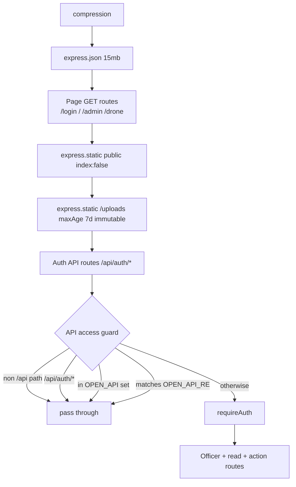
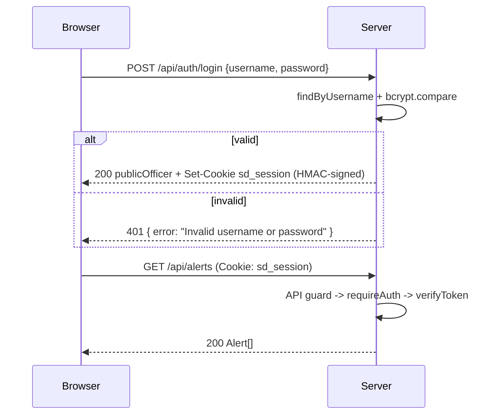
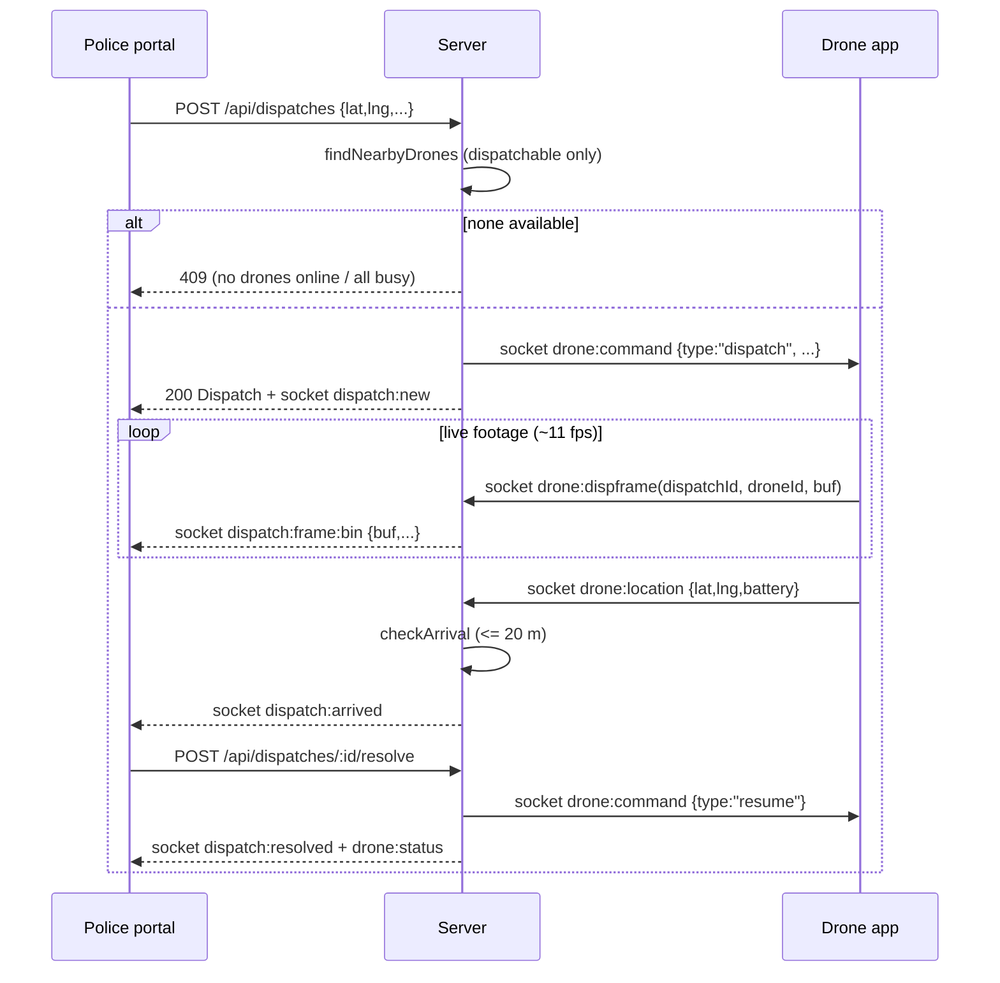
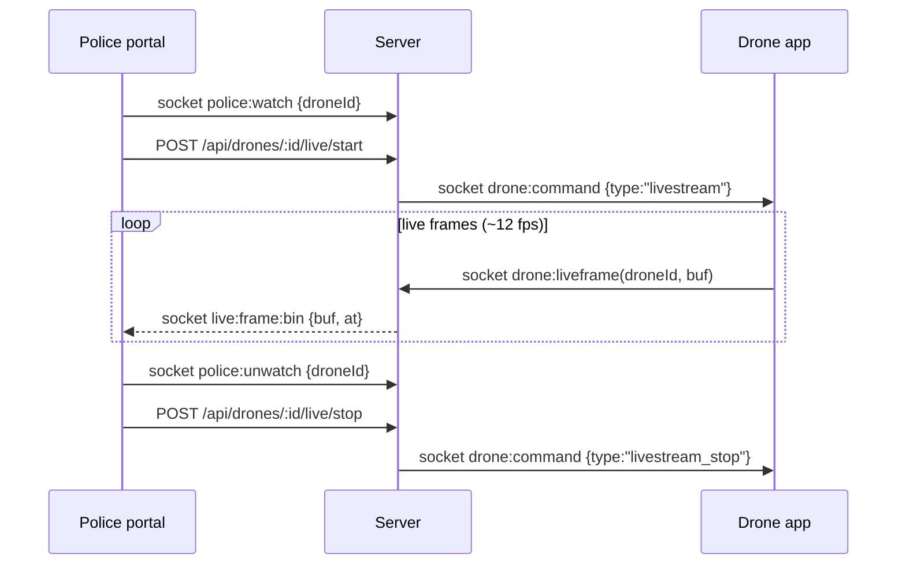

# Smart City Drone Security System — HTTP + Socket.IO API Reference

This document describes **every** HTTP endpoint and **every** Socket.IO event exposed by
the backend. All behaviour is grounded in the source; each item cites the defining
`file:line`. The authoritative file is [`server.js`](../server.js); auth primitives live in
[`src/auth.js`](../src/auth.js) and the officer store in [`src/officers.js`](../src/officers.js).

- **Runtime:** Node.js `>=20`, Express 5, Socket.IO 4 (`server.js:43-51`).
- **Transport:** A single HTTP server on `PORT` (default `3000`) plus an optional local
  self-signed HTTPS server on `HTTPS_PORT` (default `PORT + 443` = `3443`). Both share the
  same Express app and Socket.IO instance (`server.js:32-33`, `server.js:44`, `server.js:1176-1178`).
  The HTTPS listener is skipped on managed hosts where `NODE_ENV=production`, `RENDER`, or
  `RAILWAY_ENVIRONMENT` is set (`server.js:1167-1169`).

---

## Table of contents

1. [Conventions](#1-conventions)
2. [Authentication & sessions](#2-authentication--sessions)
3. [Middleware pipeline & access control](#3-middleware-pipeline--access-control)
4. [Core object shapes](#4-core-object-shapes)
5. [Page routes (HTML)](#5-page-routes-html)
6. [HTTP API — Auth](#6-http-api--auth)
7. [HTTP API — Officers (admin)](#7-http-api--officers-admin)
8. [HTTP API — Read / dashboard](#8-http-api--read--dashboard)
9. [HTTP API — Frame analysis](#9-http-api--frame-analysis)
10. [HTTP API — Alert actions](#10-http-api--alert-actions)
11. [HTTP API — Dispatch](#11-http-api--dispatch)
12. [HTTP API — Live camera](#12-http-api--live-camera)
13. [HTTP API — Maintenance & admin](#13-http-api--maintenance--admin)
14. [HTTP API — Map-link resolution](#14-http-api--map-link-resolution)
15. [Socket.IO API](#15-socketio-api)
16. [Sequence diagrams](#16-sequence-diagrams)

---

## 1. Conventions

| Aspect | Detail | Evidence |
|---|---|---|
| Base URL | `http://<host>:3000` (or `https://<host>:3443` on LAN) | `server.js:1195`, `server.js:1178` |
| Request bodies | JSON, parsed by `express.json({ limit: '15mb' })` (large cap for base64 frames) | `server.js:59` |
| Responses | JSON unless a page/file route | throughout |
| Compression | Every response is gzipped (`compression()` mounted first) | `server.js:58` |
| Error shape | `{ "error": "<message>" }` with a non-2xx status | e.g. `server.js:75`, `server.js:322` |
| Success (no data) | `{ "ok": true }`, sometimes with extra fields | e.g. `server.js:87`, `server.js:741` |
| Auth mechanism | Signed httpOnly cookie `sd_session` (see §2) | `src/auth.js:11`, `src/auth.js:54-59` |
| ID format (server) | `<prefix>_<base36 time><6 hex>` via `uid(prefix)` | `server.js:181-183` |
| ID format (officer) | `off_<base36 time><6 hex>` via `newId()` | `src/officers.js:14-16` |

The frontend calls all JSON endpoints through a thin `fetch` wrapper `api(path, opts)`
that sets `Content-Type: application/json`, JSON-stringifies `opts.body`, and throws
`data.error || res.statusText` on a non-2xx response (`public/js/common.js:41-52`).

> **Note on Express version:** `server.js` imports `express` bare (`server.js:12`); the pinned
> version (`^5.2.1`) is in `package.json`, not `server.js`.

---

## 2. Authentication & sessions

Authentication is **bcrypt password hashing + a stateless, HMAC-SHA256-signed
mini-token stored in an httpOnly cookie**. There is **no** server-side session store,
**no** standard 3-part JWT, and **no** OAuth (`src/auth.js:1-3`).

**Cookie:** name `sd_session`, lifetime **7 days** (`src/auth.js:11-12`). Set with
`httpOnly:true, sameSite:'lax', secure, maxAge, path:'/'`, where `secure` is `true` only
when `NODE_ENV==='production'` **or** `RENDER` is set (`src/auth.js:54-59`).

**Token format:** `` `${body}.${signature}` `` — two parts, not three. `body` is
`base64url(JSON.stringify({ ...payload, exp: Date.now()+7d }))`; `signature` is
`HMAC-SHA256(AUTH_SECRET, body)` base64url (`src/auth.js:24-27`, `src/auth.js:15`).
The signing secret is `process.env.AUTH_SECRET`, falling back to
`'dev-insecure-secret-change-me'` with a startup warning if unset (`src/auth.js:7-9`).

**Verification** (`src/auth.js:28-39`): splits on `.`, recomputes the HMAC, compares with
`crypto.timingSafeEqual` (length-checked first), parses the JSON body, and rejects if the
`exp` claim is missing or in the past. Returns the payload `{ id, role, username, exp }`
or `null`.

**Guard middleware exported from `src/auth.js`:**

| Guard | On failure | Sets | Line |
|---|---|---|---|
| `requireAuth` | `401 { error: 'not authenticated' }` | `req.session` | `src/auth.js:65-69` |
| `requireAdmin` | `401` if no session; `403 { error: 'admin only' }` if `role !== 'admin'` | `req.session` | `src/auth.js:70-75` |
| `requireAuthPage` | `302` redirect to `/login` | `req.session` | `src/auth.js:76-80` |
| `requireAdminPage` | redirect `/login` (no session) or `/` (not admin) | `req.session` | `src/auth.js:81-86` |

Session payload is created only in the login route (`server.js:84`), which calls
`setSession(res, { id, role, username })`.

---

## 3. Middleware pipeline & access control

Middleware registration order is load-bearing (`server.js:58-127`):



**The `/api/*` access guard** (`server.js:120-127`) requires a login for everything under
`/api/` **except**:

- Any path under `/api/auth/` (`server.js:124`).
- The `OPEN_API` allow-set: `/api/config`, `/api/drones`, `/api/analyze` (`server.js:120`).
- Two regex-matched open paths `OPEN_API_RE` (`server.js:121`):
  - `^/api/drones/[^/]+/live/frame$`
  - `^/api/dispatches/[^/]+/frame$`

These open endpoints exist because the **drone field app at `/drone` is unauthenticated**
and must reach them (`server.js:118-119`). Every other `/api/*` route falls through to
`requireAuth`. Routes that additionally require an admin role are guarded per-route with
`requireAdmin` (registered after the global guard).

Non-`/api/` requests bypass the guard entirely (`server.js:123`).

**Static serving** (`server.js:69-70`): `public/` is served with `index:false` (so `/`
never auto-serves `index.html`, preserving login-gating); `/uploads` serves stored frame
images from `UPLOAD_DIR` with `maxAge:'7d', immutable:true`.

---

## 4. Core object shapes

These shapes are assembled by the server and echoed to clients. Field lists are taken
from the code that constructs them; the Postgres schema mirrors them.

### Officer (public view)
`publicOfficer(o)` strips `passwordHash` and returns everything else (`src/officers.js:57-61`).
Fields as created (`server.js:139-143`, `src/officers.js:70-74`): `id, username, name,
badgeId, station, photo, role ('officer'|'admin'), active, createdAt`. A `theme` string is
also carried through when set (`src/officers.js` merge + Supabase mappers).

### Drone
Constructed by the seeder and mutated in place (`src/seed.js`, `server.js:251-254`,
`server.js:1022-1026`): `id, name, sector, lat, lng, status ('monitoring'|'alerting'|
'dispatched'|'offline'), battery, connected (bool), liveView (bool), activeDispatchId
(string|null), lastSeen (ISO string|null)`.

### Alert
Constructed at `server.js:364-384`: `id, droneId, droneName, sector, lat, lng, timestamp,
imageUrl, incidentType, title, severity ('none'|'low'|'medium'|'high'|'critical'),
confidence (0..1), interpretation, recommendedAction, source, status
('pending_review'|'escalated'|'dismissed'), reviewedBy, reviewedAt, reviewNote`.

### Dispatch
Constructed at `server.js:510-530`: `id, timestamp, lat, lng, address, incidentType,
description, officer, status ('active'|'resolved'), assignedDrones[] ({id, name, sector,
distanceKm, arrived?}), frames[] ({id, droneId, droneName, url, at}), updates[] ({id, at,
officer, info}), arrived[] ({droneId, droneName, at, distanceKm}), resolvedAt (ISO|null)`.

### Main-force record
Constructed at `server.js:424-437` (escalate) and `server.js:623-636` (convey): `id,
timestamp, sourceType ('alert'|'dispatch'), sourceId, incidentType, title, location, lat,
lng, droneName, officer, conveyed`.

### Stats
Returned by `stats()` (`server.js:257-269`):

```json
{
  "dronesOnline": 0,
  "dronesTotal": 4,
  "pendingAlerts": 0,
  "escalated": 0,
  "dismissed": 0,
  "activeDispatches": 0,
  "mainForce": 0
}
```

---

## 5. Page routes (HTML)

These serve static HTML files; they are registered **before** the static middleware so
login-gating cannot be bypassed (`server.js:61-66`).

| Method | Path | Guard | Serves | Line |
|---|---|---|---|---|
| GET | `/login` | none (open) | `public/login.html` | `server.js:63` |
| GET | `/`, `/index.html` | `requireAuthPage` | `public/index.html` (police portal) | `server.js:64` |
| GET | `/admin`, `/admin.html` | `requireAdminPage` | `public/admin.html` (admin console) | `server.js:65` |
| GET | `/drone` | none (open field device) | `public/drone.html` (drone camera app) | `server.js:66` |

Unauthenticated hits on `/` or `/admin` redirect to `/login`; a non-admin on `/admin`
redirects to `/` (`src/auth.js:76-86`).

---

## 6. HTTP API — Auth

All auth routes are under `/api/auth/*` and bypass the global guard (`server.js:124`).

### POST `/api/auth/login`
Log in and set the session cookie. **Auth:** open. (`server.js:73-86`)

- **Body:** `{ "username": string, "password": string }`
- **Validation:** both required, else `400`. Lookup is case-insensitive
  (`findByUsername`, `src/officers.js:32-35`). Rejected if the officer is missing, has
  `active === false`, or the bcrypt comparison fails (`server.js:82-83`).
- **Success `200`:** the `publicOfficer` object (no `passwordHash`); a `Set-Cookie:
  sd_session=...` header is attached.
- **Errors:** `400` missing fields; `401 Invalid username or password`; `500 Login
  unavailable — is the officers table created? <msg>` if the lookup throws.

**Example request**
```http
POST /api/auth/login
Content-Type: application/json

{ "username": "admin", "password": "admin123" }
```
**Example response**
```json
{
  "id": "off_lx1a2b3c4d5e",
  "username": "admin",
  "name": "System Administrator",
  "badgeId": "ADMIN-001",
  "station": "Control HQ",
  "photo": null,
  "role": "admin",
  "active": true,
  "createdAt": "2026-07-05T10:00:00.000Z"
}
```

### POST `/api/auth/logout`
Clear the session cookie. **Auth:** open. (`server.js:87`)

- **Body:** none. **Success `200`:** `{ "ok": true }`.

### GET `/api/auth/me`
Return the currently signed-in officer. **Auth:** open (self-checks the cookie). (`server.js:88-95`)

- **Reads** the `sd_session` cookie; returns `401 { error: 'not authenticated' }` if there
  is no valid session, or if the officer is missing / `active === false` (in which case the
  cookie is also cleared, `server.js:93`).
- **Success `200`:** the `publicOfficer` object.

### POST `/api/auth/photo`
Update the signed-in officer's own avatar. **Auth:** `requireAuth`. (`server.js:97-107`)

- **Body:** `{ "photo": string }` — must be a `data:image/...` data URI.
- **Validation:** `400 a valid image is required` if not a string starting with
  `data:image/`; `413 image too large — please pick a smaller one` if `photo.length >
  800000` (`server.js:99-101`).
- **Success `200`:** the updated `publicOfficer`. **Errors:** `404 officer not found`;
  `500 { error: <msg> }`.

### POST `/api/auth/theme`
Save the signed-in officer's UI theme preference. **Auth:** `requireAuth`. (`server.js:109-116`)

- **Body:** `{ "theme": string }` — max length 40.
- **Validation:** `400 invalid theme` if not a string or longer than 40 chars.
- **Success `200`:** `{ "ok": true }`. **Errors:** `500 { error: <msg> }`.
- **Used by** the portal theme picker, which POSTs the chosen theme id so it follows the
  officer across devices (`public/js/portal.js:14`).

---

## 7. HTTP API — Officers (admin)

All routes require `requireAdmin` (admin role) (`server.js:130-177`).

### GET `/api/officers`
List all officers. **Auth:** admin. (`server.js:130-133`)
- **Success `200`:** `publicOfficer[]`. **Errors:** `500 { error: <msg> }`.

### POST `/api/officers`
Create an officer. **Auth:** admin. (`server.js:134-147`)
- **Body:** `{ username, password, name?, badgeId?, station?, photo?, role? }`.
- **Validation / defaults:** `username` and `password` required else `400`; `409 That
  username already exists` if the username is taken; `name` defaults to `username`;
  `badgeId`/`station` default to `''`; `photo` defaults to `null`; `role` is coerced to
  `'admin'` only if exactly `'admin'`, else `'officer'`; `active:true`; `createdAt` = now
  (`server.js:135-143`). The password is bcrypt-hashed (`server.js:140`).
- **Success `200`:** the created `publicOfficer`. **Errors:** `400`, `409`, `500`.

### PATCH `/api/officers/:id`
Update an officer. **Auth:** admin. (`server.js:148-165`)
- **Path param:** `id`.
- **Body (all optional):** `{ name, badgeId, station, photo, role, active, password }`.
  Only provided keys are patched (`server.js:150-157`). `role` is coerced as in create;
  `active` is coerced to boolean; a non-empty `password` is re-hashed.
- **Self-protection:** if `:id === req.session.id` and the patch would set
  `role:'officer'` or `active:false`, returns `400 You can't demote or deactivate your own
  account.` (`server.js:158-159`).
- **Success `200`:** updated `publicOfficer`. **Errors:** `400`; `404 officer not found`;
  `500`.

### DELETE `/api/officers/:id`
Delete an officer. **Auth:** admin. (`server.js:166-177`)
- **Path param:** `id`.
- **Guards:** `400 You can't delete your own account.` if `:id === req.session.id`; `404
  officer not found` if missing; `400 Cannot delete the last active admin.` if the target
  is the only remaining active admin (`server.js:167-173`).
- **Success `200`:** `{ "ok": true }`. **Errors:** `400`, `404`, `500`.

---

## 8. HTTP API — Read / dashboard

### GET `/api/config`
Client bootstrap config. **Auth:** open (in `OPEN_API`). (`server.js:295-297`)
- **Success `200`:** `{ aiMode, aiLabel, cityCenter: {lat,lng}, incidentTypes, landmarks }`.
  `aiMode`/`aiLabel` come from the selected AI provider (`src/ai.js`); `incidentTypes` is
  the full 18-entry catalogue (`src/incidents.js`); `landmarks` is the 10 named dispatch
  targets (`src/seed.js`).

### GET `/api/drones`
Full fleet list. **Auth:** open (in `OPEN_API`). (`server.js:299`)
- **Success `200`:** `Drone[]` (unsorted, as stored). Used by both the portal and the
  unauthenticated drone app (`public/js/drone.js:54`, `public/js/portal.js:82`).

### GET `/api/alerts`
Alerts, newest first. **Auth:** login required (via global guard). (`server.js:301-305`)
- **Query param:** `?status=<value>` — optional exact-match filter on `alert.status`
  (`server.js:303`).
- **Success `200`:** `Alert[]` sorted by `timestamp` descending.

### GET `/api/dispatches`
Dispatches, newest first. **Auth:** login required. (`server.js:307-309`)
- **Success `200`:** `Dispatch[]` sorted by `timestamp` descending.

### GET `/api/mainforce`
Main-force log, newest first. **Auth:** login required. (`server.js:311-313`)
- **Success `200`:** `MainForceRecord[]` sorted by `timestamp` descending.

### GET `/api/stats`
Dashboard counters. **Auth:** login required. (`server.js:315`)
- **Success `200`:** the [Stats](#stats) object. Also configured as the Render health
  check path.

---

## 9. HTTP API — Frame analysis

### POST `/api/analyze`
Analyze a captured drone frame and, if warranted, raise an alert. **Auth:** open (in
`OPEN_API`; called by the unauthenticated drone app). (`server.js:319-408`)

- **Body:** `{ droneId: string, image: string(dataURI or base64), lat?: number, lng?:
  number, scenarioHint?: string }`.
- **Behaviour:**
  1. `404 unknown drone` if `droneId` is not found (`server.js:321-322`).
  2. If `lat`/`lng` are numbers, updates the drone position; marks the drone
     `connected:true` and refreshes `lastSeen` (`server.js:324-329`).
  3. Runs `analyzeFrame(strippedBase64, {droneId, droneName, sector, scenarioHint})`
     (`server.js:333-338`). On a thrown error returns `500 { error: 'analysis failed' }`
     (`server.js:339-342`).
  4. Raises an alert **only** when `incidentType !== 'normal'` **and** the incident type is
     `policeRelevant` (`server.js:347`). Deduplication: if a `pending_review` alert already
     exists for this drone, it is reused rather than duplicated (`server.js:349-351`).
  5. Re-validates after the awaits — if the drone became dispatched in the meantime, the
     alert is suppressed (`alert:null`); a concurrent duplicate check runs again
     (`server.js:354-362`). New alerts are capped at `MAX_ALERTS = 300`, evicting only the
     oldest **reviewed** alerts, never a pending one (`server.js:388-393`).
  6. On a real new alert: sets `drone.status='alerting'`, emits `alert:new` to police
     (`server.js:394-396`).
  7. Always emits `drone:status` + `stats` so the map stays live even for a normal /
     duplicate / suppressed frame (`server.js:404-405`).
- **Success `200`:** `{ analysis, alert }` where `analysis` is the normalized AI result
  and `alert` is the (new or reused) alert object, or `null` when none was raised.

**Example request**
```http
POST /api/analyze
Content-Type: application/json

{
  "droneId": "drone-1",
  "image": "data:image/jpeg;base64,/9j/4AAQSk...",
  "lat": 11.2512,
  "lng": 75.7756,
  "scenarioHint": "auto"
}
```
**Example response (no alert)**
```json
{
  "analysis": {
    "incidentType": "normal",
    "title": "All clear",
    "severity": "none",
    "confidence": 0.83,
    "interpretation": "Quiet street, light foot traffic.",
    "recommendedAction": "Continue monitoring.",
    "source": "mock-simulation"
  },
  "alert": null
}
```

---

## 10. HTTP API — Alert actions

Both routes require a login (global guard).

### POST `/api/alerts/:id/escalate`
Escalate a pending alert to the main force. **Auth:** login required. (`server.js:412-458`)
- **Path param:** `id`. **Body:** `{ officer?: string = 'Drone Police', note?: string = '' }`.
- **Guards:** `404 unknown alert`; `409 alert already <status>` if not `pending_review`
  (`server.js:414-416`).
- **Effects:** sets the alert to `escalated` with reviewer/timestamp/note; creates a
  main-force record (capped at `MAX_MAINFORCE = 500`); if the alert's drone is not on an
  active dispatch, resets it to `monitoring` and sends it a `drone:command {type:'resume'}`
  (`server.js:419-451`). Emits `alert:updated`, `mainforce:new`, `drone:status`, `stats`.
- **Success `200`:** `{ alert, record }`.

### POST `/api/alerts/:id/dismiss`
Dismiss a pending alert. **Auth:** login required. (`server.js:460-486`)
- **Path param:** `id`. **Body:** `{ officer?: string = 'Drone Police', note?: string = '' }`.
- **Guards:** `404 unknown alert`; `409 alert already <status>` if not `pending_review`.
- **Effects:** sets the alert to `dismissed` with reviewer/timestamp/note; if the drone is
  not on an active dispatch, resets it to `monitoring` and sends `drone:command
  {type:'resume'}` (note text is echoed into the message). Emits `alert:updated`,
  `drone:status`, `stats` (`server.js:467-484`).
- **Success `200`:** `{ alert }`.

---

## 11. HTTP API — Dispatch

### POST `/api/dispatches`
Dispatch nearby online drones to a location. **Auth:** login required. (`server.js:490-563`)
- **Body:** `{ lat: number, lng: number, address?: string='', incidentType?:
  string='suspicious_activity', description?: string='', officer?: string='Main Force',
  radiusKm?: number }`.
- **Validation:** `400 valid lat/lng required` unless `lat`/`lng` are finite with
  `|lat|<=90` and `|lng|<=180` (`server.js:493-494`).
- **Drone selection:** `findNearbyDrones({lat,lng}, drones, {radiusKm: radiusKm ?? 3})`
  returns only **dispatchable** drones (connected, not already dispatched, has coordinates)
  (`server.js:496-498`, `src/geo.js:22-31`).
- **Conflict `409`** with distinct messages (`server.js:499-508`):
  - No drones online → *"No drones are online. Open the drone app on a phone..."*
  - Online drones exist but all busy → *"Your N online drone(s) are already on an active
    dispatch..."*
- **Effects:** builds a dispatch (`status:'active'`, snapshot of `assignedDrones` with
  rounded `distanceKm`); marks each chosen drone `dispatched` with `activeDispatchId`;
  sends each a `drone:command {type:'dispatch', ...}`; emits `dispatch:new`, a
  `drone:status` per drone, runs an immediate `checkArrival` for each, then `stats`
  (`server.js:510-561`).
- **Success `200`:** the created `Dispatch` object.

**Example request**
```http
POST /api/dispatches
Content-Type: application/json

{ "lat": 11.2512, "lng": 75.7756, "address": "SM Street",
  "incidentType": "suspicious_activity", "description": "Reported disturbance" }
```

### POST `/api/dispatches/:id/frame`
Dispatched drone streams one frame over HTTP (fallback to the binary socket path).
**Auth:** open (matches `OPEN_API_RE`). (`server.js:570-606`)
- **Path param:** `id`. **Body:** `{ droneId: string, image: string }`.
- **Guards:** `404 unknown dispatch`; `409 dispatch not active`; `404 unknown drone`; `400
  no image` if the base64 payload is empty (`server.js:571-578`).
- **Effects:** immediately relays the frame inline to police via `dispatch:frame` and
  responds `{ ok: true }`; then archives roughly every 4th frame (`FRAME_SAVE_EVERY = 4`),
  URL-only, evicting frames beyond `MAX_FRAMES_PER_DISPATCH = 16` and reclaiming their
  storage objects (`server.js:580-605`).
- **Success `200`:** `{ "ok": true }`.

### POST `/api/dispatches/:id/convey`
Drone police relay a field update to the main force. **Auth:** login required. (`server.js:610-646`)
- **Path param:** `id`. **Body:** `{ info: string, officer?: string='Drone Police' }`.
- **Validation:** `404 unknown dispatch`; `400 info required` if `info` is empty/whitespace
  (`server.js:611-616`).
- **Effects:** appends an update to the dispatch (capped at `MAX_UPDATES_PER_DISPATCH = 50`);
  creates a main-force record (`sourceType:'dispatch'`, capped at 500); emits
  `dispatch:updated`, `mainforce:new`, `stats` (`server.js:618-644`).
- **Success `200`:** `{ dispatch, record }`.

### POST `/api/dispatches/:id/resolve`
Resolve a dispatch and free its drones. **Auth:** login required. (`server.js:650-676`)
- **Path param:** `id`.
- **Guards:** `404 unknown dispatch`; `409 already resolved` if not active (`server.js:652-653`).
- **Effects:** sets `status:'resolved'` + `resolvedAt`; clears the frame-throttle counter;
  for each assigned drone still bound to this dispatch, resets to `monitoring`, clears
  `activeDispatchId`, and sends `drone:command {type:'resume'}`; emits `dispatch:resolved`,
  a `drone:status` per drone, `stats` (`server.js:655-674`).
- **Success `200`:** the resolved `Dispatch` object.

### POST `/api/dispatches/clear-resolved`
Remove all resolved dispatches. **Auth:** login required. (`server.js:735-742`)
- **Body:** none. **Effects:** keeps only `active` dispatches; emits `refresh` + `stats`.
- **Success `200`:** `{ "ok": true, "cleared": <number removed> }`.

---

## 12. HTTP API — Live camera

### POST `/api/drones/:id/live/start`
Start an on-demand live camera feed from a connected drone. **Auth:** login required. (`server.js:680-689`)
- **Path param:** `id`.
- **Guards:** `404 unknown drone`; `409 drone is offline` if `!drone.connected`.
- **Effects:** sets `liveView:true`; sends `drone:command {type:'livestream'}` to the drone;
  emits `drone:status`.
- **Success `200`:** `{ "ok": true }`.

### POST `/api/drones/:id/live/stop`
Stop the live feed. **Auth:** login required. (`server.js:691-699`)
- **Path param:** `id`. **Guards:** `404 unknown drone`.
- **Effects:** sets `liveView:false`; sends `drone:command {type:'livestream_stop'}`; emits
  `drone:status`. **Success `200`:** `{ "ok": true }`.

### POST `/api/drones/:id/live/frame`
Live frame relay over HTTP (fallback to the binary socket path). **Auth:** open (matches
`OPEN_API_RE`). (`server.js:701-710`)
- **Path param:** `id`. **Body:** `{ image: string }`.
- **Guards:** `404 unknown drone`; `400 no image` if `image` is falsy.
- **Behaviour:** if nobody is watching (`!drone.liveView`), the frame is dropped and the
  response is `{ ok:true, ignored:true }` (`server.js:706`); otherwise it is relayed to
  police via `live:frame` (not persisted).
- **Success `200`:** `{ "ok": true }` or `{ "ok": true, "ignored": true }`.

---

## 13. HTTP API — Maintenance & admin

### POST `/api/admin/reset`
Demo reset — clear incidents, keep the fleet. **Auth:** `requireAdmin`. (`server.js:714-731`)
- **Body:** none. **Effects:** empties `alerts`, `dispatches`, `mainForce`; resets each
  drone to `monitoring` with `activeDispatchId:null, liveView:false`; emits `refresh` to
  police and, per drone, `drone:command {type:'livestream_stop'}` then `{type:'resume'}`;
  emits `stats` (`server.js:715-729`).
- **Success `200`:** `{ "ok": true }`.

### POST `/api/alerts/clear-reviewed`
Remove all non-pending alerts. **Auth:** login required. (`server.js:745-752`)
- **Body:** none. **Effects:** keeps only `pending_review` alerts; emits `refresh` + `stats`.
- **Success `200`:** `{ "ok": true, "cleared": <number removed> }`.

### POST `/api/admin/clear-images`
Wipe captured images (key-protected). **Auth:** `requireAdmin`. (`server.js:862-887`)
- **Body:** `{ secretKey: string, mode?: 'archive' | 'delete' }`.
- **Guard:** `403 Invalid authorization key` unless `secretKey === CLEAR_SECRET`
  (default `'police2026'`, overridable via `CLEAR_SECRET`) (`server.js:39`, `server.js:864`).
- **Effects:** clears Supabase Storage objects (`supa.clearImages()`) or local uploads
  (`clearLocalUploads()`), whichever backend is active; nulls out `alert.imageUrl` and
  empties `dispatch.frames` so the portal shows placeholders; emits `refresh`
  (`server.js:866-878`).
- **Success `200`:** `{ ok:true, cleared:<count>, message:<string> }` — the message differs
  for `archive` vs `delete` mode (`server.js:879-886`). **Errors:** `403`; `500 failed to
  clear images: <msg>`.

---

## 14. HTTP API — Map-link resolution

### POST `/api/resolve-location`
Extract `{lat,lng}` from a shared map/location link. **Auth:** login required. (`server.js:848-858`)
- **Body:** `{ url: string }`.
- **Validation:** `400 not a link` unless `url` matches `^https?://` (`server.js:850`).
- **Behaviour (`resolveMapUrl`, `server.js:808-846`):**
  1. First tries to parse coordinates directly from the URL string via
     `MAP_COORD_PATTERNS` (8 regexes, `server.js:756-765`).
  2. **SSRF guard:** will only fetch hosts on the allow-list `MAP_HOSTS` (`google.com`,
     `goo.gl`, `g.co`, `openstreetmap.org`, `osm.org`, `apple.com`, `waze.com`) — arbitrary
     hosts return no result (`server.js:779-787`, `server.js:811`).
  3. Follows up to 5 redirects **manually**, re-checking the allow-list on every hop, so a
     short link cannot 3xx-redirect into an internal host (`server.js:819-835`).
  4. Aborts after **8 s** (`AbortController`, `server.js:812-813`); caps the response body
     at **2 MB** and only parses HTML/plain/JSON content types (`server.js:839-841`).
- **Responses:** `200 { lat, lng }` on success; `422 no coordinates found in that link`;
  `502 could not open the link: <msg>` if the fetch throws (`server.js:853-857`).

**Example**
```http
POST /api/resolve-location
Content-Type: application/json

{ "url": "https://maps.google.com/?q=11.2512,75.7756" }
```
```json
{ "lat": 11.2512, "lng": 75.7756 }
```

---

## 15. Socket.IO API

Socket.IO is bound to the HTTP server (and attached to the HTTPS server too) with
`maxHttpBufferSize: 12e6`, `pingInterval: 10000`, `pingTimeout: 12000` — the tight ping
window detects a vanished phone faster than the ~45 s default (`server.js:45-51`,
`server.js:1177`).

### Rooms & emit helpers

| Room | Members | Purpose | Evidence |
|---|---|---|---|
| `police` | Portal sockets that emitted `police:join` | Broadcast target for all portal updates | `server.js:934-935` |
| `drones` | Every connected drone app | Fleet-change fan-out (`fleet:changed`) | `server.js:986` |
| `drone:<id>` | Socket(s) controlling a specific drone | Per-drone command channel | `server.js:985` |

Helpers: `toPolice(event, data)` → `io.to('police').emit(...)`; `toDrone(id, event, data)`
→ `io.to('drone:<id>').emit(...)` (`server.js:248-249`). "Online" ground truth is room
membership, not `lastSeen` (`server.js:1103-1106`).

A drone is considered **taken by another** device only if a socket from a *different*
`deviceId` is already in its room — the same phone reconnecting is not a conflict
(`server.js:894-905`).

### 15a. Client → server events

| Event | Payload | Direction | Handler behaviour | Line |
|---|---|---|---|---|
| `police:join` | — | portal → server | Joins the `police` room; replies with `stats` to the joining socket | `server.js:934-937` |
| `police:watch` | `{ droneId }` | portal → server | Registers this socket as a live-view watcher of `droneId` (`liveWatchers` map) | `server.js:940-945` |
| `police:unwatch` | `{ droneId }` | portal → server | Removes this watcher; if none remain, stops the drone's stream (`stopLiveIfUnwatched`) | `server.js:948-957` |
| `drone:hello` | `{ droneId, deviceId }` | drone → server | Claims a drone (rejects with `drone:taken` if another device owns it); joins `drone:<id>` + `drones`; marks online; leaves any previously-owned drone room; re-sends an active dispatch and/or resumes live view | `server.js:959-1011` |
| `drone:location` | `{ droneId, lat, lng, battery? }` | drone → server | Ownership-checked live GPS + battery update; validates ranges; emits `drone:status`; runs `checkArrival` if on a dispatch | `server.js:1014-1034` |
| `drone:liveframe` | `(droneId, buf, ack)` | drone → server | Binary live frame; acks immediately (backpressure release); if `droneId` is owned and `liveView` is on, relays as `live:frame:bin` to police | `server.js:1038-1044` |
| `drone:dispframe` | `(dispatchId, droneId, buf, ack)` | drone → server | Binary dispatch frame; acks immediately; relays as `dispatch:frame:bin`; throttled 1-in-4 archival with eviction | `server.js:1048-1074` |
| `disconnect` | — | either → server | Drops the socket from all live-watch sets (stopping unwatched drones); marks the drone offline if no other socket controls it, emitting `drone:status`, `stats`, `fleet:changed` | `server.js:1076-1100` |

> `drone:liveframe` and `drone:dispframe` are **positional-argument** events with a final
> ack callback, not object payloads — see the client emitters at
> `public/js/drone.js:333-334` and `public/js/drone.js:374`.

### 15b. Server → client events

| Event | Target | Payload | Emitted when | Line |
|---|---|---|---|---|
| `stats` | joining socket / `police` | the [Stats](#stats) object | On `police:join`, and after any state change (`pushStats`) | `server.js:936`, `server.js:271` |
| `drone:status` | `police` | a `Drone` object | Any drone create/update: analyze, dispatch, resolve, live start/stop, hello, location, disconnect, safety sweep | `server.js:254`, `553`, `672`, `687`, `697`, `990`, `1028`, `1096`, `1116` |
| `drone:command` | `drone:<id>` or a socket | `{ type, ... }` — types below | Escalate/dismiss/resolve/reset (`resume`), dispatch create/re-send (`dispatch`), live start/resume (`livestream`), live stop (`livestream_stop`) | `server.js:446`, `475`, `537`, `664`, `686`, `696`, `727`, `997`, `1010` |
| `drone:taken` | requesting socket | `{ droneId, available: [ids] }` | A `drone:hello` for a drone already controlled by a different device | `server.js:967` |
| `alert:new` | `police` | an `Alert` object | A new incident alert is raised in `/api/analyze` | `server.js:396` |
| `alert:updated` | `police` | an `Alert` object | Alert escalated or dismissed | `server.js:453`, `482` |
| `mainforce:new` | `police` | a main-force record | Escalation or a dispatch field update | `server.js:454`, `643` |
| `dispatch:new` | `police` | a `Dispatch` object | A dispatch is created | `server.js:550` |
| `dispatch:arrived` | `police` | `{ dispatchId, droneId, droneName, at, distanceKm }` | A dispatched drone comes within `ARRIVAL_RADIUS_KM` (20 m) of the target (once per drone) | `server.js:290` |
| `dispatch:frame` | `police` | `{ dispatchId, droneId, droneName, at, image }` | HTTP dispatch-frame path relays a base64 frame inline | `server.js:584` |
| `dispatch:frame:bin` | `police` | `{ dispatchId, droneId, droneName, buf, at }` | Binary dispatch-frame socket path | `server.js:1055` |
| `dispatch:updated` | `police` | a `Dispatch` object | A field update is conveyed | `server.js:642` |
| `dispatch:resolved` | `police` | a `Dispatch` object | A dispatch is resolved | `server.js:669` |
| `live:frame` | `police` | `{ droneId, image, at }` | HTTP live-frame path (base64) when someone is watching | `server.js:708` |
| `live:frame:bin` | `police` | `{ droneId, buf, at }` | Binary live-frame socket path when someone is watching | `server.js:1043` |
| `refresh` | `police` | `{}` | Demo reset, clear-resolved, clear-reviewed, clear-images | `server.js:724`, `739`, `749`, `878` |
| `fleet:changed` | `drones` | — | A drone joined/left/went offline — drone apps refresh their dropdowns | `server.js:992`, `1098`, `1121` |

**`drone:command` type inventory** (`server.js`):

| `type` | Extra fields | Meaning |
|---|---|---|
| `resume` | `message` | Return to monitoring (after escalate/dismiss/resolve/reset) |
| `dispatch` | `dispatchId, incidentType, address, description, lat, lng, message` | Proceed to target and stream live |
| `livestream` | — | Start the on-demand live camera |
| `livestream_stop` | — | Stop the on-demand live camera |

**Client-side handlers for reference:** the portal listens for all `police`-room events in
`wireSocket()` (`public/js/portal.js:58-79`); the drone app maps `drone:command` types to
`enterDispatch` / `exitDispatch` / `startLive` / `stopLive`
(`public/js/drone.js:141-146`).

---

## 16. Sequence diagrams

### Login → authenticated request



### Dispatch lifecycle (create → stream → arrive → resolve)



### On-demand live camera



---

## Not determinable from the current codebase

- The exact Express version is not pinned in `server.js` (it is in `package.json`, not the
  files documented here for endpoint behaviour).
- There is **no** rate limiting, CSRF token, API-key auth, pagination, or OpenAPI/Swagger
  spec present for these endpoints — none appear in the code.
- No `PUT` endpoints exist; officer updates use `PATCH` (`server.js:148`).
