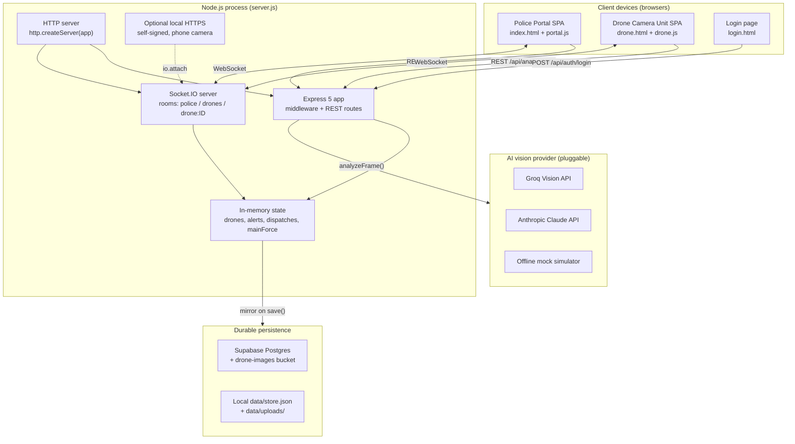
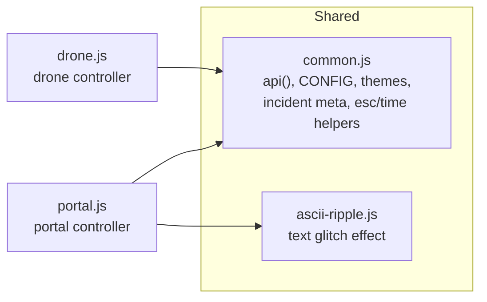
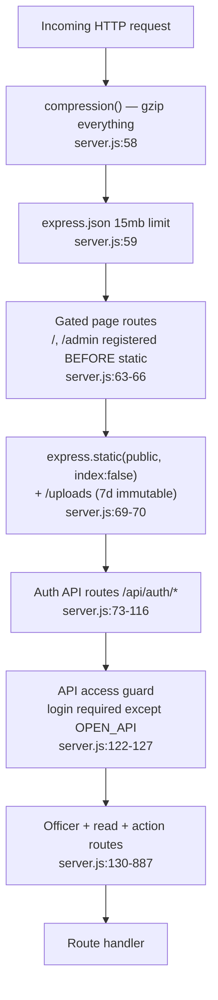
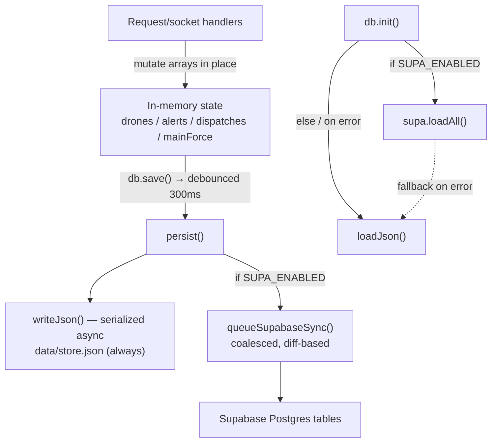
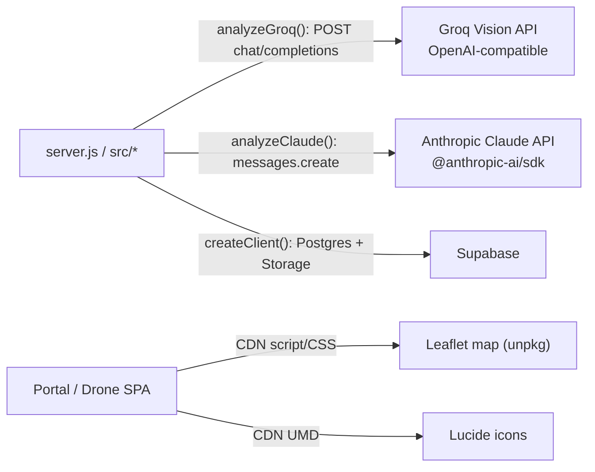
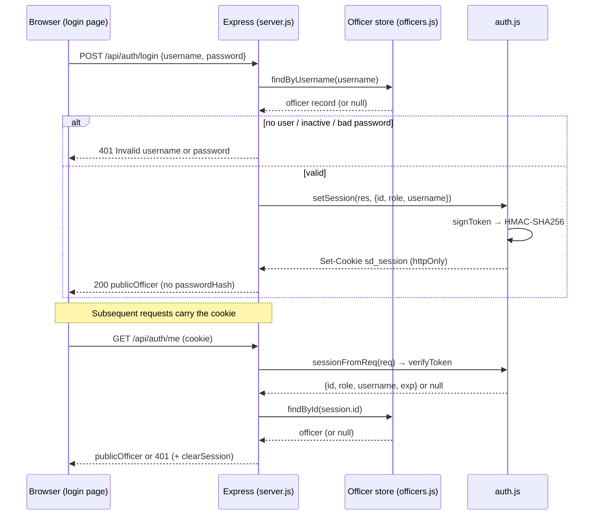
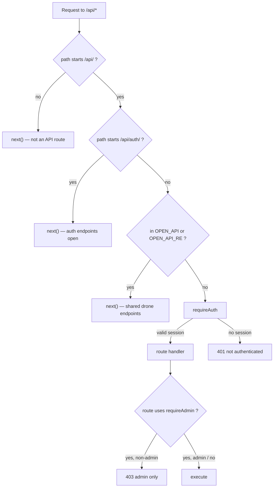
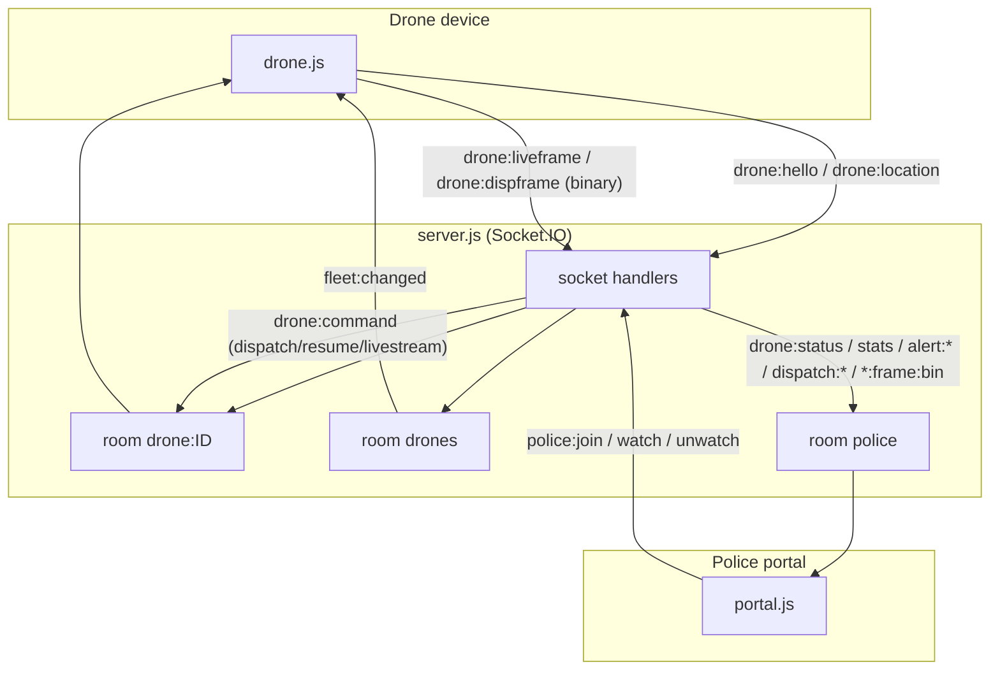

# Software Architecture — Smart City Drone Security System

> AI-assisted aerial surveillance for a smart city. Field phones act as "drones" that
> capture camera frames, an AI vision provider classifies each frame into an incident
> type, and a police control center reviews alerts, dispatches drones to locations, and
> watches live footage — all in real time.
>
> This document describes the system as it exists in the source tree at repository root
> `d:/Project/SmartDrone`. Every claim is grounded in code with `file:line` citations.
> Where a detail is not present in the codebase, it is called out explicitly.

---

## 1. High-Level Architecture

The system is a single Node.js process that serves three responsibilities from one
Express + Socket.IO application:

1. **Static web delivery** — two vanilla-JS single-page apps (police portal and drone
   camera unit) plus a login page, served directly from `public/` with no build step
   (`server.js:62-70`).
2. **REST API** — stateless HTTP endpoints under `/api/*` for reads, actions, auth, and
   officer administration (`server.js:73-887`).
3. **Real-time layer** — a Socket.IO server bound to the same HTTP server carrying drone
   telemetry, live/dispatch camera frames, and control commands (`server.js:44-51`,
   `server.js:933-1101`).

Application state lives **in memory** for synchronous access and is mirrored to a durable
backend — Supabase Postgres when configured, otherwise a local `data/store.json` file
(`src/db.js:1-6`). AI frame analysis is delegated to a pluggable provider: Groq, Anthropic
Claude, or an offline mock (`src/ai.js:3-6`, `src/ai.js:17-25`).



**Key architectural properties**

- **Single deployable unit.** `package.json` declares `"main": "server.js"`, start script
  `node server.js`, Node `>=20`, and no build step (config-deploy reference). The frontend
  is static; there is no bundler or transpiler.
- **Realtime-first.** Alerts, dispatch commands, GPS, and camera frames flow over
  Socket.IO; REST is used for reads and idempotent actions. This is why serverless hosts
  that lack WebSocket support are unsuitable and Render/Railway/Fly are recommended
  (config-deploy reference).
- **Memory as the source of truth at runtime.** All request handlers read/write the
  in-memory `state` object synchronously; persistence is a debounced side effect
  (`src/db.js:85-92`).

---

## 2. Frontend Architecture

The frontend is three static HTML pages plus ES modules under `public/js/`, loaded
directly by the browser (`type="module"`), with no framework and no build tooling.

### 2.1 Pages and entry points

| Page | Served by | Purpose | Client module |
|---|---|---|---|
| `/login` | `server.js:63` (open) | Credential entry | inline |
| `/`, `/index.html` | `server.js:64` (`requireAuthPage`) | Police Control Center | `public/js/portal.js` |
| `/admin`, `/admin.html` | `server.js:65` (`requireAdminPage`) | Officer administration | (admin console) |
| `/drone` | `server.js:66` (open) | Drone camera field unit | `public/js/drone.js` |

Both SPAs load Socket.IO's client from `/socket.io/socket.io.js`, Lucide icons (UMD), and
their controller module at the bottom of the page. The police portal additionally loads
Leaflet CSS/JS for the map (frontend reference; `index.html` head + script tags).

### 2.2 Module responsibilities



- **`common.js`** — the shared toolkit imported by both apps. It exposes `api(path, opts)`,
  a thin `fetch` wrapper that JSON-serializes the body, parses the response, and throws
  `data.error || statusText` on non-2xx (`public/js/common.js:41-52`). It holds the mutable
  `CONFIG` object (default AI mode `mock`, Kozhikode city center) hydrated from
  `/api/config` by `loadConfig()` (`public/js/common.js:11-20`), plus HTML-escaping,
  relative-time formatting, incident-metadata lookup, Lucide icon helpers, and the six-theme
  picker persisted to `localStorage['sd-theme']` (`public/js/common.js:73-127`).
- **`portal.js`** — the police controller. Instantiates `const socket = io()`
  (`public/js/portal.js:4`), holds all client view state in one `state` object
  (`public/js/portal.js:5`), and wires every Socket.IO listener in `wireSocket()`
  (`public/js/portal.js:58-79`). It renders the alerts queue, dispatch board, Leaflet map,
  main-force log, and the live-camera modal.
- **`drone.js`** — the field-device controller. Generates a stable per-device UUID in
  `localStorage['droneDeviceId']` (`public/js/drone.js:8-19`), keeps a single `st` runtime
  object (`public/js/drone.js:21-37`), captures camera frames, runs the scan loop, streams
  dispatch/live footage as binary, and reports live GPS + battery.
- **`ascii-ripple.js`** — a dependency-free decorative text effect; honours
  `prefers-reduced-motion` and inserts an `.sr-only` static twin for accessibility
  (frontend reference).

### 2.3 Frontend state management

Client state is deliberately minimal and centralized per app — plain objects mutated in
place, with the server acting as the authority:

- **Portal** keeps `state = { drones, alerts, dispatches, mf, pendingTarget, liveDroneId }`
  (`public/js/portal.js:5`) and augments it at runtime with live-frame caches and watchdog
  timers (frontend reference). Socket events trigger targeted refetches
  (`refreshAlerts()`, `refreshDispatches()`, etc.) rather than wholesale reloads; a single
  `drone:status` event upserts just one drone to avoid O(drones²) refetch churn
  (`public/js/portal.js:60-62`).
- **Drone** keeps a single `st` object (`public/js/drone.js:21-37`) tracking the selected
  drone id, coordinates (seeded from `CONFIG.cityCenter`), media stream, loop timers, and
  boolean mode flags (`streamRunning`, `liveRunning`, `busy`, `awaitingReview`).

Theme selection is bootstrapped before first paint by an inline `<head>` script that reads
`localStorage['sd-theme']` into `document.documentElement.dataset.theme`, so there is no
flash of the wrong theme (frontend reference). On the portal, a theme change also POSTs to
`/api/auth/theme` so the preference follows the officer across devices
(`public/js/portal.js:14`).

### 2.4 Drone camera pipeline

The drone app operates several capture loops driven by server commands and local timers
(frontend reference, `public/js/drone.js`):

- **Scan loop** — captures a frame, POSTs `/api/analyze` with `{droneId, image, lat, lng,
  scenarioHint}`, and shows the verdict. Bails while busy, dispatched, awaiting review, or
  streaming live.
- **Dispatch mode** — entered via a `drone:command` of type `dispatch`; streams binary
  frames (`drone:dispframe`) at ~11 fps with a bounded in-flight window, tracks distance and
  bearing to target, and declares arrival within 20 m.
- **On-demand live view** — entered via `drone:command` type `livestream`; streams
  `drone:liveframe` at ~12 fps while police watch, stopped by `livestream_stop`.
- **GPS + battery** — `navigator.geolocation.watchPosition` plus a 5 s heartbeat emit
  `drone:location`; the Battery Status API feeds the battery percentage.

---

## 3. Backend Architecture

The backend is one ESM module, `server.js` (1219 lines), that composes Express middleware,
REST routes, Socket.IO handlers, and a startup sequence. Domain logic is factored into
`src/` modules.

### 3.1 Module map

| Module | Responsibility | Key exports |
|---|---|---|
| `server.js` | HTTP/WS wiring, routes, socket handlers, lifecycle | — |
| `src/db.js` | In-memory state + durable persistence | `db`, `UPLOAD_DIR` |
| `src/supa.js` | Supabase Postgres + Storage adapter | `SUPA_ENABLED`, `loadAll`, `syncAll`, image + officer ops |
| `src/ai.js` | Frame → incident analysis (Groq/Claude/mock) | `analyzeFrame`, `AI_MODE`, `AI_LABEL` |
| `src/incidents.js` | 18-entry incident catalogue + severity ranks | `INCIDENT_TYPES`, `INCIDENT_KEYS`, `meta` |
| `src/geo.js` | Haversine distance + drone selection | `haversineKm`, `findNearbyDrones` |
| `src/seed.js` | Fleet seeding/reconciliation, landmarks | `seedFleet`, `CITY_CENTER`, `LANDMARKS` |
| `src/auth.js` | bcrypt hashing + signed-cookie sessions | hashing, token, session, guard middleware |
| `src/officers.js` | Officer account store (Supabase or JSON) | CRUD, `publicOfficer`, `seedDefaultAdmin` |

### 3.2 Middleware pipeline (order is load-bearing)

Registration order matters because Express evaluates middleware top-down
(`server.js:58-127`):



Two design decisions are enforced by ordering:

- **Login-gated pages are declared before `express.static`** so the static handler can never
  bypass `requireAuthPage`/`requireAdminPage` by serving `index.html`/`admin.html` directly;
  `index:false` also prevents static from auto-serving `index.html` at `/`
  (`server.js:61-69`).
- **The `/api/*` access guard is registered after the auth routes** so login/logout/me stay
  reachable while everything else requires a session (`server.js:118-127`).

### 3.3 REST surface (representative)

The full route inventory spans `server.js:73-887`. Grouped by concern:

- **Auth** — `POST /api/auth/login` (`73`), `POST /api/auth/logout` (`87`),
  `GET /api/auth/me` (`88`), `POST /api/auth/photo` (`97`), `POST /api/auth/theme` (`109`).
- **Officers (admin)** — `GET/POST /api/officers` (`130`, `134`),
  `PATCH/DELETE /api/officers/:id` (`148`, `166`). Guarded by `requireAdmin`, with rules
  preventing self-demotion/self-deletion and deletion of the last active admin
  (`server.js:158-159`, `167-173`).
- **Reads** — `/api/config` (`295`), `/api/drones` (`299`), `/api/alerts` (`301`),
  `/api/dispatches` (`307`), `/api/mainforce` (`311`), `/api/stats` (`315`).
- **Drone/incident lifecycle** — `POST /api/analyze` (`319`),
  alert escalate/dismiss (`412`, `460`), dispatch create/frame/convey/resolve
  (`490`, `570`, `610`, `650`), live start/stop/frame (`680`, `691`, `701`).
- **Admin/maintenance** — reset (`714`), clear-resolved dispatches (`735`), clear-reviewed
  alerts (`745`), resolve-location (`848`), clear-images (`862`).

The `/api/analyze` handler is the most intricate: it re-validates drone state **after**
the `analyzeFrame`/`saveImage` awaits so it never demotes a drone that was committed to a
dispatch in the interim, and it deduplicates alerts while one is still pending for the same
drone (`server.js:347-400`).

### 3.4 Server-side state and its invariants

State is the `EMPTY = { drones, alerts, dispatches, mainForce }` object cloned at startup
(`src/db.js:23-25`). Handlers mutate the arrays returned by `db.drones()` etc. in place, then
call `db.save()` (debounced) or rely on the socket-side `db.save()` calls. Bounded-growth
invariants are enforced inline:

- Alerts capped at `MAX_ALERTS = 300`, **never evicting a pending alert** — only the oldest
  reviewed alerts are dropped (`server.js:37`, `388-393`).
- Main-force log capped at `MAX_MAINFORCE = 500` (`server.js:36`, `439-440`, `638-639`).
- Dispatch frames capped at `MAX_FRAMES_PER_DISPATCH = 16` with eviction reclaiming the
  underlying stored images (`server.js:34`, `598-602`, `1066-1070`).
- Field updates per dispatch capped at `MAX_UPDATES_PER_DISPATCH = 50` (`server.js:35`,
  `620-621`).

### 3.5 Lifecycle: startup and shutdown

`start()` (`server.js:1186-1216`) runs: `await db.init()` → `seedFleet()` →
`await seedDefaultAdmin()` (in try/catch) → `server.listen(PORT)`, then inside the listen
callback `startHttps()`, LAN IP enumeration, and a console banner. Graceful shutdown is
handled in `src/db.js`: `SIGINT`/`SIGTERM` trigger a synchronous local JSON flush, then a
bounded (4 s) final Supabase sync, then `process.exit(0)` (`src/db.js:107-127`).

A 10 s safety-sweep interval reconciles each drone's `connected` flag against real
Socket.IO room membership and is `.unref()`-ed so it never keeps the process alive
(`server.js:1107-1123`).

---

## 4. Database Architecture

### 4.1 Two-tier persistence

The persistence layer is intentionally simple: **memory is authoritative at runtime, and a
durable backend is a mirror.** `src/db.js:1-6` documents the contract — everything is held
in memory so the rest of the app stays synchronous, and every change is mirrored to
Supabase Postgres when enabled, else `data/store.json`. The local JSON file is **always**
written, even in Supabase mode, as an offline backup (`src/db.js:6`, `85-92`).



### 4.2 Backend selection

Supabase is used **iff both** `SUPABASE_URL` and `SUPABASE_SECRET_KEY` are set
(`src/supa.js:7-9`); the client is created with `{ auth: { persistSession: false } }`
(`src/supa.js:13`). Load precedence in `db.init()`: if enabled, `ensureBucket()` then
`loadAll()` merged over `EMPTY`, with a warn-and-fall-back to local JSON on any error;
otherwise straight to `loadJson()` (`src/db.js:161-178`).

### 4.3 Write path characteristics

- **Debounced** — `persist()` coalesces bursts into one write every 300 ms
  (`src/db.js:85-92`).
- **Serialized JSON writes** — overlapping writes are deferred via a `writeAgain` flag so
  they never interleave and corrupt the file (`src/db.js:63-82`).
- **Coalesced, diff-based Supabase sync** — `queueSupabaseSync()` runs one sync at a time and
  re-runs if marked `dirty` (`src/db.js:41-59`); `syncTable` upserts only rows whose stable
  serialization changed and deletes only rows removed from state, tracked in a per-collection
  `lastSynced` map (`src/supa.js:30-84`). This avoids re-upserting the whole fleet on every
  GPS ping.

### 4.4 Schema

`supabase/schema.sql` is idempotent (`create table if not exists`) with tables `drones`,
`alerts`, `dispatches`, `main_force`, and `officers`, all keyed by a `text` primary `id`
(data-auth reference). Notable schema facts:

- **No foreign keys** anywhere — `drone_id`, `source_id`, `active_dispatch_id`, etc. are
  plain `text` with no FK constraint (data-auth reference).
- Dispatch collection fields `assigned_drones`, `frames`, `updates`, `arrived` are `jsonb`
  defaulting to `'[]'` (data-auth reference). Top-level column names are snake_case; nested
  jsonb keeps camelCase because the adapter only converts top-level keys
  (`src/supa.js:15-16`).
- Indexes exist on `officers(lower(username))` and on the `timestamp desc` of alerts,
  dispatches, and main_force (data-auth reference).
- **No RLS** — the server uses the trusted service_role key, which bypasses row-level
  security (data-auth reference).

### 4.5 Image storage

Captured frames are stored via `storeBuffer()` (`server.js:193-213`): when Supabase is
enabled it uploads to the public `drone-images` bucket with one retry and **no local
fallback** (a local path would 404 on other instances); otherwise it writes a file to
`UPLOAD_DIR` served at `/uploads`. Only image **URLs** are persisted into the DB/JSON —
never the base64 payload — to keep sync payloads small (`server.js:588-591`).

---

## 5. External Integrations



### 5.1 AI vision providers (Groq / Anthropic Claude / mock)

`src/ai.js` selects a provider once at module load via `decideProvider()`
(`src/ai.js:17-25`): if `AI_PROVIDER` is forced it is honoured (falling back to `mock` if the
matching key is absent); otherwise `GROQ_API_KEY` → `groq`, else `ANTHROPIC_API_KEY` →
`claude`, else `mock`. **Groq wins over Claude when both keys are present**
(`src/ai.js:21-22`). `AI_LABEL` is `Groq Vision` / `Claude Vision` / `Standby`
(`src/ai.js:32-33`).

- **Groq** — `analyzeGroq()` POSTs to `https://api.groq.com/openai/v1/chat/completions`
  with a system prompt plus an image content block, a 15 s `AbortController` timeout, and
  prompt-only JSON enforcement (ai reference).
- **Claude** — the Anthropic client is constructed as `new Anthropic()` only when
  `AI_MODE === 'claude'`, inside a try/catch that leaves `claude = null` (falling back to
  mock) on failure (`src/ai.js:35-42`). The model id defaults to `AI_MODEL || 'claude-opus-4-8'`
  (`src/ai.js:27`).
- **Mock** — a fully offline scenario simulator drawing from weighted incident templates
  (ai reference), used when no key is configured or as the resilient fallback.

All three return the same normalized shape `{ incidentType, title, severity, confidence,
interpretation, recommendedAction, source }` (`src/ai.js:8-10`). On a real-provider error,
`analyzeFrame` deliberately returns an "All clear" normal result rather than inventing a
random incident (ai reference).

### 5.2 Supabase

Optional cloud persistence (Postgres) and image Storage via `@supabase/supabase-js`
(`src/supa.js:5-13`). Beyond state sync it also backs the officer account store when enabled
(`src/supa.js:146-178`), selected once at module load in `src/officers.js` via
`const SUPA = supa.SUPA_ENABLED` (data-auth reference).

### 5.3 Leaflet and Lucide (client-side)

- **Leaflet** — the police portal loads Leaflet CSS/JS (from unpkg) and renders the fleet
  map; markers are driven by `drone:status` events and themed via CSS variables (frontend
  reference).
- **Lucide** — icon set loaded as a UMD bundle; `common.js` emits `<i data-lucide>`
  placeholders that `lucide.createIcons()` upgrades into inline SVGs after each HTML update
  (`public/js/common.js:26-39`).

---

## 6. Authentication Architecture

Authentication is **stateless**: bcrypt-hashed passwords plus an HMAC-SHA256-signed
mini-JWT carried in an httpOnly cookie, with **no server-side session store**
(`src/auth.js:1-3`). This is deliberate so sessions survive a Render restart without shared
session storage.

### 6.1 Primitives (`src/auth.js`)

- **Password hashing** — `hashPassword` uses `bcrypt.hash(pw, 10)` (cost factor 10);
  `verifyPassword` uses `bcrypt.compare` and returns `false` on any throw
  (`src/auth.js:17-22`).
- **Token** — `signToken(payload)` produces `` `${body}.${hmac(body)}` `` where `body` is a
  base64url JSON of the payload plus `exp = Date.now() + 7 days`; `hmac` is
  `HMAC-SHA256(SECRET, body)` base64url (`src/auth.js:14-27`). This is a **two-part**
  token (body + signature), not a standard three-part JWT — there is no separate header.
- **Verification** — `verifyToken` recomputes the HMAC and compares with
  `crypto.timingSafeEqual` (length-checked first), then parses the body and rejects a
  missing/expired `exp` (`src/auth.js:28-39`).
- **Cookie** — name `sd_session`, 7-day max age, `httpOnly:true`, `sameSite:'lax'`, and
  `secure` when `NODE_ENV==='production'` or `RENDER` is set (`src/auth.js:11-12`, `54-59`).
- **Secret** — `AUTH_SECRET` env var; a warning is logged if unset and an insecure default
  is used (`src/auth.js:7-9`).

### 6.2 Login and identity flow



The login route verifies credentials, rejects inactive accounts (`o.active === false`), and
on success calls `setSession` with `{ id, role, username }` and returns the public officer
object (`server.js:73-86`). `GET /api/auth/me` re-derives identity from the cookie and
clears it if the officer no longer exists or is deactivated (`server.js:88-95`).

### 6.3 Default admin seeding

At startup, `seedDefaultAdmin()` ensures at least one admin exists: if none has
`role === 'admin'`, it creates `username: 'admin'` with password
`ADMIN_PASSWORD || 'admin123'` (warning if unset) and a bcrypt hash (data-auth reference,
`server.js:1190`). Officer records omit the password hash from any API response via
`publicOfficer()` (data-auth reference).

---

## 7. Authorization Architecture

Authorization is role-based with two roles — `officer` and `admin` — enforced by middleware
guards and a global API gate.

### 7.1 Guards

| Guard | Enforces | On failure | Source |
|---|---|---|---|
| `requireAuth` | Valid session | 401 JSON | `src/auth.js:65-69` |
| `requireAdmin` | Session + `role==='admin'` | 401, else 403 `admin only` | `src/auth.js:70-75` |
| `requireAuthPage` | Session (page) | redirect `/login` | `src/auth.js:76-80` |
| `requireAdminPage` | Session + admin (page) | redirect `/login`, else `/` | `src/auth.js:81-86` |

### 7.2 The global API gate

A single middleware gates everything under `/api/*` (`server.js:122-127`):

- Non-`/api/` paths pass through untouched.
- `/api/auth/*` is always open (login must be reachable).
- An explicit allowlist `OPEN_API = {/api/config, /api/drones, /api/analyze}` and two regexes
  `OPEN_API_RE` (drone live-frame and dispatch-frame HTTP paths) are open **because the
  unauthenticated drone field app needs them** (`server.js:120-121`).
- Everything else falls through to `requireAuth`.



Officer-administration routes and destructive admin actions (`/api/admin/reset`,
`/api/admin/clear-images`) additionally require `requireAdmin` (`server.js:130-177`, `714`,
`862`). Business-rule authorization guards self-demotion/self-deactivation, self-deletion,
and removal of the last active admin (`server.js:158-159`, `167-173`).

### 7.3 Socket-level ownership

The realtime layer enforces device ownership rather than officer roles: only the device that
issued `drone:hello` for a drone may send `drone:location`, `drone:liveframe`, or
`drone:dispframe` for it (`server.js:1019`, `1040`, `1050`). A drone is considered "taken"
only by a **different physical device** (tracked by `deviceId`), so a reconnecting phone is
never bounced off its own drone (`server.js:891-905`).

---

## 8. State Management (Client + Server)

### 8.1 Server state

- **Runtime store** — one in-memory `state` object of four arrays, exposed read-only-ish via
  the `db` API (`getter`, `drones()`, `alerts()`, `dispatches()`, `mainForce()`, `find()`,
  `save()`, `flush()`, `setDrones()`, `reset()`, `init()`) (`src/db.js:129-178`). Only
  `setDrones` and `reset` replace whole collections; all other mutations happen in place in
  handlers.
- **Ephemeral socket bookkeeping** (not persisted) — `liveWatchers: Map<droneId,
  Set<socketId>>` for live-view watcher counting (`server.js:910`), and
  `frameSaveCounter: Map<dispatchId, count>` for the 1-in-4 frame-archival throttle
  (`server.js:567`).
- **Ground truth for "online" is Socket.IO room membership**, not `lastSeen` — the 10 s
  sweep and `availableDroneIds()`/`droneTakenByOther()` all read room membership
  (`server.js:923-931`, `1107-1123`).

### 8.2 Client state

Covered in §2.3. The unifying pattern: the server emits fine-grained events, and each SPA
mutates its single local state object and re-renders the affected view — with the server
always the authority (e.g. `stats` events overwrite the tiles; `drone:status` upserts one
drone).

### 8.3 Fleet seeding and reconciliation

`seedFleet()` (`src/seed.js`) seeds four Kozhikode-sector drones if the fleet is empty and
otherwise reconciles: it keeps known drones (resetting transient fields), adds missing ones,
drops extras, forces `connected=false`, downgrades stale `dispatched`/`alerting` statuses to
`monitoring`, and closes any still-active dispatch (data-auth reference). This runs once at
startup after `db.init()` (`server.js:1188`).

---

## 9. Data Flow

### 9.1 Frame analysis → alert (request flow)

The canonical write path is a drone frame being analyzed and possibly raising an alert:

```mermaid
sequenceDiagram
  participant D as Drone app (drone.js)
  participant S as Express (server.js)
  participant AI as analyzeFrame (ai.js)
  participant DB as db + persistence
  participant P as Police portals (Socket.IO)

  D->>S: POST /api/analyze {droneId, image, lat, lng, scenarioHint}
  S->>S: find drone; update lat/lng, connected, lastSeen
  S->>AI: analyzeFrame(image, context)
  AI-->>S: {incidentType, severity, confidence, ...}
  alt incident is police-relevant AND not duplicate/dispatched
    S->>DB: saveImage(image) → URL
    S->>S: re-validate (not now dispatched, still no pending dup)
    S->>DB: push alert (cap at MAX_ALERTS, keep pending)
    S->>P: emit alert:new
  end
  S->>P: emit drone:status + stats (always)
  S-->>D: {analysis, alert}
  P->>P: refreshAlerts() + toast + alarm
```

Key correctness detail: because `analyzeFrame` and `saveImage` are awaited, the handler
**re-checks** drone state afterward and suppresses the alert if the drone became dispatched or
another scan already raised a pending alert (`server.js:347-400`).

### 9.2 Realtime component interaction



- **Drone → server** — `drone:hello` claims a drone and joins `drone:<id>` + `drones`
  rooms; `drone:location` updates GPS/battery and triggers arrival detection;
  `drone:liveframe`/`drone:dispframe` carry binary frames relayed to police
  (`server.js:959-1074`).
- **Server → police** (room `police`) — `drone:status`, `stats`, `alert:new`/`updated`,
  `dispatch:new`/`updated`/`arrived`/`resolved`, `mainforce:new`, and binary frame relays
  `live:frame:bin`/`dispatch:frame:bin` (server-http reference).
- **Server → drone** (room `drone:<id>`) — `drone:command` with types `dispatch`, `resume`,
  `livestream`, `livestream_stop` (server-http reference).
- **Server → all drones** (room `drones`) — `fleet:changed` prompts drone apps to refresh
  their dropdowns (`server.js:992`, `1098`, `1121`).

### 9.3 Dispatch data flow

A dispatch is created by `POST /api/dispatches`, which selects dispatchable drones via
`findNearbyDrones` (online, not already dispatched, within `radiusKm` default 3, else the
nearest online drones), assigns them, emits `drone:command` type `dispatch` to each, and
notifies police (`server.js:490-563`). Dispatched drones stream binary footage, report GPS,
and `checkArrival()` marks arrival within `ARRIVAL_RADIUS_KM = 0.02` (20 m), emitting
`dispatch:arrived` once per drone (`server.js:41`, `277-291`). Resolving frees the drones
and clears their `activeDispatchId` (`server.js:650-676`).

---

## 10. Error Handling

Error handling is layered from process-global down to per-operation:

- **Process crash guards** — `uncaughtException` and `unhandledRejection` handlers log and
  keep the process alive, so a single malformed socket payload or rejected promise cannot
  take the control center down (`server.js:53-56`).
- **Route-level try/catch with typed HTTP status codes** — handlers return specific codes:
  `400` (validation), `401`/`403` (authz), `404` (unknown entity), `409` (state conflict, e.g.
  already-resolved dispatch or all-drones-busy), `413` (photo too large), `422`
  (no coordinates in link), `500`/`502` (upstream failure). Examples: login `500` when the
  officers table is missing (`server.js:80`), analyze `500` on AI failure
  (`server.js:339-342`), dispatch `409` with distinct "no drones online" vs "all busy"
  messages (`server.js:499-508`).
- **AI provider resilience** — `analyzeFrame` catches provider errors and returns a normal
  "All clear" verdict instead of failing or fabricating an incident (ai reference); the Groq
  path has a 15 s abort timeout (ai reference); the Claude client init is wrapped in try/catch
  that degrades to mock (`src/ai.js:35-42`).
- **Persistence resilience** — Supabase load failure falls back to local JSON
  (`src/db.js:172-176`); Supabase sync failures are logged but do not block the app
  (`src/db.js:51`); per-table sync errors are isolated so one failing table does not block the
  others (`src/supa.js:86-97`); image upload retries once and then stores no image rather than
  a dead local path (`server.js:196-209`).
- **Best-effort cleanup paths** — evicted-image deletion and local upload clearing swallow
  errors intentionally (`server.js:226-246`).
- **SSRF-guarded link resolution** — `/api/resolve-location` validates the scheme, restricts
  to an allowlist of map hosts re-checked on every redirect hop, caps the body at 2 MB, and
  aborts after 8 s (`server.js:779-846`).
- **Client error surface** — `api()` throws `data.error || statusText` on any non-2xx so UI
  callers can display server-provided messages (`public/js/common.js:50`).

---

## 11. Logging

Logging is console-based (`console.log`/`warn`/`error`); there is **no external logging
framework or transport** in the codebase (verified across `server.js` and `src/*`).

- **Startup banner** — AI label, data store (Supabase vs local JSON), and localhost/LAN URLs
  (`server.js:1198-1214`); the AI provider is logged at module load (`src/ai.js:44`); the
  data store logs the loaded record counts (`src/db.js:168-170`).
- **Warnings** — insecure `AUTH_SECRET` default (`src/auth.js:8-9`), missing `ADMIN_PASSWORD`
  (data-auth reference), Supabase load/sync failures (`src/db.js:51`, `173`), image upload
  failure after retry (`server.js:205`), missing HTTPS certificate (`server.js:1172`), and
  officer-table initialization problems (`server.js:1192`).
- **Errors** — the two process-global handlers print stack traces (`server.js:55-56`),
  JSON persistence failures (`src/db.js:74`), and analyze failures (`server.js:340`).

There is no request-access log middleware and no log level configuration.

---

## 12. Security Model

The security posture combines authentication, an API gate, transport options, and input
hardening.

- **Password storage** — bcrypt with cost factor 10; hashes are never returned to clients
  (`src/auth.js:17-19`; `publicOfficer` strips `passwordHash`).
- **Session integrity** — HMAC-SHA256-signed cookie compared with `timingSafeEqual`;
  httpOnly + `sameSite=lax`; `secure` on managed hosts (`src/auth.js:28-39`, `54-59`). The
  signing secret must be set via `AUTH_SECRET` for production (`src/auth.js:7-9`).
- **API gate** — everything under `/api/*` requires a session except the deliberately open
  drone-field and auth endpoints (`server.js:118-127`); admin-only actions are additionally
  role-gated (§7).
- **Body size limits** — JSON bodies capped at 15 MB for base64 frames
  (`server.js:59`); avatar uploads capped at 800000 chars with a `413`
  (`server.js:101`).
- **Input validation** — coordinates are range-checked (`|lat|<=90`, `|lng|<=180`) on
  dispatch and on `drone:location` (`server.js:493`, `1017`); the photo endpoint requires a
  `data:image/` URI (`server.js:99`).
- **SSRF protection** — link resolution only fetches allowlisted map hosts, re-checked per
  redirect hop, with byte and time caps (`server.js:779-846`).
- **Image-clear authorization** — `/api/admin/clear-images` requires both `requireAdmin` and
  a separate `CLEAR_SECRET` key (default `police2026`, overridable via env)
  (`server.js:39`, `862-864`).
- **Transport** — in production behind Render/Railway, TLS is terminated at the edge and the
  local HTTPS listener is skipped (`server.js:1164-1169`); for local phone-camera use a
  self-signed certificate is loaded or generated so the browser camera API works over HTTPS
  on the LAN (`server.js:1137-1183`).
- **Socket ownership** — device-scoped ownership checks prevent a client from moving or
  streaming a drone it does not control (`server.js:1019`, `1040`, `1050`).

**Known/By-design considerations** (grounded, not speculative): the drone endpoints
`/api/analyze`, `/api/drones`, and the frame relays are intentionally unauthenticated
(`server.js:120-121`) so a phone can act as a drone without a login; the default
`AUTH_SECRET`, `ADMIN_PASSWORD`, and `CLEAR_SECRET` values are insecure and must be overridden
in production (`src/auth.js:7`, `officers` default `admin123`, `server.js:39`); Postgres has
no RLS by design because the server uses the service_role key (data-auth reference).

---

## 13. Scalability Considerations

The architecture is optimized for a **single long-lived process** with a small fleet, and
several choices reflect that scope:

**Designed-in efficiency**

- **Inline binary frame relay.** Live and dispatch footage is relayed as raw binary over the
  WebSocket and displayed immediately, keeping Supabase Storage off the critical path; only a
  1-in-4 thumbnail is archived (`server.js:580-591`, `1046-1073`). This was an explicit fix
  for "laggy footage" from per-frame uploads + re-downloads (`server.js:581-583`).
- **Diff-based Supabase sync.** Only changed rows are upserted and only removed rows deleted,
  so a single GPS ping no longer re-upserts the entire fleet (`src/supa.js:30-84`).
- **Debounced/coalesced persistence.** Bursts collapse into one 300 ms-debounced write, and
  concurrent writes/syncs are serialized (`src/db.js:41-92`).
- **Bounded memory growth.** Alerts (300), main-force (500), dispatch frames (16), and
  per-dispatch updates (50) are all capped with eviction (§3.4).
- **Targeted client re-renders.** The portal upserts a single drone per `drone:status` rather
  than refetching the fleet, explicitly to avoid O(drones²) work (`public/js/portal.js:60-62`).
- **Compression + immutable static caching.** `compression()` gzips every response
  (`server.js:58`); `/uploads` is served with a 7-day immutable cache (`server.js:70`).
- **Faster liveness detection.** Socket.IO `pingInterval 10s`/`pingTimeout 12s` plus a 10 s
  reconciliation sweep detect vanished phones well before the ~45 s default
  (`server.js:45-51`, `1107-1123`).

**Horizontal-scaling constraints** (inherent to the current design)

- **In-process state is not shared across instances.** Because runtime state and the
  `liveWatchers`/`frameSaveCounter` maps live in one process's memory (§8.1), Socket.IO rooms
  and live state would not span multiple instances without a shared adapter/broker — none is
  present in the codebase. The recommended hosting model is therefore a single persistent
  instance (config-deploy reference).
- **Supabase as the shared substrate.** When multiple instances are desired, Supabase Postgres
  is the shared datastore, and images must go to Supabase Storage (never local disk) precisely
  so URLs resolve on any instance/restart (`server.js:197-199`). Even so, cross-instance
  realtime fan-out is not implemented.
- **Fleet size.** Seeding provisions four drones (`src/seed.js`), and dispatch selection caps
  at four responders (`src/geo.js:29`); the system is scoped to a small, phone-backed fleet
  rather than a large autonomous swarm.

In short, the system scales **vertically** on one persistent Node process very comfortably for
its intended small-fleet, single-city deployment; multi-instance horizontal scaling would
require adding a shared Socket.IO adapter and is out of scope for the current code.

---

*All statements above are grounded in the repository source. Items attributed to a
"reference" were verified against the cited files during authoring; direct `file:line`
citations point to the exact lines. Where the codebase does not implement a concept (e.g.
an external logging framework, a shared Socket.IO adapter, database foreign keys, or RLS),
that absence is stated explicitly rather than assumed.*
