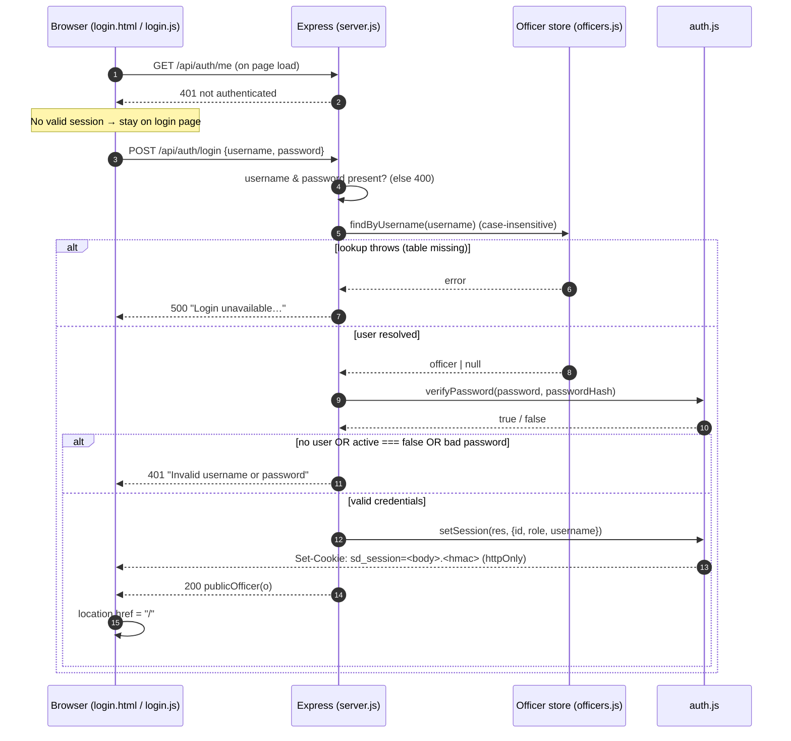
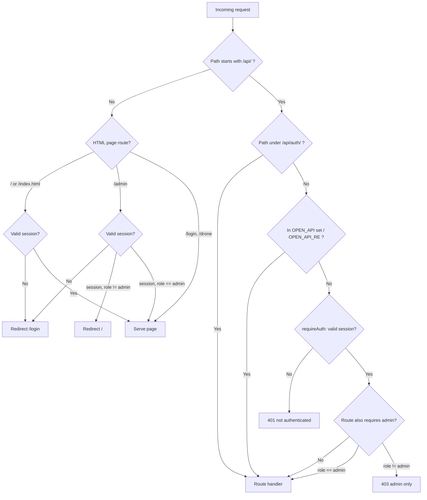

# Authentication & Authorization

This document describes exactly how the Smart City Drone Security System authenticates
users and enforces access control. Every statement is grounded in the source code, with
`file:line` citations. Where a common feature does **not** exist in this codebase, it is
stated explicitly rather than assumed.

---

## 1. Overview

The system uses a deliberately small, dependency-light auth stack:

- **Password hashing** with bcrypt (`bcryptjs`), cost factor 10 (`src/auth.js:17-19`).
- **Stateless sessions** carried in a single **HMAC-SHA256-signed cookie** — a
  "mini-JWT" the code stores in an `httpOnly` cookie so sessions survive restarts
  without any server-side session store (`src/auth.js:1-3, 24-27`).
- **Role-based authorization** with two roles — `officer` and `admin`
  (`src/auth.js:70-75`, `src/officers.js:71-73`).
- **Two categories of principal**: signed-in officers who use the Police Control Center
  (`/`) and the admin console (`/admin`), and the **unauthenticated drone field app**
  (`/drone`), which is intentionally left open (`server.js:66`).

The relevant files are:

| File | Responsibility |
|---|---|
| `src/auth.js` | Password hashing, token signing/verification, cookie session helpers, Express guards |
| `src/officers.js` | Officer account store (Supabase or local JSON), default-admin seeding, `publicOfficer` view |
| `server.js` | Login/logout/`me` routes, the `/api/*` access guard, officer-management routes, page gating |
| `public/js/login.js` + `public/login.html` | The sign-in page (client side of the login flow) |
| `public/js/common.js` | Shared client `api()` fetch wrapper (sends cookies by default) |

---

## 2. Account model & user roles

Officer accounts are the only user identities in the system. An account record is created
with this shape (`src/officers.js:70-74`, `server.js:139-143`):

```js
{
  id,            // e.g. "off_<base36-time><6-hex>"  (officers.js:14-16)
  username,      // unique, matched case-insensitively
  passwordHash,  // bcrypt hash — never returned to clients
  name, badgeId, station, photo,
  role,          // 'officer' (default) | 'admin'
  active,        // boolean; false blocks login
  createdAt,     // ISO timestamp
  theme          // optional saved UI theme (added via /api/auth/theme)
}
```

### Roles

There are exactly **two roles** (`server.js:142, 155`):

| Role | Granted by | Capabilities |
|---|---|---|
| `officer` | Default for any created account (`server.js:142`) | Access the Police Control Center (`/`), all authenticated `/api/*` action/read routes, and self-service profile updates |
| `admin` | Explicitly set at create/patch time (`role === 'admin'`), or the seeded default admin | Everything an officer can do **plus** the admin console (`/admin`) and all `/api/officers` management routes |

The account store backend is chosen once at module load: Supabase when configured, else a
local `data/officers.json` file (`src/officers.js:12, 28-54`). Both paths implement the
same interface (`listOfficers`, `findByUsername`, `findById`, `createOfficer`,
`updateOfficer`, `removeOfficer`).

---

## 3. Password handling (bcrypt)

Passwords are never stored or compared in plaintext.

- **Hashing** — `hashPassword(pw)` calls `bcrypt.hash(String(pw), 10)` (cost factor 10)
  (`src/auth.js:17-19`). It is used when seeding the default admin
  (`src/officers.js:71`), creating an officer (`server.js:140`), and changing a password
  via PATCH (`server.js:157`).
- **Verification** — `verifyPassword(pw, hash)` calls `bcrypt.compare(String(pw), hash || '')`
  inside a `try/catch` that returns `false` on any error, so a malformed or missing hash
  can never throw its way into a successful login (`src/auth.js:20-22`).
- **Storage** — the hash lives in `passwordHash` (local JSON) / `password_hash`
  (Supabase, `NOT NULL`). It is stripped from every client-facing response by
  `publicOfficer()`, which destructures `passwordHash` out and returns the rest
  (`src/officers.js:57-61`). No route ever returns the hash.

There is **no password-strength / complexity policy** and **no minimum length check** in
the code — any non-empty `password` is accepted at create and login time
(`server.js:75, 136`).

---

## 4. Sessions

### 4.1 Mechanism — a signed cookie, not a standard JWT

Sessions are **stateless**: the server keeps no session table. Instead it issues a signed
token and stores it in a cookie (`src/auth.js:1-3`).

The token is what the code comments call a "mini-JWT", but it is **not** an RFC 7519 JWT —
it has **two** parts (`body.signature`), no JOSE header, and no `alg` field
(`src/auth.js:24-27`):

```
token = base64url( JSON({ ...payload, exp: Date.now() + 7 days }) ) + "." + HMAC_SHA256(SECRET, body)
```

- `payload` at sign time is `{ id, role, username }` (`server.js:84`); `exp` is added
  automatically (`src/auth.js:25`).
- The signature is `HMAC-SHA256(SECRET, body)`, base64url-encoded (`src/auth.js:15, 26`).
- `MAX_AGE_MS = 7 days` (`src/auth.js:12`).

### 4.2 Cookie attributes

`setSession(res, payload)` writes the cookie with these attributes (`src/auth.js:54-59`):

| Attribute | Value | Note |
|---|---|---|
| name | `sd_session` | `COOKIE` constant (`src/auth.js:11`) |
| `httpOnly` | `true` | Not readable by page JavaScript (XSS token-theft mitigation) |
| `sameSite` | `'lax'` | CSRF mitigation (see §10) |
| `secure` | `NODE_ENV === 'production'` **or** `RENDER` set | `true` on managed hosts; `false` for local HTTP dev |
| `maxAge` | 7 days | Matches the token `exp` |
| `path` | `/` | Sent to every route |

`setSession` is the **only** place the cookie is issued, and it is called **only** from
the login route (`server.js:84`).

### 4.3 Verification

`verifyToken(token)` performs a constant-time check (`src/auth.js:28-39`):

1. Reject if the token is missing / not a string, or does not split into `body` and `sig`.
2. Recompute `hmac(body)` and compare it to `sig` using
   `crypto.timingSafeEqual` — but only after a length check, so it resists signature
   timing attacks (`src/auth.js:32-34`).
3. Parse the JSON body; reject on parse failure.
4. Reject if `exp` is missing or already in the past (`src/auth.js:37`).
5. Return the payload `{ id, role, username, exp }`.

`sessionFromReq(req)` = `verifyToken(parseCookies(req)[COOKIE])`, where `parseCookies`
parses the raw `Cookie` header and URL-decodes values (`src/auth.js:41-53`).

---

## 5. Login flow

**Endpoint:** `POST /api/auth/login` (open — it precedes the API guard)
(`server.js:73-86`).

Server logic (`server.js:73-86`):

1. Require both `username` and `password` in the JSON body, else `400`
   (`server.js:75`).
2. `findByUsername(username)` — case-insensitive lookup (`src/officers.js:32-35`). If the
   lookup itself throws (e.g. the Supabase `officers` table is missing), respond `500`
   with a hint to create the table (`server.js:79-81`).
3. Reject with `401 "Invalid username or password"` if **any** of: no such user, the
   account is deactivated (`o.active === false`), or `verifyPassword` fails
   (`server.js:82-83`). The identical message for all three cases avoids leaking whether
   a username exists.
4. On success: `setSession(res, { id, role, username })` (issues the cookie) and respond
   with `publicOfficer(o)` (the account minus its password hash) (`server.js:84-85`).

**Client side** (`public/js/login.js`):

- On page load it first calls `GET /api/auth/me`; if already authenticated it redirects
  straight to `/` (`login.js:4`).
- On form submit it `POST`s `{username, password}` to `/api/auth/login`; on success it
  navigates to `/`; on failure it shows `data.error` inline (`login.js:6-29`).



---

## 6. Registration flow

**There is no public / self-service registration.** No route lets an anonymous visitor
create an account. New officers can only be created by an **admin** through the officer
management API:

- `POST /api/officers` (guarded by `requireAdmin`) creates an officer
  (`server.js:134-147`). It rejects a duplicate username with `409`
  (`server.js:138`), hashes the password with bcrypt, and forces `role` to `'officer'`
  unless `'admin'` is explicitly requested (`server.js:140-142`).

The only automatic account creation is the **default admin seed** at boot (see §9).

---

## 7. Session validation & "current user"

`GET /api/auth/me` returns the signed-in officer or `401` (`server.js:88-95`):

1. `sessionFromReq(req)` — verify the cookie token; `401` if invalid/expired.
2. `findById(session.id)` to reload the live account.
3. If the account no longer exists or is now `active === false`, it **clears the cookie**
   and returns `401` (`server.js:93`). This is the one place a deactivated/deleted account
   is actively logged out.
4. Otherwise it returns `publicOfficer(o)`.

The portal uses this on load to render the officer profile (`portal.js` calls
`/api/auth/me`), and the login page uses it to skip the form when already signed in.

**Self-service (any logged-in officer, `requireAuth`):**

- `POST /api/auth/photo` — update own avatar; validates a `data:image/` URI and caps size
  at 800 000 chars (`413` if larger) (`server.js:97-107`).
- `POST /api/auth/theme` — persist own UI theme (string ≤ 40 chars) (`server.js:109-116`).

Both act on `req.session.id`, so an officer can only modify their own record.

---

## 8. Authorization & protected routes

Authorization is enforced in three layers.

### 8.1 Page gating (HTML routes)

Page routes are registered **before** the static-file middleware so gating cannot be
bypassed by requesting the raw file (`server.js:61-69`):

| Route | Guard | Behaviour |
|---|---|---|
| `/login` | none | Serves `login.html` (`server.js:63`) |
| `/`, `/index.html` | `requireAuthPage` | Redirects to `/login` if no session (`server.js:64`, `auth.js:76-80`) |
| `/admin`, `/admin.html` | `requireAdminPage` | Redirect `/login` if no session, redirect `/` if not admin (`server.js:65`, `auth.js:81-86`) |
| `/drone` | none | Field device app stays open (`server.js:66`) |

### 8.2 The `/api/*` access guard

A single middleware gates the entire API surface (`server.js:118-127`). For any request
whose path starts with `/api/`, it requires a valid session **unless** the path is on an
allow-list:

- Auth endpoints: anything under `/api/auth/` passes (`server.js:124`).
- `OPEN_API` exact set: `/api/config`, `/api/drones`, `/api/analyze` (`server.js:120`).
- `OPEN_API_RE` patterns: `POST /api/drones/:id/live/frame` and
  `POST /api/dispatches/:id/frame` (`server.js:121`).

These open endpoints exist because the **unauthenticated drone app** must read config,
list drones, submit frames for analysis, and stream frames. Everything else under `/api/`
falls through to `requireAuth` (`server.js:126`). Non-`/api/` paths are ignored by this
guard (`server.js:123`).

### 8.3 Per-route guards

The four Express guards from `src/auth.js` are the enforcement primitives:

| Guard | On failure | Used for |
|---|---|---|
| `requireAuth` | `401` JSON | Any logged-in officer; sets `req.session` (`auth.js:65-69`) |
| `requireAdmin` | `401` if no session, `403 "admin only"` if `role !== 'admin'` | Admin-only routes (`auth.js:70-75`) |
| `requireAuthPage` | redirect `/login` | Gated HTML pages (`auth.js:76-80`) |
| `requireAdminPage` | redirect `/login` or `/` | Admin HTML page (`auth.js:81-86`) |

Admin-only API routes attach `requireAdmin` **explicitly** in addition to the global
guard — the officer-management routes (`server.js:130, 134, 148, 166`) and the
image/reset admin routes.



### 8.4 Officer-management authorization rules

Beyond `requireAdmin`, the officer routes encode extra guardrails
(`server.js:148-177`):

- **PATCH `/api/officers/:id`** — an admin cannot demote or deactivate **their own**
  account (`role → officer` or `active → false` on `req.session.id` ⇒ `400`)
  (`server.js:158-159`).
- **DELETE `/api/officers/:id`** — an admin cannot delete their own account
  (`400`, `server.js:167`) and cannot delete the **last active admin**
  (`400 "Cannot delete the last active admin."`, `server.js:172-173`).

---

## 9. Default admin seeding

On boot, `seedDefaultAdmin()` runs (invoked from server startup). If **no** account has
`role === 'admin'`, it creates one (`src/officers.js:64-75`):

- `username: 'admin'`, password = `process.env.ADMIN_PASSWORD || 'admin123'`,
  `name: 'System Administrator'`, `badgeId: 'ADMIN-001'`, `station: 'Control HQ'`,
  `role: 'admin'`, `active: true`.
- The password is bcrypt-hashed before storage (`src/officers.js:71`).
- If `ADMIN_PASSWORD` is unset, it logs a warning telling the operator to set it and
  change the password after first login (`src/officers.js:68-69`).

This guarantees at least one usable login exists on a fresh deployment.

---

## 10. What this system does NOT do

These are common auth features that are **absent** from the codebase (verified, not
assumed):

- **No standard JWT / JOSE.** The session token is a custom 2-part `body.signature`
  string signed with HMAC-SHA256; it has no header segment and no `alg` field
  (`src/auth.js:24-27`). No JWT library is used.
- **No token refresh / sliding sessions.** `exp` is fixed at sign time to
  `Date.now() + 7 days` (`src/auth.js:25`) and the cookie is re-issued **only** at login
  (`server.js:84`). Ordinary authenticated requests do not extend the session; when the
  7-day window elapses the user must sign in again. There is no refresh token and no
  refresh endpoint.
- **No OAuth / OIDC / SSO / social login.** Authentication is username + password only.
  There are no third-party identity providers, redirect/callback routes, or OAuth
  scopes anywhere in the code.
- **No public self-registration** (see §6).
- **No server-side session store** (no Redis, no DB session table). Sessions are entirely
  contained in the signed cookie (`src/auth.js:1-3`).
- **No multi-factor authentication, email verification, or password-reset flow.**
- **No login rate-limiting, throttling, or account lockout.** The login route performs a
  lookup and bcrypt compare with no attempt counter (`server.js:73-86`).

---

## 11. Security considerations

Grounded observations about the security posture as implemented:

**Strengths**

- Passwords hashed with bcrypt (cost 10); plaintext never stored (`src/auth.js:17-19`).
- Session signature verified with `crypto.timingSafeEqual` after a length check,
  resisting signature-forgery timing attacks (`src/auth.js:32-34`).
- Session cookie is `httpOnly` (page JS cannot read the token) and `sameSite=lax`
  (mitigates cross-site request forgery for state-changing POSTs) (`src/auth.js:54-59`).
  There is **no separate CSRF token** — `sameSite=lax` is the only CSRF control present.
- Password hash is stripped from every response via `publicOfficer` (`src/officers.js:57-61`).
- Uniform `401 "Invalid username or password"` for unknown user, deactivated account, and
  wrong password prevents username enumeration at the login endpoint (`server.js:82-83`).
- Self-lockout protections: an admin cannot demote/deactivate/delete themselves or delete
  the last active admin (`server.js:158-159, 167, 172-173`).

**Weaknesses / operational cautions**

- **Insecure defaults.** `AUTH_SECRET` defaults to `'dev-insecure-secret-change-me'` and
  logs a warning if unset (`src/auth.js:7-9`); `ADMIN_PASSWORD` defaults to `'admin123'`
  with a warning (`src/officers.js:67-69`). Both **must** be set in production — the HMAC
  secret protects every session, and a known default admin password is a trivial takeover.
- **`secure` cookie is conditional.** The `Secure` flag is set only when
  `NODE_ENV === 'production'` or `RENDER` is present (`src/auth.js:55`). On plain local
  HTTP the session cookie is transmitted without `Secure`.
- **Stateless sessions cannot be revoked before expiry.** `requireAuth` / `requireAdmin`
  only verify the token's signature and `exp`; they do **not** reload the account
  (`src/auth.js:65-75`). Consequently:
  - Deactivating (`active:false`), deleting, or changing an officer's **role** does not
    invalidate an already-issued cookie for API routes — the old token remains valid until
    its 7-day `exp`. (The one exception is `GET /api/auth/me`, which reloads the account
    and clears the cookie for inactive/missing users — `server.js:93`.)
  - `POST /api/auth/logout` only calls `clearSession` to delete the client cookie
    (`server.js:87`, `src/auth.js:60-62`); a token already captured elsewhere stays valid
    until it expires.
- **No login rate-limiting** (see §10), so the login endpoint has no built-in brute-force
  protection.
- **The `/drone` app and its supporting endpoints are intentionally unauthenticated**
  (`server.js:66, 120-121`) — any client on the network can list drones, submit frames to
  `/api/analyze`, and stream frames. This is a deliberate design trade-off for field
  devices, but it is an unauthenticated attack surface to be aware of.

---

## 12. Environment variables that affect auth

| Variable | Effect | Default | Citation |
|---|---|---|---|
| `AUTH_SECRET` | HMAC key signing the session cookie | `'dev-insecure-secret-change-me'` (warns) | `src/auth.js:7-9` |
| `ADMIN_PASSWORD` | Password for the seeded default admin | `'admin123'` (warns) | `src/officers.js:67-69` |
| `NODE_ENV` | `production` ⇒ sets `Secure` cookie flag | unset | `src/auth.js:55` |
| `RENDER` | Presence ⇒ sets `Secure` cookie flag | unset | `src/auth.js:55` |
| `SUPABASE_URL` / `SUPABASE_SECRET_KEY` | If both set, officer accounts live in Supabase; else local `data/officers.json` | unset ⇒ local JSON | `src/officers.js:12`, `src/supa.js:7-9` |

---

*All behaviour above reflects the code as read in `src/auth.js`, `src/officers.js`,
`server.js`, `public/js/login.js`, `public/login.html`, and `public/js/common.js`.*
