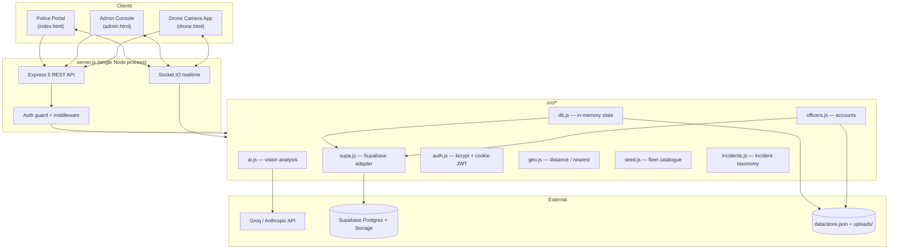
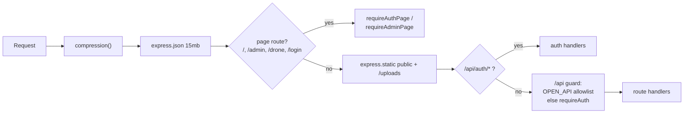
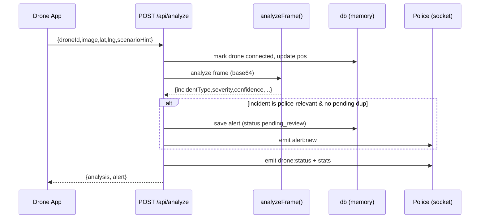
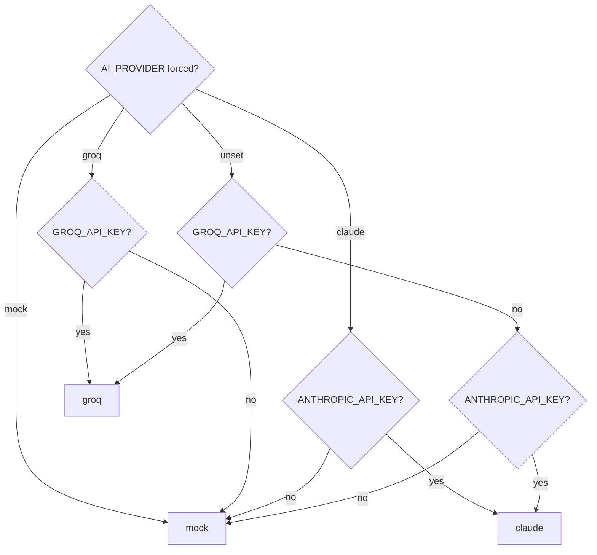
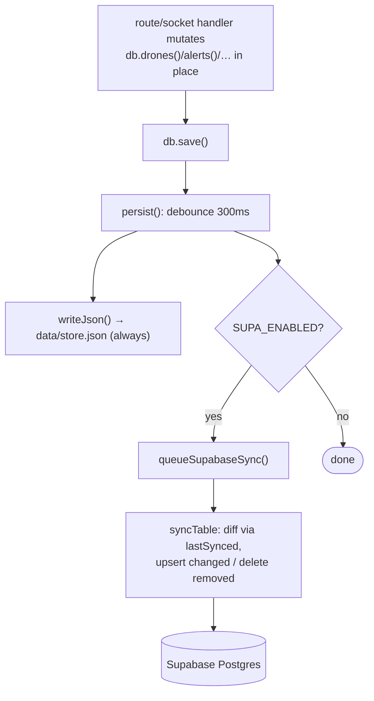
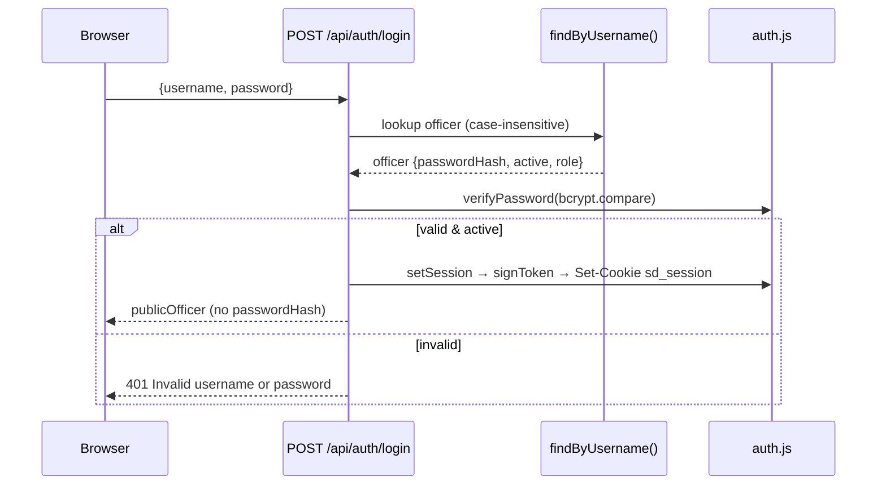

# Backend Architecture — Smart City Drone Security System

> AI-assisted drone surveillance backend for a smart city. A single Node.js process runs an
> Express 5 REST API, a Socket.IO real-time layer, a pluggable persistence layer
> (Supabase Postgres **or** local JSON), and a vision-AI incident classifier
> (Groq / Anthropic Claude / offline mock).
>
> GEC Kozhikode S7 Main Project — Group 17. License: MIT (`package.json:22`).

This document describes the server-side code only. Every claim is grounded in the
repository source and cited as `file:line`. Where a detail cannot be established from
the code it is marked **"Not determinable from the current codebase."**

---

## 1. Technology stack

| Concern | Choice | Evidence |
|---|---|---|
| Runtime | Node.js `>=20`, ESM modules (`"type":"module"`) | `package.json:5,7-8` |
| HTTP framework | Express `^5.2.1` | `package.json:29`, `server.js:12,43` |
| Real-time | Socket.IO `^4.8.3` | `package.json:31`, `server.js:14,45` |
| Vision AI | `@anthropic-ai/sdk ^0.110.0` (Claude) + Groq REST (via `fetch`) | `package.json:24`, `src/ai.js:12,172` |
| Cloud persistence | `@supabase/supabase-js ^2.110.0` (Postgres + Storage) | `package.json:25`, `src/supa.js:5` |
| Password hashing | `bcryptjs ^3.0.3` | `package.json:26`, `src/auth.js:5` |
| Response compression | `compression ^1.8.1` | `package.json:27`, `server.js:58` |
| Env loading | `dotenv ^17.4.2` | `package.json:28`, `server.js:1` |
| PostgreSQL driver | `pg ^8.22.0` — **declared but not imported** in any read source file (a `grep` for `from 'pg'` / `require('pg')` returns no matches); all DB access goes through `@supabase/supabase-js`. | `package.json:30` |

There is **no build step**: the only npm scripts are `start` (`node server.js`) and `dev`
(`node --watch server.js`) (`package.json:10-13`). The frontend is static files served from
`public/`; the backend is pure runtime Node.

---

## 2. High-level architecture



The process is deliberately **single-tier at runtime**: all mutable application state lives
in memory (so route handlers stay synchronous) and every mutation is mirrored to a durable
store asynchronously (`src/db.js:1-6`).

---

## 3. Folder structure

Tracked source files (excluding `public/`, `certs/`, and the runtime `data/` directory):

```
SmartDrone/
├── server.js                # HTTP + Socket.IO server, all routes, socket handlers
├── package.json             # deps, scripts, engines (Node >=20, ESM)
├── render.yaml              # Render Blueprint (web service, npm start, health /api/stats)
├── .env.example             # documented environment variables
├── src/
│   ├── ai.js                # vision-AI provider selection + frame analysis
│   ├── incidents.js         # incident-type catalogue (18 types) + severity ranks
│   ├── db.js                # in-memory state + JSON/Supabase persistence
│   ├── supa.js              # Supabase Postgres + Storage adapter, officer queries
│   ├── auth.js              # bcrypt hashing, signed-cookie sessions, guards
│   ├── officers.js          # officer account CRUD (Supabase or JSON) + admin seed
│   ├── geo.js               # haversine distance + nearest-drone selection
│   └── seed.js              # fleet definition, landmarks, city centre
├── supabase/
│   └── schema.sql           # Postgres DDL for all five tables + indexes
├── public/                  # static frontend (served, not part of backend)
└── data/                    # runtime store.json, officers.json, uploads/ (git-ignored)
```

(File list from `git ls-files`; runtime `data/` directory is created on demand by
`ensureDirs()` at `src/db.js:18-21`.)

---

## 4. Server initialization

### 4.1 Module bootstrap

`server.js` loads `dotenv/config` first (`server.js:1`) so `process.env` is populated before any
module reads it, then imports Node core modules, Express, compression, Socket.IO, and the
eight `src/*` service modules (`server.js:1-29`). An ESM `__dirname` shim is derived from
`import.meta.url` (`server.js:31`).

Configuration constants (`server.js:32-41`):

| Constant | Value | Purpose |
|---|---|---|
| `PORT` | `Number(process.env.PORT) \|\| 3000` | HTTP listen port |
| `HTTPS_PORT` | `process.env.HTTPS_PORT \|\| PORT + 443` (→ 3443) | local self-signed HTTPS port |
| `MAX_FRAMES_PER_DISPATCH` | `16` | archived dispatch thumbnails kept |
| `MAX_UPDATES_PER_DISPATCH` | `50` | field updates kept per dispatch |
| `MAX_MAINFORCE` | `500` | main-force log records kept |
| `MAX_ALERTS` | `300` | alert records kept (pending never evicted) |
| `CLEAR_SECRET` | `process.env.CLEAR_SECRET \|\| 'police2026'` | key to wipe captured images |
| `ARRIVAL_RADIUS_KM` | `0.02` (20 m) | dispatch "arrived" threshold |

The Express app and an `http.Server` wrapping it are created unconditionally, and a Socket.IO
server is bound to that HTTP server with a 12 MB max buffer and aggressive ping settings
(`pingInterval: 10000`, `pingTimeout: 12000`) so a phone that vanishes is detected far faster
than the ~45 s default (`server.js:43-51`).

### 4.2 Startup sequence

```mermaid
sequenceDiagram
  participant Main as start()
  participant DB as db.init()
  participant Seed as seedFleet()
  participant Off as seedDefaultAdmin()
  participant HTTP as server.listen(PORT)
  participant HTTPS as startHttps()

  Main->>DB: await load state (Supabase or JSON)
  Main->>Seed: reconcile fleet to 4 drones
  Main->>Off: ensure ≥1 admin (try/catch)
  Main->>HTTP: listen 0.0.0.0:PORT
  HTTP-->>HTTPS: startHttps() → skip on managed hosts,<br/>else self-signed cert
  HTTP-->>Main: print console banner (URLs, AI label, store)
```

`start()` (`server.js:1186-1216`) is `async` and invoked at module end (`server.js:1218`):

1. **`await db.init()`** — loads state from Supabase if configured, else the local JSON file
   (`server.js:1187`; see §9).
2. **`seedFleet()`** — seeds four drones if the fleet is empty, otherwise reconciles stale
   state (`server.js:1188`; see §8.5).
3. **`await seedDefaultAdmin()`** in a `try/catch` — guarantees at least one admin login; a
   failure (e.g. the `officers` table not yet created in Supabase) is warned, not fatal
   (`server.js:1189-1193`).
4. **`server.listen(PORT, '0.0.0.0', cb)`** (`server.js:1195`). In the callback it calls
   `startHttps()`, enumerates non-internal LAN IPv4 addresses via `lanIPs()`
   (`server.js:1127-1135`), and prints a console banner with the AI label, the active data
   store, and localhost/LAN URLs (`server.js:1198-1214`).

### 4.3 HTTP vs. HTTPS

The plain HTTP server always listens on `PORT` bound to `0.0.0.0` (`server.js:1195`). A
**second, self-signed HTTPS listener** exists so a phone camera can be granted `getUserMedia`
permission over Wi-Fi (browsers require a secure context). `startHttps()`
(`server.js:1164-1184`):

- **Returns `false` and skips HTTPS** when `NODE_ENV==='production'`, `RENDER`, or
  `RAILWAY_ENVIRONMENT` is set — managed hosts terminate TLS at the edge
  (`server.js:1167-1169`).
- Otherwise `loadOrCreateCerts()` (`server.js:1139-1162`) reads `certs/key.pem` +
  `certs/cert.pem`, or regenerates a 10-year self-signed cert via
  `spawnSync('openssl', …, CN=smart-drone.local, SAN localhost/127.0.0.1)`; returns `null`
  if `openssl` is unavailable.
- If credentials load, `https.createServer(creds, app)` is created, `io.attach(httpsServer)`
  shares the realtime layer on the secure port, and it listens on `HTTPS_PORT`
  (`server.js:1176-1178`).

---

## 5. Middleware pipeline

Middleware registration order is load-bearing. Requests flow through it top-to-bottom:



| # | Middleware | Scope | Purpose | Line |
|---|---|---|---|---|
| 1 | `compression()` | global | gzip every response; must precede routes & static | `server.js:58` |
| 2 | `express.json({ limit:'15mb' })` | global | parse JSON bodies up to 15 MB (base64 frames are large) | `server.js:59` |
| 3 | Page GET routes | `/login`,`/`,`/index.html`,`/admin`,`/admin.html`,`/drone` | defined **before** static so login-gating can't be bypassed | `server.js:63-66` |
| 4 | `express.static(public, {index:false})` | global | serve CSS/JS/images; `index:false` so `/` never auto-serves index.html | `server.js:69` |
| 5 | `express.static(UPLOAD_DIR)` | `/uploads` | serve stored frames, `maxAge:'7d', immutable:true` | `server.js:70` |
| 6 | Auth API handlers | `/api/auth/*` | registered before the API guard | `server.js:73-116` |
| 7 | **API access guard** | `/api/*` | require login except allowlisted open endpoints | `server.js:122-127` |
| 8 | Feature routes | various | run behind the guard | `server.js:130+` |

### 5.1 The `/api` access guard

All `/api/*` routes require an authenticated session **except** a small allowlist that the
unauthenticated drone app needs (`server.js:120-127`):

```js
const OPEN_API = new Set(['/api/config', '/api/drones', '/api/analyze']);
const OPEN_API_RE = [/^\/api\/drones\/[^/]+\/live\/frame$/, /^\/api\/dispatches\/[^/]+\/frame$/];
app.use((req, res, next) => {
  if (!req.path.startsWith('/api/')) return next();          // static, pages → pass
  if (req.path.startsWith('/api/auth/')) return next();       // login/logout/me
  if (OPEN_API.has(req.path) || OPEN_API_RE.some((re) => re.test(req.path))) return next();
  return requireAuth(req, res, next);                         // everything else → login
});
```

The drone field device is intentionally unauthenticated (`/drone` stays open,
`server.js:66`), so the endpoints it calls — config, fleet list, frame analysis, and the two
live/dispatch frame-relay paths — are exempt. Every other `/api` route (alerts, dispatches,
main-force, stats, officer admin, image clearing) is gated.

---

## 6. Routes / controllers

All route handlers are defined inline in `server.js` (there is no separate `controllers/`
directory — the file is the controller layer). Auth key: **admin** = `requireAdmin`,
**auth** = login required (global guard or explicit `requireAuth`), **open** = no login.

### 6.1 Pages & auth

| Method | Path | Auth | Body / params | Response | Line |
|---|---|---|---|---|---|
| GET | `/login` | open | — | `login.html` | `63` |
| GET | `/`, `/index.html` | auth page | — | `index.html` | `64` |
| GET | `/admin`, `/admin.html` | admin page | — | `admin.html` | `65` |
| GET | `/drone` | open | — | `drone.html` | `66` |
| POST | `/api/auth/login` | open | `{username,password}` | `publicOfficer` \| 400/401/500 | `73` |
| POST | `/api/auth/logout` | open | — | `{ok:true}` | `87` |
| GET | `/api/auth/me` | self-check | cookie | `publicOfficer` \| 401 | `88` |
| POST | `/api/auth/photo` | auth | `{photo}` data-URI ≤800 000 chars | `publicOfficer` \| 400/413/404/500 | `97` |
| POST | `/api/auth/theme` | auth | `{theme}` ≤40 chars | `{ok:true}` \| 400/500 | `109` |

### 6.2 Officer administration (all `requireAdmin`)

| Method | Path | Body | Response | Line |
|---|---|---|---|---|
| GET | `/api/officers` | — | `publicOfficer[]` | `130` |
| POST | `/api/officers` | `{username,password,name,badgeId,station,photo,role}` | `publicOfficer` \| 400/409/500 | `134` |
| PATCH | `/api/officers/:id` | partial `{name,badgeId,station,photo,role,active,password}` | `publicOfficer` \| 400/404/500 | `148` |
| DELETE | `/api/officers/:id` | — | `{ok:true}` \| 400/404/500 | `166` |

Self-protection rules: an admin cannot demote/deactivate their own account
(`server.js:158-159`), cannot delete their own account (`server.js:167`), and cannot delete
the last active admin (`server.js:172-173`).

### 6.3 Read endpoints

| Method | Path | Auth | Response | Line |
|---|---|---|---|---|
| GET | `/api/config` | open | `{aiMode,aiLabel,cityCenter,incidentTypes,landmarks}` | `295` |
| GET | `/api/drones` | open | drone[] | `299` |
| GET | `/api/alerts` | auth | alert[] (optional `?status=`, newest first) | `301` |
| GET | `/api/dispatches` | auth | dispatch[] (newest first) | `307` |
| GET | `/api/mainforce` | auth | record[] (newest first) | `311` |
| GET | `/api/stats` | auth | stats object | `315` |

The `stats()` object (`server.js:257-269`):
`{ dronesOnline, dronesTotal, pendingAlerts, escalated, dismissed, activeDispatches, mainForce }`.
Sorting is done per-request by `timestamp.localeCompare` on ISO strings (`server.js:304,308,312`).

### 6.4 Incident & dispatch workflow

| Method | Path | Auth | Purpose | Line |
|---|---|---|---|---|
| POST | `/api/analyze` | open | analyze a drone frame → maybe raise an alert | `319` |
| POST | `/api/alerts/:id/escalate` | auth | escalate alert → main force | `412` |
| POST | `/api/alerts/:id/dismiss` | auth | dismiss alert | `460` |
| POST | `/api/dispatches` | auth | dispatch nearby drones to a location | `490` |
| POST | `/api/dispatches/:id/frame` | open | dispatched drone streams a frame (HTTP) | `570` |
| POST | `/api/dispatches/:id/convey` | auth | field update → main force | `610` |
| POST | `/api/dispatches/:id/resolve` | auth | resolve dispatch, free drones | `650` |
| POST | `/api/drones/:id/live/start` | auth | start on-demand live camera | `680` |
| POST | `/api/drones/:id/live/stop` | auth | stop live camera | `691` |
| POST | `/api/drones/:id/live/frame` | open | live frame relay (HTTP) | `701` |

### 6.5 Admin / maintenance

| Method | Path | Auth | Purpose | Line |
|---|---|---|---|---|
| POST | `/api/admin/reset` | admin | clear incidents, keep fleet | `714` |
| POST | `/api/dispatches/clear-resolved` | auth | remove resolved dispatches | `735` |
| POST | `/api/alerts/clear-reviewed` | auth | remove non-pending alerts | `745` |
| POST | `/api/resolve-location` | auth | extract lat/lng from a map link (SSRF-guarded) | `848` |
| POST | `/api/admin/clear-images` | admin | wipe captured images (`CLEAR_SECRET` protected) | `862` |

### 6.6 Notable handler logic

- **`/api/analyze`** (`server.js:319-408`) is the core drone pipeline. It updates the drone's
  position/online flag, calls `analyzeFrame()`, and — only if the incident is non-`normal`
  and `policeRelevant` — raises an alert. Two safeguards run **after** the awaits:
  duplicate pending alerts for the same drone are suppressed (`server.js:349-352,360-362`),
  and a drone that became dispatched during the await window is never demoted with a stale
  alert (`server.js:357-359`). Alerts are capped at `MAX_ALERTS`, evicting oldest **reviewed**
  alerts only — pending alerts are never dropped (`server.js:388-393`).



- **`/api/dispatches`** (`server.js:490-563`) validates coordinates, then uses
  `findNearbyDrones` (default radius 3 km) to pick dispatchable drones. It returns **409**
  with distinct messages for "no drones online" vs. "your online drones are already on a
  dispatch" (`server.js:499-508`). Each chosen drone is marked `dispatched`, receives a
  `drone:command` of type `dispatch`, and is immediately checked for arrival
  (`server.js:533-560`).

- **`/api/dispatches/:id/frame`** (`server.js:570-606`) relays the frame **inline** over the
  socket first (keeping Supabase Storage off the critical path), responds `{ok:true}`, then
  archives every 4th frame (`FRAME_SAVE_EVERY`) as a URL only, evicting frames beyond
  `MAX_FRAMES_PER_DISPATCH` and reclaiming their Storage objects.

- **`/api/resolve-location`** (`server.js:848-858`) delegates to `resolveMapUrl`
  (`server.js:808-846`) — an SSRF-guarded map-link resolver (see §13.3).

---

## 7. Real-time layer (Socket.IO)

Socket.IO is bound to the HTTP server (`server.js:45`) and also attached to the HTTPS server
when it starts (`server.js:1177`). Rooms in use: `'police'`, `'drones'`, and per-drone
`drone:<id>`. Two emit helpers: `toPolice` → `io.to('police').emit` (`server.js:248`) and
`toDrone` → `io.to('drone:<id>').emit` (`server.js:249`).

### 7.1 Inbound events (client → server)

| Event | Payload | Purpose | Line |
|---|---|---|---|
| `police:join` | — | join `police` room, echo `stats` | `934` |
| `police:watch` | `{droneId}` | register a live-view watcher | `940` |
| `police:unwatch` | `{droneId}` | drop watcher; stop stream if last | `948` |
| `drone:hello` | `{droneId,deviceId}` | claim a drone (one device per drone), rejoin rooms, resume dispatch/live | `959` |
| `drone:location` | `{droneId,lat,lng,battery}` | live GPS + battery; ownership-checked; triggers arrival check | `1014` |
| `drone:liveframe` | `(droneId,buf,ack)` | binary live frame → relay `live:frame:bin` | `1038` |
| `drone:dispframe` | `(dispatchId,droneId,buf,ack)` | binary dispatch frame → relay + archive | `1048` |
| `disconnect` | — | clean up watchers; mark drone offline if its room is empty | `1076` |

Ownership and identity are enforced on every drone event: `drone:location`, `drone:liveframe`,
and `drone:dispframe` all bail unless `socket.data.droneId === droneId`
(`server.js:1019,1040,1050`). `droneTakenByOther()` (`server.js:894-905`) allows the same
physical device (`socket.data.deviceId`) to reconnect without being treated as a conflict, but
rejects a *different* device trying to control an occupied drone. **Ground truth for "online"
is socket-room membership, not `lastSeen`** (`server.js:923-931,1088-1090`).

### 7.2 Outbound events (server → client)

| Event | Target | Payload | Representative line |
|---|---|---|---|
| `stats` | police | `stats()` | `936` |
| `drone:status` | police | drone object | `254` |
| `drone:command` | `drone:<id>` | `{type,…}` (`resume`\|`dispatch`\|`livestream`\|`livestream_stop`) | `446,537,686,696` |
| `drone:taken` | requester | `{droneId,available:[ids]}` | `967` |
| `alert:new` / `alert:updated` | police | alert object | `396` / `453` |
| `mainforce:new` | police | main-force record | `454` |
| `dispatch:new` / `:updated` / `:resolved` | police | dispatch object | `550` / `642` / `669` |
| `dispatch:arrived` | police | `{dispatchId,droneId,droneName,at,distanceKm}` | `290` |
| `dispatch:frame` / `dispatch:frame:bin` | police | frame (base64 / binary) | `584` / `1055` |
| `live:frame` / `live:frame:bin` | police | live frame (base64 / binary) | `708` / `1043` |
| `refresh` | police | `{}` | `724` |
| `fleet:changed` | `drones` room | — | `992` |

### 7.3 Connection lifecycle & safety sweep

On `disconnect` a socket is removed from every live-watch set it belonged to, and any drone
whose room is now empty is marked offline (`server.js:1076-1100`). Because a `disconnect`
event can be missed, a `setInterval(…, 10000).unref()` **safety sweep** reconciles each
drone's `connected` flag against real room membership every 10 s and marks phantom-online
drones offline (`server.js:1107-1123`). `.unref()` ensures the timer never keeps the process
alive on shutdown.

---

## 8. Service modules

### 8.1 `src/ai.js` — vision analysis

Classifies a single JPEG frame into exactly one incident type. Three interchangeable
providers, all returning the same normalized shape
`{ incidentType, title, severity, confidence, interpretation, recommendedAction, source }`
(`src/ai.js:8-10`).

**Provider selection** — `decideProvider()` (`src/ai.js:16-24`), evaluated once into
`AI_MODE` (`:25`):



Groq wins over Claude when both keys exist (`src/ai.js:21-22`). `AI_LABEL` is
`'Groq Vision'` / `'Claude Vision'` / `'Standby'` (`src/ai.js:32-33`). Models are overridable:
`CLAUDE_MODEL = process.env.AI_MODEL || 'claude-opus-4-8'` (`:27`) and
`GROQ_MODEL = process.env.GROQ_MODEL || 'meta-llama/llama-4-scout-17b-16e-instruct'` (`:30`).

- **`analyzeGroq`** (`src/ai.js:144-191`) POSTs to Groq's OpenAI-compatible endpoint with a
  15 s `AbortController` timeout (`:168-183`), `temperature:0.2`, `max_tokens:500`, and a
  system prompt appended with a "respond with ONLY JSON" instruction. Non-OK responses throw
  `groq <status>: <body…>` (`:184-187`).
- **`analyzeClaude`** (`src/ai.js:123-141`) calls the Anthropic SDK with an image block + text
  block. It passes `output_config:{format:{type:'json_schema', schema:ANALYSIS_SCHEMA}}`
  (`:137`). There is **no timeout/abort** on the Claude path.
- **`analyzeMock`** (`src/ai.js:382-400`) is fully offline. It honours a `scenarioHint`, or
  draws from `AUTO_WEIGHTS` (`:359-369`) — a weighted distribution over 9 of the 18 types
  (normal 0.5, traffic_block 0.1, …). Templates in `MOCK_TEMPLATES` cover all 18 types.

**`normalize()`** (`src/ai.js:78-100`) is the safety funnel every provider passes through: it
coerces `incident_type` to a known key (else `'normal'`), clamps confidence to `[0,1]`
(dividing by 100 if a model answered 0-100), validates severity against the five-value enum,
and truncates strings. **`parseLenient()`** (`:103-116`) tolerates models that wrap JSON in
prose/code fences by extracting the first `{` … last `}` substring.

**`analyzeFrame()`** (`src/ai.js:402-424`) is the single public entry point. On a real-provider
error it deliberately returns an **"All clear" normal** result rather than inventing a random
incident, so a blank frame or rate-limit never produces a false alert (`:406-422`).

### 8.2 `src/incidents.js` — incident taxonomy

`INCIDENT_TYPES` (`src/incidents.js:7-98`) is the single source of truth for **18** incident
types. Each entry carries `label`, `icon` (emoji for `<option>` menus), `lucide` (line-icon
name), `color`, `defaultSeverity`, `policeRelevant`, and `hint`. Only `normal` has
`policeRelevant:false` (`:8-12`); the other 17 are all police-relevant. Exports:
`INCIDENT_KEYS` (`:100`), `SEVERITY_RANK = {none:0,low:1,medium:2,high:3,critical:4}` (`:102`),
and `meta(type)` which falls back to `INCIDENT_TYPES.normal` for unknown keys (`:104-106`).
The catalogue is injected into the AI system prompt and JSON schema so the prompt, schema, and
UI dropdowns can never drift apart (`src/ai.js:46-50,67`).

### 8.3 `src/db.js` — in-memory state + persistence

A two-tier design (`src/db.js:1-6`): mutable state is held in memory as
`EMPTY = { drones, alerts, dispatches, mainForce }` (`:23`), and every change is mirrored to a
durable backend. The local `data/store.json` file is **always** written as an offline backup,
even when Supabase is enabled (`:6,90`).

Persistence internals:

| Function | Behavior | Line |
|---|---|---|
| `loadJson()` | read/parse `store.json`, merge over `EMPTY`; reset on error | `28-38` |
| `persist()` | **debounced 300 ms** writer; on fire writes JSON and (if Supabase) queues a sync | `85-92` |
| `writeJson()` | serialized async write; overlapping writes deferred via `writeAgain` | `65-82` |
| `queueSupabaseSync()` | coalesced async `supa.syncAll(state)`; re-runs if marked `dirty` mid-flight | `43-59` |
| `flushSync()` | synchronous immediate write, clears the timer (used on exit) | `95-105` |
| `shutdown()` | on SIGINT/SIGTERM: flush JSON, then a 4 s-bounded Supabase flush, then `exit(0)` | `108-125` |

Public `db` API (`src/db.js:129-178`): `state` getter; `drones()`/`alerts()`/`dispatches()`/
`mainForce()` accessors; `find(collection, id)`; `save()` (debounced persist); `flush()`
(immediate); `setDrones(list)`; `reset()`; and `async init()`. Note there is **no per-record
setter** — callers mutate the returned arrays/objects in place and then call `db.save()`
(e.g. `server.js:394-395`).

### 8.4 `src/supa.js` — Supabase adapter

Enabled only when both `SUPABASE_URL` and `SUPABASE_SECRET_KEY` are set:
`SUPA_ENABLED = !!(URL && KEY)` (`src/supa.js:7-9`). The client is created with
`{ auth:{ persistSession:false } }` (`:13`). Bucket name is `'drone-images'` (`:10`).

- **Naming conversion**: the app uses camelCase, DB columns are snake_case. `toRow`/`fromRow`
  convert **only top-level keys**; nested jsonb (e.g. `assignedDrones`) keeps its camelCase
  (`src/supa.js:15-20`).
- **Diff sync**: a per-collection `lastSynced` map of `id → rowKey` (stable, top-level-sorted
  JSON) means `syncTable` upserts **only changed rows** and deletes **only removed ids**
  (`src/supa.js:33-84`) — a single GPS ping no longer re-upserts every row. `lastSynced` is
  updated only *after* a successful upsert, so failures retry next cycle (`:75-76`).
- **`syncAll(state)`** (`:86-97`) isolates each table's errors and throws a joined message if
  any failed, so one bad table doesn't block the others.
- **Image Storage**: `ensureBucket()` (creates the public bucket if missing, `:99-109`),
  `uploadImage(buffer,name)` (`:111-118`), `deleteImages(names)` (`:121-123`),
  `clearImages()` (`:126-135`).
- **Officer queries** (`:138-178`): `officersList`, `officerByUsername` (case-insensitive
  `ilike`), `officerById`, `officerCreate`, `officerUpdate` (allow-listed columns, excludes
  `id`/`created_at`), `officerRemove`. Row mappers translate `password_hash ↔ passwordHash`,
  `badge_id ↔ badgeId`, `created_at ↔ createdAt`.

### 8.5 `src/seed.js` — fleet & landmarks

`CITY_CENTER = {lat:11.2588, lng:75.7804}` — Kozhikode (`src/seed.js:5`). `FLEET` defines four
drones across four city sectors (`:8-13`), assigned ids `drone-1`…`drone-4`.

`seedFleet()` (`:15-57`) **reconciles** rather than blindly re-seeding: it keeps existing
drones whose id is in `FLEET` (resetting transient fields — forces `connected=false`,
`liveView=false`, downgrades `dispatched`/`alerting` → `monitoring`, clears
`activeDispatchId`), adds any missing, and drops extras. It also closes any still-`active`
dispatch left over from a prior run to `resolved` (`:48-54`), then persists via
`db.setDrones(kept)`. Also exported: `HOME_POSITIONS` (drone base coords, `:63`) and
`LANDMARKS` — 10 named Kozhikode places police can dispatch to by name (`:65-76`).

### 8.6 `src/geo.js` — distance & nearest-drone

`haversineKm(a, b)` (`src/geo.js:5-15`) returns great-circle distance in km (Earth radius
6371 km) with a `Math.min(1, …)` domain clamp. `findNearbyDrones(target, drones, {radiusKm=3,
minCount=3})` (`:22-31`) filters to **dispatchable** drones only —
`connected === true && status !== 'dispatched' && !activeDispatchId && typeof lat === 'number'`
(`:24`) — annotates each with `distanceKm`, and sorts ascending. If any fall within `radiusKm`
it returns those (up to 4); otherwise it returns the nearest `minCount` online drones
regardless of distance, because only phone-controlled (online) drones can actually respond
(`:18-21,28-30`).

### 8.7 `src/officers.js` — account store

Backend chosen **once at module load**: `const SUPA = supa.SUPA_ENABLED` (`src/officers.js:12`);
each function branches between Supabase queries and a local `data/officers.json` file.
Exports `newId()` (`off_<base36-time><hex>`, `:14-16`), the async CRUD set
(`listOfficers`/`findByUsername`/`findById`/`createOfficer`/`updateOfficer`/`removeOfficer`,
`:28-54`), `publicOfficer(o)` which strips `passwordHash` before serialization (`:57-61`), and
`seedDefaultAdmin()` (`:64-75`) — if no `role:'admin'` officer exists it creates
`username:'admin'` with password `process.env.ADMIN_PASSWORD || 'admin123'` and warns when the
env var is unset.

---

## 9. Persistence & database communication



**Backend selection** happens at `db.init()` (`src/db.js:161-178`): if `SUPA_ENABLED`, it calls
`supa.ensureBucket()` then `supa.loadAll()` and merges the result over `EMPTY`; on any error it
warns and falls back to `loadJson()`. If Supabase is not enabled it loads the JSON file
directly. **Officer storage is selected independently** and captured once at
`officers.js:12` — the two subsystems can, in principle, use different backends, though both
key off the same `SUPA_ENABLED` flag.

**Write path**: handlers mutate the in-memory arrays and call `db.save()`, which debounces a
300 ms write. On fire it writes `store.json` unconditionally and, when Supabase is enabled,
queues a coalesced `syncAll`. Writes are serialized (`writing`/`writeAgain`) and syncs are
coalesced (`syncing`/`dirty`) so bursts never interleave or hammer the network.

**Load precedence** and **shutdown flush** are both bounded and fault-tolerant — on
SIGINT/SIGTERM the local JSON is flushed synchronously first (guaranteed) and the final
Supabase sync is wrapped in a 4 s `Promise.race` so shutdown never hangs
(`src/db.js:108-125`).

---

## 10. Data models

### 10.1 In-memory shapes

State root: `{ drones:[], alerts:[], dispatches:[], mainForce:[] }` (`src/db.js:23`).

**Drone** (created in `seed.js:26-38`): `{ id, name, sector, lat, lng, status, battery,
connected, liveView, activeDispatchId, lastSeen }`. `status ∈ monitoring | alerting |
dispatched | offline`.

**Alert** (built in `server.js:364-384`): `{ id, droneId, droneName, sector, lat, lng,
timestamp, imageUrl, incidentType, title, severity, confidence, interpretation,
recommendedAction, source, status, reviewedBy, reviewedAt, reviewNote }`. `status ∈
pending_review | escalated | dismissed`.

**Dispatch** (built in `server.js:510-530`): `{ id, timestamp, lat, lng, address, incidentType,
description, officer, status, assignedDrones[], frames[], updates[], arrived[], resolvedAt }`.
`status ∈ active | resolved`. `assignedDrones` items:
`{ id, name, sector, distanceKm, arrived? }`; `arrived` items:
`{ droneId, droneName, at, distanceKm }` (`server.js:283`); `frames` items:
`{ id, droneId, droneName, url, at }` (`server.js:597`).

**Main-force record** (built in `server.js:424-437`): `{ id, timestamp, sourceType, sourceId,
incidentType, title, location, lat, lng, droneName, officer, conveyed }`. `sourceType ∈
alert | dispatch`.

**Officer** (created in `server.js:139-143` / `officers.js:70-74`): `{ id, username,
passwordHash, name, badgeId, station, photo, role, active, createdAt }`, plus `theme` carried
through the Supabase mappers (`supa.js:140,144`).

### 10.2 Postgres schema (`supabase/schema.sql`)

Idempotent DDL (`create table if not exists`) for five tables in `public`, plus indexes; ends
with `notify pgrst, 'reload schema'` to refresh the PostgREST cache (`schema.sql:103`).

| Table | Primary key | Notable columns / defaults | Line |
|---|---|---|---|
| `drones` | `id text` | `connected`/`live_view` default `false`; `active_dispatch_id text` | `6-18` |
| `alerts` | `id text` | `confidence real`; `status` comment `pending_review\|escalated\|dismissed` | `21-41` |
| `dispatches` | `id text` | `assigned_drones/frames/updates/arrived` all `jsonb default '[]'` | `44-59` |
| `main_force` | `id text` | `source_type` comment `alert\|dispatch` | `62-75` |
| `officers` | `id text` | `username unique not null`; `password_hash not null`; `role default 'officer'`; `active default true`; `created_at default now()` | `78-90` |

Indexes: `officers_username_idx on officers(lower(username))` (`:91`); descending timestamp
indexes on `alerts`, `dispatches`, `main_force` (`:94-96`). **No foreign keys** are defined —
`drone_id`, `source_id`, `active_dispatch_id`, etc. are plain `text`. **No RLS** is enabled;
the server uses the trusted `service_role` key which bypasses RLS (`:98-100`).

Note the frontend/app camelCase ↔ DB snake_case mapping is handled by `toRow`/`fromRow`
(`supa.js:19-20`); nested jsonb columns intentionally retain camelCase keys.

---

## 11. Authentication & authorization

Mechanism: **bcrypt password hashing + a stateless, HMAC-SHA256-signed mini-JWT stored in an
httpOnly cookie** — no server-side session store, so sessions survive restarts
(`src/auth.js:1-3`).



- **Hashing** (`src/auth.js:17-22`): `bcrypt.hash(pw, 10)` (cost factor 10);
  `verifyPassword` uses `bcrypt.compare` and returns `false` on any throw.
- **Token** (`:24-39`): `signToken` produces `` `${base64url(json)}.${hmac(base64url)}` `` —
  a **two-part** token (body.signature), with a 7-day `exp` embedded. `verifyToken` recomputes
  the HMAC and compares with `crypto.timingSafeEqual` (length-checked first), then rejects
  missing/expired `exp`. Returns `{ id, role, username, exp }`.
- **Secret**: `SECRET = process.env.AUTH_SECRET || 'dev-insecure-secret-change-me'`; a warning
  is logged when `AUTH_SECRET` is unset (`:7-9`).
- **Cookie** `sd_session`: `httpOnly:true, sameSite:'lax', maxAge:7d, path:'/'`, and
  `secure:true` when `NODE_ENV==='production'` **or** `RENDER` is set (`:11,54-59`).
- **Guards** (`:65-86`): `requireAuth` → 401 if no session; `requireAdmin` → 401 then 403
  `admin only` if `role!=='admin'`; `requireAuthPage` → redirect `/login`; `requireAdminPage`
  → redirect `/login`, then `/` if not admin.

The **login route** itself (`server.js:73-86`) verifies the password, rejects inactive
accounts (`o.active === false`), and calls `setSession`. `/api/auth/me` (`server.js:88-95`)
revalidates the officer still exists and is active, clearing the cookie otherwise.

---

## 12. Validation

Validation is per-handler (there is no schema-validation library). Representative checks:

| Concern | Rule | Line |
|---|---|---|
| Login body | `username` and `password` both required | `server.js:75` |
| Profile photo | must be a `data:image/` URI, ≤ 800 000 chars (else 413) | `server.js:99-101` |
| Theme string | string, ≤ 40 chars | `server.js:111` |
| Officer create | `username` + `password` required; duplicate username → 409 | `server.js:136-138` |
| Role coercion | any role other than `'admin'` collapses to `'officer'` | `server.js:142,155` |
| Dispatch coords | `Number.isFinite(lat/lng)` and `|lat|≤90`, `|lng|≤180` | `server.js:493` |
| GPS payload | same finite/bounds check; out-of-range dropped | `server.js:1017` |
| Battery | only applied when a number in `[0,100]`, then rounded | `server.js:1024` |
| Frame body | `stripBase64(image)` must be non-empty | `server.js:578,705` |
| Convey info | `info.trim()` must be non-empty | `server.js:616` |
| Map link | must match `^https?://`; coords bounds-checked | `server.js:850`, `:772` |
| Socket payloads | null/non-object payloads rejected on `drone:hello`/`drone:location` | `server.js:960,1015` |

The AI layer performs a second, defensive validation pass in `normalize()` — clamping
confidence, enum-checking severity/incident type, and truncating strings regardless of what a
model returns (`src/ai.js:78-100`).

---

## 13. Security

### 13.1 Authentication boundary
Login-gated pages are registered **before** static middleware so gating can't be bypassed by
requesting the file directly (`server.js:61-69`). The `/api` guard defaults to deny — only an
explicit allowlist (`OPEN_API` + `OPEN_API_RE`) is open (`server.js:120-127`). Cookies are
`httpOnly` and `secure` in production; passwords are bcrypt-hashed and never returned
(`publicOfficer` strips `passwordHash`, `officers.js:57-61`).

### 13.2 Device ownership on the realtime layer
Every drone-authored socket event checks `socket.data.droneId === droneId`
(`server.js:1019,1040,1050`), and `drone:hello` enforces one physical device per drone via
`droneTakenByOther` (`server.js:894-905`). This prevents one phone from moving or streaming as
another's drone.

### 13.3 SSRF-guarded map-link resolution
`/api/resolve-location` never fetches an arbitrary host. `resolveMapUrl`
(`server.js:808-846`) first tries a pure-regex coordinate extraction; only if the URL's host
is on the `MAP_HOSTS` allowlist (`server.js:779-787`) does it fetch. Redirects are followed
**manually** (`redirect:'manual'`) so **every hop is re-checked against the allowlist**
(`server.js:817-835`), a short-link cannot 3xx-redirect into an internal host. The fetch has an
8 s abort (`server.js:813`), the response body is capped at 2 MB (`readCapped`,
`server.js:790-806,841`), and non-HTML/JSON content types are rejected (`server.js:840`).

### 13.4 Image-clearing key
`/api/admin/clear-images` requires both `requireAdmin` **and** a matching `CLEAR_SECRET`
(`server.js:862-864`), a defence-in-depth second factor for a destructive operation. Default
`police2026`, overridable via env (`server.js:39`).

### 13.5 Resource caps (DoS resistance)
In-memory collections are bounded — `MAX_ALERTS` 300 (pending never evicted), `MAX_MAINFORCE`
500, `MAX_FRAMES_PER_DISPATCH` 16, `MAX_UPDATES_PER_DISPATCH` 50 (`server.js:34-37`) — and
frame archival is throttled 1-in-4 (`server.js:568,591`). The JSON body limit is 15 MB
(`server.js:59`) and Socket.IO buffers cap at 12 MB (`server.js:46`).

### 13.6 Known weak defaults (grounded observations)
These are shipped defaults, called out honestly, not invented issues:
- `AUTH_SECRET` defaults to `'dev-insecure-secret-change-me'` with only a warning
  (`src/auth.js:7-9`).
- `ADMIN_PASSWORD` defaults to `admin123` with only a warning (`src/officers.js:67-69`).
- `CLEAR_SECRET` defaults to `police2026` (`server.js:39`).
- The self-signed HTTPS cert uses fixed subject/SAN and 10-year validity
  (`server.js:1150-1152`); it exists only for the local phone-camera path.

---

## 14. Error handling

- **Process-level crash guards**: `uncaughtException` and `unhandledRejection` are logged and
  the process stays up — a single malformed payload or rejected promise must never take down
  the control center (`server.js:53-56`).
- **Route handlers** return structured JSON errors with appropriate status codes: `400`
  (validation), `401`/`403` (auth), `404` (unknown entity), `409` (state conflict, e.g.
  "already resolved", "dispatch not active"), `413` (payload too large), `422` (no coords in
  link), `500`/`502` (upstream/internal failures). Async officer/auth handlers wrap DB calls in
  `try/catch` and surface `e.message` (e.g. `server.js:79-81,102-106,132`).
- **AI failures** never propagate as false positives — `analyzeFrame` catches provider errors
  and returns an "All clear" result (`src/ai.js:406-422`); `/api/analyze` still returns `500`
  only if `analyzeFrame` itself throws unexpectedly (`server.js:339-342`).
- **Persistence failures** are non-fatal: JSON write errors are logged
  (`src/db.js:73-74`), Supabase sync errors are warned and retried on the next cycle
  (`src/db.js:51`, `src/supa.js:75-76`), image-upload failures retry once then store no image
  rather than a dead local path in shared mode (`server.js:200-209`).
- **Startup resilience**: `seedDefaultAdmin` failure (missing officers table) is caught and
  warned (`server.js:1189-1193`); Supabase load failure falls back to local JSON
  (`src/db.js:172-176`).

---

## 15. Logging

Logging is via `console.*` (no logging library). Observed conventions:

| Prefix | Meaning | Example |
|---|---|---|
| `[uncaughtException]` / `[unhandledRejection]` | process crash guards | `server.js:55-56` |
| `[ai]` | provider selection, init fallback, per-frame failure | `src/ai.js:40,44,410` |
| `[db]` | store load/sync/persist status | `src/db.js:35,51,74,168` |
| `[supa]` | bucket list/create warnings | `src/supa.js:102,107` |
| `[img]` | Storage upload retry failure | `server.js:205` |
| `[auth]` | missing `AUTH_SECRET`, officer-table init failure | `src/auth.js:9`, `server.js:1192` |
| `[officers]` | default-admin seeding, JSON save failure | `src/officers.js:25,69` |
| `[https]` | cert / secure-listener issues | `server.js:1172,1181` |
| `[seed]` | fleet reconciliation result | `src/seed.js:56` |
| `[analyze]` | analyze-route failure | `server.js:340` |

The startup banner (`server.js:1198-1214`) prints the AI label, the active data store
(Supabase vs. local), and localhost/LAN portal & drone URLs.

---

## 16. Deployment notes

- **Start command**: `npm start` → `node server.js` (`package.json:11`). No build step.
- **Render Blueprint** (`render.yaml`): a `web` service `dronesecurity`, `runtime: node`,
  `plan: free`, build `npm install`, start `npm start`, health check `/api/stats`. Secret env
  vars (`GROQ_API_KEY`, `SUPABASE_URL`, `SUPABASE_SECRET_KEY`) are `sync:false`; `NODE_ENV` and
  `GROQ_MODEL` are literals. `PORT` is **not** set — Render provides it.
- **Environment variables** (from `.env.example` and `process.env` usage): AI —
  `GROQ_API_KEY`, `GROQ_MODEL`, `ANTHROPIC_API_KEY`, `AI_MODEL`, `AI_PROVIDER`; server —
  `PORT`, `HTTPS_PORT`, `CLEAR_SECRET`; persistence — `SUPABASE_URL`, `SUPABASE_SECRET_KEY`;
  auth — `AUTH_SECRET`, `ADMIN_PASSWORD`; platform — `NODE_ENV`, `RENDER`,
  `RAILWAY_ENVIRONMENT`. All are optional (the app runs fully offline with mock AI + local JSON
  store), though `AUTH_SECRET` and `ADMIN_PASSWORD` are strongly recommended in production.

---

## 17. Unknowns / not determinable

- **`pg` usage**: `pg ^8.22.0` is a declared dependency but is not imported in any read source
  file (`package.json:30`; no `import … 'pg'` match). Its runtime role is **not determinable
  from the current codebase**.
- Frontend controller internals (`public/js/*`) are out of scope for this backend document.
- Exact wire behavior of the Anthropic `output_config` parameter (`src/ai.js:137`) depends on
  the SDK/API version and is not verifiable from this repository alone.
