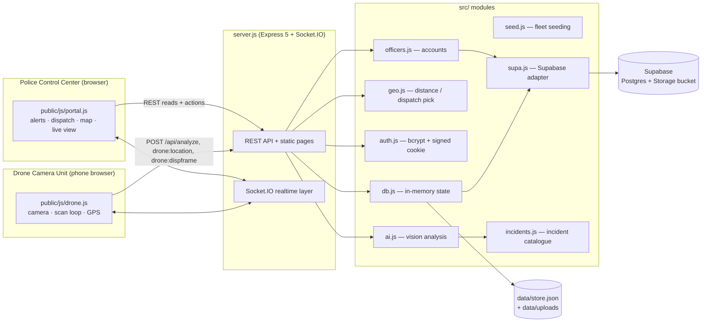
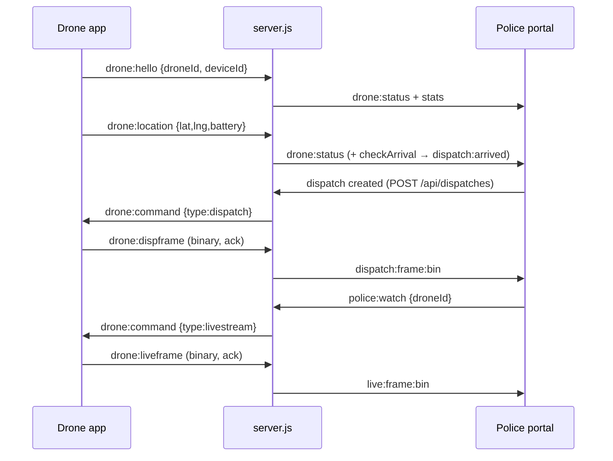
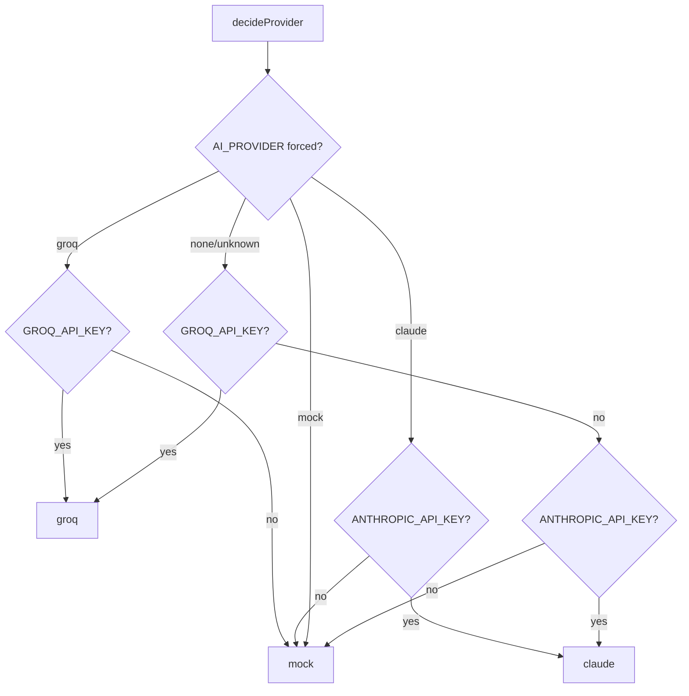
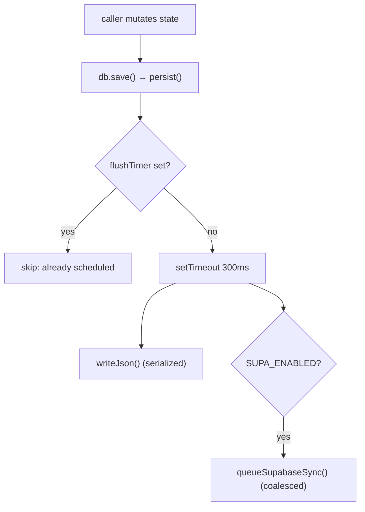
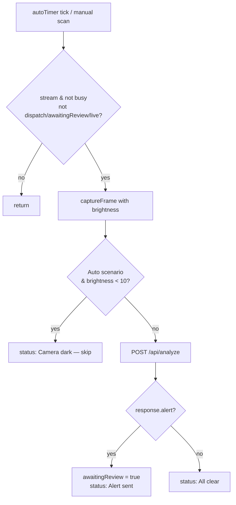

# Code Explanation — Smart City Drone Security System

This document explains the most important modules of the codebase: what each one is
*for*, how it works internally, the notable algorithms it implements, the design
decisions baked into it, and what it depends on. Every claim is grounded in the actual
source, cited as `file:line`.

The system is a **Node.js / Express 5 + Socket.IO** backend with a **Supabase/Postgres
(or local-JSON fallback)** data layer and **Anthropic Claude / Groq** vision AI, plus a
**static-HTML + vanilla-JS** front end (no build step). Two front-end apps are served
from one server: the **Police Control Center** at `/` and the **Drone Camera Unit** at
`/drone` (`server.js:64`, `server.js:66`).

---

## 1. High-level architecture



The backend keeps **all live app state in memory** (`db.js:1-6`) so route handlers can
stay synchronous, and mirrors every change to a durable store asynchronously. Real-time
fan-out (alerts, dispatch commands, live camera frames, GPS) rides Socket.IO rooms
(`police`, `drones`, `drone:<id>`), while REST handles reads, one-shot actions, and the
`/api/analyze` frame pipeline.

---

## 2. `server.js` — HTTP + realtime orchestrator

**Purpose.** The single entry point (`package.json` `main`, started by `node server.js`).
It builds the Express app, attaches Socket.IO to the same HTTP server, wires every REST
route and socket event, runs the startup sequence, and (for local phone-camera use)
optionally starts a self-signed HTTPS listener.

**Dependencies.** `express`, `compression`, `socket.io`, plus the local modules
`src/db.js`, `src/supa.js`, `src/seed.js`, `src/ai.js`, `src/geo.js`, `src/incidents.js`,
`src/auth.js`, `src/officers.js` (`server.js:12-29`).

### 2.1 App creation and crash guards

```js
const app = express();
const server = http.createServer(app);
const io = new SocketServer(server, {
  maxHttpBufferSize: 12e6,
  pingInterval: 10000,
  pingTimeout: 12000
});
```
(`server.js:43-51`). The larger 12 MB buffer accommodates base64/binary frames; the
tightened ping settings detect a vanished phone faster than the ~45 s default so it stops
looking online and dispatchable (`server.js:47-48`). Two process-level handlers log and
stay up rather than let one bad socket payload or rejected promise crash the control
center (`server.js:55-56`).

### 2.2 Middleware order (load-bearing)

```js
app.use(compression());                        // gzip everything, before routes/static
app.use(express.json({ limit: '15mb' }));      // 15 MB cap for base64 frames
// page routes BEFORE static so login-gating can't be bypassed
app.get('/login', ...);
app.get(['/', '/index.html'], requireAuthPage, ...);
app.get(['/admin', '/admin.html'], requireAdminPage, ...);
app.get('/drone', ...);                         // drone app stays open (field device)
app.use(express.static(publicDir, { index: false }));
app.use('/uploads', express.static(UPLOAD_DIR, { maxAge: '7d', immutable: true }));
```
(`server.js:58-70`). Placing the authenticated page routes *before* `express.static`, and
setting `{ index: false }`, ensures the static middleware can never serve `index.html`
at `/` and short-circuit the `requireAuthPage` gate (`server.js:61`, `server.js:69`).

### 2.3 The API access guard

After the auth endpoints, a single guard protects everything under `/api/` except an
explicit open set — the endpoints the unauthenticated drone app must reach:

```js
const OPEN_API = new Set(['/api/config', '/api/drones', '/api/analyze']);
const OPEN_API_RE = [/^\/api\/drones\/[^/]+\/live\/frame$/, /^\/api\/dispatches\/[^/]+\/frame$/];
app.use((req, res, next) => {
  if (!req.path.startsWith('/api/')) return next();
  if (req.path.startsWith('/api/auth/')) return next();
  if (OPEN_API.has(req.path) || OPEN_API_RE.some((re) => re.test(req.path))) return next();
  return requireAuth(req, res, next);
});
```
(`server.js:120-127`). Everything registered *after* this guard (officers CRUD, alerts,
dispatches, stats, etc.) inherits login enforcement, while the drone's shared endpoints
stay open by exact-path or regex match.

### 2.4 The `/api/analyze` pipeline (most important route)

This is where a drone frame becomes an alert. The handler is deliberately careful about
**re-validating state after every `await`**, because analysis and image upload are slow
and the drone's situation can change underneath them:

```js
if (analysis.incidentType !== 'normal' && m.policeRelevant) {
  const existing = db.alerts().find(a => a.droneId === drone.id && a.status === 'pending_review');
  if (existing) { alert = existing; }               // don't stack duplicates
  else {
    const imageUrl = await saveImage(image);
    // Re-validate AFTER the awaits: the drone may now be dispatched, or a concurrent
    // scan may already have raised an alert for it.
    if (drone.activeDispatchId || drone.status === 'dispatched') alert = null;
    else {
      const dup = db.alerts().find(a => a.droneId === drone.id && a.status === 'pending_review');
      if (dup) alert = dup;
      else { /* build alert, push, cap, emit alert:new */ }
    }
  }
}
```
(`server.js:347-400`). The alert cap never evicts a *pending* alert — it keeps all
pending and drops only the oldest reviewed ones (`server.js:388-393`). Regardless of
whether an alert was raised, the handler always pushes fresh telemetry so the map stays
current (`server.js:404-405`).

### 2.5 Dispatch arrival detection

A drone is considered "arrived" once its live GPS is within `ARRIVAL_RADIUS_KM = 0.02`
(20 m) of the dispatch target (`server.js:41`). `checkArrival` fires once per drone and
emits `dispatch:arrived`:

```js
function checkArrival(drone, dispatch) {
  if (!dispatch || dispatch.status !== 'active') return;
  if (dispatch.arrived.some(a => a.droneId === drone.id)) return;   // already arrived once
  const dist = haversineKm({lat: drone.lat, lng: drone.lng}, {lat: dispatch.lat, lng: dispatch.lng});
  if (dist > ARRIVAL_RADIUS_KM) return;
  dispatch.arrived.push({ droneId: drone.id, droneName: drone.name, at, distanceKm });
  ...
  toPolice('dispatch:arrived', { dispatchId: dispatch.id, ...rec });
}
```
(`server.js:277-291`). It is invoked both when a dispatch is created (a drone may already
be in range, `server.js:557-560`) and on every `drone:location` update (`server.js:1030-1033`).

### 2.6 SSRF-guarded map-link resolution

`/api/resolve-location` lets an officer paste a Google/OSM/Apple/Waze share link and
extract coordinates. It first tries a battery of regexes locally (`MAP_COORD_PATTERNS`,
`server.js:756-765`); only if that fails does it fetch — and only from an **allowlist**,
re-checked on **every redirect hop** so a short-link can't 3xx-redirect the server to an
internal host:

```js
for (let hop = 0; hop < 5; hop++) {
  if (!isMapHost(current)) return null;             // re-check the allowlist each hop (SSRF guard)
  resp = await fetch(current, { redirect: 'manual', signal: ctrl.signal, ... });
  if (resp.status >= 300 && resp.status < 400) { current = new URL(loc, current).toString(); ... }
  break;
}
```
(`server.js:819-835`). An 8 s abort timer (`server.js:813`), a 2 MB body cap
(`readCapped`, `server.js:790-806`), and a content-type check (`server.js:840`) bound the
work.

### 2.7 Socket.IO event map



Key server-handled events: `police:join / watch / unwatch`, `drone:hello`,
`drone:location`, `drone:liveframe`, `drone:dispframe`, and `disconnect`
(`server.js:934-1101`). **Ground truth for "online" is Socket.IO room membership**, not a
`lastSeen` timestamp. `droneTakenByOther` (`server.js:894-905`) enforces one physical
device per drone (keyed by a stable `deviceId`, so a reconnect from the *same* phone is
not treated as a conflict). Binary frame relays ack immediately to release the drone's
backpressure, then relay and archive (`server.js:1038-1074`).

A **10 s safety sweep** reconciles the `connected` flag against real room presence in case
a disconnect event was missed, and is `.unref()`-ed so it never keeps the process alive
(`server.js:1107-1123`).

### 2.8 Startup and dual HTTP/HTTPS

`start()` runs `db.init()` → `seedFleet()` → `seedDefaultAdmin()` (in try/catch), then
`server.listen(PORT)` (`server.js:1186-1195`). Inside the listen callback, `startHttps()`
optionally spins up a self-signed HTTPS listener on `HTTPS_PORT` (default `PORT + 443`)
that **shares the same app and Socket.IO instance** via `io.attach` — needed because a
phone browser only grants camera access over `https://` on a LAN. It is **skipped on
managed hosts** (`NODE_ENV=production` / `RENDER` / `RAILWAY_ENVIRONMENT`) that terminate
TLS at their edge (`server.js:1164-1184`). If `certs/*.pem` are missing it tries to
regenerate them with `openssl` (`server.js:1139-1162`).

---

## 3. `src/ai.js` — vision analysis (provider abstraction)

**Purpose.** Turn one still camera frame into a structured incident report of a fixed
shape: `{ incidentType, title, severity, confidence, interpretation, recommendedAction,
source }` (`ai.js:8-10`). Three interchangeable providers back it: **Groq** (OpenAI-
compatible vision), **Claude** (Anthropic vision), and **mock** (offline simulation).

**Dependencies.** `@anthropic-ai/sdk` and the incident catalogue `./incidents.js`
(`ai.js:12-13`).

### 3.1 Provider auto-selection (and the fallback algorithm)



```js
function decideProvider() {
  if (forced === 'groq')   return process.env.GROQ_API_KEY ? 'groq' : 'mock';
  if (forced === 'claude') return process.env.ANTHROPIC_API_KEY ? 'claude' : 'mock';
  if (forced === 'mock')   return 'mock';
  if (process.env.GROQ_API_KEY) return 'groq';        // Groq wins over Claude when both keys exist
  if (process.env.ANTHROPIC_API_KEY) return 'claude';
  return 'mock';
}
```
(`ai.js:17-24`). The result is fixed once into `AI_MODE` at module load (`ai.js:25`), and
surfaced to the UI as `AI_LABEL` — `'Groq Vision'`, `'Claude Vision'`, or `'Standby'`
(`ai.js:32-33`). The Claude client is only constructed in claude mode, in a try/catch that
degrades to mock on failure (`ai.js:35-42`).

### 3.2 Prompt and schema derived from the catalogue

The incident list injected into the prompt is built straight from `INCIDENT_TYPES`, and
the JSON schema's `incident_type` enum is `INCIDENT_KEYS`, so **prompt, schema, and UI
dropdowns can never drift apart** (`ai.js:46-76`). The system prompt casts the model as
the drone's on-board AI, instructs it to classify into exactly one type and to answer
`"normal"` when unsure (`ai.js:52-62`).

### 3.3 Per-provider request shape

- **Claude** (`ai.js:123-141`): one user message whose content is an image block then a
  text block; response parsed by finding the first `text` block.
- **Groq** (`ai.js:144-191`): POST to `https://api.groq.com/openai/v1/chat/completions`,
  `temperature: 0.2`, with an added instruction to reply with **only** a JSON object.
  Guarded by an `AbortController` + 15 s timeout so a hung request can't stall the drone's
  scan loop:

```js
const ctrl = new AbortController();
const timer = setTimeout(() => ctrl.abort(), 15000);
try { res = await fetch(..., { signal: ctrl.signal }); }
finally { clearTimeout(timer); }
```
(`ai.js:168-183`). The Claude path has no such timeout (`ai.js:123-141`).

### 3.4 `normalize()` and lenient parsing

`normalize` is the coercion layer that makes any model output safe (`ai.js:78-100`): it
forces `incidentType` into the enum (else `'normal'`), repairs `confidence` (non-finite →
0.6, values >1 divided by 100 to handle a 0-100 scale, then clamped to `[0,1]`), fills
title/severity/interpretation/recommendedAction from the catalogue defaults, and slices
each string to a max length. `parseLenient` tolerates models that wrap JSON in prose or
code fences by extracting the substring from the first `{` to the last `}`
(`ai.js:103-116`).

### 3.5 The weighted mock picker

When no key is set (or the model output can't be classified), mock mode synthesises a
plausible incident. If no scenario is forced, it draws a type from a weighted
distribution (`ai.js:359-379`):

```js
const AUTO_WEIGHTS = [
  ['normal', 0.5], ['traffic_block', 0.1], ['person_alone_at_night', 0.09],
  ['building_fire', 0.07], ['road_accident', 0.07], ['suspicious_activity', 0.06],
  ['crowd_gathering', 0.05], ['flood', 0.03], ['forest_fire', 0.03]
];
function weightedPick() {
  const r = Math.random();
  let acc = 0;
  for (const [type, w] of AUTO_WEIGHTS) { acc += w; if (r <= acc) return type; }
  return 'normal';
}
```
The weights sum to 1.0 and skew heavily to `normal` (50%) so the demo mostly shows quiet
patrols. **Only 9 of the 18 catalogue types are auto-selectable**; the rest (weapon,
violence, theft, medical, etc.) are reachable only via an explicit `scenarioHint`
(`ai.js:382-384`). Confidence is a random value inside the template's `[lo, hi]` band
(`ai.js:388`).

### 3.6 Failure policy (a deliberate design decision)

```js
export async function analyzeFrame(imageBase64, context = {}) {
  try {
    if (AI_MODE === 'groq') return await analyzeGroq(imageBase64, context);
    if (AI_MODE === 'claude' && claude) return await analyzeClaude(imageBase64, context);
  } catch (err) {
    // A real provider failed — do NOT invent a random incident (that produced false alerts).
    return normalize({ incident_type: 'normal', title: 'All clear', severity: 'none',
      confidence: 0.5, ... }, `${AI_MODE}-unavailable`);
  }
  return analyzeMock(imageBase64, context);   // mock mode (or claude with a null client)
}
```
(`ai.js:402-424`). When a *real* provider throws (rate limit, black frame, timeout), the
frame is treated as **"All clear"** rather than a random incident — a deliberate choice to
avoid false alerts. Mock's randomisation is used only when the configured mode is mock.

> Note: `analyzeClaude` passes `output_config: { format: { type: 'json_schema', ... } }`
> (`ai.js:137`), and `CLAUDE_MODEL` defaults to `'claude-opus-4-8'` (`ai.js:27`). Whether
> those match the live Anthropic API is **Not determinable from the current codebase** —
> they are default strings/params in this repo, and any mismatch would surface at call
> time and be caught by the "All clear" fallback above.

---

## 4. `src/incidents.js` — the incident catalogue

**Purpose.** A single source of truth for the 18 incident types (`incidents.js:7-98`).
Each entry carries `label`, `icon` (emoji), `lucide` (icon name), `color`,
`defaultSeverity`, `policeRelevant`, and a `hint` used both in the AI prompt and as the
fallback interpretation. Exports `INCIDENT_KEYS`, a `SEVERITY_RANK`
(`{none:0,low:1,medium:2,high:3,critical:4}`), and `meta(type)` which returns the entry or
falls back to `normal` (`incidents.js:100-106`). Every type except `normal` is
`policeRelevant: true`, which is exactly the flag `/api/analyze` checks before raising an
alert (`server.js:347`).

---

## 5. `src/db.js` — in-memory state with durable mirroring

**Purpose.** Hold all app state in memory so the rest of the app is synchronous, and
mirror every change to a durable backend — Supabase Postgres when configured, else a local
`data/store.json`. **The JSON file is always written too**, as an offline backup
(`db.js:1-6`).

**Dependencies.** `node:fs`, `node:path`, and `./supa.js` (`db.js:8-11`).

### 5.1 Shape and public API

State is `{ drones, alerts, dispatches, mainForce }` (`db.js:23`). The exported `db`
object exposes collection getters, `find(collection, id)`, `save()` (debounced persist),
`flush()` (immediate), `setDrones()`, `reset()`, and `init()` (`db.js:129-178`). Callers
mutate the returned arrays/objects **in place** and then call `db.save()`; there are no
per-field setters beyond `setDrones` (`db.js:142-153`).

### 5.2 Write path — debounce + serialization + coalescing



Three mechanisms cooperate:

- **`persist()`** debounces writes by 300 ms so a burst of updates hits disk/network once
  (`db.js:85-92`).
- **`writeJson()`** serializes writes with a `writing`/`writeAgain` flag pair so two
  overlapping async writes never interleave and corrupt the file (`db.js:63-82`).
- **`queueSupabaseSync()`** coalesces Supabase syncs: if one is in flight, it sets `dirty`
  and re-runs once after (`db.js:41-59`).

### 5.3 Load precedence and graceful shutdown

`init()` prefers Supabase (`ensureBucket()` + `loadAll()`, merged over `EMPTY`) and falls
back to `loadJson()` on any error, so a Supabase outage never blocks startup
(`db.js:161-178`). On `SIGINT`/`SIGTERM`, `shutdown()` writes local JSON *synchronously
first* (guaranteed even if Supabase is slow), then does a **bounded** final Supabase flush
(`Promise.race` against a 4 s timeout) so a Render restart doesn't lose the last ~300 ms of
debounced changes, then exits (`db.js:108-127`).

---

## 6. `src/supa.js` — Supabase adapter with diff-sync

**Purpose.** The optional cloud backend: Postgres tables plus an image Storage bucket.
Active **iff both** `SUPABASE_URL` and `SUPABASE_SECRET_KEY` are set (`supa.js:7-9`).

**Key algorithm — diff-sync.** Rather than rewrite every row on every save, it keeps a
`lastSynced` map of `id → serialized rowKey` per collection and upserts only changed rows /
deletes only removed ids (`supa.js:30-84`). Naming is converted top-level camel↔snake via
`toRow`/`fromRow`; **nested jsonb keeps camelCase** (`supa.js:15-20`). Deletes are chunked
by 100 ids (`supa.js:54-61`). It also handles image upload/delete/clear against the
`drone-images` bucket and the full officer CRUD surface (`supa.js:111-178`). This module
is described in full in the data-layer reference; the server never talks to Supabase
directly except through `db.js` and `officers.js`.

---

## 7. `src/auth.js` — bcrypt + stateless signed-cookie sessions

**Purpose.** Authentication with **no server-side session store**: bcrypt password hashing
plus a mini-JWT (HMAC-SHA256 signed) kept in an httpOnly cookie, so sessions survive a
Render restart (`auth.js:1-3`).

**Dependencies.** `node:crypto` and `bcryptjs` (`auth.js:4-5`).

### 7.1 Token format

The token is **two parts** (`body.signature`), not a standard 3-part JWT — there is no
separate header:

```js
export function signToken(payload) {
  const body = b64url(JSON.stringify({ ...payload, exp: Date.now() + MAX_AGE_MS }));
  return `${body}.${hmac(body)}`;
}
export function verifyToken(token) {
  const [body, sig] = token.split('.');
  const expect = hmac(body);
  const a = Buffer.from(sig), b = Buffer.from(expect);
  if (a.length !== b.length || !crypto.timingSafeEqual(a, b)) return null;   // constant-time compare
  ...
  if (!payload || !payload.exp || payload.exp < Date.now()) return null;     // reject expired
  return payload; // { id, role, username, exp }
}
```
(`auth.js:24-39`). Signature comparison uses `crypto.timingSafeEqual` (length-checked
first) to avoid timing leaks. Passwords use `bcrypt` cost factor **10** (`auth.js:17-19`),
and `verifyPassword` returns `false` on any throw (`auth.js:20-22`).

### 7.2 Cookie and middleware

`setSession` writes `sd_session` with `httpOnly`, `sameSite:'lax'`, a 7-day `maxAge`, and
`secure` enabled when `NODE_ENV==='production'` or `RENDER` is set (`auth.js:54-59`). Four
guards are exported: `requireAuth`/`requireAdmin` (JSON 401/403 for the API) and
`requireAuthPage`/`requireAdminPage` (redirect to `/login` or `/` for pages)
(`auth.js:65-86`). The secret is `AUTH_SECRET` with an insecure dev default and a warning
if unset (`auth.js:7-9`).

> The **login route itself** lives in `server.js` (`POST /api/auth/login`,
> `server.js:73-86`): it looks up the officer, rejects inactive accounts, verifies the
> password, then calls `setSession`.

---

## 8. `src/officers.js` — officer account store

**Purpose.** CRUD for officer/admin accounts, backed by Supabase when configured, else a
local `data/officers.json` (`officers.js:1-2`). The backend is chosen once at module load
(`const SUPA = supa.SUPA_ENABLED;`, `officers.js:12`), and every function branches on it
(`officers.js:28-54`).

`publicOfficer` strips `passwordHash` before anything reaches the client
(`officers.js:57-61`). **`seedDefaultAdmin()`** runs at boot: if no `role === 'admin'`
account exists, it creates `admin` / `ADMIN_PASSWORD` (default `admin123`, with a warning)
so someone can always log in (`officers.js:64-75`).

---

## 9. `src/geo.js` — distance and dispatch selection

**Purpose.** Geo helpers on plain `{lat, lng}` points. `haversineKm` is the great-circle
distance in km with Earth radius 6371 and a `Math.min(1, …)` clamp for numerical safety
(`geo.js:5-15`).

**Key algorithm — `findNearbyDrones` (dispatch selection).** This decides which drones
answer a dispatch:

```js
export function findNearbyDrones(target, drones, { radiusKm = 3, minCount = 3 } = {}) {
  const ranked = drones
    .filter(d => d.connected && d.status !== 'dispatched' && !d.activeDispatchId && typeof d.lat === 'number')
    .map(d => ({ ...d, distanceKm: haversineKm(target, { lat: d.lat, lng: d.lng }) }))
    .sort((x, y) => x.distanceKm - y.distanceKm);
  const within = ranked.filter(d => d.distanceKm <= radiusKm);
  if (within.length >= 1) return within.slice(0, Math.max(minCount, within.length > 4 ? 4 : within.length));
  return ranked.slice(0, minCount);
}
```
(`geo.js:22-31`). Only **dispatchable** drones qualify — connected, not already
dispatched, no active dispatch, and with a numeric position. If any are within `radiusKm`
(default 3 km) it returns those (capped at 4); otherwise it returns the nearest online
drones *regardless of distance*, because in this system only a phone-controlled (online)
drone can physically respond (`geo.js:18-21`). `server.js` turns an empty result into a
**409** with distinct messages for "no drones online" vs. "all online drones already busy"
(`server.js:499-508`).

---

## 10. `src/seed.js` — fleet seeding and reconciliation

**Purpose.** Define the four demo drones around Kozhikode and reconcile the persisted fleet
to match on every boot (`seed.js:1-13`). `seedFleet()` keeps known drones (resetting
transient fields — `connected`, `liveView`, `activeDispatchId`, and downgrading
`dispatched`/`alerting` back to `monitoring`), adds any missing, and drops extras (e.g.
after shrinking 8 → 4). It also closes any dispatch left `active` from before a restart
(`seed.js:15-57`). It exports `CITY_CENTER`, `LANDMARKS` (10 named places officers can
dispatch to by name), and `HOME_POSITIONS` (`seed.js:63-78`).

---

## 11. `public/js/drone.js` — the Drone Camera Unit controller

**Purpose.** Runs in the field phone's browser. It claims a drone, streams live GPS +
battery, runs the periodic AI scan, and handles dispatch / on-demand live streaming.

**Dependencies.** `/js/common.js` helpers and a browser `io()` Socket.IO client
(`drone.js:1-3`).

### 11.1 Device identity and drone claim

A **stable per-device UUID** is stored in `localStorage['droneDeviceId']` so the server can
tell a reconnect (same phone) from a real conflict (a different phone grabbing the same
drone) (`drone.js:8-19`). On selection it emits `drone:hello { droneId, deviceId }`
(`drone.js:104`); if the server replies `drone:taken`, the client switches to an available
drone (`drone.js:134-140`).

### 11.2 The scan loop (the core monitoring algorithm)



```js
async function scan() {
  if (!st.stream || st.busy || st.dispatch || st.awaitingReview || st.liveRunning) return;
  const image = captureFrame(true);
  if ($('scenario').value === 'auto' && st.lastBrightness != null && st.lastBrightness < 10) {
    setStatus('mon', `Camera dark — skipping · ...`); return;   // don't analyse a covered lens
  }
  st.busy = true;
  const res = await api('/api/analyze', { method: 'POST', body: { droneId, image, lat, lng, scenarioHint } });
  if (st.dispatch || !st.stream) return;                        // situation changed while awaiting
  showVerdict(res.analysis);
  if (res.alert) { st.awaitingReview = true; setStatus('wait', ...); }
  else setStatus('mon', `All clear · ...`);
}
```
(`drone.js:234-276`). Guards prevent overlapping scans (`busy`) and pause monitoring
during dispatch, an unresolved alert (`awaitingReview`), or a live-view session — the heavy
analysis capture would otherwise stutter the live feed (`drone.js:235-237`). Frame capture
draws the video to a 640 px canvas at JPEG quality 0.6, sampling brightness only when
needed (`captureFrame`, `drone.js:196-215`). `updateAuto()` drives the loop at the selected
5/8/15 s interval (`drone.js:288-295`).

### 11.3 Dispatch mode and binary streaming

On a `drone:command {type:'dispatch'}`, `enterDispatch` stores the target, locks the drone
selector, stops auto-monitor, shows the tracker, and starts streaming (`drone.js:298-316`).
`startStreaming` runs a **binary** loop tuned for latency, not detail: ~90 ms cadence
(~11 fps) with up to 3 frames in flight, each a small `captureBlob` (480 px, quality 0.5)
sent over the socket with a 1.5 s timeout ack that decrements the in-flight counter:

```js
socket.timeout(1500).emit('drone:dispframe', st.dispatch.dispatchId, st.dispatch.droneId, buf,
  () => { inFlight = Math.max(0, inFlight - 1); });
```
(`drone.js:321-340`). Capping in-flight frames decouples fps from round-trip latency
(strict 1-at-a-time capped throughput at one frame per RTT). The drone leaves dispatch mode
only on the server's `resume` command, not on a send error (`drone.js:342-354`). The
on-demand live view (`startLive`, `drone.js:357-380`) uses the same pattern at ~80 ms.

### 11.4 Live GPS + dispatch tracker

`toggleGps()` uses `navigator.geolocation.watchPosition` (high accuracy) to update
`st.coords` and `sendLocation()`; on error it falls back to the drone's sector coordinates
(`drone.js:436-469`). `sendLocation` is throttled to 2.5 s (unless forced) and a 5 s
heartbeat keeps the portal fresh even when the phone is stationary (`drone.js:73`,
`drone.js:396-404`). `updateDispatchTracker` recomputes distance and a compass bearing with
a local haversine + `bearingDeg`, declaring arrival at ≤ 20 m and rotating the navigation
arrow toward the target (`drone.js:407-434`).

---

## 12. `public/js/portal.js` — the Police Control Center controller

**Purpose.** The officer-facing single-page controller: alerts triage, dispatch, live map,
main-force log, and live camera viewing.

**Dependencies.** `/js/common.js`, `/js/ascii-ripple.js`, Leaflet (map), Lucide (icons),
and a browser `io()` client (`portal.js:1-4`, `index.html:220-224`).

### 12.1 Boot and socket wiring

`init()` sets up the sidebar, photo edit, theme picker (which POSTs `/api/auth/theme` so a
theme follows the officer), loads config, builds the dispatch incident dropdown from
`CONFIG.incidentTypes` minus `normal`, wires the tabs/forms/modals, calls `wireSocket()`,
emits `police:join`, then refreshes all four collections in parallel
(`portal.js:10-56`). The socket wiring maps realtime events to targeted refreshes
(`portal.js:58-79`): `alert:new` triggers a refresh + toast + alarm; `dispatch:arrived`
toasts + beeps; `drone:status` merges a single drone rather than refetching the fleet.

### 12.2 Efficient rendering — single-drone upsert + debounce

Position pings are frequent, so the portal avoids refetching the whole fleet on each one:

```js
socket.on('drone:status', (drone) => { if (drone && drone.id) upsertDrone(drone); else refreshDrones(); });
function upsertDrone(drone) { /* replace-in-place */ scheduleDroneRender(); }
function scheduleDroneRender() {
  if (droneRenderTimer) return;
  droneRenderTimer = setTimeout(() => { renderMap(); renderDroneList();
    if (state.dispatches.some(d => d.status === 'active')) renderDispatches(); }, 150);
}
```
(`portal.js:62`, `portal.js:86-102`). A 150 ms debounce means a burst of pings costs one
paint, and the dispatch list is only rebuilt while a dispatch is active.

### 12.3 Live frame handling (binary + base64 fallback)

Both dispatch and live-camera feeds have a fast **binary** path and a legacy **base64**
path. In steady state a new frame just swaps one `.src` — no list rebuild, no
document-wide icon re-scan. The binary path builds an object URL and revokes the previous
one for that feed so a long session doesn't leak memory:

```js
function onFrameBin(p) {
  const key = p.dispatchId + '__' + p.droneId;
  const prev = state.liveFrames[key];
  const url = URL.createObjectURL(new Blob([p.buf], { type: 'image/jpeg' }));
  state.liveFrames[key] = url;
  const img = document.querySelector('img[data-feed="' + CSS.escape(key) + '"]');
  if (img) { img.src = url; if (prev?.startsWith('blob:')) URL.revokeObjectURL(prev); return; }
  ...
}
```
(`portal.js:109-141`). The newest frame is cached in `state.liveFrames[dispatchId__droneId]`
so a full re-render keeps the current image.

### 12.4 Live-view lifecycle and the new-alert alarm

Opening a live feed emits `police:watch` + POSTs `/live/start`, arms a 3.5 s watchdog if no
frame arrives, and re-arms a 2.5 s stale watchdog on each frame; closing emits
`police:unwatch` + `/live/stop` (per the frontend reference; `portal.js` live-modal block).
On the server side, the **last watcher leaving** (even via a tab close, where no
`/live/stop` is sent) stops the drone's stream through `liveWatchers` bookkeeping
(`server.js:907-921`, `server.js:1076-1084`). A new alert triggers `startAlarm()` — a red
body glow plus a looping two-tone siren that clears on the first user interaction after a
short grace period (`portal.js` alarm block, referenced at `portal.js:63`).

---

## 13. Cross-cutting design decisions (summary)

| Decision | Where | Why |
|---|---|---|
| In-memory state, async mirror | `db.js:1-6` | Keep route handlers synchronous; durability off the hot path |
| Local JSON always written | `db.js:88-92` | Offline backup even when Supabase is enabled |
| Debounce + serialize + coalesce writes | `db.js:41-92` | Never hammer disk/network; never corrupt the file |
| Bounded shutdown flush | `db.js:108-125` | Don't lose the last ~300 ms on a Render restart; never hang exit |
| Room membership = "online" | `server.js:923-931`, `1107-1123` | Robust truth vs. a stale `lastSeen` |
| One device per drone via `deviceId` | `server.js:894-905` | A reconnect isn't mistaken for a conflict |
| Re-validate after every `await` in `/api/analyze` | `server.js:354-400` | Avoid stale/duplicate alerts and demoting a dispatched drone |
| Provider failure ⇒ "All clear", not random | `ai.js:406-421` | Prevent false alerts from a real provider's error |
| Binary frames + in-flight cap | `drone.js:321-340`, `server.js:1038-1074` | Smooth low-latency video over a phone uplink |
| SSRF allowlist re-checked per hop | `server.js:819-835` | A short-link can't redirect the server to an internal host |
| Pages routed before static + `index:false` | `server.js:61-69` | Login gate can't be bypassed |
| Stateless signed-cookie sessions | `auth.js:1-3` | Survive restarts with no session store |

---

### Gaps / not determinable

- The exact **Express version** is not pinned in `server.js` (imported bare); it is
  declared in `package.json` as `^5.2.1` per the config reference, but not visible in the
  runtime code itself.
- Whether `analyzeClaude`'s `output_config`/`json_schema` parameter and the
  `claude-opus-4-8` model id match the live Anthropic API is **Not determinable from the
  current codebase** — they are default strings/params here, and any mismatch is absorbed
  by the "All clear" fallback (`ai.js:406-421`).
