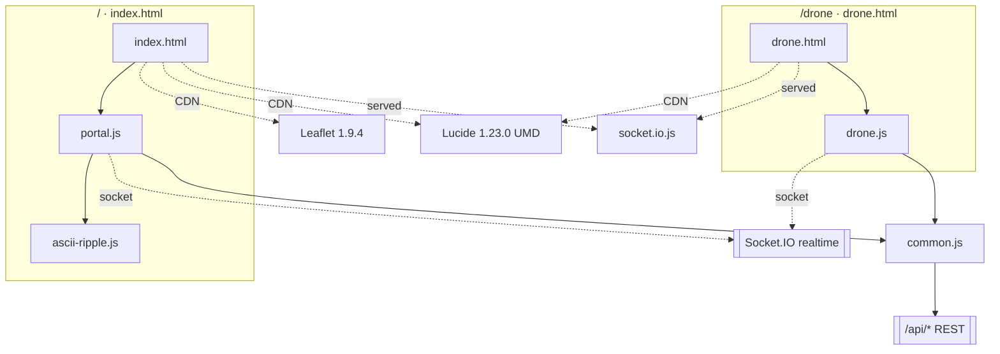
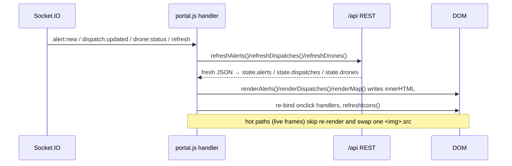

# Component / UI Reference

> Frontend of the **Smart City Drone Security System** (Group 17, GEC Kozhikode).
> This document is a code-grounded reference for the reusable UI pieces and render
> functions that make up the two browser apps. Every claim is cited as
> `file:line` against the files under `d:/Project/SmartDrone/public/`.

---

## 0. Framework context — read this first

**This is a vanilla-JS application. There is no React, no Vue, no JSX, no virtual
DOM, and no build step.** The frontend is three static HTML pages plus ES modules
loaded directly by the browser (`<script type="module">` at `index.html:224` and
`drone.html:102`). Consequently, several concepts this document is asked to cover
**do not apply and are called out explicitly** wherever relevant:

| React concept | Status in this codebase |
|---|---|
| **Props** | Not applicable. "Components" here are plain functions that take ordinary JavaScript arguments and return an HTML **string**, or imperative functions that mutate the DOM directly. Where this doc says "inputs/parameters" it means positional function arguments, not React props. |
| **Component state / `useState`** | Not applicable. There is exactly one mutable state object per page held in module scope — `state` on the portal (`portal.js:5`) and `st` on the drone unit (`drone.js:21`). Render functions **read** from that shared object; they do not own local state. |
| **Hooks / lifecycle (`useEffect`, etc.)** | Not applicable. "Lifecycle" is manual: a Socket.IO event or timer calls a `refresh*()` function which re-fetches and calls a `render*()` function, which rewrites `innerHTML` and re-binds event handlers. |
| **Reconciliation / keyed diffing** | Not applicable. Most renders replace an entire container's `innerHTML` wholesale. A few hot paths deliberately swap a single `.src` instead of rebuilding (`onFrame`, `portal.js:109`). |
| **Reusability mechanism** | String-returning helper functions (`alertCard`, `dispatchCard`, `droneRow`, `icon`) that are `.map(...).join('')`-ed into a list, plus imperative controllers (`initThemePicker`, `attachAsciiRipple`, `openModal`). |

The design idiom throughout is: **build an HTML string → assign to `.innerHTML` →
call `refreshIcons()` to hydrate Lucide `<i data-lucide>` placeholders into SVGs →
re-attach `onclick` handlers by query-selecting the freshly written nodes.**

### Page → module map



Third-party runtime dependencies (loaded, never bundled): Leaflet CSS/JS from
unpkg (`index.html:8,221`), Lucide UMD `1.23.0` (`index.html:222`,
`drone.html:100`), and the server-provided Socket.IO client
(`index.html:220`, `drone.html:99`). The portal additionally lazy-loads a
`pico.js` face detector **only** when an officer edits their avatar
(`portal.js:210-226`).

---

## 1. Shared helpers — `common.js`

`common.js` is the shared toolkit imported by both `portal.js` and `drone.js`.
These are **not** UI components; they are the primitives every component is built
from. Documented here because every later section depends on them.

### 1.1 `CONFIG` / `loadConfig()`
- **Purpose:** holds server-provided client config (AI label/mode, city center,
  incident-type catalogue, landmarks). Exported as a **mutable `let`**
  (`common.js:11`) with sane offline defaults `{ aiMode:'mock',
  cityCenter:{lat:11.2588,lng:75.7804}, incidentTypes:{} }`.
- **Inputs/outputs:** `loadConfig()` (`common.js:13-20`) is `async`, GETs
  `/api/config` via `api()`, assigns the result into `CONFIG`, and returns it.
  On failure it silently keeps the defaults.
- **State read:** none. It *populates* module state that everything else reads.
- **Related:** consumed by `incidentMeta`, the incident-type `<select>` builders
  (`portal.js:22-26`, `drone.js:49-52`), the landmark dropdown
  (`portal.js:491-503`), and the map center (`portal.js:758`, `drone.js:23`).

### 1.2 `incidentMeta(type)` and icon helpers
- `incidentMeta(type)` (`common.js:22-24`) — looks up
  `CONFIG.incidentTypes[type]`; falls back to
  `{label:type, icon:'❓', lucide:'circle-help', color:'#888'}` for unknown types.
  Returns the metadata object `{ label, icon, lucide, color, ... }`.
- `icon(name, cls='')` (`common.js:28-30`) — returns the string
  `<i data-lucide="name" class="cls"></i>`, a **placeholder** that
  `lucide.createIcons()` later replaces with an inline SVG.
- `incidentIcon(type)` (`common.js:32-35`) — a colour-wrapped incident icon
  span. Used on the drone unit (`drone.js:282,305`); imported but effectively
  unused for rendering in the portal (portal uses `icon()` + inline colour).
- `refreshIcons()` (`common.js:37-39`) — calls `window.lucide.createIcons()` if
  present. **Must be called after every `innerHTML` write** that contains
  `data-lucide` placeholders, or icons render as empty `<i>` tags.

### 1.3 `api(path, opts)`
- **Purpose** (`common.js:41-52`): the single `fetch` wrapper used for all REST
  calls. Sets `Content-Type: application/json`, JSON-stringifies `opts.body` when
  present, reads the response as text then attempts `JSON.parse`. On non-`ok` it
  throws `new Error(data.error || res.statusText)`.
- **Parameters:** `path` (string), `opts` (fetch init; `body` is a plain object,
  not pre-stringified).
- **Related:** every `refresh*()` and action handler calls this.

### 1.4 Formatting/escaping utilities
- `esc(s)` (`common.js:54-58`) — HTML-escapes `& < > " '`. Applied to **all**
  interpolated user/AI text before it enters an HTML string (the app's primary
  XSS defence, since rendering is string concatenation into `innerHTML`).
- `timeAgo(iso)` (`common.js:60-67`) — relative time (`Ns/Nm/Nh ago`, else a
  locale datetime); `'—'` when falsy.
- `fmtTime(iso)` (`common.js:69-71`) — localized `HH:MM:SS`.
- `SEV_CLASS` (`common.js:3-9`) — maps severity → CSS class
  (`none→sev-none` … `critical→sev-critical`).

---

## 2. Theme picker — `initThemePicker(mount, onChange)`

`common.js:74-127`. A self-contained, framework-free dropdown widget that lets
the user pick one of **six** palettes; the choice drives all theming via a
`data-theme` attribute on `<html>`.

- **Purpose:** render a theme button + popup menu into a mount element, apply the
  current theme immediately, and persist selection to `localStorage`.
- **Inputs/parameters:**
  - `mount` — an element **or** an element id string (`common.js:93`). Resolves to
    `#themePicker` on both pages (`index.html:56`, `drone.html:16`). Returns a
    no-op stub `{ apply(){} }` if the mount is missing (`common.js:94`).
  - `onChange(id)` — optional callback fired **only on user clicks**, not on
    programmatic `apply()`. The portal uses it to POST the theme to the officer's
    account (`portal.js:14`); the drone unit passes no callback (`drone.js:41`).
- **DOM produced** (`common.js:99-103`): a `.theme-btn#themeBtn` showing the
  current palette's two swatches, plus a `.theme-menu#themeMenu` containing one
  `.theme-opt[data-theme-id]` per entry of the `THEMES` array, each with swatches,
  a name, and a `.theme-check` tick.
- **State read:** `currentTheme()` (`common.js:82-84`) reads
  `localStorage['sd-theme']` (default `'midnight'`); `THEMES` (`common.js:74-81`)
  is the palette list: `midnight, graphite, obsidian, emerald, tricolor, aurora`.
- **Internal logic:**
  - `applyTheme(id)` (`common.js:85-88`) sets
    `document.documentElement.dataset.theme = id` and writes `localStorage`.
  - Clicking the button toggles `.open` (`common.js:109`); clicking an option sets
    `cur`, applies + persists, refreshes swatches/tick, closes the menu, hydrates
    icons, and fires `onChange` (`common.js:110-118`). A document-level click
    closes the menu (`common.js:119`).
  - **Return value:** `{ apply(id) }` (`common.js:121-126`) — sets the theme
    programmatically **without** firing `onChange`. The portal calls this to apply
    the signed-in officer's saved `me.theme` (`portal.js:276`) so a server-side
    preference doesn't loop back into another POST.
- **Pre-paint bootstrap:** both HTML heads run an inline script that reads
  `localStorage['sd-theme']` and sets `dataset.theme` **before first paint**
  (`index.html:10`, `drone.html:9`) to avoid a flash of the default theme.
- **Dependencies:** `icon()` (for swatch tick), `refreshIcons()`; CSS
  `.theme-btn`/`.theme-menu` (`style.css:138-146`).
- **React note:** the returned `{ apply }` object is a hand-rolled imperative
  handle — the vanilla equivalent of a ref-exposed method, **not** a hook.

---

## 3. ASCII glitch-ripple module — `ascii-ripple.js`

`attachAsciiRipple(el, opts)` (`ascii-ripple.js:25-198`). A dependency-free port
of a React "AsciiGlitchRipple" component (`ascii-ripple.js:1-11`), rewritten as an
imperative attach-to-a-DOM-node function. It scrambles an element's text through
an ASCII/box-drawing charset in a ripple that emanates from the pointer (or
auto-runs), then settles back to the original text.

- **Purpose / where used:** decorate the portal's **empty-state messages** so they
  shimmer without interaction — e.g. "No pending alerts. Drones are monitoring…",
  "Nothing reviewed yet.", the empty dispatch and main-force placeholders
  (`portal.js:376-381, 678-679, 719-720`).
- **Inputs/parameters:**
  - `el` — the target element (its trimmed `textContent` is the message).
  - `opts` (`ascii-ripple.js:47-54`): `dur` (ripple ms, default 1000), `chars`
    (scramble set, default `DEFAULT_CHARS` at `:18`), `preserveSpaces` (default
    true), `spread` (default 1.0), `auto` (self-run, default false), `autoEvery`
    (ms between self-ripples, default 2600). Callers pass `{ auto:true }`.
- **Outputs / DOM effects:**
  - Rewrites `el.textContent` each animation frame (`ascii-ripple.js:119`) and
    toggles the `.as` class while animating (`:127`).
  - **Accessibility:** sets `aria-hidden="true"` on the churning node and inserts a
    static `.sr-only` twin span beside it so screen readers get the real message
    (`ascii-ripple.js:41-45`; `.sr-only` at `style.css:341`).
  - Returns a `cleanup()` function that removes listeners, clears timers, restores
    text, removes `aria-hidden`, and deletes the twin (`ascii-ripple.js:182-197`).
- **State read:** none external — it is fully self-contained per element. Internal
  state: `waves[]`, `animId`, `autoId`, `isHover`, `cursorPos`, `autoSweep`
  (`ascii-ripple.js:59-64`).
- **Internal logic:**
  - `calcWaveEffect(charIdx, t)` (`:68-87`) — for each active wave computes a
    radius from elapsed-fraction × distance, scrambling characters within
    `WAVE_THRESH` of the wave edge using a cycling index.
  - `frame()` (`:112-121`) — the rAF loop; prunes expired waves and stops when none
    remain. `startWave(pos)` (`:123-130`) pushes a wave and starts the loop.
  - Pointer handlers `mouseenter/mousemove/mouseleave` (`:139-158`) spawn ripples
    from the cursor's character position (`posFromEvent`, `:132-137`).
  - **Auto mode** (`:161-180`): a `setInterval` walks a ripple across the text,
    but pauses when hovered, when `document.hidden`, or when the node has no
    `offsetParent` (i.e. its tab panel is `display:none`), and self-terminates once
    the node is detached (`!el.isConnected`) so replaced empty-states are GC-able.
- **Guards:** idempotent via `el.dataset.rippleOn` (`:29,35`); honours
  `prefers-reduced-motion` by leaving text static and animating nothing
  (`:20-23, 33`).
- **Constants:** `WAVE_THRESH=3`, `CHAR_MULT=3`, `ANIM_STEP=40`, `WAVE_BUF=5`
  (`:13-16`).
- **React note:** the source component's props map to the `opts` object; its
  effect-cleanup maps to the returned `cleanup()`. There is no re-render — text is
  mutated in place.

---

## 4. Stat tiles (police portal)

Static markup in `index.html:61-68` + the `setStats()` updater
(`portal.js:144-154`) + a first-hover flag animation (`setupFlagWave`,
`portal.js:304-315`).

- **Purpose:** the six-tile dashboard header showing live fleet/incident counts.
- **DOM (static):** a `.stats` grid of six `.tile` elements, each a 3D icon badge
  (`.icon3d.metal`) + a number (`.n`) + a label (`.l`). The six numeric nodes are
  `#s_drones`, `#s_pending`, `#s_escalated`, `#s_dismissed`, `#s_dispatch`,
  `#s_mf` (`index.html:62-67`). Some tiles carry accent classes
  (`.tile.alert/.disp/.mf`) that colour the number (`style.css:227-229`).
- **Inputs to the updater:** `setStats(s)` takes a stats object with keys
  `dronesOnline, dronesTotal, pendingAlerts, escalated, dismissed,
  activeDispatches, mainForce` (the shape returned by `/api/stats` and the socket
  `stats` event).
- **Outputs:** writes `textContent` on the six nodes; `#s_drones` shows
  `online/total` (`portal.js:145`). Also drives the tab badge `#pill_alerts`:
  shown with the count when `pendingAlerts > 0`, hidden otherwise
  (`portal.js:151-153`).
- **State read:** none of the portal `state` object — `setStats` is a pure
  DOM-writer fed by socket/HTTP. It is wired to the `stats` socket event
  (`portal.js:59`) and called once at boot with `/api/stats` (`portal.js:53`).
- **`setupFlagWave()`** (`portal.js:304-315`): appends a `.flag-sweep` span to each
  tile and, **only under the `tricolor` theme**, plays a one-time Indian-flag sweep
  on each tile's first hover (guarded by
  `document.documentElement.dataset.theme === 'tricolor'`).
- **Related CSS:** `.tile` staggered rise-in + hover liquid-sheen
  (`style.css:208-244`); flag sweep (`style.css:696+`).

---

## 5. Alert cards (police portal)

The alerts panel is the portal's primary review surface. It is built from three
cooperating functions.

### 5.1 `alertCard(a, reviewed)` — the card template
`portal.js:331-369`.

- **Purpose:** return the HTML string for a single alert as a collapsible card
  (compact header always visible; full detail revealed on click).
- **Parameters:**
  - `a` — an alert record. Fields read: `incidentType, confidence, severity,
    source, imageUrl, title, droneName, sector, timestamp, interpretation,
    recommendedAction, lat, lng, id, status, reviewNote, reviewedBy`.
  - `reviewed` (boolean) — chooses between the **action buttons** (pending) and a
    **status chip** (already escalated/dismissed) (`portal.js:337-342`).
- **DOM produced:**
  ```mermaid
  graph TD
    AC[".alert-card (.open toggles detail)"] --> H[".ac-head [data-toggle=id]"]
    AC --> D[".ac-details (hidden until .open)"]
    H --> T[".ac-thumb-sm — image OR incident icon"]
    H --> M[".ac-main: .ac-title + .ac-sub + .ac-snippet"]
    H --> CH[".ac-chevron"]
    D --> IMG["full .ac-thumb image (if imageUrl)"]
    D --> INT[".interp quote + suggested action"]
    D --> CONF["confidence bar"]
    D --> COORD["lat/lng + source label"]
    D --> ACT[".ac-actions: buttons OR status chip"]
  ```
- **Internal logic:**
  - `conf` = `round(confidence*100)`; rendered as a `.conf-bar` width and a `%`
    label (`portal.js:333,364`).
  - `sourceLabel` maps the raw `source` string to a friendly name:
    `claude*→"Claude Vision"`, `groq*→"Groq Vision"`, else `"AI Vision"`
    (`portal.js:335`).
  - Thumbnail: the captured `imageUrl` if present, else a coloured incident icon
    (`portal.js:345-347`).
  - **Pending** cards render two buttons — `[data-esc]` "Escalate to Main Force"
    and `[data-dis]` "Situation OK — Resume" (`portal.js:339-342`). **Reviewed**
    cards render a chip plus any review note (`portal.js:338`).
- **State read:** `incidentMeta`, `SEV_CLASS` from config; no portal `state`
  directly (the caller supplies `a`).

### 5.2 `renderAlerts()` — list renderer + wiring
`portal.js:371-390`.

- **Purpose:** split `state.alerts` into pending vs. reviewed, render each list,
  and (re-)bind interactions.
- **State read:** `state.alerts` (`portal.js:372-373`), partitioned by
  `status === 'pending_review'`.
- **Outputs:** writes `#alertsPending` and `#alertsHistory`. Empty lists render a
  `.empty.ripple-empty` placeholder that then gets `attachAsciiRipple(el,{auto:true})`
  (`portal.js:376-382`). Shows/hides `#clearAlertsBtn` based on whether any
  reviewed history exists (`portal.js:383-384`).
- **Event wiring (re-attached every render):**
  - `[data-toggle]` headers toggle `.open` on the closest `.alert-card`
    (`portal.js:386`) — this is the expand/collapse.
  - `[data-esc]`/`[data-dis]` buttons call `reviewAlert(id, 'escalate'|'dismiss')`
    with `stopPropagation` so the toggle doesn't also fire (`portal.js:387-388`).
  - Ends with `refreshIcons()` (`portal.js:389`).
- **Triggered by:** `refreshAlerts()` (`portal.js:103`), which is called on socket
  `alert:new`/`alert:updated` (`portal.js:63-64`) and the 30 s "x ago" re-render
  interval (`portal.js:55`).

### 5.3 `reviewAlert(id, kind)` — the decision flow
`portal.js:392-409`. Looks up the alert in `state.alerts`, then opens the shared
review modal (§10.1) with escalate/dismiss-specific copy. The modal's `onOk(note)`
callback POSTs to `/api/alerts/:id/escalate` or `/dismiss` with
`{ officer:'Drone Police Officer', note }` (`portal.js:403-406`).

---

## 6. Dispatch cards + live footage (police portal)

### 6.1 `dispatchCard(d)` — template
`portal.js:596-662`.

- **Purpose:** render one emergency dispatch: incident header, per-drone status
  chips (with live distance + battery), a grid of live footage tiles, conveyed
  updates, and (when active) convey/resolve controls.
- **Parameters:** `d` — a dispatch record. Fields read: `status, frames[],
  arrived[], assignedDrones[], incidentType, address, lat, lng, timestamp,
  description, updates[], id`.
- **State read:** `state.drones` (to get each assigned drone's **live** position,
  connection, battery — `portal.js:601-602`) and `state.liveFrames` (cached newest
  camera frame per drone — `portal.js:630`).
- **Internal logic:**
  - Builds `latestByDrone` from `d.frames` and an `arrivedIds` set from
    `d.arrived` (`portal.js:598-600`).
  - **Per-drone chip** (`portal.js:603-623`): status is "reached location" if
    arrived; else, while active and the drone is live, an en-route line with a
    freshly computed `haversineKm(live, target)` distance (`portal.js:609`); else
    the static snapshot `a.distanceKm`. Appends a live **battery** indicator
    (icon+colour chosen by level, `portal.js:616-619`) and, for online assigned
    drones, a `[data-livecam]` "Access live camera / Live camera (en route)"
    button (`portal.js:620-621`).
  - **Footage tiles** (`portal.js:625-638`): for each assigned drone, prefer the
    cached live frame `state.liveFrames[key]`, else the last archived thumbnail
    URL, else a `.sim-tile` "surrounding…" placeholder with a scan animation. The
    live `` carries `data-feed="<dispatchId>__<droneId>"` so incoming frames
    can target it by attribute (see §6.3).
  - **Active-only footer** (`portal.js:654-660`): a `#conv_<id>` convey input plus
    `[data-convey]` and `[data-resolve]` buttons.
- **`haversineKm(a,b)`** (`portal.js:587-594`) — local great-circle helper (km,
  R=6371) used for live en-route distances. (Note: a second, independent copy
  exists in `drone.js:407-412` for the on-device tracker — see §13.4.)

### 6.2 `renderDispatches()` — list renderer
`portal.js:664-704`.

- **State read:** `state.dispatches` (`portal.js:676`).
- **Outputs:** writes `#dispatchList`; empty → ripple placeholder
  (`portal.js:677-679`).
- **Input-preservation trick (important):** because live footage re-renders this
  list frequently, before rewriting `innerHTML` it **saves every `#conv_*` input's
  value plus the focused input's selection range**, then restores them afterward
  (`portal.js:668-692`) so an officer typing a convey message isn't interrupted.
- **Event wiring:** `[data-livecam]`→`openLive` (`portal.js:680`);
  `[data-resolve]`→POST `/resolve` (`portal.js:693`);
  `[data-convey]`→POST `/convey` with `{info, officer:'Drone Police Officer'}`
  (`portal.js:694-699`). Toggles `#clearDispBtn` visibility on resolved history
  (`portal.js:701-702`).

### 6.3 Live dispatch frame ingestion — `onFrame` / `onFrameBin`
`portal.js:109-141`. These are **not** renderers; they are the socket handlers
that feed footage tiles with minimal work.

- **`onFrame(p)`** (base64 legacy, `portal.js:109-120`): caches
  `state.liveFrames[dispatchId__droneId] = p.image`; if a matching
  `img[data-feed=key]` already exists, just swaps `.src` (the steady-state cheap
  path); otherwise triggers one `renderDispatches()` to build the card.
- **`onFrameBin(p)`** (binary fast path, `portal.js:123-141`): wraps `p.buf` in a
  `Blob`→object URL, swaps the tile's `.src`, and **revokes the previous object
  URL** for that drone to avoid a memory leak during long dispatches.
- **CSS escape:** the `data-feed` selector uses `CSS.escape(key)` when available
  (`portal.js:114,130`).

---

## 7. Main Force log — `renderMF()`

`portal.js:707-722`.
- **Purpose:** render the list of records conveyed to the main police force.
- **State read:** `state.mf`.
- **Outputs:** writes `#mfList` with one `.log-item` per record showing timestamp,
  `sourceType` ("Escalation" vs "Field update"), officer, incident title +
  location + drone name, and the conveyed text. Empty → ripple placeholder
  (`portal.js:718-720`). Ends with `refreshIcons()`.

---

## 8. Fleet map (police portal)

A Leaflet map plus a synced fleet roster side-panel. Module-local state:
`lmap`, `mapMarkers`, `mapFitted` (`portal.js:727-729`) and
`STATUS_COLOR` (`portal.js:725`).

### 8.1 `initMap()` — one-time setup
`portal.js:757-774`. Creates the Leaflet map centered on `CONFIG.cityCenter`,
adds dark CARTO tiles (no API key), creates the `mapMarkers` layer group, and
binds a **map click** handler that sets `state.pendingTarget`, fills the dispatch
lat/lng inputs, re-renders, and shows the pin-confirm overlay
(`portal.js:767-773`).

### 8.2 `renderMap()` — marker rebuild
`portal.js:809-849`.
- **Purpose:** redraw all incident/dispatch/drone markers.
- **State read:** `state.alerts`, `state.dispatches`, `state.pendingTarget`,
  `state.drones`.
- **Lazy/guarded init:** always calls `renderFleetPanel()` first (panel is
  independent of Leaflet). Only initialises Leaflet **when the Map tab is active**
  (needs a sized container) and **skips the full marker teardown/rebuild when the
  map is hidden** (`portal.js:810-819`) — `setupTabs` re-renders on tab open
  (`portal.js:325`).
- **What it draws:** pending-alert incident pins (`lucidePin`, `portal.js:824-829`);
  active-dispatch targets with a 20 m dashed arrival radius (`L.circle`) + a solid
  red pin (`portal.js:831-834`); the pending map-click target as an orange pin
  (`portal.js:836-838`); and **only connected** drones as `droneIcon` markers
  (offline drones live in the side panel instead) (`portal.js:841-846`). Auto-fits
  once when the first online drone appears (`mapFitted` guard, `portal.js:848`).
- **Icon builders:**
  - `lucidePin(name,color,size)` (`portal.js:776-783`) — a Lucide-glyph `divIcon`.
  - `solidPin(color,size)` (`portal.js:785-793`) — a teardrop SVG pin whose tip
    sits on the exact coordinate (`iconAnchor` at the tip).
  - `droneIcon(d)` (`portal.js:794-807`) — a labelled dot whose colour comes from
    `STATUS_COLOR[connected ? status : 'offline']`, with a glowing ring when
    connected.

### 8.3 `fitMap()`
`portal.js:733-742`. Collects connected drones + active dispatches +
pending-review alerts and `fitBounds` (or `setView` for a single point). Bound to
`#fitMapBtn` (`portal.js:36`) and used after tab open.

### 8.4 `renderFleetPanel()` — roster aside
`portal.js:853-879`. Independent of the Leaflet map (always renders). Sorts
`state.drones` online-first, then draws an `#offlineBox` list: each drone's name +
status dot, sector, and a live line (status·battery·"viewing" when online; "last
seen …"/"not yet connected" when offline). Header shows `online/total`.

### 8.5 Pin-confirm overlay
`showPinConfirm()` / `hidePinConfirm()` (`portal.js:744-755`). Populates
`#pinCoords` from `state.pendingTarget` and toggles the `.show` class on
`#pinConfirm` (static markup at `index.html:148-153`). `#pinUse` switches to the
dispatch tab; `#pinCancel` clears the pending target (`portal.js:40-48`).

---

## 9. Drone fleet cards + on-demand live view (police portal)

### 9.1 `droneRow(d)` / `renderDroneList()`
- `droneRow(d)` (`portal.js:882-909`) — HTML string for one `.fleet-card`: 3D
  icon badge (accent colour by effective status), name + sector, a status chip, a
  battery meter (`.hatch`/`.bar-fill`, width from `d.battery`), and a **Live view**
  button `[data-live]` that is `disabled` unless `d.connected`.
- `renderDroneList()` (`portal.js:910-916`) — writes `#droneList` from
  `state.drones`, binds each `[data-live]` to `openLive(id)`, hydrates icons.

### 9.2 Live camera modal
Static markup at `index.html:203-218` (`#liveBack` overlay → `.modal` with
`#liveTitle`, `#liveImg`, `#liveWait`, `#liveMeta`). Controller functions:

- **`openLive(id)`** (`portal.js:922-945`): sets `state.liveDroneId`, resets the
  modal to a "Connecting…" waiting state, opens the overlay, emits
  `police:watch {droneId}` (so the server stops the feed if the tab closes), arms a
  **3.5 s watchdog** that shows "camera off" if no frame arrives
  (`portal.js:938-939`), then POSTs `/api/drones/:id/live/start`.
- **`onLiveFrame` / `onLiveFrameBin`** (`portal.js:983-1004`): socket handlers.
  Ignore frames not for the current `state.liveDroneId`; call `liveFrameArrived()`;
  set `#liveImg.src` (binary path uses an object URL and revokes the previous one,
  `portal.js:997-1002`); update `#liveMeta` with the frame time.
- **`liveFrameArrived()`** (`portal.js:959-967`): marks `liveGotFrame`, clears the
  connect watchdog, hides the waiting text, and **arms a 2.5 s stale watchdog** so
  that if frames stop (camera turned off mid-view) `liveShowOff()` fires.
- **`liveShowOff()`** (`portal.js:948-956`): hides the frozen last frame and shows
  a "Camera is off" message.
- **`closeLive()`** (`portal.js:969-982`): closes the overlay, clears watchdogs,
  revokes any lingering object URL, emits `police:unwatch`, and POSTs
  `/api/drones/:id/live/stop`.
- **State read/written:** `state.liveDroneId`, `state.liveGotFrame`,
  `state.liveWaitTimer`, `state.liveStaleTimer` (all added to `state` at runtime).
- **Setup:** `setupLiveModal()` (`portal.js:918-921`) wires `#liveClose` and
  backdrop-click to `closeLive`.

---

## 10. Modals (police portal)

### 10.1 Generic review modal — `openModal` / `closeModal`
`portal.js:1006-1025`; static markup `index.html:177-187`.
- **Purpose:** a reusable confirm dialog with a title, description, optional note
  textarea, and a confirm button whose label and callback are supplied per call.
- **Parameters (via an options object, the vanilla stand-in for props):**
  `openModal({ title, desc, okLabel, onOk })` (`portal.js:1017-1024`). `onOk(note)`
  receives the textarea value; it is stored in the module-local `modalOnOk`
  (`portal.js:1007`) and invoked when the user confirms (`portal.js:1011-1015`),
  wrapped in try/catch that `alert()`s errors.
- **Consumers:** `reviewAlert` (escalate/dismiss, §5.3). This is the only generic
  modal; other dialogs are purpose-built.

### 10.2 Clear-captured-images modal — `setupClearModal` / `clearImages`
`portal.js:1027-1058`; static markup `index.html:189-201`.
- **Purpose:** admin-only, secret-key-protected wipe of stored drone images, with
  two modes: **archive** ("Move to police server & clear cache") and **delete**.
- **Logic:** `setupClearModal` (`portal.js:1028-1040`) opens `#clearBack`, focuses
  the key input, and wires the two action buttons to `clearImages('archive'|'delete')`.
  `clearImages(mode)` (`portal.js:1042-1058`) validates a key is entered, POSTs
  `/api/admin/clear-images` with `{secretKey, mode}`, shows the result message, and
  refreshes alerts + dispatches so cleared thumbnails disappear.
- **Visibility:** the topbar `#clearImgBtn` trigger is hidden unless the signed-in
  officer is an admin (`portal.js:285-287`).

---

## 11. Toasts, beep, and the new-alert alarm (police portal)

- **`toast(a)`** (`portal.js:1061-1070`): builds a `.toast` (incident icon +
  title + snippet), appends to `#toasts`, auto-removes after 7 s, click-to-dismiss.
  Fed by `alert:new`, `dispatch:new`, and `dispatch:arrived` events
  (`portal.js:63,65,69-73`).
- **`beep()`** (`portal.js:1072-1080`): a single 880 Hz sine blip via a shared
  `AudioContext` (`actx`, `portal.js:1071`); played on dispatch arrival.
- **New-alert alarm** (`portal.js:1082-1119`): `startAlarm()` adds
  `body.alerting` (full-screen red glow via `#alertGlow`) and loops a two-tone
  square-wave siren (`alarmTone` every 1500 ms). After a 700 ms grace period,
  **any** user interaction from `ALARM_EVENTS` (`mousemove/keydown/click/
  touchstart/wheel`) calls `stopAlarm()`, which clears the glow, stops the loop,
  and removes the listeners. Triggered by `alert:new` (`portal.js:63`).

---

## 12. Portal render lifecycle (how it all ties together)

There are no hooks — the "lifecycle" is an explicit socket/timer → refresh →
render pipeline:



`wireSocket()` (`portal.js:58-79`) is the single registry mapping every server
event to a refresh/handler. `upsertDrone` + `scheduleDroneRender`
(`portal.js:86-102`) coalesce bursts of position pings into a single debounced
(150 ms) paint instead of re-fetching the whole fleet per ping.

---

## 13. Drone Camera Unit UI (`drone.html` + `drone.js`)

The `/drone` page is the field device (a phone). It has no lists to render; its
"UI pieces" are imperative controllers over a fixed layout. Shared state object:
`st` (`drone.js:21-37`).

### 13.1 Camera view + verdict overlay
- **Camera frame** (`drone.html:35-48`): a `<video id="video">`, a `#liveChip`
  "● LIVE · police viewing" badge, a `#camOff` "Camera is off" overlay with a
  **Start camera** button, a `#verdict` overlay, and a hidden `<canvas>` used for
  frame capture.
- **`startCamera()` / `stopCamera()`** (`drone.js:150-192`): request the rear
  camera via `getUserMedia({ facingMode:'environment' })`, wire the `<video>`,
  enable/disable controls, and (on stop) tear down stream, timers, dispatch, and
  auto-monitor. `startCamera` surfaces an HTTPS hint on failure (`drone.js:157-159`).
- **`showVerdict(a)`** (`drone.js:278-286`): fills `#vTitle` (incident icon +
  title + confidence chip, tinted by `incidentMeta(...).color`) and `#vInterp`
  with the AI interpretation; reveals the `#verdict` overlay.
- **Frame capture:** `captureFrame(measureBrightness)` (`drone.js:196-215`) draws
  the video to canvas at width 640 and returns a `image/jpeg` data URL (q 0.6),
  optionally sampling average brightness to skip near-black frames.
  `captureBlob(cb,w=480,q=0.5)` (`drone.js:220-231`) produces a small raw
  `ArrayBuffer` JPEG for binary streaming.

### 13.2 Status strip — `setStatus(kind, text)`
`drone.js:472-476`; markup `drone.html:51-54`. Sets
`#statusStrip.className = 'status-strip ' + kind` and the `#statusText`. `kind`
is one of `mon`/`wait`/`disp`, each a coloured left border
(`style.css:509-511`): green monitoring, amber awaiting-review, red dispatched.

### 13.3 Scan + auto-monitor
- **`scan()`** (`drone.js:234-276`): bails if not streaming, busy, dispatched,
  awaiting review, or live-streaming (so live view isn't stuttered). Captures a
  frame; on the "auto" scenario skips near-black frames (`lastBrightness < 10`);
  POSTs `/api/analyze` with `{droneId, image, lat, lng, scenarioHint}`; on a
  returned `alert` sets `awaitingReview` and a "wait" status, else "All clear".
- **`updateAuto()`** (`drone.js:288-295`): (re)arms a `setInterval(scan, ms)` from
  the `#interval` select (5/8/15 s, default 8 s) when `#autoChk` is checked and a
  stream exists and no dispatch is active.

### 13.4 Dispatch mode banner + arrival tracker
- **`enterDispatch(cmd)` / `exitDispatch(message)`** (`drone.js:298-354`):
  triggered by the server `drone:command` `dispatch`/`resume` types
  (`drone.js:141-146`). Enter shows `#dispatchBanner`, fills `#dispatchInfo`,
  locks the drone `<select>`, stops auto-monitor, and starts binary footage
  streaming; exit reverses it and resumes monitoring.
- **`startStreaming()`** (`drone.js:321-340`): a ~11 fps loop (INTERVAL 90 ms)
  that keeps up to `CAP=3` frames in flight, emitting `drone:dispframe(dispatchId,
  droneId, buf)` with a 1.5 s socket-timeout ack that decrements the in-flight
  counter (so a dropped frame can't wedge the loop).
- **`updateDispatchTracker()`** (`drone.js:421-434`): the arrival UI in
  `#dispatchTracker`. Computes `haversineKm` + `bearingDeg` to the target
  (`drone.js:407-419`), writes distance (`#trackerDist`), a compass instruction
  (`#trackerDir`) or "You have arrived" when within **20 m**, and **rotates the
  `#trackerArrow` navigation icon** to the bearing via `transform: rotate(...)`.
  `COMPASS` (`drone.js:420`) is the 8-point label array.

### 13.5 On-demand live view (police-requested)
`startLive()` / `stopLive()` (`drone.js:357-386`), triggered by server
`drone:command` `livestream`/`livestream_stop`. Shows the `#liveChip` and runs a
~12 fps binary loop (INTERVAL 80 ms, `CAP=3`) emitting `drone:liveframe(droneId,
buf)` with a 1.5 s ack — the same decoupled in-flight design as dispatch
streaming.

### 13.6 Drone selection + presence
- **`populateDroneSelect()`** (`drone.js:110-119`): builds `#droneSel` from
  `st.drones`, disabling drones already `connected` on another device (marked
  "· in use").
- **`selectDrone(id)`** (`drone.js:100-107`): sets the active drone, seeds coords
  from its sector, emits `drone:hello {droneId, deviceId}`, updates status.
  `randomFreeDroneId()` (`drone.js:121-125`) defaults to an unclaimed drone.
- **`DEVICE_ID`** (`drone.js:8-19`): a stable per-device UUID in
  `localStorage['droneDeviceId']` so the server distinguishes a reconnect from a
  real conflict. On `drone:taken` the client auto-switches to a free drone
  (`drone.js:134-140`).

### 13.7 Live GPS + battery
- **`toggleGps()`** (`drone.js:436-469`): `navigator.geolocation.watchPosition`
  (high accuracy) updates `st.coords`, `#gpsStatus`, and pushes location; on
  error/off it falls back to the assigned sector coords.
- **`sendLocation(force)`** (`drone.js:396-404`): throttled (2.5 s unless forced)
  emit of `drone:location {droneId, lat, lng, battery?}`; also refreshes the
  dispatch tracker. A 5 s heartbeat force-sends it (`drone.js:73`).
- **`initBattery()`** (`drone.js:77-98`): Battery Status API → `#batteryBadge`
  text/colour, and pushes battery to the portal on change.

### 13.8 AI badge + scenario select (both pages)
Both pages set an `#aiBadge` from `CONFIG.aiLabel`/`aiMode`
(`portal.js:18-20`, `drone.js:43-45`) — class `live` unless mock. The drone's
`#scenario` select is populated from `CONFIG.incidentTypes` (plus "Auto") and is
**hidden when a real AI provider is configured** (`aiMode !== 'mock'`,
`drone.js:52`), because a real provider analyses the actual image rather than a
forced scenario.

---

## 14. Component index (quick lookup)

| Piece | Kind | Defined at | Section |
|---|---|---|---|
| `api` / `esc` / `timeAgo` / `fmtTime` | helper fns | `common.js:41,54,60,69` | §1 |
| `incidentMeta` / `icon` / `incidentIcon` / `refreshIcons` | helper fns | `common.js:22,28,32,37` | §1.2 |
| `initThemePicker` | imperative widget | `common.js:92` | §2 |
| `attachAsciiRipple` | imperative effect | `ascii-ripple.js:25` | §3 |
| Stat tiles / `setStats` / `setupFlagWave` | markup + updater | `index.html:61`, `portal.js:144,304` | §4 |
| `alertCard` / `renderAlerts` / `reviewAlert` | template + renderer | `portal.js:331,371,392` | §5 |
| `dispatchCard` / `renderDispatches` | template + renderer | `portal.js:596,664` | §6 |
| `onFrame` / `onFrameBin` | frame handlers | `portal.js:109,123` | §6.3 |
| `renderMF` | renderer | `portal.js:707` | §7 |
| `initMap`/`renderMap`/`fitMap`/`renderFleetPanel` + pins | map | `portal.js:757,809,733,853,776,785,794` | §8 |
| `droneRow` / `renderDroneList` | template + renderer | `portal.js:882,910` | §9.1 |
| `openLive`/`closeLive`/`onLiveFrame*`/`liveShowOff`/`liveFrameArrived` | live modal | `portal.js:922,969,983,948,959` | §9.2 |
| `openModal` / `closeModal` | generic modal | `portal.js:1017,1025` | §10.1 |
| `setupClearModal` / `clearImages` | admin modal | `portal.js:1028,1042` | §10.2 |
| `toast` / `beep` / `startAlarm` / `stopAlarm` | notifications | `portal.js:1061,1072,1101,1113` | §11 |
| `startCamera`/`stopCamera`/`showVerdict`/`captureFrame`/`captureBlob` | drone camera | `drone.js:150,171,278,196,220` | §13.1 |
| `setStatus` | status strip | `drone.js:472` | §13.2 |
| `scan` / `updateAuto` | monitoring | `drone.js:234,288` | §13.3 |
| `enterDispatch`/`exitDispatch`/`startStreaming`/`updateDispatchTracker` | dispatch | `drone.js:298,342,321,421` | §13.4 |
| `startLive` / `stopLive` | on-demand live | `drone.js:357,382` | §13.5 |

---

## 15. Not determinable from the current codebase

- Whether any of these pieces were ever authored as real React components: only
  the `ascii-ripple.js` header comment states it is a *port* of a React component
  (`ascii-ripple.js:1-11`); no React source is present, so the original props/
  hooks are Not determinable from the current codebase.
- The exact CSS rendering of classes referenced but not inspected in detail (e.g.
  `.icon3d` variants, `.conf-bar`) beyond the selectors quoted above — the visual
  result depends on `public/css/style.css` token values, which are theme-dependent.
