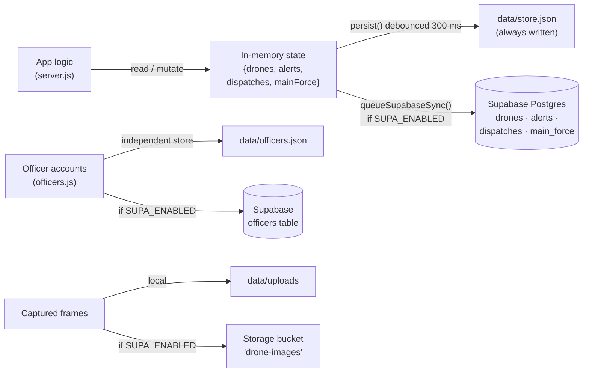
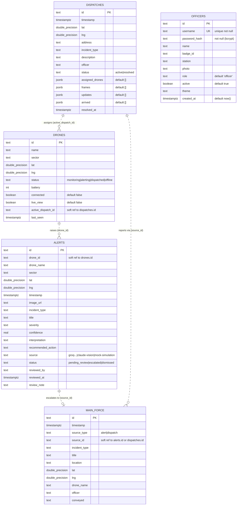
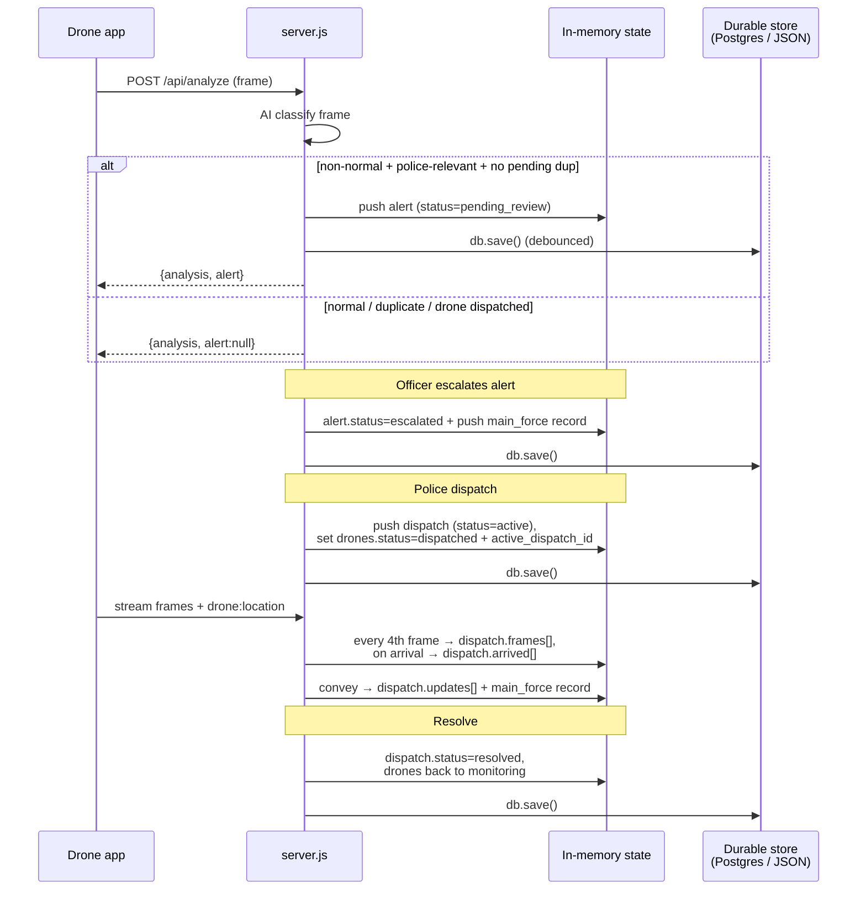
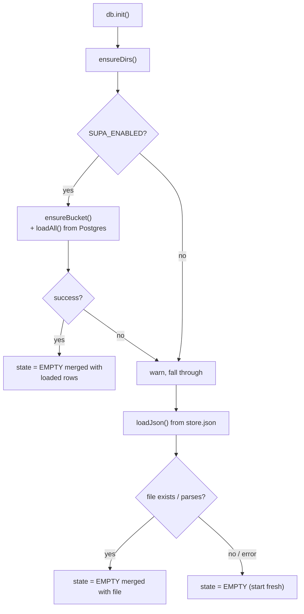

# Database

This document describes the persistence layer of the Smart City Drone Security
System: the database technology, every table and column, keys and relationships,
constraints, indexes, how data flows through the schema, and the local-JSON
fallback store. It is grounded entirely in the repository source
(`supabase/schema.sql`, `src/db.js`, `src/supa.js`, `src/seed.js`, and the
record-construction sites in `server.js`).

---

## 1. Database technology

The system uses a **two-tier persistence model** (`db.js:1-6`):

1. **In-memory state** — the authoritative live copy the rest of the app reads
   and mutates synchronously. Shape: `{ drones, alerts, dispatches, mainForce }`
   (`db.js:23`, `db.js:25`).
2. **A durable backend**, mirrored from memory on every change. The backend is
   chosen at runtime:
   - **Supabase Postgres** when both `SUPABASE_URL` and `SUPABASE_SECRET_KEY`
     environment variables are set (`supa.js:7-9`).
   - **A local `data/store.json` file** otherwise (`db.js:15`, `db.js:28-38`).

The local JSON file is **always written**, even when Supabase is enabled, as an
offline backup (`db.js:6`, `db.js:90`). Supabase is therefore an *additional*
durable mirror, never a replacement for the local file.

Image data is stored out-of-band from the row data:
- **Supabase Storage** bucket `drone-images` (public) when Supabase is enabled
  (`supa.js:10`, `supa.js:99-118`).
- Local filesystem directory `data/uploads` (exported as `UPLOAD_DIR`) otherwise
  (`db.js:16`). Rows store only the **image URL**, never the base64 bytes.

> **Officers are a separate store.** The main in-memory `state` does **not**
> include officers (`db.js:23`). Officer accounts have their own persistence
> path in `src/officers.js`/`src/supa.js`, and the backend for officers is
> chosen once at module load (`officers.js:12`), independently of the main
> state. See §7.

---

## 2. Schema overview

The Supabase schema (`supabase/schema.sql`) defines **five tables**, all in the
`public` schema. Every table uses a **`text` primary key** and the script is
**idempotent** (`create table if not exists`), safe to re-run (`schema.sql:1-3`).

| Table | Purpose | Why it exists | Source |
|---|---|---|---|
| `drones` | Live fleet roster + telemetry | One row per surveillance drone; holds position, battery, connection state, and which dispatch it is on | `schema.sql:6-18` |
| `alerts` | Autonomous AI detections needing review | Each frame the drone AI flags as a non-normal incident becomes an alert for a drone-police officer to escalate or dismiss | `schema.sql:21-41` |
| `dispatches` | Police-initiated drone deployments | When police send drones to a location, this row tracks the deployment, its assigned drones, streamed frames, field updates, and arrivals | `schema.sql:44-59` |
| `main_force` | Escalation / field-report log | An append-only log of information passed up to the main police force, from either an escalated alert or a dispatch field update | `schema.sql:62-75` |
| `officers` | Police login accounts | Backs the portal login + admin user-management module | `schema.sql:78-90` |

**Important structural facts (verified in `schema.sql`):**

- **No foreign-key constraints exist anywhere.** Columns such as
  `alerts.drone_id`, `drones.active_dispatch_id`, and `main_force.source_id` are
  plain `text` with no `references` clause. All cross-table links are
  **application-level soft references** (§5).
- **No `NOT NULL` / `UNIQUE` constraints** except on `officers`
  (`username unique not null`, `password_hash not null`, `schema.sql:80-81`).
- **No Row-Level Security (RLS).** The server connects with the trusted
  `service_role` key, which bypasses RLS, so no policies are defined
  (`schema.sql:98-100`).
- The script ends with `notify pgrst, 'reload schema';` to refresh the
  PostgREST cache after (re-)creation (`schema.sql:102-103`).

### Column-naming convention

Application code uses **camelCase**; Postgres columns are **snake_case**. The
Supabase adapter converts **top-level keys only** (`supa.js:15-20`): `toRow`
(camel→snake) on write, `fromRow` (snake→camel) on read. **Nested `jsonb`
values keep their original camelCase** — this is deliberate and is why the
`dispatches` jsonb arrays below are documented with camelCase inner keys
(`supa.js:16`, `supa.js:36`).

---

## 3. Entity-Relationship diagram

Relationships below are **logical/application-level** — they are enforced by
code, **not** by database constraints (there are no FKs). Dashed lines denote
these soft references.

> `OFFICERS` has no relationship edge: no other table references it. `reviewed_by`
> / `officer` columns store a free-text officer **name string**, not an officer id
> (e.g. escalate defaults `officer = 'Drone Police'`, `server.js:418`).

---

## 4. Table-by-table reference

Types are exactly as declared in `supabase/schema.sql`. Each table also lists
the **in-memory / JSON record shape** (camelCase), since that is what lives in
`data/store.json` and what `server.js` constructs.

### 4.1 `drones` — fleet roster (`schema.sql:6-18`)

| Column | Type | Key / Default | Notes |
|---|---|---|---|
| `id` | `text` | **PRIMARY KEY** | e.g. `drone-1` … `drone-4` (`seed.js:16`) |
| `name` | `text` | | e.g. `Drone 1` (`seed.js:9`) |
| `sector` | `text` | | e.g. `Sector 1 - Mananchira` |
| `lat` | `double precision` | | Live latitude |
| `lng` | `double precision` | | Live longitude |
| `status` | `text` | | `monitoring` \| `alerting` \| `dispatched` \| `offline` (`schema.sql:12`) |
| `battery` | `int` | | Battery percent |
| `connected` | `boolean` | default `false` | `true` when a phone camera is live-controlling this drone (`seed.js:34`) |
| `live_view` | `boolean` | default `false` | `true` when police have an on-demand live view open (`seed.js:35`) |
| `active_dispatch_id` | `text` | | Soft ref → `dispatches.id`; `null` when idle |
| `last_seen` | `timestamptz` | | Last telemetry timestamp |

- **In-memory shape** (`seed.js:26-38`): `{ id, name, sector, lat, lng, status,
  battery, connected, liveView, activeDispatchId, lastSeen }`.
- **Why it exists:** the single source of truth for where each drone is, whether
  it is online, and what it is currently doing. The map, stats tiles, dispatch
  eligibility (`findNearbyDrones`), and arrival detection all read this table.
- **Lifecycle:** the fleet is seeded/reconciled to exactly 4 drones on startup
  (`seedFleet`, `seed.js:15-57`). On restart, transient fields are reset:
  `connected=false`, `liveView=false`, `dispatched`/`alerting` status downgraded
  to `monitoring`, and `activeDispatchId` cleared (`seed.js:39-46`).

### 4.2 `alerts` — AI detections awaiting review (`schema.sql:21-41`)

| Column | Type | Key / Default | Notes |
|---|---|---|---|
| `id` | `text` | **PRIMARY KEY** | `alert_…` (from `uid('alert')`, `server.js:365`) |
| `drone_id` | `text` | | Soft ref → `drones.id` |
| `drone_name` | `text` | | Denormalized drone name snapshot |
| `sector` | `text` | | Denormalized sector snapshot |
| `lat` | `double precision` | | Where the frame was captured |
| `lng` | `double precision` | | |
| `timestamp` | `timestamptz` | | ISO creation time (`server.js:371`) |
| `image_url` | `text` | | URL of the archived frame (Storage or `/uploads`) |
| `incident_type` | `text` | | One of the incident-catalogue keys |
| `title` | `text` | | Short AI-generated title |
| `severity` | `text` | | `none` \| `low` \| `medium` \| `high` \| `critical` |
| `confidence` | `real` | | AI confidence 0.0–1.0 |
| `interpretation` | `text` | | 1–2 sentence AI description |
| `recommended_action` | `text` | | AI-suggested action |
| `source` | `text` | | `groq-…` \| `claude-vision` \| `mock-simulation` (`schema.sql:36`) |
| `status` | `text` | | `pending_review` \| `escalated` \| `dismissed` (`schema.sql:37`) |
| `reviewed_by` | `text` | | Officer name who acted (null until reviewed) |
| `reviewed_at` | `timestamptz` | | When reviewed |
| `review_note` | `text` | | Optional officer note |

- **In-memory shape** (`server.js:364-384`): camelCase equivalents —
  `imageUrl`, `incidentType`, `recommendedAction`, `reviewedBy`, `reviewedAt`,
  `reviewNote`.
- **Why it exists:** each autonomous AI detection that is *not* `normal` and is
  police-relevant becomes a reviewable alert. It is the queue a drone-police
  officer works through, deciding to escalate (→ `main_force`) or dismiss.
- **Notable rule — dedup:** at most one `pending_review` alert per drone; a
  concurrent duplicate reuses the existing row (`server.js:349-362`).
- **Cap:** total alerts are capped at `MAX_ALERTS` (300), evicting only the
  oldest **reviewed** alerts — pending alerts are never dropped
  (`server.js:388-393`).

### 4.3 `dispatches` — police deployments (`schema.sql:44-59`)

| Column | Type | Key / Default | Notes |
|---|---|---|---|
| `id` | `text` | **PRIMARY KEY** | `disp_…` (`server.js:511`) |
| `timestamp` | `timestamptz` | | Creation time |
| `lat` | `double precision` | | Target latitude |
| `lng` | `double precision` | | Target longitude |
| `address` | `text` | | Human-readable target (optional) |
| `incident_type` | `text` | | Reason for dispatch (default `suspicious_activity`, `server.js:491`) |
| `description` | `text` | | Free-text detail |
| `officer` | `text` | | Dispatching officer name (default `Main Force`) |
| `status` | `text` | | `active` \| `resolved` (`schema.sql:53`) |
| `assigned_drones` | `jsonb` | default `'[]'::jsonb` | Array of assigned-drone objects (see below) |
| `frames` | `jsonb` | default `'[]'::jsonb` | Archived streamed frames (thumbnails) |
| `updates` | `jsonb` | default `'[]'::jsonb` | Field updates conveyed to main force |
| `arrived` | `jsonb` | default `'[]'::jsonb` | Arrival records |
| `resolved_at` | `timestamptz` | | Set when resolved |

**Nested `jsonb` shapes** (camelCase — nested keys are *not* snake-converted,
`supa.js:16`):

- `assigned_drones[]` (`server.js:520-525`, plus `arrived` flag added on arrival
  at `server.js:286`):
  `{ id, name, sector, distanceKm, arrived? }` — `id` is a soft ref → `drones.id`.
- `frames[]` (`server.js:597`):
  `{ id, droneId, droneName, url, at }` — `url` only, never base64.
  Capped at `MAX_FRAMES_PER_DISPATCH` (16); evicted frames' Storage objects are
  reclaimed (`server.js:598-602`).
- `updates[]` (`server.js:618`):
  `{ id, at, officer, info }`. Capped at `MAX_UPDATES_PER_DISPATCH` (50).
- `arrived[]` (`server.js:283`):
  `{ droneId, droneName, at, distanceKm }`, appended once per drone when it comes
  within `ARRIVAL_RADIUS_KM` (0.02 km / 20 m) of the target.

- **Why it exists:** a dispatch is the unit of a police-initiated operation. It
  binds a target location and incident to a set of drones and accumulates the
  live evidence (frames), field intelligence (updates), and arrival confirmations
  for that operation.

### 4.4 `main_force` — escalation log (`schema.sql:62-75`)

| Column | Type | Key / Default | Notes |
|---|---|---|---|
| `id` | `text` | **PRIMARY KEY** | `mf_…` (`server.js:425`) |
| `timestamp` | `timestamptz` | | When logged |
| `source_type` | `text` | | `alert` \| `dispatch` (`schema.sql:65`) |
| `source_id` | `text` | | Soft ref → `alerts.id` **or** `dispatches.id`, per `source_type` |
| `incident_type` | `text` | | Copied from the source |
| `title` | `text` | | Log title |
| `location` | `text` | | Sector (alert) or address/coords (dispatch) |
| `lat` | `double precision` | | |
| `lng` | `double precision` | | |
| `drone_name` | `text` | | Drone(s) involved |
| `officer` | `text` | | Officer who escalated/conveyed |
| `conveyed` | `text` | | The message passed to main force |

- **In-memory shape** (`server.js:424-437`, `server.js:623-636`): camelCase —
  `sourceType`, `sourceId`, `incidentType`, `droneName`.
- **Why it exists:** an append-only audit trail of everything handed up to the
  main police force. Two producers write to it: **escalating an alert**
  (`sourceType:'alert'`, `server.js:427`) and **conveying a dispatch field
  update** (`sourceType:'dispatch'`, `server.js:626`).
- **Cap:** capped at `MAX_MAINFORCE` (500), oldest-first eviction
  (`server.js:439-440`, `server.js:638-639`).

### 4.5 `officers` — login accounts (`schema.sql:78-90`)

| Column | Type | Key / Default | Notes |
|---|---|---|---|
| `id` | `text` | **PRIMARY KEY** | `off_…` (`officers.js:14-16`) |
| `username` | `text` | **UNIQUE NOT NULL** | Login name |
| `password_hash` | `text` | **NOT NULL** | bcrypt hash — never the plain password (`schema.sql:81`) |
| `name` | `text` | | Display name |
| `badge_id` | `text` | | Badge / service id |
| `station` | `text` | | Assigned station |
| `photo` | `text` | | URL or data URI (optional) |
| `role` | `text` | default `'officer'` | `officer` \| `admin` (`schema.sql:86`) |
| `active` | `boolean` | default `true` | Account enabled flag |
| `theme` | `text` | | Saved UI theme, follows the officer across devices |
| `created_at` | `timestamptz` | default `now()` | |

- **Why it exists:** backs portal authentication and the admin user-management
  module. This is the only table with real integrity constraints (`UNIQUE`,
  `NOT NULL`).
- **Seeding:** if no `admin`-role officer exists, one is auto-created
  (`username:'admin'`, password from `ADMIN_PASSWORD` env or `admin123`)
  (`officers.js:64-75`).
- **Storage path:** independent of the main state — Supabase `officers` table
  when enabled, else `data/officers.json` (`officers.js:11-12`).

---

## 5. Relationships (all application-level)

Because there are **no FK constraints**, referential integrity is maintained by
code. The soft references are:

| From | Column | To | Semantics | Enforced by |
|---|---|---|---|---|
| `alerts` | `drone_id` | `drones.id` | The drone whose frame raised the alert | `server.js:366`, resolved via `db.find('drones', alert.droneId)` (`server.js:442`) |
| `drones` | `active_dispatch_id` | `dispatches.id` | The dispatch the drone is currently on (`null` if idle) | set at `server.js:536`, cleared at `server.js:663` |
| `dispatches` | `assigned_drones[].id` | `drones.id` | Drones assigned to the dispatch | `server.js:520`, iterated at resolve `server.js:659-660` |
| `main_force` | `source_id` (+ `source_type`) | `alerts.id` or `dispatches.id` | The alert or dispatch this log entry came from | `server.js:427-428`, `server.js:626-627` |

Denormalization is used throughout (e.g. `alerts.drone_name`,
`main_force.drone_name`, `assigned_drones[].name`): a name/sector snapshot is
copied into the child row so history reads correctly even if the drone later
changes, and so most reads need no join.

Cardinality (logical): one drone → many alerts; one dispatch → many assigned
drones (and one drone is on at most one active dispatch); one alert → at most one
`main_force` escalation entry; one dispatch → many `main_force` field-update
entries.

---

## 6. Constraints and indexes

### Constraints (`schema.sql`)

- **Primary keys:** every table has a single `text` PK (`id`).
- **Uniqueness / not-null:** only on `officers` — `username unique not null`,
  `password_hash not null` (`schema.sql:80-81`).
- **Defaults:** `drones.connected=false`, `drones.live_view=false`;
  `dispatches.{assigned_drones,frames,updates,arrived}='[]'::jsonb`;
  `officers.role='officer'`, `officers.active=true`, `officers.created_at=now()`.
- **Foreign keys:** none (§5).
- **Check constraints:** none — enum-like columns (`status`, `severity`,
  `role`, `source_type`) are documented via SQL comments only and validated in
  application code.
- **RLS:** disabled; the server uses the `service_role` key (`schema.sql:98-100`).

### Indexes (`schema.sql:91-96`)

| Index | Table (columns) | Purpose |
|---|---|---|
| `officers_username_idx` | `officers (lower(username))` | Case-insensitive username lookup at login (matches `.ilike('username', …)`, `supa.js:152`) |
| `alerts_ts_idx` | `alerts (timestamp desc)` | Newest-first alert listing |
| `dispatches_ts_idx` | `dispatches (timestamp desc)` | Newest-first dispatch listing |
| `main_force_ts_idx` | `main_force (timestamp desc)` | Newest-first main-force log |

(The three `timestamp desc` indexes back the dashboard's descending sorts, e.g.
`server.js:304`, `server.js:308`, `server.js:312`.)

---

## 7. Data flow — how rows are created and mutated

The app **never issues SQL directly**. All writes mutate the in-memory `state`
in place, then call `db.save()`, which debounces a persist (§8). The Supabase
adapter later diffs and syncs the changed rows.

Key write paths (all in `server.js`):

1. **Alert creation** — `POST /api/analyze` pushes an `alert` and sets the
   drone's `status='alerting'` (`server.js:364-395`).
2. **Escalate** — sets `alert.status='escalated'` + review fields and appends a
   `main_force` record (`server.js:419-438`).
3. **Dismiss** — sets `alert.status='dismissed'` + review fields; no
   `main_force` record (`server.js:467-470`).
4. **Dispatch** — pushes a `dispatch`, and for each assigned drone sets
   `status='dispatched'` and `activeDispatchId` (`server.js:510-536`).
5. **Frame archive** — every 4th streamed frame appends to `dispatch.frames`
   with the stored URL, evicting past the cap (`server.js:589-603`).
6. **Arrival** — `checkArrival` appends to `dispatch.arrived` and flags the
   `assigned_drones[]` entry once within 20 m (`server.js:277-291`).
7. **Convey** — appends to `dispatch.updates` and a `main_force` record
   (`server.js:618-640`).
8. **Resolve** — sets `dispatch.status='resolved'`, `resolvedAt`, and frees each
   drone back to `monitoring` with `activeDispatchId=null` (`server.js:655-663`).

---

## 8. The local-JSON fallback store (`src/db.js`)

When Supabase is not configured, `data/store.json` is the durable store; when it
*is* configured, the JSON file is still written as an offline backup
(`db.js:2-6`).

### In-memory model

- `EMPTY = { drones: [], alerts: [], dispatches: [], mainForce: [] }`
  (`db.js:23`). Note the top-level key is **`mainForce`** (camelCase) in memory
  and JSON; it maps to the **`main_force`** Postgres table (`supa.js:27`).
- `state = structuredClone(EMPTY)` at boot (`db.js:25`).
- Officers are **not** part of this state (they live in `officers.js`).

### File location & directories

- `DATA_DIR = ../data`, `STORE_FILE = ../data/store.json`,
  `UPLOAD_DIR = ../data/uploads` (`db.js:14-16`). `ensureDirs()` creates both
  directories recursively on init (`db.js:18-21`).

### `db` object API (`db.js:129-178`)

| Member | Behavior |
|---|---|
| `state` (getter) | Returns the live `state` object (`db.js:130-132`) |
| `drones()` / `alerts()` / `dispatches()` / `mainForce()` | Return the respective live arrays (`db.js:133-136`) |
| `find(collection, id)` | `state[collection].find(x => x.id === id)` (`db.js:138-140`) |
| `save()` | Debounced persist via `persist()` (`db.js:142-144`) |
| `flush()` | Immediate synchronous JSON write (`db.js:146-148`) |
| `setDrones(list)` | Replace the drones array and persist (`db.js:150-153`) |
| `reset()` | Reset state to `EMPTY` and persist (`db.js:155-158`) |
| `init()` | Load initial state (Supabase-first, else JSON — see below) (`db.js:161-178`) |

There is **no per-collection setter** other than `setDrones`; alerts,
dispatches, and mainForce are mutated in place by callers, then flushed via
`db.save()`.

### Persistence mechanics

- **Debounced write** — `persist()` schedules a 300 ms timer; on fire it writes
  JSON and, if Supabase is enabled, queues a sync (`db.js:85-92`). A burst of
  updates collapses into one write.
- **Serialized JSON write** — `writeJson()` guards against overlapping writes
  (`writing`/`writeAgain` flags) so two writes never interleave and corrupt the
  file (`db.js:63-82`). Uses async `fs.promises.writeFile` with pretty-printed
  JSON.
- **Coalesced Supabase sync** — `queueSupabaseSync()` runs one `supa.syncAll` at
  a time; overlapping requests set a `dirty` flag and re-run once after
  (`db.js:41-59`).
- **Immediate flush** — `flushSync()` clears the debounce timer and writes
  synchronously; used on shutdown so a pending write is never lost
  (`db.js:95-105`).
- **Graceful shutdown** — on `SIGINT`/`SIGTERM`, `shutdown()` flushes JSON
  immediately, then (if Supabase enabled) races a final `supa.syncAll` against a
  4-second timeout before `process.exit(0)` (`db.js:108-125`). `flushSync` is
  also bound to `process.on('exit')` (`db.js:127`).

### Load precedence at startup (`db.init`, `db.js:161-178`)

`loadJson()` merges parsed file contents over `EMPTY` so a missing collection
key never yields `undefined`; on any read/parse error it warns and resets to
`EMPTY` (`db.js:28-38`).

---

## 9. The Supabase diff-sync adapter (`src/supa.js`)

When Supabase is enabled, `supa.syncAll(state)` mirrors the in-memory state to
Postgres efficiently:

- **Collection→table map** `COLLECTIONS`: `drones→drones`, `alerts→alerts`,
  `dispatches→dispatches`, `mainForce→main_force` (`supa.js:23-28`).
- **Change detection** — `lastSynced` holds, per collection, a `Map(id →
  serialized rowKey)` of the last-synced state (`supa.js:33`). `rowKey` sorts
  top-level keys for a stable, order-independent comparison (`supa.js:37-41`).
  Only rows whose serialization changed are upserted; only ids removed from state
  are deleted (`supa.js:63-84`). This avoids re-upserting every row on a single
  GPS ping (`supa.js:30-32`).
- **Chunked deletes** — removed ids are deleted 100 at a time to stay under URL
  length limits (`supa.js:54-61`).
- **Error isolation** — one table's sync failure does not block the others;
  errors are collected and re-thrown joined (`supa.js:86-97`).
- **Load** — `loadAll()` selects `*` (limit 10000) from each table, maps
  `fromRow`, and seeds `lastSynced` (`supa.js:43-52`).
- **Officer queries** are separate functions (`officersList`,
  `officerByUsername` (case-insensitive `ilike`), `officerById`, `officerCreate`,
  `officerUpdate`, `officerRemove`) with their own snake/camel mappers
  (`supa.js:138-178`). `officerUpdate` deliberately never updates `id` or
  `created_at` (`supa.js:167`).

### Image storage

Row data never contains image bytes — only URLs. Images live in the
`drone-images` Storage bucket (public), created on demand by `ensureBucket()`
(`supa.js:99-109`). `uploadImage` uploads JPEGs with `upsert:true` and returns
the public URL (`supa.js:111-118`); `deleteImages`/`clearImages` reclaim them
(`supa.js:121-135`). Without Supabase, images are files under `data/uploads`
(`db.js:16`).

---

## 10. Summary of "why each table exists"

- **`drones`** — the live operational picture: one row per field unit, driving
  the map, dispatch eligibility, and arrival detection.
- **`alerts`** — the review queue: turns autonomous AI detections into
  human-actionable items with an audit trail (who reviewed, when, with what
  note).
- **`dispatches`** — the operation record: ties a target + incident to assigned
  drones and accumulates the live evidence, field updates, and arrivals for that
  deployment.
- **`main_force`** — the escalation ledger: an append-only record of everything
  passed up the chain, sourced from either an alert or a dispatch.
- **`officers`** — identity & access: the only table with hard integrity
  constraints, backing login and admin user management.

---

### Not determinable from the current codebase

- No migration tooling, versioning, or seed SQL beyond `supabase/schema.sql` was
  found; schema is applied by manually running that script (`schema.sql:2`).
- No check constraints or enum types back the documented value lists (`status`,
  `severity`, `role`, `source_type`); they are validated only in application
  code.
