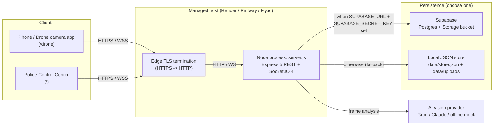
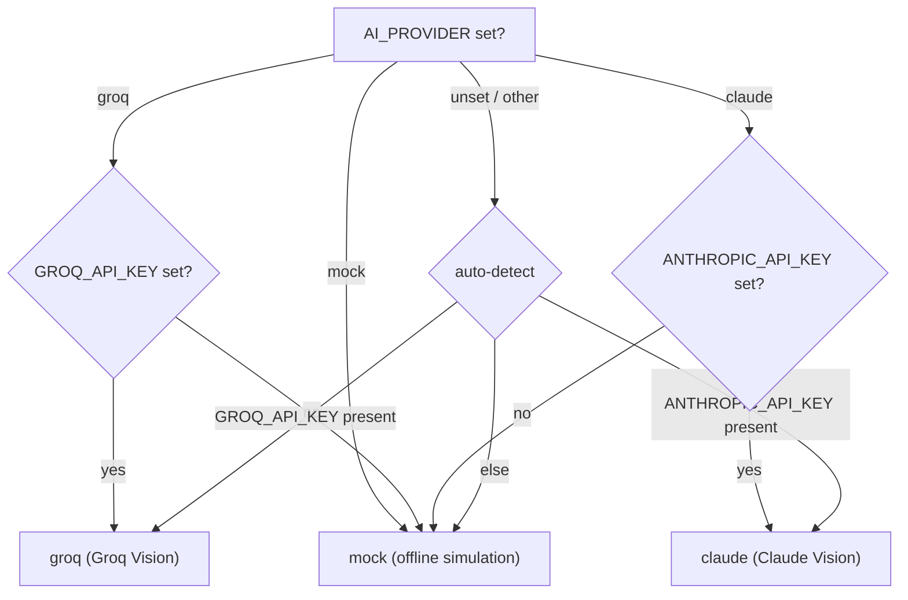
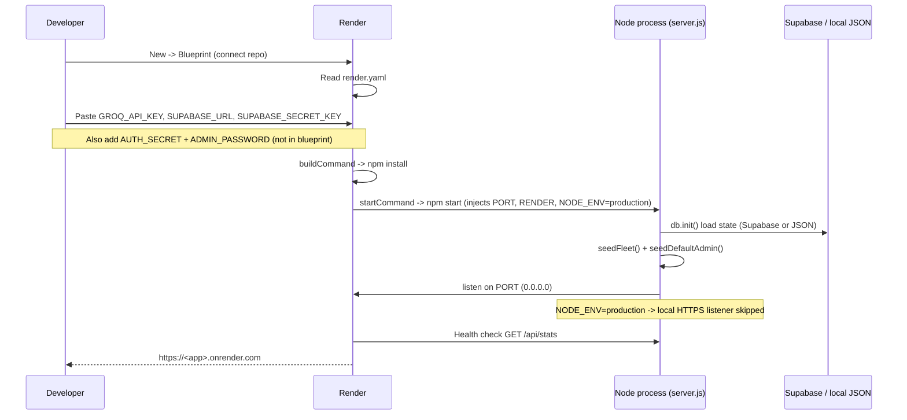
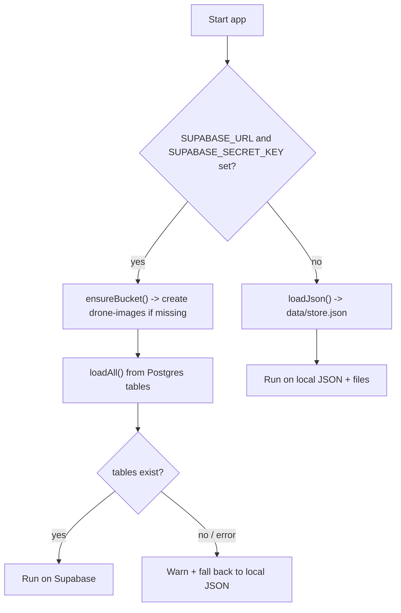

# Deployment Guide

Smart City Drone Security System — **S7 B.Tech Main Project, Group 17, GEC Kozhikode**.

This document covers everything required to run the system in production: environment
variables, the (non-existent) build step, the Render Blueprint deploy, hosting
requirements, TLS/reverse-proxy behaviour, the Supabase schema migration, CI/CD status,
troubleshooting, and scaling guidance. Every statement is grounded in the repository
source; where the codebase does not answer a question this document says so explicitly.

---

## 1. What is being deployed

The application is a **single, long-lived Node.js process** (`server.js`) that hosts:

- An **Express 5** REST API (`express@^5.2.1`, `package.json:29`).
- A **Socket.IO 4** real-time layer bound to the same HTTP server for alerts, dispatch
  commands, and live camera frames (`server.js:44-51`).
- **Static file serving** of the two front-end apps in `public/` — the Police Control
  Center at `/` and the Drone Camera App at `/drone` (`server.js:63-69`, `README.md:39-42`).

There is **no separate front-end server and no client build artifact** — the browser apps
are plain static HTML/CSS/JS served directly (`README.md:44-49`).



---

## 2. Build process

**There is no build step.** The `scripts` block defines only two commands
(`package.json:10-13`):

| Script | Command | Purpose |
|--------|---------|---------|
| `start` | `node server.js` | Production / entry command. |
| `dev` | `node --watch server.js` | Local development with auto-restart on file change. |

- No `build` script exists. Render's `buildCommand` is literally `npm install`
  (`render.yaml:10`) — dependency installation only, no compilation or bundling.
- The project is pure runtime Node ESM (`"type": "module"`, `package.json:5`); the
  front-end is static and requires no transpilation.

Therefore the entire "build" is: install dependencies, then run the process.

```bash
npm install   # install dependencies (this is the whole "build")
npm start     # node server.js
```

---

## 3. Environment variables

Copy `.env.example` to `.env` for local use (`.env.example:1`); on managed hosts set the
same keys in the platform dashboard. `dotenv` loads `.env` into `process.env`
(`dotenv@^17.4.2`, `package.json:28`).

### 3.1 Documented in `.env.example`

| Variable | Required? | Purpose | Default (source) |
|----------|-----------|---------|------------------|
| `GROQ_API_KEY` | No | Enables **Groq** vision (preferred provider; auto-selected when present). | none → falls back to Claude/mock (`ai.js:16-23`) |
| `GROQ_MODEL` | No | Groq vision model id. | `meta-llama/llama-4-scout-17b-16e-instruct` (`ai.js:30`, `.env.example:9-11`) |
| `ANTHROPIC_API_KEY` | No | Enables **Claude** vision (used when Groq key absent). | none (`.env.example:14`) |
| `AI_MODEL` | No | Claude model id (only when provider = claude). | `claude-opus-4-8` (`ai.js:27`, `.env.example:15`) |
| `AI_PROVIDER` | No | Force a provider, overriding key auto-detection: `groq` \| `claude` \| `mock`. | unset → auto-detect (`ai.js:16`, `.env.example:17`) |
| `PORT` | No | HTTP listen port. **Do not set on Render — it is provided.** | `3000` (`server.js:32`, `.env.example:22`) |
| `HTTPS_PORT` | No | Local self-signed HTTPS port for the phone camera over Wi-Fi. | `PORT + 443` = `3443` (`server.js:33`, `.env.example:23-24`) |
| `CLEAR_SECRET` | No | Police authorization key required by the "Clear captured images" action. | `police2026` (`server.js:39`, `.env.example:27`) |
| `SUPABASE_URL` | No (both needed for cloud mode) | Supabase project URL → Postgres + image Storage; else local JSON store. | unset → local (`supa.js:7,9`, `.env.example:34`) |
| `SUPABASE_SECRET_KEY` | No (both needed) | Supabase service/secret key. | unset → local (`supa.js:8,9`, `.env.example:35`) |

### 3.2 Read by the code but **not** listed in `.env.example`

These are discovered from `process.env` usage. They should be set explicitly for any real
deployment even though the app boots without them.

| Variable | Recommendation | Purpose | Default (source) |
|----------|----------------|---------|------------------|
| `AUTH_SECRET` | **Set in production** | HMAC-SHA256 secret that signs the session cookie (a two-part mini-JWT). The app **warns** if unset. | `dev-insecure-secret-change-me` (`auth.js:7-9`) |
| `ADMIN_PASSWORD` | **Set in production** | Password for the auto-seeded default admin (username `admin`). The app **warns** if unset. | `admin123` (`officers.js:67-69`) |
| `NODE_ENV` | Set to `production` | `=production` sets the `Secure` cookie flag (`auth.js:55`) **and** disables the local self-signed HTTPS listener (`server.js:1167`). | unset |
| `RENDER` | Platform-set (Render) | Presence sets `Secure` cookies (`auth.js:55`) and skips the local HTTPS listener (`server.js:1167`). | unset |
| `RAILWAY_ENVIRONMENT` | Platform-set (Railway) | Presence skips the local HTTPS listener (`server.js:1167`). | unset |

> **Security note:** `AUTH_SECRET` and `ADMIN_PASSWORD` are **not** in `render.yaml`.
> If you deploy the Blueprint as-is and do not add them, the process runs with the
> insecure fallback secret and the default `admin123` password — both of which the server
> warns about on startup (`auth.js:8-9`, `officers.js:68-69`). Add both in the dashboard.

### 3.3 AI provider selection precedence

`decideProvider()` resolves the active provider once at startup (`ai.js:16-25`):



When both keys are present in auto mode, **Groq wins** (`ai.js:21-22`). The active label
(`Groq Vision` / `Claude Vision` / `Standby`) prints on the startup banner (`ai.js:44`,
`server.js:1199`).

---

## 4. Hosting requirements

| Requirement | Detail | Source |
|-------------|--------|--------|
| Runtime | Node.js **>= 20** | `package.json:7-8` |
| Process model | **Persistent / long-lived** process holding WebSocket connections | `README.md:106-108` |
| Serverless hosts | **Not supported** — Vercel / Netlify are serverless and cannot host Socket.IO; the function crashes on invocation | `README.md:110-112`, `render.yaml:2-3` |
| Supported hosts | Render (recommended, tested via `render.yaml`), Railway, Fly.io — same env vars, no code changes | `README.md:114-123` |
| Outbound network | To Groq (`api.groq.com`) and/or Anthropic and/or Supabase, only if those providers are configured | `ai.js:172`, `supa.js` |
| Persistent disk | Only needed for the **local** JSON/file store (`data/`). Not needed when Supabase is configured | `db.js:14-16`, `supa.js:9` |
| Port binding | Binds `0.0.0.0` on `PORT`; host must inject `PORT` | `server.js:1195` |

> **Ephemeral filesystem caveat (local store mode):** On Render's free plan and similar
> hosts the filesystem is ephemeral — it is wiped on every deploy and restart. The local
> store writes to `data/store.json`, `data/officers.json`, and `data/uploads`
> (`db.js:14-16`, `officers.js:11`). To keep data across restarts on a managed host, use
> **Supabase mode** (Section 8) or attach a persistent disk. Without either, all alerts,
> dispatches, officers, and images reset on each deploy.

---

## 5. Deployment process (Render Blueprint)

The repository ships a Render Blueprint at `render.yaml`. In Render, choose
**New → Blueprint** and connect the repository; Render reads the file and provisions the
service (`render.yaml:1-4`).

### 5.1 `render.yaml` as-is

```yaml
services:
  - type: web
    name: dronesecurity
    runtime: node
    plan: free
    buildCommand: npm install
    startCommand: npm start
    healthCheckPath: /api/stats
    envVars:
      - key: NODE_ENV
        value: production
      - key: GROQ_MODEL
        value: meta-llama/llama-4-scout-17b-16e-instruct
      - key: GROQ_API_KEY
        sync: false          # paste in the Render dashboard
      - key: SUPABASE_URL
        sync: false
      - key: SUPABASE_SECRET_KEY
        sync: false
```

| Field | Value | Note |
|-------|-------|------|
| `type` | `web` | HTTP service. |
| `name` | `dronesecurity` | Service name. |
| `runtime` | `node` | Native Node runtime (no Docker; there is no `Dockerfile` in the repo). |
| `plan` | `free` | Free tier. |
| `buildCommand` | `npm install` | Dependency install only (no build). |
| `startCommand` | `npm start` | Runs `node server.js`. |
| `healthCheckPath` | `/api/stats` | See the health-check caveat in Section 10. |
| `envVars` | see above | `NODE_ENV` and `GROQ_MODEL` are literal; the three `sync: false` keys are secrets you paste in the dashboard (`render.yaml:18-23`). |

### 5.2 Deploy sequence



### 5.3 Manual (non-Blueprint) alternative

Render **New → Web Service** with build `npm install` and start `npm start`; then add the
env vars manually (`README.md:114-119`). Railway and Fly.io work the same way with the
same variables (`README.md:123`).

Steps common to all managed hosts (`README.md:118-121`):

1. Add env vars: `GROQ_API_KEY`, `SUPABASE_URL`, `SUPABASE_SECRET_KEY` (optionally
   `GROQ_MODEL`), plus `AUTH_SECRET` and `ADMIN_PASSWORD` (recommended).
2. **Do not set `PORT`** — the platform provides it (`README.md:119`).
3. Deploy → you get a public HTTPS URL; because the edge provides real TLS, the phone
   camera works over the internet with no certificate warning (`README.md:120-121`).

---

## 6. Production configuration

The following behaviours change automatically in production, driven by environment flags.

| Behaviour | Trigger | Effect | Source |
|-----------|---------|--------|--------|
| Secure session cookie | `NODE_ENV === 'production'` **or** `RENDER` set | Session cookie sent with `Secure` flag | `auth.js:55` |
| Local HTTPS listener disabled | `NODE_ENV === 'production'` **or** `RENDER` **or** `RAILWAY_ENVIRONMENT` set | `startHttps()` returns `false` — no self-signed listener; the edge terminates TLS | `server.js:1167-1169` |
| Response compression | always | `compression()` gzips every response, mounted before routes/static | `server.js:58` |
| JSON body cap | always | `express.json({ limit: '15mb' })` (large enough for base64 frames) | `server.js:59` |
| Socket buffer / ping | always | `maxHttpBufferSize: 12e6`, `pingInterval: 10000`, `pingTimeout: 12000` | `server.js:45-51` |
| Static cache | always | `/uploads` served with `maxAge: '7d', immutable: true` | Reference (`server.js:70`) |

Fixed in-process limits (constants, not env-configurable): `MAX_FRAMES_PER_DISPATCH = 16`,
`MAX_UPDATES_PER_DISPATCH = 50`, `MAX_MAINFORCE = 500`, `MAX_ALERTS = 300`,
`ARRIVAL_RADIUS_KM = 0.02` (`server.js:34-41`). The application holds all working state in
memory and mirrors it to the durable store (`db.js:1-6`); the local JSON file is always
written as an offline backup even in Supabase mode (`db.js:6`).

Process resilience: `uncaughtException` and `unhandledRejection` are logged and the process
stays up (`server.js:55-56`). On `SIGINT`/`SIGTERM` the app flushes the local JSON store
synchronously, then (if enabled) runs a bounded Supabase sync before exiting
(`db.js:108-126`).

---

## 7. Reverse proxy & TLS termination

The application is designed to run **behind the managed host's edge**, which terminates
TLS and forwards plain HTTP to the Node process:

- On managed hosts (`NODE_ENV=production`, `RENDER`, or `RAILWAY_ENVIRONMENT`) the app's
  own HTTPS listener is intentionally skipped because the platform provides HTTPS at the
  edge (`server.js:1164-1169`). The public URL is real HTTPS with a valid certificate
  (`README.md:120-121`).
- **Locally**, when none of those flags is set, the app starts its own self-signed HTTPS
  listener so a phone camera can reach it over Wi-Fi. It reads `certs/key.pem` and
  `certs/cert.pem`, regenerating a self-signed cert with `openssl` if they are missing (CN
  `smart-drone.local`, SAN `localhost`/`127.0.0.1`, 10-year validity); if `openssl` is
  unavailable it logs a warning and stays HTTP-only (`server.js:1137-1184`). Both HTTP and
  HTTPS listeners share the same Express app and the same Socket.IO instance via
  `io.attach(httpsServer)` (`server.js:1176-1177`).

**No application-level reverse proxy is bundled or configured.** There is no `nginx`,
`Caddy`, `Dockerfile`, or `Procfile` in the repository, and Express **`trust proxy` is not
set anywhere** (verified: no `trust proxy` configuration exists in the codebase). This has
one practical consequence to be aware of:

> Because `trust proxy` is not enabled, `req.secure` reflects the direct HTTP connection
> from the edge, not the client's original HTTPS. The session cookie's `Secure` flag does
> **not** depend on `req.secure` — it is driven purely by `NODE_ENV`/`RENDER`
> (`auth.js:55`) — so secure cookies still work correctly behind the edge. Any custom
> reverse-proxy setup that relies on `X-Forwarded-*` header trust would need
> `app.set('trust proxy', ...)` added, which the code does not currently do.

---

## 8. Database migration (Supabase schema)

Supabase mode activates **only when both** `SUPABASE_URL` and `SUPABASE_SECRET_KEY` are set
(`supa.js:7-9`). Otherwise the app uses the local JSON store and local image files
(`db.js:176`, `README.md:47-48`).

### 8.1 One-time schema install

The schema is **not applied automatically** — you must run it once (`.env.example:36`,
`README.md:96-97`):

1. Create a Supabase project.
2. Open the Supabase **SQL Editor** and run [`supabase/schema.sql`](../supabase/schema.sql)
   once.
3. Put the **Project URL** and **service/secret key** into the environment, then start the
   app. The banner shows `Data store : Supabase` (`server.js:1200`).

The `drone-images` Storage bucket is created **automatically** on startup
(`ensureBucket()`), so only the SQL tables need the manual step
(`README.md:98-100`, `supa.js:99-109`).

### 8.2 What `schema.sql` creates

`supabase/schema.sql` is **idempotent** (`create table if not exists`), safe to re-run
(reference: `schema.sql:1-4`). It creates four data tables plus the officers table:

| Table | Purpose | Notes |
|-------|---------|-------|
| `public.drones` | Fleet state (position, battery, status, connection) | PK `id` (text) |
| `public.alerts` | AI-raised incident alerts | PK `id`; index on `timestamp desc` |
| `public.dispatches` | Police → drone dispatches | `assigned_drones`/`frames`/`updates`/`arrived` are `jsonb default '[]'` |
| `public.main_force` | Escalation / main-force log | index on `timestamp desc` |
| `public.officers` | Login accounts (bcrypt hashes) | `username` UNIQUE NOT NULL; index on `lower(username)` |

Additional schema facts (reference: `schema.sql`): there are **no foreign keys** — id
references are plain `text`; **no RLS** is enabled (the server uses the trusted
service/secret key, which bypasses RLS); the file ends with
`notify pgrst, 'reload schema';` to refresh the PostgREST cache.

### 8.3 Migration model

There is **no incremental migration tooling** (no versioned migration files, no migration
runner). `schema.sql` is a single idempotent bootstrap script. Because it uses
`create table if not exists`, re-running it will **not** add new columns to existing tables
— schema changes to already-created tables must be applied by hand in the SQL Editor. The
officers table is loaded independently at module load (`officers.js:12`); if it is missing,
`seedDefaultAdmin()` fails softly and the server logs a warning telling you to create it
(`server.js:1189-1193`).



---

## 9. CI/CD

**There is no CI/CD pipeline in this repository.** Verified: no `.github/` workflows, no
`.gitlab-ci.yml`, no `.circleci/`, no `Dockerfile`, no `Procfile`, and no other pipeline
configuration files are present.

- There is **no automated test suite** and no `test` script in `package.json`
  (`package.json:10-13`), so there is nothing for a CI stage to run.
- The only automation is Render's own **auto-deploy on push** to the connected branch,
  which is a platform feature configured in the Render dashboard, not in this repository.
  `render.yaml` describes the service, not a CI/CD workflow.

If CI/CD is desired, it would need to be added (for example a GitHub Actions workflow) — it
does not currently exist. **Not determinable** beyond that from the codebase.

---

## 10. Troubleshooting

| Symptom | Likely cause | Fix |
|---------|--------------|-----|
| Render health check failing / service marked unhealthy | The health-check path `/api/stats` is registered **after** the API auth guard and is **not** in the open-endpoint allowlist (`OPEN_API = {'/api/config','/api/drones','/api/analyze'}`), so an unauthenticated `GET /api/stats` calls `requireAuth` and returns **HTTP 401** (`server.js:120-127`, `server.js:315`; `requireAuth` → 401 per `auth.js:65-69`). Render's health check to that path receives a 401 rather than a success status. | If the platform treats non-2xx health checks as failures, point `healthCheckPath` at an open route such as `/api/config` (in `OPEN_API`), or add `/api/stats` to `OPEN_API`. See the note below. |
| Banner shows `AI analysis : Standby` and no incidents from real frames | No `GROQ_API_KEY` and no `ANTHROPIC_API_KEY` → provider resolves to `mock` (`ai.js:23`, label `Standby` at `ai.js:32-33`). | Set `GROQ_API_KEY` (or `ANTHROPIC_API_KEY`), or use the drone app's scenario picker in mock mode. |
| Startup warning about insecure session secret | `AUTH_SECRET` unset → fallback `dev-insecure-secret-change-me` (`auth.js:7-9`). | Set `AUTH_SECRET` to a strong random value. |
| Startup warning about admin password / can only log in with `admin` / `admin123` | `ADMIN_PASSWORD` unset → default admin seeded with `admin123` (`officers.js:67-69`). | Set `ADMIN_PASSWORD` before first boot (or change the password afterward via the admin console). |
| `[auth] Could not initialise officer accounts (is the officers table created in Supabase?)` | Supabase enabled but the `officers` table was not created (schema.sql not fully run) (`server.js:1189-1193`). | Run `supabase/schema.sql` in the SQL Editor. |
| Data resets on every deploy | Local store on an ephemeral filesystem (Section 4). | Switch to Supabase mode, or attach a persistent disk. |
| `Data store : local JSON + files` even though you set Supabase vars | Only one of `SUPABASE_URL` / `SUPABASE_SECRET_KEY` is set — **both** are required (`supa.js:7-9`); or `loadAll()` errored and the app fell back to JSON with a warning (`db.js:172-176`). | Set both variables; check logs for the Supabase load warning. |
| Phone camera blocked / no HTTPS link printed locally | Browsers require HTTPS for camera access off `localhost`; the local HTTPS listener needs `openssl` to generate a cert and is disabled when `NODE_ENV=production`/`RENDER`/`RAILWAY_ENVIRONMENT` is set (`server.js:1167-1172`). | Locally: install `openssl` (or provide `certs/key.pem` + `certs/cert.pem`), and ensure those production flags are unset. In the cloud: use the platform's HTTPS URL directly. |
| App works locally but WebSockets fail after deploy | The host is serverless (Vercel/Netlify) — Socket.IO cannot run there (`README.md:110-112`). | Deploy on Render/Railway/Fly.io. |
| Port conflict / "address in use" on the HTTPS port | `HTTPS_PORT` defaults to `PORT + 443` (`server.js:33`). | Set `HTTPS_PORT` to a free port, or leave the local HTTPS listener disabled. |

> **On the `/api/stats` health check:** the exact pass/fail semantics of a 401 depend on the
> hosting platform's health-check policy, which is external to this codebase. The grounded
> fact is that `/api/stats` is behind `requireAuth` (`server.js:122-127`, `315`) and returns
> 401 without a valid session cookie. If your deployment reports the service as unhealthy on
> an otherwise-running process, this is the first thing to check and the fix above resolves
> it.

---

## 11. Scaling recommendations

These recommendations follow directly from how the code is written; they distinguish what
the code supports today from what would require changes.

### 11.1 Current architecture constraints (grounded)

- **In-memory state, single process.** All working state (drones, alerts, dispatches,
  main-force log) lives in memory and is mirrored to the store on change (`db.js:1-6`,
  `db.js:23-25`). Socket rooms (`police`, `drones`, `drone:<id>`) and live-view watcher maps
  are held in that one process's memory (reference: `server.js` §5). This means the server
  is effectively **single-instance**: two instances would not share room membership,
  in-memory alert lists, or watcher state, and no Socket.IO adapter (e.g. Redis) is
  configured. **Horizontal scaling to multiple instances is not supported as written.**
- **Bounded memory footprint.** Retention caps keep memory bounded: `MAX_ALERTS = 300`
  (pending always retained, oldest reviewed evicted), `MAX_MAINFORCE = 500`,
  `MAX_FRAMES_PER_DISPATCH = 16`, `MAX_UPDATES_PER_DISPATCH = 50` (`server.js:34-37`).
- **Frame throughput controls.** Dispatch/live frames are relayed over Socket.IO binary
  channels with in-flight caps on the drone side and a 1-in-N archival throttle
  (`FRAME_SAVE_EVERY = 4`) so not every frame is persisted (reference: `server.js` §5b,
  §8). This limits image-write pressure under sustained streaming.
- **Vertical fit.** The default fleet is small — 4 drones (`seed.js:8-13`) — and the free
  plans referenced (`render.yaml:9`) are sized for a demo/project, not for large fleets.

### 11.2 Recommendations

1. **Scale vertically first, stay single-instance.** Given the shared in-memory state and
   the absence of a Socket.IO adapter, keep the service at **one instance** and increase
   CPU/RAM rather than adding replicas. Do not enable horizontal autoscaling without the
   change in point 4.
2. **Use Supabase in production** (Section 8) so state survives restarts and deploys, and so
   the process is not dependent on an ephemeral local filesystem. This is required for any
   durability beyond a single process lifetime.
3. **Move off the free plan for real load.** The free tier idles/sleeps and offers limited
   resources; a paid always-on plan avoids cold starts that would drop live WebSocket
   sessions.
4. **To go multi-instance would require code changes** (not present today): add a Socket.IO
   adapter (such as the Redis adapter) so rooms and broadcasts are shared, and move the
   in-memory working set behind the shared database rather than per-process memory. Until
   then, treat the box as a single realtime node.
5. **Offload image storage to Supabase Storage** (already supported) rather than local
   files, so image volume does not consume instance disk and is served from the bucket's
   public URLs (`supa.js:111-118`).
6. **Tune AI provider for throughput.** Groq is documented as the better fit for continuous
   interval scanning (`README.md:78`); the Groq path also has a 15 s request timeout with
   graceful "All clear" fallback (reference: `ai.js`), which protects the event loop from a
   hung provider under load.

---

## Appendix — Startup sequence (reference)

`start()` runs at process launch (`server.js:1186-1218`):

1. `await db.init()` — load state from Supabase or local JSON (`server.js:1187`).
2. `seedFleet()` — seed the 4-drone fleet if empty, else reconcile stale state
   (`server.js:1188`).
3. `await seedDefaultAdmin()` in try/catch — ensure at least one admin login exists
   (`server.js:1190-1193`).
4. `server.listen(PORT, '0.0.0.0', …)` (`server.js:1195`); in the callback, `startHttps()`
   (skipped on managed hosts), enumerate LAN IPs, and print the banner
   (`server.js:1196-1214`).

---

*Grounding: this document cites `package.json`, `render.yaml`, `.env.example`, `README.md`,
`server.js`, and the `src/*` / `supabase/schema.sql` reference material. Where a capability
is absent (build step, CI/CD, bundled reverse proxy, multi-instance support, automated
migrations), that absence is stated explicitly rather than inferred.*
