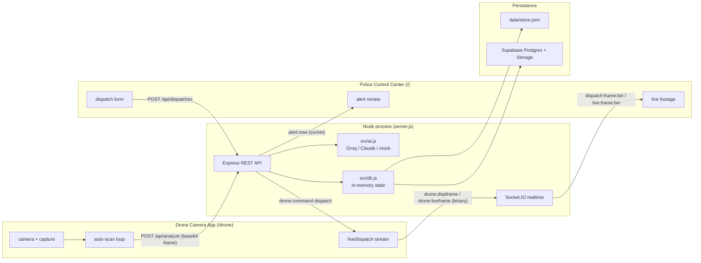
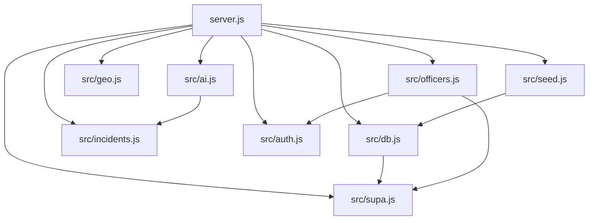
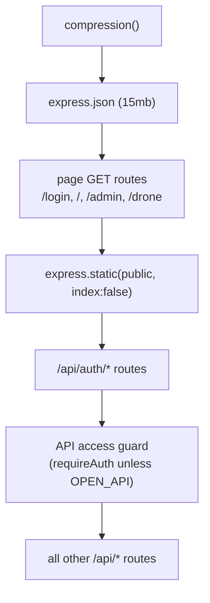

# Developer Guide — Smart City Drone Security System

**S7 B.Tech Main Project · Group 17 · Government Engineering College, Kozhikode**

This guide is for a developer picking up the codebase for the first time. It
explains what the system is, how the repository is laid out, how to run and
develop it locally, and the concrete steps for extending it (a new incident
type, a new REST route, a new realtime event). Every claim below is grounded in
the actual source; file/line citations use the `file:line` form.

---

## 1. Project overview

The Smart City Drone Security System is a two-app web system backed by a single
persistent Node process:

| App | URL | Runs on | Purpose |
|---|---|---|---|
| **Police Control Center** | `/` | Officer's computer | Review alerts, dispatch drones, watch live footage (`server.js:64`) |
| **Drone Camera App** | `/drone` | Phone mounted on the drone | Capture frames, run AI analysis, stream footage (`server.js:66`) |

It implements two directions of the proposal (README:20-33):

1. **Drone → Police (autonomous detection):** the phone camera captures frames,
   `POST /api/analyze` classifies each frame into one of 18 incident types, and
   police-relevant incidents raise an alert on the portal for human review
   (`server.js:319-408`).
2. **Police → Drone (dispatch & surround):** an officer picks a location; the
   nearest online drones are dispatched and stream live footage back
   (`server.js:490`, `src/geo.js:22-31`).

**Technology stack** (verified in `package.json:23-32`):

- **Runtime:** Node.js `>=20` (`package.json:7-8`), ES modules
  (`"type": "module"`, `package.json:5`).
- **HTTP / API:** Express 5 (`express` `^5.2.1`) with `compression`.
- **Realtime:** Socket.IO 4 (`socket.io` `^4.8.3`) for alerts, dispatch
  commands and binary camera frames.
- **AI vision:** Groq or Anthropic Claude (`@anthropic-ai/sdk`), with a full
  offline **mock** simulation fallback (`src/ai.js`).
- **Persistence:** in-memory state mirrored to Supabase Postgres + Storage
  (`@supabase/supabase-js`, `pg`) when configured, else a local
  `data/store.json` + local image files (`src/db.js`, `src/supa.js`).
- **Auth:** bcrypt password hashing (`bcryptjs`) + an HMAC-signed session cookie
  (`src/auth.js`).
- **Frontend:** static HTML + vanilla JS ES modules under `public/`. There is
  **no build step** — no bundler, no transpiler (`package.json:10-13`).

### Architecture at a glance



---

## 2. Folder structure

```
d:/Project/SmartDrone/
├── server.js              # Entry point: Express app + Socket.IO + all routes (1200+ lines)
├── package.json           # Scripts, deps, "type": module, engines >=20
├── render.yaml            # One-click Render deploy blueprint
├── .env.example           # Documented env vars (copy to .env)
├── .gitignore             # Ignores node_modules/, data/, .env, certs/, *.log
├── README.md              # User-facing overview + demo script
│
├── src/                   # Backend modules (all ESM)
│   ├── ai.js              # Provider selection + frame → incident analysis
│   ├── incidents.js       # The incident-type catalogue (single source of truth)
│   ├── db.js              # In-memory state + JSON/Supabase persistence
│   ├── supa.js            # Supabase adapter (Postgres tables + image bucket)
│   ├── auth.js            # bcrypt + HMAC-signed session cookie primitives
│   ├── officers.js        # Officer account store + default-admin seeding
│   ├── seed.js            # Fleet seeding, city center, landmarks
│   └── geo.js             # Haversine distance + nearest-drone selection
│
├── public/                # Static frontend (served as-is, no build)
│   ├── index.html         # Police portal
│   ├── drone.html         # Drone camera unit
│   ├── admin.html         # Admin console (officer management)
│   ├── login.html         # Login page
│   ├── css/style.css      # Single hand-written CSS file, theme tokens
│   ├── js/
│   │   ├── common.js      # Shared helpers (api(), config, themes, icons)
│   │   ├── portal.js      # Police portal controller
│   │   ├── drone.js       # Drone camera controller
│   │   ├── admin.js       # Admin console controller
│   │   ├── login.js       # Login controller
│   │   └── ascii-ripple.js# Text glitch-ripple effect
│   └── vendor/            # Local third-party assets (e.g. pico face detector)
│
├── supabase/
│   └── schema.sql         # Idempotent Postgres schema (run once in SQL Editor)
│
├── certs/                 # Self-signed TLS (git-ignored, regenerated on run)
├── data/                  # Local store + uploads (git-ignored)
│   ├── store.json         # Local JSON persistence
│   └── uploads/           # Local captured images
└── docs/
    └── DEVELOPER_GUIDE.md # (this file)
```

`data/` and `certs/` are runtime artifacts and are git-ignored
(`.gitignore:2,8`); they are created automatically on first run.

### Module dependency map



(Import lines: `server.js:16-29`; `db.js` imports `supa`; `seed.js` calls
`db.setDrones`; `ai.js` imports the incident catalogue; `officers.js` uses
`supa` + `auth`.)

---

## 3. Development workflow

There is no compile/watch pipeline for the frontend and no test runner. The
loop is deliberately simple:

1. **Backend change** (`server.js` or anything under `src/`): restart the
   server. Use `npm run dev` so Node's built-in watcher restarts on save
   (`package.json:12`).
2. **Frontend change** (anything under `public/`): just refresh the browser —
   static files are served directly (`server.js:69`); no restart needed.
3. **Incident catalogue change** (`src/incidents.js`): restart the server; the
   client re-reads the catalogue from `GET /api/config` on load
   (`server.js:295`, `common.js:13-20`).
4. **Schema change** (`supabase/schema.sql`): re-run the file in the Supabase
   SQL Editor. It is idempotent (`create table if not exists`), so it is safe to
   re-run (`schema.sql:1-4`).

Git workflow: the default branch is `main`. Branch before committing; do not
commit or push unless asked.

---

## 4. Running locally

### Prerequisites

- Node.js **20 or newer** (`package.json:7-8`).
- Install dependencies once: `npm install`.

### Start commands (the only two scripts)

```bash
npm start      # node server.js            — run once
npm run dev    # node --watch server.js    — auto-restart on file save
```

(`package.json:10-13`.) There is no `build` script — the app is pure runtime
Node and static files.

### What starts up

`start()` (`server.js:1186-1216`) runs in order:

1. `await db.init()` — load state from Supabase or `data/store.json`
   (`server.js:1187`, `db.js:161-178`).
2. `seedFleet()` — seed the 4-drone fleet if empty, else reconcile stale state
   (`server.js:1188`, `seed.js:15-57`).
3. `await seedDefaultAdmin()` — ensure at least one admin login exists
   (`server.js:1190`, `officers.js:64-75`).
4. `server.listen(PORT, '0.0.0.0', …)` — the HTTP listener on port `3000` by
   default (`server.js:1195`, `PORT` at `server.js:32`).
5. In the listen callback, `startHttps()` also brings up a **self-signed HTTPS
   listener** on `HTTPS_PORT` (default `PORT + 443` = `3443`) so a real phone
   camera can be served over Wi-Fi — the browser requires HTTPS for camera
   access off `localhost` (`server.js:33,1164-1184`). This HTTPS listener is
   skipped on managed hosts (`NODE_ENV=production`, `RENDER`, or
   `RAILWAY_ENVIRONMENT` set) because they terminate TLS at the edge
   (`server.js:1167-1169`).

After startup the console prints a banner with the AI provider, the data store
(Supabase vs local), and the localhost + LAN URLs (`server.js:1198-1214`).

### Two ways to open the apps

- On the same computer: `http://localhost:3000/` (portal) and
  `http://localhost:3000/drone` (drone). Camera works over plain HTTP on
  `localhost` (README:60-67).
- On a phone over Wi-Fi: open the printed `https://<lan-ip>:3443/drone`, accept
  the one-time self-signed-certificate warning, allow camera access.

### Configuration (`.env`)

Copy `.env.example` to `.env` and fill in only what you need — the app runs with
no `.env` at all (mock AI + local JSON store).

| Variable | Purpose | Default |
|---|---|---|
| `GROQ_API_KEY` | Enables Groq vision (preferred provider) | unset → next option (`ai.js:21`) |
| `GROQ_MODEL` | Groq model id | `meta-llama/llama-4-scout-17b-16e-instruct` (`ai.js:30`) |
| `ANTHROPIC_API_KEY` | Enables Claude vision | unset (`ai.js:22`) |
| `AI_MODEL` | Claude model id (only when provider = claude) | `claude-opus-4-8` (`ai.js:27`) |
| `AI_PROVIDER` | Force `groq` \| `claude` \| `mock` | unset → auto-detect (`ai.js:16`) |
| `PORT` | HTTP port | `3000` (`server.js:32`) |
| `HTTPS_PORT` | Local HTTPS port for the phone camera | `PORT + 443` = `3443` (`server.js:33`) |
| `CLEAR_SECRET` | Key to clear captured images | `police2026` (`server.js:39`) |
| `SUPABASE_URL` + `SUPABASE_SECRET_KEY` | Both set → cloud Postgres + image Storage; else local | unset → local (`supa.js:7-9`) |
| `AUTH_SECRET` | HMAC secret signing the session cookie (set in prod) | `dev-insecure-secret-change-me` (`auth.js:7-9`) |
| `ADMIN_PASSWORD` | Password for the auto-seeded `admin` account | `admin123` (`officers.js:67`) |

`AUTH_SECRET` and `ADMIN_PASSWORD` are **not** in `.env.example` but are read by
the code and warn when unset — set both in production.

**AI provider auto-selection** (`ai.js:16-25`): if `AI_PROVIDER` is set it wins
(falling back to `mock` if the matching key is absent); otherwise `GROQ_API_KEY`
→ groq, else `ANTHROPIC_API_KEY` → claude, else `mock`. Groq wins over Claude
when both keys are present.

---

## 5. How to add features

### 5.1 Add a new incident type

The incident catalogue in `src/incidents.js` is the single source of truth. It
feeds the AI prompt/schema, the alert colours/icons, and the client dropdowns
(via `GET /api/config`). To add a type, add one entry to `INCIDENT_TYPES`
(`incidents.js:7-98`):

```js
// src/incidents.js — add inside INCIDENT_TYPES
gas_leak: {
  label: 'Gas Leak', icon: '☣️', lucide: 'wind',
  color: '#65a30d', defaultSeverity: 'high', policeRelevant: true,
  hint: 'Visible gas escape, vapour cloud, or reported leak.'
},
```

Every field is required and used somewhere:

- `label` — human name shown in alerts/menus.
- `icon` — emoji, used in `<option>` menus which cannot hold SVG
  (`incidents.js:4`).
- `lucide` — Lucide icon name used everywhere else in the UI.
- `color` — hex colour for the incident.
- `defaultSeverity` — one of `none | low | medium | high | critical`
  (`SEVERITY_RANK`, `incidents.js:102`); used when the AI omits severity
  (`ai.js:88-90`).
- `policeRelevant` — `true` means the type can raise an alert for review; only
  `normal` is `false` (`server.js:347`).
- `hint` — descriptive text injected into the AI prompt and used as the
  fallback interpretation (`ai.js:48-50,92`).

That single edit propagates automatically:

- `INCIDENT_KEYS` and the JSON-schema enum update, so the AI may return the new
  type (`incidents.js:100`, `ai.js:64-76`).
- The client picks it up from `GET /api/config`, which returns
  `incidentTypes: INCIDENT_TYPES` (`server.js:295`, `common.js:15`); the portal
  dispatch dropdown and the drone scenario menu rebuild from it.

**Optional follow-ups** (only if you want richer behaviour):

- To give the new type nicer **mock** copy, add a matching key to
  `MOCK_TEMPLATES` in `ai.js:194-357` (`titles[]`, `interps[]`, `action`,
  `conf:[lo,hi]`). Without it, mock falls back to the `normal` template
  (`ai.js:385`).
- To let the new type appear in **auto** mock scanning (no scenario chosen),
  add a weight to `AUTO_WEIGHTS` (`ai.js:359-369`). Only 9 of the 18 types are
  currently auto-selectable; the rest are reachable only via an explicit
  scenario hint.
- If you use Supabase, no schema change is needed — `incident_type` is a plain
  `text` column (`schema.sql:21-41`).

### 5.2 Add a new REST route

All routes live in `server.js`. **Order is load-bearing** because of the
middleware pipeline (`server.js:58-127`):



Rules to follow when adding a route:

- **Authenticated route (default):** register it **after** the API guard
  (`server.js:122-127`). The guard forces `requireAuth` on everything under
  `/api/` except `/api/auth/*`, the `OPEN_API` set, and the `OPEN_API_RE`
  regexes. So a plain `app.get('/api/foo', …)` placed after line 127 already
  requires a logged-in officer, and its handler can read `req.session`.
- **Admin-only route:** add `requireAdmin` explicitly, e.g.
  `app.get('/api/officers', requireAdmin, …)` (`server.js:130`).
- **Public route (drone app needs it without login):** add its exact path to
  the `OPEN_API` set (`server.js:120`) or, for parameterised paths, add a
  regex to `OPEN_API_RE` (`server.js:121`). The drone app is unauthenticated,
  so `/api/config`, `/api/drones`, `/api/analyze`, and the two frame-relay
  paths are open.

Follow the existing handler conventions (see `POST /api/analyze`,
`server.js:319-408`):

```js
// After the API guard (server.js:127). Authenticated by default.
app.post('/api/drones/:id/note', (req, res) => {
  const drone = db.find('drones', req.params.id);        // lookup by id
  if (!drone) return res.status(404).json({ error: 'unknown drone' });

  const { note } = req.body || {};                       // guard missing body
  if (typeof note !== 'string') return res.status(400).json({ error: 'note required' });

  drone.note = note;                                     // mutate state in place
  db.save();                                             // debounced persist (300ms)
  droneStatus(drone);                                    // push drone:status to police
  res.json(drone);                                       // JSON response
});
```

Conventions this illustrates:

- Look objects up with `db.find(collection, id)` (`db.js:138-140`).
- Return errors as `res.status(<code>).json({ error: '…' })`; the client's
  `api()` throws `data.error` on non-ok responses (`common.js:41-52`).
- Mutate the in-memory state object **in place**, then call `db.save()` — a
  debounced 300 ms persist that writes JSON and (if enabled) queues a Supabase
  sync (`db.js:85-92,142-144`). There are no per-collection setters except
  `db.setDrones()` (`db.js:150`); alerts/dispatches/mainForce are mutated in
  place by the route and flushed via `db.save()`.
- Notify the portal in realtime with the existing emit helpers: `toPolice(event,
  data)` → the `police` room (`server.js:248`); `toDrone(droneId, event, data)`
  → that drone (`server.js:249`); `droneStatus(drone)` and `pushStats()` are
  convenience wrappers (`server.js:251,271`).
- Unique ids use `uid('prefix')` (`server.js:181`); base64 data-URIs are
  stripped with `stripBase64()` before analysis/storage (`server.js:185`).

### 5.3 Add a new Socket.IO event

All socket wiring is inside the single `io.on('connection', (socket) => { … })`
block (`server.js:933-1104`). The realtime layer uses three rooms — `police`,
`drones`, and per-drone `drone:<id>` — plus a live-watcher map
(`liveWatchers`, `server.js:910`).

**To handle a new client → server event,** add a `socket.on(...)` inside the
connection block, mirroring the existing guards (`server.js:940-957` is a clean
template):

```js
// inside io.on('connection', socket => { ... })
socket.on('drone:telemetry', (payload) => {
  if (!payload || typeof payload !== 'object') return;   // guard null/garbage
  const { droneId, heading } = payload;
  const drone = db.find('drones', droneId);
  if (!drone) return;
  drone.heading = heading;
  db.save();
  toPolice('drone:status', drone);                       // fan out to portal
});
```

Guidance grounded in the existing handlers:

- **Always guard the payload** — a malformed message must not crash the process
  (`server.js:960`, `941`). There is a top-level `uncaughtException` net
  (`server.js:55`) but per-handler guards are the norm.
- **Ownership / presence:** "online" is decided by socket-room membership, not a
  timestamp. `drone:hello` claims a drone and joins `drone:<id>` + `drones`
  (`server.js:959-992`); `drone:location` is ownership-checked before it updates
  GPS (`server.js:1014`). Reuse `droneTakenByOther` (`server.js:894`) and
  `availableDroneIds` (`server.js:923`) if your event touches ownership.
- **Binary frames** (camera) are sent as raw buffers with an ack callback and
  relayed straight to the `police` room — see `drone:liveframe` →
  `live:frame:bin` (`server.js:1038-1046`) and `drone:dispframe` →
  `dispatch:frame:bin` (`server.js:1048-1074`). Ack immediately so the sender
  can keep its in-flight window moving.
- **Cleanup on disconnect:** if your event registers state per-socket, clean it
  up in the `disconnect` handler (`server.js:1076-1104`), which drops
  live-watchers and marks a drone offline when its room empties.

**To emit a new server → client event,** call `toPolice`/`toDrone`/`io.to(room)`
and add a matching listener on the client:

- Portal listeners are registered in `wireSocket()` (`portal.js:58-79`); the
  portal emits `police:join`, `police:watch`, `police:unwatch`.
- Drone listeners are in the drone's `wireSocket()` (`drone.js:127-147`); the
  drone reacts to `drone:command` types `dispatch | resume | livestream |
  livestream_stop`.

Keep the event name namespaced (`drone:*`, `dispatch:*`, `alert:*`,
`live:*`) to match the existing inventory.

---

## 6. Coding conventions (inferred from the code)

These are conventions observed consistently across the codebase — follow them
for new code.

**Module system**
- ES modules everywhere (`"type": "module"`, `package.json:5`): `import` /
  `export`, top-level `await` in `start()`, and `import.meta.url` +
  `fileURLToPath` for `__dirname` (`server.js:31`). No CommonJS `require`.
- Node built-ins use the `node:` prefix (`import http from 'node:http'`,
  `server.js:2-10`).
- Backend files export named functions/objects (e.g. `export function
  seedFleet()`, `export const db`); frontend modules import shared helpers from
  `common.js`.

**Naming**
- Variables/functions: `camelCase` (`findNearbyDrones`, `pushStats`,
  `analyzeFrame`).
- Constants / config: `UPPER_SNAKE_CASE` (`MAX_ALERTS`, `ARRIVAL_RADIUS_KM`,
  `CITY_CENTER`, `INCIDENT_TYPES`).
- App-layer objects are `camelCase`; the **Supabase Postgres layer is
  `snake_case`**, and `supa.js` converts between them at the boundary via
  `toRow`/`fromRow` — only top-level keys are converted, nested JSONB keeps
  camelCase (`supa.js:15-20`). Keep new DB columns `snake_case` and let the
  mappers translate.
- Socket events are colon-namespaced (`drone:hello`, `alert:new`,
  `dispatch:frame:bin`).
- Ids are prefixed and generated with `uid('alert')` / `newId()` style helpers
  (`server.js:181`, `officers.js:14-16`).

**State & persistence**
- App state is a single in-memory object mutated in place, then flushed with
  `db.save()` (debounced) or `db.flush()` (immediate) (`db.js:142-148`). The
  JSON file is always written as a backup even when Supabase is enabled
  (`db.js:6,88-92`).

**Comments**
- Comments explain *why*, not *what* — they document non-obvious invariants
  (e.g. the re-validation-after-await rationale in `/api/analyze`,
  `server.js:354-359`; the "don't invent a random incident on provider failure"
  note, `ai.js:407-409`; why ping intervals are tightened, `server.js:47-48`).
  Match this style: annotate the tricky decision, not the syntax.

**Error handling**
- REST handlers wrap async provider/DB calls in `try/catch` and return a JSON
  `{ error }` with an appropriate status (`server.js:339-342`, `officers.js`
  callers). Socket handlers guard payloads and return early rather than throw.
- The AI layer never throws to the caller on provider failure — it returns a
  normalized "All clear" result (`ai.js:406-422`).

---

## 7. Testing process (actual status)

**There is no automated test suite in this repository.** There is no `test`
script in `package.json` (only `start` and `dev`, `package.json:10-13`), no test
runner dependency, and no `__tests__` / `*.test.js` / `*.spec.js` files.

Testing today is **manual**, following the demo script in the README
(README:127-142):

1. **Autonomous alert:** on `/drone`, start the camera, pick a scenario (e.g.
   *Building Fire*), press **Scan now** — an alert appears on the portal.
2. **Review decision:** on the portal, **Escalate to Main Force** or **Dismiss**
   the alert and confirm the drone gets a `resume` command.
3. **Dispatch:** on the **Fleet Map**, drop a target near a drone, fill the
   dispatch form, **Dispatch nearest drones**, and confirm live footage streams
   back.
4. **Reset:** **Reset demo** (top-right) clears alerts/dispatches/logs while
   keeping the fleet (`POST /api/admin/reset`, `server.js:714`; README:182-184).

**Mock mode is the built-in test harness.** With no API key the AI runs fully
offline (`AI_MODE = 'mock'`), letting you drive any incident type deterministically
via the scenario dropdown without a real camera scene (`ai.js:382-400`,
README:69-73). The health-check endpoint used by Render is `GET /api/stats`
(`render.yaml:12`), which is a quick liveness probe you can curl locally.

If you add tests, wire them to a new `"test"` script in `package.json`; none
exists to extend today.

---

## 8. Common pitfalls

- **Do not set `PORT` on Render.** The platform provides it; overriding it
  breaks the health check (README:119, `render.yaml`). Locally `PORT` is fine.
- **Vercel / Netlify will not work.** This is a persistent WebSocket server;
  serverless platforms crash on invocation. Use Render/Railway/Fly.io
  (README:110-123, `render.yaml:1-4`).
- **Route ordering.** Adding an `/api/*` route **before** the guard at
  `server.js:122-127` silently makes it public; adding a page route **after**
  `express.static` (`server.js:69`) can let static file serving shadow it. Keep
  new authenticated API routes after line 127 and page routes before line 69.
- **Forgetting `db.save()`.** Mutating state without calling `db.save()` leaves
  the change only in memory — it is lost on restart and never mirrored to
  Supabase. There is no auto-write-through.
- **Camera needs HTTPS off `localhost`.** On a phone over Wi-Fi the browser
  blocks `getUserMedia` on plain HTTP; use the printed `https://<ip>:3443/drone`
  and accept the self-signed cert (README:63-67). If the HTTPS listener does not
  start, `openssl` may be missing (`server.js:1146-1161`).
- **Supabase needs both env vars.** Setting only one of `SUPABASE_URL` /
  `SUPABASE_SECRET_KEY` leaves `SUPA_ENABLED` false and silently uses the local
  JSON store (`supa.js:7-9`). Also run `supabase/schema.sql` once first, or
  loads/syncs fail (README:95-100).
- **`AUTH_SECRET` and `ADMIN_PASSWORD` default to insecure dev values** and only
  warn when unset (`auth.js:7-9`, `officers.js:67-69`). Set them in any
  non-local deployment.
- **`git`-ignored runtime dirs.** `data/` (the local store + uploads) and
  `certs/` are ignored (`.gitignore:2,8`). Don't expect them in a fresh clone;
  they regenerate on run.
- **Model id defaults may be stale.** `AI_MODEL` defaults to `claude-opus-4-8`
  (`ai.js:27`) and the Groq default model can be deprecated upstream; override
  `GROQ_MODEL` / `AI_MODEL` with a current id if calls fail (README:83-84,
  `.env.example:9-11`).

---

## 9. Best practices for this codebase

- **Change incidents in one place.** Add/adjust incident behaviour in
  `src/incidents.js`; let it flow to the AI schema, the client config, and the
  UI rather than hard-coding a type elsewhere.
- **Respect the layer boundaries.** Keep AI concerns in `ai.js`, geo math in
  `geo.js`, persistence in `db.js`/`supa.js`, auth in `auth.js`. `server.js`
  orchestrates; it should call these modules, not reimplement them.
- **Guard every socket payload and every request body** (`payload || typeof
  payload !== 'object'` returns; `req.body || {}` destructuring). A single bad
  message must never crash the control-center process.
- **Use the emit helpers, not raw `io.emit`.** `toPolice`, `toDrone`,
  `droneStatus`, `pushStats` keep room targeting consistent
  (`server.js:248-271`).
- **Persist through `db`.** Mutate in place, then `db.save()` (debounced) or
  `db.flush()` on shutdown-critical paths. Do not write `data/store.json`
  directly.
- **Keep the frontend build-free.** Add plain ES-module `<script type="module">`
  files under `public/js/` and import shared helpers from `common.js`; do not
  introduce a bundler or a framework — the app is served as static files.
- **Prefer graceful degradation.** Follow the existing pattern of falling back
  (Supabase → local JSON, real AI → mock, HTTPS → HTTP) instead of hard-failing.
- **Keep `.env.example` in sync.** If you read a new `process.env.X`, document it
  in `.env.example` (note: `AUTH_SECRET` and `ADMIN_PASSWORD` are currently read
  but undocumented — a good first cleanup).

---

*Grounding note: statements above cite `file:line` from the actual repository
(`server.js`, `src/*.js`, `public/js/*.js`, `package.json`, `render.yaml`,
`.env.example`, `supabase/schema.sql`, `README.md`). Where a capability is
absent (e.g. an automated test suite), that absence is stated explicitly rather
than assumed.*
