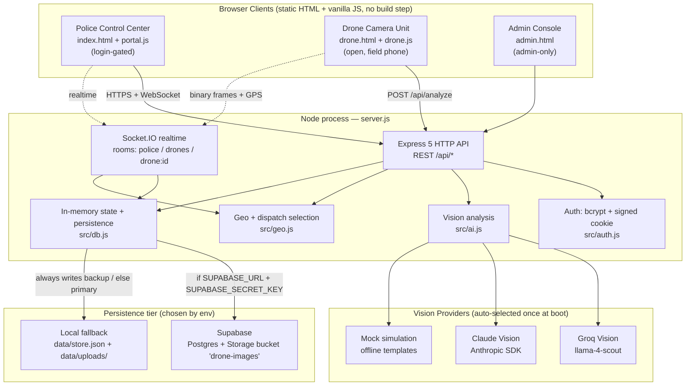
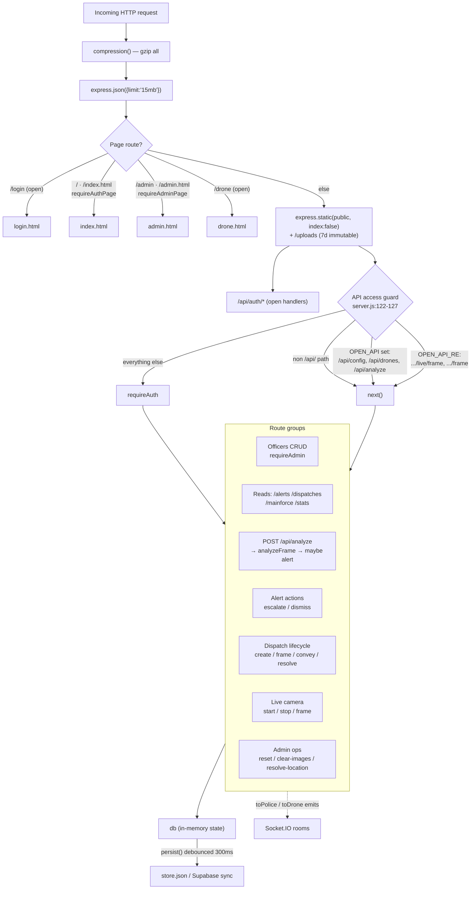
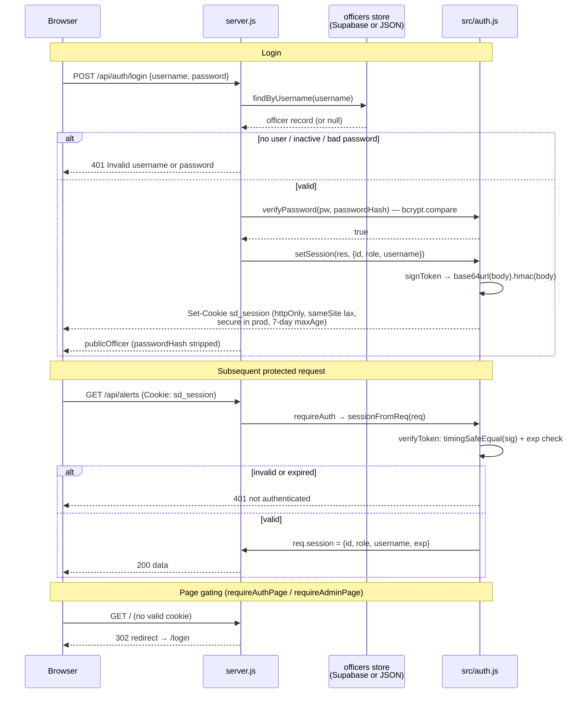
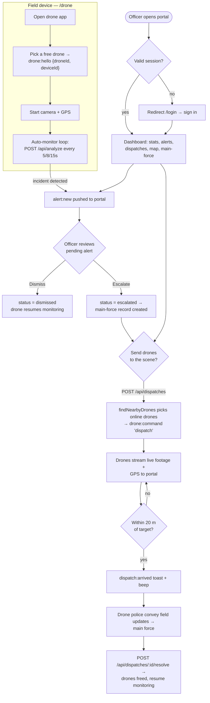
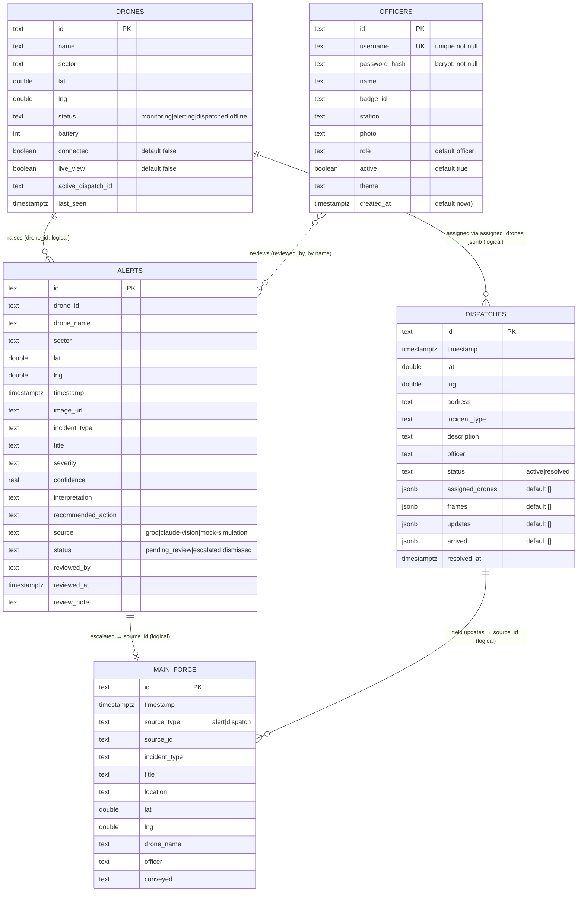
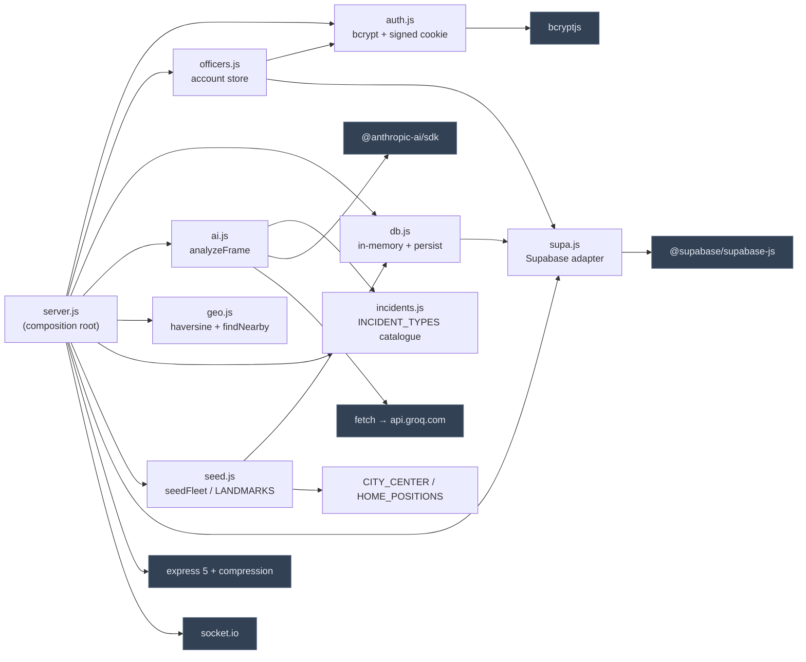
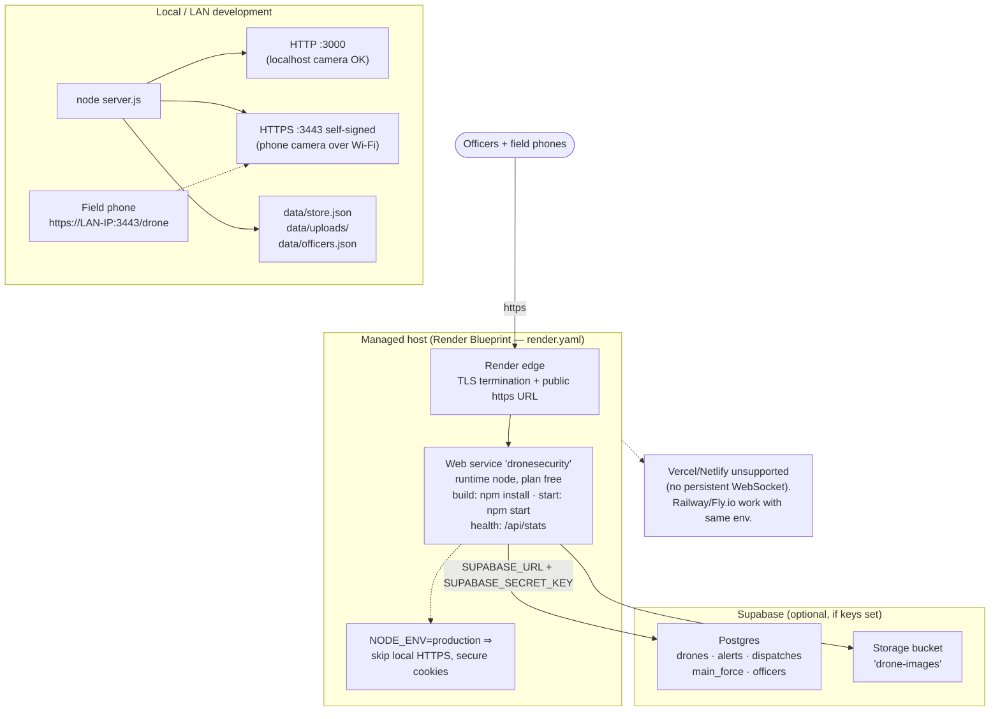

# System Diagrams

A visual reference for the **Smart City Drone Security System** (GEC Kozhikode, S7 Group 17). Every diagram below is derived directly from the source code; each carries a short caption and the primary files it was built from. Relationships shown for the database are **logical** — the schema declares no foreign-key constraints (`supabase/schema.sql`), so links are drawn to communicate intent, not enforced integrity.

---

## 1. System Architecture

High-level view of the whole system: two static browser apps, one persistent Node process that serves HTTP + a Socket.IO real-time layer, a pluggable vision provider, and a pluggable persistence/image-storage tier.



*Grounded in: `server.js:43-51`, `src/ai.js:17-25`, `src/geo.js:22-31`, `src/db.js:1-6,161-178`, `src/supa.js:7-13`.*

---

## 2. Frontend Architecture

The two front-end apps share a common helper module and the Socket.IO client. The police portal additionally uses Leaflet and an ASCII ripple effect; the drone app owns the camera capture pipeline. There is no bundler — modules are loaded as native ES modules.

```mermaid
graph TB
    subgraph Shared["public/js/common.js (ES module, imported by both)"]
        CFG["CONFIG + loadConfig()<br/>GET /api/config"]
        API["api() fetch wrapper"]
        THEME["THEMES (6) + initThemePicker()<br/>localStorage['sd-theme']"]
        HELPERS["esc / timeAgo / fmtTime<br/>incidentMeta / icon / refreshIcons"]
    end

    subgraph PortalSide["Police Portal — index.html"]
        PJS["portal.js<br/>const socket = io()"]
        LEAF["Leaflet map<br/>initMap / renderMap"]
        RIPPLE["ascii-ripple.js<br/>attachAsciiRipple()"]
        PSTATE["state = {drones, alerts,<br/>dispatches, mf, liveFrames...}"]
        PJS --> LEAF
        PJS --> RIPPLE
        PJS --> PSTATE
    end

    subgraph DroneSide["Drone Camera Unit — drone.html"]
        DJS["drone.js<br/>const socket = io()"]
        CAM["Camera pipeline<br/>captureFrame / captureBlob"]
        DSTATE["st = {droneId, coords, stream,<br/>timers, dispatch, gpsWatch...}"]
        DEVID["DEVICE_ID<br/>localStorage['droneDeviceId']"]
        DJS --> CAM
        DJS --> DSTATE
        DJS --> DEVID
    end

    PJS --> CFG
    PJS --> API
    PJS --> THEME
    PJS --> HELPERS
    DJS --> CFG
    DJS --> API
    DJS --> THEME
    DJS --> HELPERS

    PJS -.->|"socket.io.js"| SIO["Socket.IO client"]
    DJS -.->|"socket.io.js"| SIO
```



*Grounded in: `public/js/common.js:11-127`, `public/js/portal.js:1-5`, `public/js/drone.js:1-37`, `public/index.html:220-224`, `public/drone.html:99-102`.*

---

## 3. Backend Architecture

Request flow inside `server.js`: middleware order is load-bearing — page routes and auth routes are registered before the `/api/*` access guard, and static serving is mounted with `index:false` so login-gating cannot be bypassed.



*Grounded in: `server.js:58-70` (middleware), `server.js:120-127` (guard), `server.js:130-887` (routes), `server.js:248-249` (emit helpers), `src/db.js:85-92` (debounced persist).*

---

## 4. Authentication Flow

Auth is stateless: a bcrypt-verified login mints an HMAC-SHA256-signed mini-JWT (`body.signature`, not a standard 3-part JWT) stored in the httpOnly `sd_session` cookie. Every protected request re-verifies the cookie — there is no server-side session store.



*Grounded in: `server.js:73-95` (login/logout/me), `src/auth.js:15-86` (hashing, token, middleware), `src/officers.js:57-61` (publicOfficer). The default admin (`username: admin`, password from `ADMIN_PASSWORD` or `admin123`) is seeded at startup if no admin exists — `src/officers.js:64-75`.*

---

## 5. User Flow

The end-to-end operational journey across both apps: a field phone brings a drone online and streams frames for autonomous analysis; officers triage alerts in the portal and dispatch drones to incidents.



*Grounded in: `server.js:319-408` (analyze), `server.js:412-486` (escalate/dismiss), `server.js:490-563` (dispatch), `server.js:277-291` (arrival), `server.js:610-676` (convey/resolve), `public/js/drone.js:234-295` (scan/auto-monitor).*

---

## 6. Sequence — Frame → AI → Alert → Review → Dispatch

The core incident lifecycle, from an autonomous capture on the drone through officer review to a dispatch back onto the fleet. Note `/api/analyze` re-validates the drone state *after* its awaits so a drone that got dispatched mid-analysis is never demoted, and duplicate pending alerts per drone are suppressed.

```mermaid
sequenceDiagram
    autonumber
    participant D as Drone app<br/>(drone.js)
    participant S as server.js
    participant AI as src/ai.js
    participant P as Provider<br/>(Groq / Claude / Mock)
    participant DB as db / storage
    participant PO as Police portal<br/>(portal.js)

    D->>S: POST /api/analyze {droneId, image, lat, lng, scenarioHint}
    S->>DB: find drone; set lat/lng, connected=true
    S->>AI: analyzeFrame(imageBase64, {droneName, sector, scenarioHint})
    AI->>P: vision request (image + SYSTEM_PROMPT)
    alt provider error / timeout
        P-->>AI: throw
        AI-->>S: normalized "All clear" (normal, never a random incident)
    else success
        P-->>AI: JSON {incident_type, severity, confidence...}
        AI-->>S: normalize() → camelCase result
    end

    alt incidentType != normal AND policeRelevant
        S->>DB: dedupe check (existing pending alert for drone?)
        S->>DB: saveImage(image) → Storage/local URL
        Note over S: Re-validate after awaits —<br/>suppress if drone now dispatched
        S->>DB: push alert {status: pending_review}, cap MAX_ALERTS
        S->>DB: drone.status = 'alerting'
        S-->>PO: emit alert:new (+ toast + alarm)
    end
    S-->>PO: emit drone:status + stats
    S-->>D: 200 {analysis, alert}

    Note over PO: Officer triages the pending alert
    PO->>S: POST /api/alerts/:id/escalate {officer, note}
    S->>DB: alert.status = 'escalated'; push main_force record
    S-->>PO: emit alert:updated + mainforce:new + stats
    S-->>D: drone:command 'resume' (if not on a dispatch)

    Note over PO: Escalated incident warrants boots on the scene
    PO->>S: POST /api/dispatches {lat, lng, incidentType, description}
    S->>S: findNearbyDrones(target, drones, radiusKm=3)
    alt no dispatchable drone
        S-->>PO: 409 (no drones online / all busy)
    else drones selected
        S->>DB: create dispatch; mark drones dispatched
        S-->>D: drone:command 'dispatch' {dispatchId, lat, lng}
        S-->>PO: emit dispatch:new + drone:status + stats
        D-->>PO: drone:dispframe (binary) → dispatch:frame:bin (live footage)
        D->>S: drone:location → checkArrival (<=20 m) → dispatch:arrived
    end
```

*Grounded in: `server.js:319-408` (analyze + re-validation), `src/ai.js:402-424` (fallback), `src/ai.js:78-100` (normalize), `server.js:412-457` (escalate), `server.js:490-563` (dispatch), `server.js:1048-1074` (binary dispatch frames), `server.js:277-291` (arrival).*

---

## 7. Database ER Diagram

The persisted schema (`supabase/schema.sql`). All primary keys are opaque `text` ids (e.g. `alert_…`, `disp_…`). **No foreign keys are declared** — `drone_id`, `source_id`, and `active_dispatch_id` are plain text; the relationships below are logical associations the application maintains in code, drawn here for clarity only. When Supabase is disabled, the same shape is mirrored in `data/store.json` (drones/alerts/dispatches/main_force) and `data/officers.json`.



*Grounded in: `supabase/schema.sql:6-96`. Indexes: `officers (lower(username))`, and `timestamp desc` on alerts/dispatches/main_force (`schema.sql:91-96`). No RLS (server uses the trusted service_role key, `schema.sql:98-100`).*

---

## 8. Component Relationships

Module dependency graph of the server-side code. `server.js` is the composition root; every `src/*` module is imported there. `db.js` and `officers.js` each choose Supabase vs. local independently based on `supa.SUPA_ENABLED`.



*Grounded in: `server.js:12-29` (imports), `src/officers.js:12` (SUPA branch), `src/db.js:161-178`, `src/ai.js:12,36`, `src/seed.js:15-78`, `package.json:23-32` (deps).*

---

## 9. Deployment Architecture

Local development runs both an HTTP listener (`PORT`, default 3000) and a self-signed HTTPS listener (`HTTPS_PORT`, default 3443) so a phone camera can stream over LAN Wi-Fi. On managed hosts (`NODE_ENV=production`, `RENDER`, or `RAILWAY_ENVIRONMENT` set) the local HTTPS listener is skipped because the platform terminates TLS at its edge.



*Grounded in: `server.js:32-33` (ports), `server.js:1164-1184` (HTTPS gating + `io.attach`), `render.yaml:5-23` (service + env), `src/supa.js:7-10` (Supabase selection), `src/db.js:6` (JSON backup always written), `README:106-123` (host constraints).*

---

### Legend / conventions

- **Solid arrows** — direct call, import, or request path.
- **Dashed arrows** — realtime Socket.IO emits, or conditional/notational links.
- **ER links** are logical only; the schema declares no foreign keys (`supabase/schema.sql`).
- Provider, persistence, and TLS choices are all resolved from environment variables at boot, not at request time.
