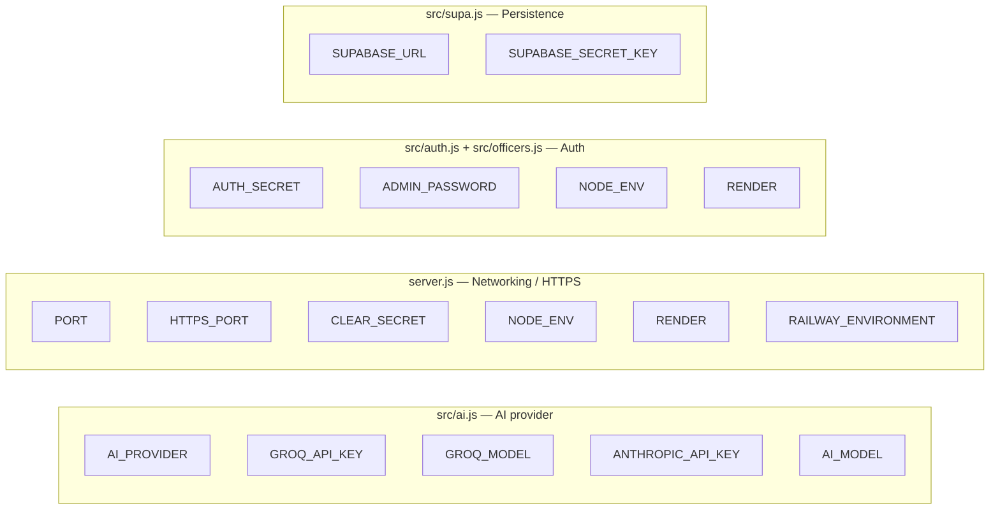
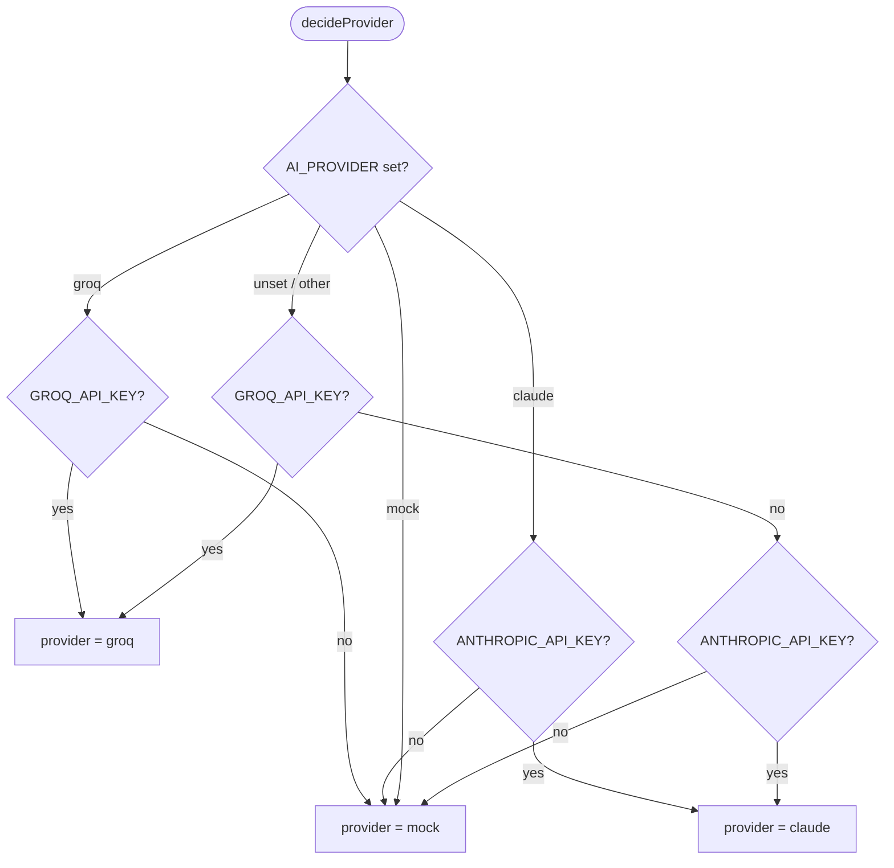
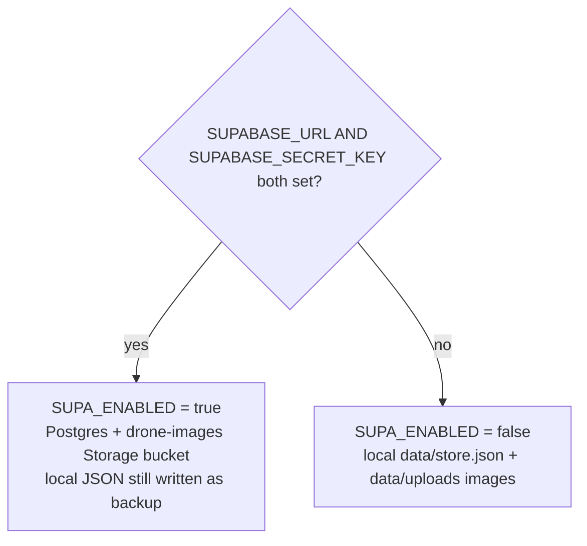

# Environment Variables

This document catalogues **every** environment variable the Smart City Drone Security System reads, whether it is declared in [`.env.example`](../.env.example) or referenced only through `process.env` in the source. Each entry lists its purpose, whether it is required, an example value, and the security implications of setting (or not setting) it.

The application loads variables from a local `.env` file via `dotenv` and from the real process environment (e.g. values injected by Render). Copy `.env.example` to `.env` and fill in what you need — nothing in the file is mandatory for a local demo, because every subsystem has a working fallback.

---

## Quick reference table

| Variable | Required? | Subsystem | Purpose | Default (if unset) | Example |
|---|---|---|---|---|---|
| `GROQ_API_KEY` | No | AI | Enables the Groq vision provider (preferred when set) | none → falls through provider auto-detect | `gsk_...` |
| `GROQ_MODEL` | No | AI | Groq vision model id | `meta-llama/llama-4-scout-17b-16e-instruct` | `meta-llama/llama-4-scout-17b-16e-instruct` |
| `ANTHROPIC_API_KEY` | No | AI | Enables the Anthropic Claude vision provider | none → falls through provider auto-detect | `sk-ant-...` |
| `AI_MODEL` | No | AI | Claude model id (used only when provider = claude) | `claude-opus-4-8` | `claude-opus-4-8` |
| `AI_PROVIDER` | No | AI | Force a provider, overriding key auto-detection | unset → auto-detect | `groq` \| `claude` \| `mock` |
| `PORT` | No | Networking | HTTP listen port | `3000` | `3000` |
| `HTTPS_PORT` | No | Networking | Local self-signed HTTPS port (phone camera over Wi-Fi) | `PORT + 443` (i.e. `3443`) | `3443` |
| `CLEAR_SECRET` | No | Security | Police key required to wipe captured drone images | `police2026` | `police2026` |
| `AUTH_SECRET` | Recommended for prod | Security | HMAC-SHA256 secret that signs the session cookie | `dev-insecure-secret-change-me` (with a warning) | a long random string |
| `ADMIN_PASSWORD` | Recommended for prod | Security | Password for the auto-seeded default `admin` account | `admin123` (with a warning) | a strong password |
| `SUPABASE_URL` | No (both needed for cloud mode) | Persistence | Supabase project URL → Postgres + image Storage | unset → local JSON store | `https://xxxx.supabase.co` |
| `SUPABASE_SECRET_KEY` | No (both needed for cloud mode) | Persistence | Supabase service/secret key | unset → local JSON store | `sb_secret_...` |
| `NODE_ENV` | No (platform-set) | Platform | `production` → Secure cookies + skip local HTTPS listener | unset | `production` |
| `RENDER` | No (platform-set) | Platform | Presence → Secure cookies + skip local HTTPS listener | unset | `true` |
| `RAILWAY_ENVIRONMENT` | No (platform-set) | Platform | Presence → skip local HTTPS listener | unset | `production` |

> **Documented vs. discovered:** `GROQ_API_KEY`, `GROQ_MODEL`, `ANTHROPIC_API_KEY`, `AI_MODEL`, `AI_PROVIDER`, `PORT`, `HTTPS_PORT`, `CLEAR_SECRET`, `SUPABASE_URL`, and `SUPABASE_SECRET_KEY` are all present in `.env.example`. `AUTH_SECRET`, `ADMIN_PASSWORD`, `NODE_ENV`, `RENDER`, and `RAILWAY_ENVIRONMENT` are **used in code but not listed in `.env.example`** — they are documented here so nothing is hidden.

---

## Where each variable is read

Exact call sites:

- `AI_PROVIDER`, `GROQ_API_KEY`, `ANTHROPIC_API_KEY` — `src/ai.js:16-23`; `AI_MODEL` — `src/ai.js:27`; `GROQ_MODEL` — `src/ai.js:30`; `GROQ_API_KEY` again for the request header — `src/ai.js:175`.
- `PORT` — `server.js:32`; `HTTPS_PORT` — `server.js:33`; `CLEAR_SECRET` — `server.js:39`; `NODE_ENV`/`RENDER`/`RAILWAY_ENVIRONMENT` — `server.js:1167`.
- `AUTH_SECRET` — `src/auth.js:7-9`; `NODE_ENV`/`RENDER` (Secure cookie flag) — `src/auth.js:55`; `ADMIN_PASSWORD` — `src/officers.js:67-69`.
- `SUPABASE_URL`/`SUPABASE_SECRET_KEY` — `src/supa.js:7-9`.

---

## AI provider variables

### `AI_PROVIDER`
- **Required?** No.
- **Purpose:** Forces the vision provider regardless of which API keys are present. Read at `src/ai.js:16` and lower-cased; accepted values are `groq`, `claude`, and `mock`.
- **Behavior (`src/ai.js:17-24`):**
  - `groq` → uses Groq **if** `GROQ_API_KEY` is set, otherwise falls back to `mock`.
  - `claude` → uses Claude **if** `ANTHROPIC_API_KEY` is set, otherwise falls back to `mock`.
  - `mock` → always the offline simulation.
  - Any other/empty value → auto-detect (see diagram below).
- **Example:** `AI_PROVIDER=groq`
- **Security implications:** None directly. Setting `mock` guarantees no drone frames leave the machine (no external AI calls), which is the most privacy-preserving mode.

### `GROQ_API_KEY`
- **Required?** No — but it is the highest-priority key in auto-detect.
- **Purpose:** Enables Groq's OpenAI-compatible vision API. Its presence selects `groq` in auto-detect (`src/ai.js:21`) and it is sent as the `Authorization: Bearer <key>` header on each request (`src/ai.js:175`).
- **Example:** `GROQ_API_KEY=gsk_xxxxxxxx`
- **Security implications:** This is a **secret credential**. It grants API usage billed to your Groq account. Never commit it; keep it in `.env` (git-ignored) or your host's secret store. On Render it is declared `sync: false` (`render.yaml:18-19`) so it is entered in the dashboard, not stored in the repo. When Groq is active, drone camera frames (base64 JPEG) are transmitted to Groq for analysis.

### `GROQ_MODEL`
- **Required?** No.
- **Purpose:** Overrides the Groq vision model id. Default `meta-llama/llama-4-scout-17b-16e-instruct` (`src/ai.js:30`). Useful if Groq deprecates the default model.
- **Example:** `GROQ_MODEL=meta-llama/llama-4-scout-17b-16e-instruct`
- **Security implications:** None (not a secret). Note it is set to a literal value in `render.yaml:16-17`.

### `ANTHROPIC_API_KEY`
- **Required?** No.
- **Purpose:** Enables the Anthropic Claude vision provider. Its presence selects `claude` in auto-detect **only if** `GROQ_API_KEY` is absent (`src/ai.js:22`). When provider = claude, the SDK client is constructed with `new Anthropic()` (`src/ai.js:36-38`), which reads this key from the environment.
- **Example:** `ANTHROPIC_API_KEY=sk-ant-xxxxxxxx`
- **Security implications:** A **secret credential** billed to your Anthropic account. Same handling rules as `GROQ_API_KEY`. When Claude is active, drone frames are transmitted to Anthropic.

### `AI_MODEL`
- **Required?** No.
- **Purpose:** Claude model id, consumed only on the Claude path. Default `claude-opus-4-8` (`src/ai.js:27`). Note the variable name is the generic `AI_MODEL`, **not** an Anthropic-specific name; it has no effect when the provider is Groq or mock.
- **Example:** `AI_MODEL=claude-opus-4-8`
- **Security implications:** None (not a secret).

### Provider auto-selection

Groq wins over Claude when both keys are present (`src/ai.js:21-22`). The resulting `AI_LABEL` shown in the UI is `Groq Vision`, `Claude Vision`, or `Standby` for mock (`src/ai.js:32-33`).

---

## Networking variables

### `PORT`
- **Required?** No.
- **Purpose:** HTTP listen port for both the police portal (`/`) and the drone app (`/drone`). `Number(process.env.PORT) || 3000` (`server.js:32`).
- **Example:** `PORT=3000`
- **Security implications:** None. **Do not set `PORT` on Render** — the platform injects its own; overriding it can break the health check. (Render's `render.yaml` deliberately omits `PORT`.)

### `HTTPS_PORT`
- **Required?** No.
- **Purpose:** Port for the **local self-signed HTTPS listener** that exists so a phone browser will grant camera access over Wi-Fi (browsers require a secure context for `getUserMedia`). `Number(process.env.HTTPS_PORT) || PORT + 443`, i.e. `3443` by default (`server.js:33`).
- **Example:** `HTTPS_PORT=3443`
- **Security implications:** The HTTPS server uses a **self-signed** certificate generated on demand (CN `smart-drone.local`), so browsers will show a trust warning — acceptable for a LAN demo, not for public exposure. This listener is **skipped entirely** on managed hosts (see `NODE_ENV`/`RENDER`/`RAILWAY_ENVIRONMENT`).

---

## Security / auth variables

### `CLEAR_SECRET`
- **Required?** No, but change it before any real deployment.
- **Purpose:** The authorization key an admin must supply to wipe captured drone images via `POST /api/admin/clear-images`. `process.env.CLEAR_SECRET || 'police2026'` (`server.js:39`).
- **Example:** `CLEAR_SECRET=police2026`
- **Security implications:** Gate for a **destructive** operation (permanently deletes stored/archived images). The default `police2026` is public knowledge (it is in `.env.example`), so leaving it unchanged means anyone who can reach the admin endpoint and knows the default can wipe images. Set a strong, private value in production. Note this is a request-body key, **not** the session/cookie secret.

### `AUTH_SECRET`
- **Required?** Not enforced, but **strongly recommended** in production.
- **Purpose:** The HMAC-SHA256 secret used to sign the stateless session cookie (a mini-JWT of the form `base64url(body).hmac`). `process.env.AUTH_SECRET || 'dev-insecure-secret-change-me'` (`src/auth.js:7`). If unset, the app logs a warning at startup (`src/auth.js:8-9`).
- **Example:** `AUTH_SECRET=<long random hex string>`
- **Security implications:** This is the **most security-critical** variable. The cookie signature is the only thing preventing session forgery — anyone who knows the secret can mint a valid session for any officer or admin. The default `dev-insecure-secret-change-me` is public, so **any deployment left on the default is trivially forgeable.** Use a long, unpredictable value and keep it secret. Rotating it invalidates all existing sessions (they fail the `timingSafeEqual` check at `src/auth.js:34`).

### `ADMIN_PASSWORD`
- **Required?** Not enforced, but **strongly recommended** in production.
- **Purpose:** Password for the default `admin` officer that is auto-created on first boot when no admin exists. `process.env.ADMIN_PASSWORD || 'admin123'` (`src/officers.js:67`). If unset, the app logs a warning telling you to set it and change it after first login (`src/officers.js:68-69`).
- **Example:** `ADMIN_PASSWORD=<strong password>`
- **Security implications:** Bootstraps privileged access. The default `admin123` is public; leaving it unchanged means anyone can log in as administrator on a fresh instance. The password is stored only as a bcrypt hash (cost factor 10, `src/auth.js:18`), and this variable is read **only during seeding** — changing it later does not update an already-created admin (change the password through the app instead).

---

## Persistence (Supabase) variables

Both must be set together to switch from the local JSON store to Supabase.

### `SUPABASE_URL`
- **Required?** No (needed only for cloud mode; **must be paired** with `SUPABASE_SECRET_KEY`).
- **Purpose:** Supabase project URL. Read at `src/supa.js:7`.
- **Example:** `SUPABASE_URL=https://xxxxxxxx.supabase.co`
- **Security implications:** Not itself a secret, but identifies the backing database/storage project.

### `SUPABASE_SECRET_KEY`
- **Required?** No (needed only for cloud mode; **must be paired** with `SUPABASE_URL`).
- **Purpose:** Supabase service/secret key used by the server-side client. Read at `src/supa.js:8`.
- **Example:** `SUPABASE_SECRET_KEY=sb_secret_xxxxxxxx`
- **Security implications:** A **high-privilege secret**. The schema enables **no Row Level Security** — the server relies on this trusted service key, which bypasses RLS, so leaking it grants full read/write access to all tables and the public `drone-images` Storage bucket. Never expose it to the browser or commit it; on Render it is `sync: false` (`render.yaml:20-23`).

### Storage-backend selection

`SUPA_ENABLED = !!(URL && KEY)` (`src/supa.js:9`). Setting only one of the two leaves the app in local mode. The local JSON store is always written regardless, as an offline backup.

---

## Platform / host-set variables

These are typically set automatically by the hosting platform rather than by you.

### `NODE_ENV`
- **Required?** No.
- **Purpose / effects:**
  - `=== 'production'` marks the session cookie **Secure** (HTTPS-only) at `src/auth.js:55`.
  - `=== 'production'` also **skips** the local self-signed HTTPS listener at `server.js:1167`, because managed hosts terminate TLS at their edge.
- **Example:** `NODE_ENV=production` (Render sets this via `render.yaml:14-15`).
- **Security implications:** In production it hardens cookies (Secure flag). If you run publicly **without** `NODE_ENV=production` (and without `RENDER`), the cookie omits `Secure` and could be sent over plain HTTP — set it whenever you serve over HTTPS.

### `RENDER`
- **Required?** No — set automatically by Render.
- **Purpose / effects:** Its mere presence (any value) triggers the same two behaviors as production: Secure cookies (`src/auth.js:55`) and skipping the local HTTPS listener (`server.js:1167`).
- **Example:** `RENDER=true`
- **Security implications:** Same cookie-hardening benefit as `NODE_ENV=production`. Treat as platform-managed; you normally do not set it yourself.

### `RAILWAY_ENVIRONMENT`
- **Required?** No — set automatically by Railway.
- **Purpose / effects:** Its presence skips the local self-signed HTTPS listener (`server.js:1167`). (Unlike `RENDER`, it does **not** appear in the cookie-Secure check at `src/auth.js:55` — only `NODE_ENV`/`RENDER` do. On Railway, set `NODE_ENV=production` if you want Secure cookies.)
- **Example:** `RAILWAY_ENVIRONMENT=production`
- **Security implications:** Purely disables the redundant local TLS listener behind Railway's edge. To harden cookies on Railway, also set `NODE_ENV=production`.

---

## Deployment defaults on Render

The `render.yaml` blueprint pre-populates some of the above:

| Variable | How set in `render.yaml` |
|---|---|
| `NODE_ENV` | literal `production` (lines 14-15) |
| `GROQ_MODEL` | literal `meta-llama/llama-4-scout-17b-16e-instruct` (lines 16-17) |
| `GROQ_API_KEY` | `sync: false` — paste in dashboard (lines 18-19) |
| `SUPABASE_URL` | `sync: false` (lines 20-21) |
| `SUPABASE_SECRET_KEY` | `sync: false` (lines 22-23) |

Render also auto-injects its own `RENDER` and `PORT`. **Do not** set `PORT` yourself on Render. Secrets recommended for a hardened Render deployment but **not** in the blueprint (add them in the dashboard): `AUTH_SECRET`, `ADMIN_PASSWORD`, `CLEAR_SECRET`, and optionally `ANTHROPIC_API_KEY`/`AI_PROVIDER`/`AI_MODEL`.

---

## Production hardening checklist

The three variables that ship with public, insecure defaults are the ones to change first:

1. **`AUTH_SECRET`** — set to a long random value; the default lets anyone forge sessions.
2. **`ADMIN_PASSWORD`** — set before first boot; the default `admin123` is public.
3. **`CLEAR_SECRET`** — change from `police2026` to protect the destructive image-wipe endpoint.

Then, as needed: set `NODE_ENV=production` (or deploy on Render) for Secure cookies, provide a real AI key (`GROQ_API_KEY` or `ANTHROPIC_API_KEY`) if you want live analysis, and supply the `SUPABASE_URL` + `SUPABASE_SECRET_KEY` pair for cloud persistence.
