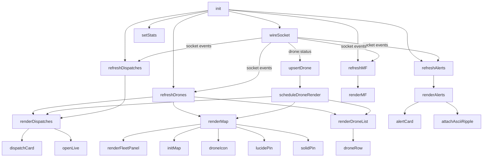
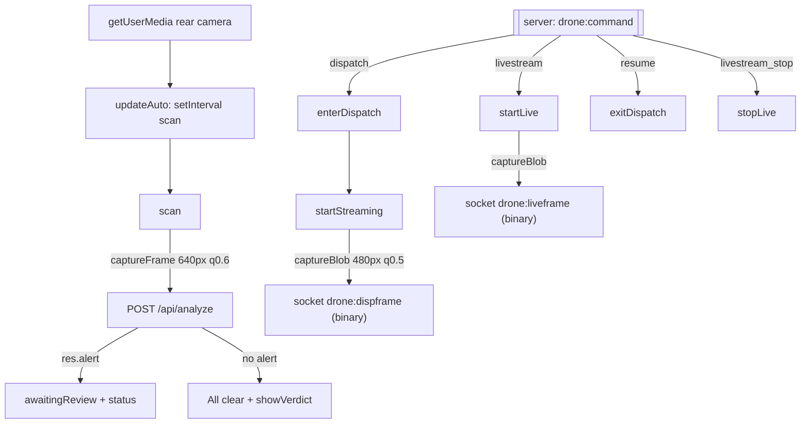
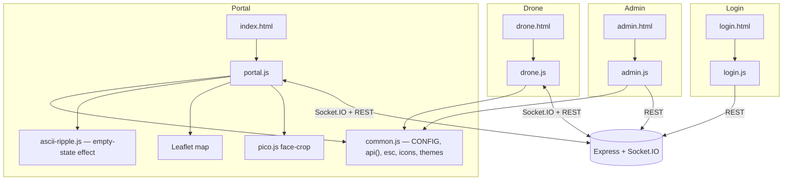

# Frontend

The Smart City Drone Security System frontend is a **static, buildless web app**: hand-written HTML pages, a small set of vanilla-JavaScript ES modules, and a single hand-authored CSS file. There is **no framework** (no React/Vue/Angular/Svelte), **no bundler or transpiler**, and **no `package.json` build step** for the client — the browser loads the source files exactly as they sit in `public/`. The Express server (`server.js:63-69`) serves the pages directly and gates the privileged ones behind auth middleware.

This document covers framework/architecture, routing, layout, the render-function hierarchy, state management, utilities and services, API integration (fetch + Socket.IO), styling and theming, UI libraries, forms, validation, and error handling — page by page and component by component.

---

## 1. Technology & architecture at a glance

| Concern | Choice | Evidence |
|---|---|---|
| UI framework | **None** — vanilla DOM + template-literal HTML strings | all `public/js/*.js` |
| Module system | Native **ES modules** (`import`/`export`, `type="module"`) | `index.html:224`, `drone.html:102`, `common.js:1` |
| Build step | **None** — files served as-is from `public/` | `server.js:69` (`express.static`) |
| Client router | **None** — server routes pages; portal uses in-page tab switching | `server.js:63-66`, `portal.js:318-328` |
| State management | Plain module-scoped objects (`state`, `st`, `CONFIG`) — no store library | `portal.js:5`, `drone.js:21-37`, `common.js:11` |
| Realtime | **Socket.IO** client (`io()`), same-origin | `portal.js:4`, `drone.js:3` |
| HTTP | `fetch` wrapped by `api()` | `common.js:41-52` |
| Maps | **Leaflet 1.9.4** (portal only) | `index.html:8,221`, `portal.js:757-807` |
| Icons | **Lucide 1.23.0** UMD, inline `<i data-lucide>` placeholders | `common.js:26-39` |
| Face detection | **pico.js** (lazy-loaded, avatar auto-crop, portal only) | `portal.js:208-248` |
| Styling | One vanilla CSS file, CSS custom properties + 6 themes | `public/css/style.css` |

### 1.1 "No framework" — what that means here

Every view is produced by building an HTML **string** from application data with template literals, assigning it to `element.innerHTML`, then re-attaching event handlers and re-scanning for icons. For example `renderAlerts()` maps the alert array to `alertCard()` strings and injects them (`portal.js:371-390`). There is no virtual DOM and no reactivity system: after any state change the relevant `render*()` function is called explicitly. Because of this, there are **no framework "hooks"** — the closest analogues are the shared helpers in `common.js` and the debounced re-render scheduler `scheduleDroneRender()` (`portal.js:91-102`).

### 1.2 Page loading pattern

Every page shares the same boot skeleton in its `<head>`:

```html
<script>try{var t=localStorage.getItem('sd-theme');if(t)document.documentElement.dataset.theme=t;}catch(e){}</script>
```

This **pre-paint theme bootstrap** (`index.html:10`, `drone.html:9`, `login.html:9`, `admin.html:9`) reads the saved theme from `localStorage` and stamps `data-theme` on `<html>` *before* first paint, so there is no flash of the default palette.

Scripts are loaded at the end of `<body>`: the same-origin Socket.IO client, any CDN vendors (Leaflet on the portal only), the Lucide UMD bundle, a `DOMContentLoaded` call to `lucide.createIcons()`, and finally the page's own ES module (`index.html:220-224`, `drone.html:99-102`).

---

## 2. Pages & routing

There is **no client-side router**. Navigation between top-level pages is ordinary URL navigation to server routes; within the police portal, "tabs" swap panels in-place without changing the URL.

### 2.1 Page inventory

| URL | File | Controller module | Auth (server) | Purpose |
|---|---|---|---|---|
| `/login` | `public/login.html` | `/js/login.js` | open | Officer sign-in |
| `/`, `/index.html` | `public/index.html` | `/js/portal.js` | login required (`requireAuthPage`) | Police Control Center |
| `/admin`, `/admin.html` | `public/admin.html` | `/js/admin.js` | admin only (`requireAdminPage`) | Officer management |
| `/drone` | `public/drone.html` | `/js/drone.js` | open | Drone camera field unit |

(Server gating is defined in `server.js:63-66`; the auth-page middleware redirects to `/login` when unauthenticated.)

### 2.2 In-page routing (portal tabs)

The portal's four content areas are `<section class="panel">` blocks — `#panel-alerts`, `#panel-dispatch`, `#panel-map`, `#panel-mainforce` (`index.html:79-171`). The tab bar (`index.html:70-75`) drives `setupTabs()` (`portal.js:318-328`), which toggles the `active` class on both the clicked `.tab` and its matching `#panel-<name>`. Opening the **map** tab lazily initialises/re-frames Leaflet after an 80 ms delay so the container has a measured size (`portal.js:325`).

```mermaid
flowchart LR
  subgraph Server routes
    L["/login → login.html"]
    P["/ → index.html"]
    A["/admin → admin.html"]
    D["/drone → drone.html"]
  end
  L -->|sign in ok| P
  P -->|"Manage officers" (admin)| A
  A -->|Back to portal| P
  P -->|"Drone Camera App" link| D
  D -->|"Police Portal" link| P
  P -->|logout| L
  A -->|logout| L
  subgraph "Portal in-page tabs (no URL change)"
    T1[Incident Alerts]
    T2[Dispatch & Live Footage]
    T3[Fleet Map]
    T4[Main Force Log]
  end
  P -.-> T1 & T2 & T3 & T4
```

Cross-page links: the portal topbar links to `/drone` in a new tab (`index.html:22`) and, for admins only, injects a `/admin` link into the sidebar footer (`portal.js:288-300`); the drone page links back to `/` (`drone.html:19`); admin links back to `/` and to logout (`admin.html:19-20`).

---

## 3. Shared foundation — `public/js/common.js`

`common.js` is the utility/service layer imported by `portal.js`, `drone.js`, and `admin.js`. It is a plain ES module exporting functions and one mutable config object; it holds no page-specific state.

### 3.1 Config service

- `CONFIG` (`common.js:11`) — exported mutable object, default `{ aiMode:'mock', cityCenter:{lat:11.2588,lng:75.7804}, incidentTypes:{} }`.
- `loadConfig()` (`common.js:13-20`) — `GET /api/config` and assigns the result into `CONFIG`; on failure it silently keeps defaults. Both the portal and drone pages `await loadConfig()` early in `init()` (`portal.js:17`, `drone.js:42`) so the incident catalogue, AI label, landmarks, and city centre are available before first render.
- `incidentMeta(type)` (`common.js:22-24`) — looks up `CONFIG.incidentTypes[type]`; falls back to `{ label:type, icon:'❓', lucide:'circle-help', color:'#888' }` so an unknown type never breaks rendering.

### 3.2 HTTP service — `api()`

```js
export async function api(path, opts = {}) { … }
```

`api()` (`common.js:41-52`) is the single fetch wrapper used across the app:

- Always sends `Content-Type: application/json`.
- Serialises `opts.body` with `JSON.stringify` when present (callers pass a plain object, e.g. `api('/api/dispatches', { method:'POST', body:{…} })`).
- Reads the response as text, then attempts `JSON.parse`; non-JSON bodies pass through as the raw string.
- **Error contract:** on a non-2xx response it throws `new Error(data.error || res.statusText)`. Every caller relies on this — they wrap `api()` in `try/catch` and surface `e.message`.

Cookies (the `sd_session` auth cookie) ride along automatically because requests are same-origin; the client never handles tokens directly.

### 3.3 Icon helpers (Lucide)

Icons are authored as placeholder tags and materialised later:

- `icon(name, cls)` (`common.js:28-30`) → `<i data-lucide="name">` string.
- `incidentIcon(type)` (`common.js:32-35`) → a colour-wrapped incident icon using `incidentMeta().color` + `.lucide`.
- `refreshIcons()` (`common.js:37-39`) → calls `window.lucide.createIcons()` to convert all pending `<i data-lucide>` placeholders into inline SVGs. **This must be called after every `innerHTML` update**, which is why nearly every render function ends with `refreshIcons()`.

### 3.4 Formatting / escaping utilities

| Helper | Purpose | Line |
|---|---|---|
| `esc(s)` | HTML-escape `& < > " '` — used on **all** interpolated data before it enters `innerHTML` (XSS guard) | `common.js:54-58` |
| `timeAgo(iso)` | Relative time ("5s/m/h ago", else localised date) | `common.js:60-67` |
| `fmtTime(iso)` | Localised `HH:MM:SS` | `common.js:69-71` |
| `SEV_CLASS` | Severity → CSS class map (`sev-none`…`sev-critical`) | `common.js:3-9` |

### 3.5 Theming service

- `THEMES` (`common.js:74-81`) — six palettes: `midnight` (default), `graphite`, `obsidian`, `emerald`, `tricolor` (the single light theme), `aurora`. Each has an `id`, `name`, and two swatch colours.
- `currentTheme()` / `applyTheme(id)` (`common.js:82-88`) — read/write `localStorage['sd-theme']` (default `'midnight'`) and set `document.documentElement.dataset.theme`.
- `initThemePicker(mount, onChange)` (`common.js:92-127`) — builds the topbar theme button + dropdown, marks the current theme with a check, and wires each option to `applyTheme` + `refreshIcons`. Crucially, `onChange(id)` fires **only on user-initiated picks**; the returned `{ apply(id) }` lets code set the theme programmatically **without** re-firing `onChange`. The portal uses this split so it can (a) persist a user's pick to their account via `POST /api/auth/theme` and (b) silently apply the officer's saved `theme` on load without echoing it back (`portal.js:14,276`).

---

## 4. Text effect module — `public/js/ascii-ripple.js`

`attachAsciiRipple(el, opts)` (`ascii-ripple.js:25-198`) is a dependency-free glitch-ripple text effect used purely for **empty-state flavour** on the portal (e.g. "No pending alerts. Drones are monitoring…", `portal.js:376-382`). It is a vanilla port of a React "AsciiGlitchRipple" component.

Behaviour and safeguards:
- **Idempotent** — refuses to double-wire a node via `el.dataset.rippleOn` (`ascii-ripple.js:29,35`).
- **Accessibility** — honours `prefers-reduced-motion` (renders static text, `ascii-ripple.js:20-23,33`); hides the animating node from assistive tech (`aria-hidden`) and inserts a static `.sr-only` twin with the real message (`ascii-ripple.js:41-45`).
- **Interaction** — `mouseenter`/`mousemove` send a ripple outward from the cursor position across the characters; `mouseleave` stops (`ascii-ripple.js:139-158`). The math lives in `calcWaveEffect` + `scrambled` on a `requestAnimationFrame` loop (`ascii-ripple.js:68-121`).
- **Auto mode** (`{ auto:true }`) — emits a gentle self-running ripple on an interval so empty states shimmer without a hover; it pauses when the tab is hidden or the node has no `offsetParent` (i.e. its panel is `display:none`) and self-cancels once `el.isConnected` becomes false after a re-render (`ascii-ripple.js:161-180`).
- Returns a `cleanup()` that removes listeners, timers, the SR twin, and the `rippleOn` flag (`ascii-ripple.js:182-197`).

---

## 5. Police portal — `index.html` + `portal.js`

The largest surface. Title "Drone Security · Police Control Center" (`index.html:6`). It loads Leaflet CSS/JS from unpkg (`index.html:8,221`), Lucide (`index.html:222`), the Socket.IO client (`index.html:220`), and `portal.js` as a module (`index.html:224`).

### 5.1 Layout

| Region | Key elements | Source |
|---|---|---|
| **Topbar** | `#menuBtn` (open sidebar), radar logo, title, `#aiBadge`, link to `/drone`, admin-only `#clearImgBtn` + `#resetBtn` (hidden until admin) | `index.html:13-25` |
| **Officer sidebar** (`aside#sidebar` + backdrop) | avatar `#sbPhoto` + `#editPhotoBtn` + hidden `#photoInput`, name/role, badge/station rows, `#themePicker` mount, `#logoutBtn` | `index.html:28-59` |
| **Stat tiles** | `#s_drones`, `#s_pending`, `#s_escalated`, `#s_dismissed`, `#s_dispatch`, `#s_mf` | `index.html:61-68` |
| **Tab bar** | `data-tab` = `alerts` / `dispatch` / `map` / `mainforce`; `#pill_alerts` count | `index.html:70-75` |
| **Panels** | `#panel-alerts`, `#panel-dispatch`, `#panel-map`, `#panel-mainforce` | `index.html:77-172` |
| **Globals** | `#toasts` container, `#alertGlow` overlay | `index.html:174-175` |
| **Modals** | review `#modalBack`, clear-images `#clearBack`, live-camera `#liveBack` | `index.html:177-218` |

### 5.2 Client state

```js
const state = { drones: [], alerts: [], dispatches: [], mf: [], pendingTarget: null, liveDroneId: null };
```

Declared at `portal.js:5`. It is a plain object mutated in place; there is no setter/store abstraction. Runtime-augmented fields:

- `state.liveFrames` (`portal.js:112`) — cache of the newest frame per `dispatchId__droneId` (base64 or `blob:` object URL).
- `state.liveGotFrame`, `state.liveWaitTimer`, `state.liveStaleTimer` (`portal.js:925,938,966`) — live-modal watchdogs.
- `state.pendingTarget` — a lat/lng chosen by clicking the map or picking a location, drawn as a pending dispatch pin.

Module-local (non-`state`) variables include the Leaflet handles `lmap`/`mapMarkers`/`mapFitted` (`portal.js:727-729`), the debounce handle `droneRenderTimer` (`portal.js:91`), the modal callback `modalOnOk` (`portal.js:1007`), and the alarm/audio locals `alarmOn`/`alarmTimer`/`actx` (`portal.js:1071,1083`).

### 5.3 Boot sequence — `init()`

`init()` (`portal.js:10-56`) runs immediately on module load and, in order: sets up the sidebar and photo editor; builds the theme picker with an account-persisting `onChange`; loads the officer profile; installs the flag-wave hover effect; `await loadConfig()`; sets the AI badge; populates the dispatch `#d_type` select from `CONFIG.incidentTypes` (excluding `normal`, defaulting `suspicious_activity`, `portal.js:22-26`); wires tabs/dispatch/modals/live/clear; binds the admin buttons; `wireSocket()`; emits `police:join`; refreshes all four collections in parallel; sets stats; and starts a 30 s interval that re-renders lists so "x ago" timestamps stay fresh (`portal.js:55`).

### 5.4 Render-function hierarchy



#### Stats — `setStats(s)` (`portal.js:144-154`)
Writes the six tile numbers (drones shown as `online/total`) and toggles the `#pill_alerts` badge on the Alerts tab when `pendingAlerts > 0`.

#### Alerts panel
- `alertCard(a, reviewed)` (`portal.js:331-369`) — builds a collapsible card: a small leading thumbnail (captured `imageUrl` or the incident icon), title + severity chip, drone/sector/time sub-line, an interpretation snippet, and a hidden detail body (full image, interpretation, suggested action, a confidence bar, coordinates, and a human source label derived from `a.source` — "Claude Vision"/"Groq Vision"/"AI Vision"). Pending cards get **Escalate** / **Situation OK — Resume** buttons; reviewed cards show a status chip + note.
- `renderAlerts()` (`portal.js:371-390`) — splits `state.alerts` into pending (`status === 'pending_review'`) vs reviewed, renders each list (or a ripple empty-state), toggles the "Clear history" button, and wires card expand/collapse plus the escalate/dismiss buttons (which call `reviewAlert`).
- `reviewAlert(id, kind)` (`portal.js:392-409`) — opens the review modal; on confirm it `POST`s `/api/alerts/:id/escalate` or `/dismiss` with `{ officer, note }`.

#### Dispatch panel
- `dispatchCard(d)` (`portal.js:596-662`) — renders one dispatch: an ACTIVE/RESOLVED severity chip, incident label, address + time, optional description, a per-drone status row (reached / en-route with live `haversineKm` distance / static distance, plus live battery and an "Access live camera" button for online assigned drones), a **footage grid** of live tiles (`data-feed="dispatchId__droneId"` images fed by socket frames, else a "surrounding…" placeholder), any conveyed updates, and — while active — a "Convey info" input plus **Convey** / **Resolve** buttons.
- `renderDispatches()` (`portal.js:664-704`) — **preserves in-progress convey text, focus, and caret position** across the frequent live-frame re-renders (`portal.js:668-692`), then renders the cards (or ripple empty-state), wires live-camera / resolve / convey buttons, and toggles "Clear resolved".
- Frame handlers `onFrame`/`onFrameBin` (`portal.js:109-141`) — cache the newest frame in `state.liveFrames` and, in steady state, swap a single `.src` (the binary path uses `URL.createObjectURL` and revokes the previous blob URL to avoid leaks); only the first frame for a tile triggers a full `renderDispatches()`.

#### Main-force log
- `renderMF()` (`portal.js:707-722`) — renders `state.mf` as timestamped log items (escalation vs field update, officer, incident, location, conveyed text), or a ripple empty-state.

#### Fleet map (Leaflet)
- `initMap()` (`portal.js:757-774`) — creates the Leaflet map centred on `CONFIG.cityCenter`, adds a **CARTO dark** tile layer (no API key), a marker layer group, and a click handler that sets `state.pendingTarget`, fills the hidden lat/lng inputs, and shows the pin-confirm overlay.
- Marker factories: `lucidePin` (incident icon pin, `portal.js:776-783`), `solidPin` (teardrop target pin, `portal.js:785-793`), `droneIcon` (labelled status dot; colour from `STATUS_COLOR`, `portal.js:794-807`).
- `renderMap()` (`portal.js:809-849`) — always syncs the side roster via `renderFleetPanel()`; initialises Leaflet only when the map tab is visible and sized; otherwise skips the marker rebuild. When visible it clears and redraws pending-alert incidents, active-dispatch targets (with a 20 m arrival circle), the pending target, and **only connected drones**. Auto-frames the fleet once via `fitMap()`.
- `renderFleetPanel()` (`portal.js:853-879`) — the always-in-sync roster aside listing **all** drones (online first) with status, battery, live-view indicator, and last-seen; independent of Leaflet visibility.
- `fitMap()` (`portal.js:733-742`) — fits map bounds to connected drones + active dispatches + pending alerts.

#### Drone fleet cards + live view
- `droneRow(d)` / `renderDroneList()` (`portal.js:882-916`) — a card grid under the map showing each drone's sector, online/offline, a battery bar, and a **Live view** button (enabled only when connected) that calls `openLive`.
- Live-view flow (`portal.js:918-1004`): `openLive(id)` records `state.liveDroneId`, opens `#liveBack`, emits `police:watch`, `POST`s `/api/drones/:id/live/start`, and arms a 3.5 s watchdog (`liveShowOff`) that declares "Camera is off" if no frame arrives. `onLiveFrame`/`onLiveFrameBin` swap `#liveImg` (binary via revocable object URL) and re-arm a 2.5 s stale watchdog through `liveFrameArrived`. `closeLive()` emits `police:unwatch`, `POST`s `/live/stop`, clears timers, and revokes the last object URL.

### 5.5 Portal auxiliary features

- **Sidebar** (`setupSidebar`, `portal.js:157-172`) — open/close with backdrop + `Escape`; logout `POST`s `/api/auth/logout` then redirects to `/login`.
- **Officer profile** (`loadOfficer`, `portal.js:272-301`) — `GET /api/auth/me`; on failure redirects to `/login`. Applies the officer's saved theme, fills name/badge/station/photo/role, and for admins reveals the topbar admin buttons and injects a "Manage officers" link.
- **Avatar editor** (`setupPhotoEdit` + `resizeToAvatar`, `portal.js:176-269`) — client-side: picks a file, **lazily loads pico.js** (`ensurePico`, `portal.js:208-226`) to detect the strongest face (`detectFace`, `portal.js:229-248`), crops/centres to a 256 px square canvas, and `POST`s the JPEG data URL to `/api/auth/photo`. Degrades to a centre-crop when the detector or a face is unavailable.
- **Flag-wave** (`setupFlagWave`, `portal.js:304-315`) — one-time Indian-flag sweep on each stat tile's first hover, only under the `tricolor` theme.
- **Review modal** (`setupModal`/`openModal`/`closeModal`, `portal.js:1006-1025`) — generic confirm dialog with an optional note; `openModal({title,desc,okLabel,onOk})` stores `onOk` and runs it (awaited, errors alerted) on confirm.
- **Clear-images modal** (`setupClearModal`/`clearImages`, `portal.js:1028-1058`) — secret-key-gated `POST /api/admin/clear-images` with `mode` `'archive'` or `'delete'`; shows inline success/error and refreshes alerts + dispatches.
- **Toasts & audio** — `toast(a)` (`portal.js:1061-1070`) transient incident cards; `beep()` (`portal.js:1072-1080`) a short WebAudio tone on arrival; and the **new-alert alarm** `startAlarm`/`alarmTone`/`stopAlarm` (`portal.js:1082-1119`) — a looping two-tone siren + full-screen red `body.alerting` glow that keeps going until any user interaction (after a 700 ms grace period) acknowledges it.

---

## 6. Drone camera unit — `drone.html` + `drone.js`

The field device app, intended to run on a phone over HTTPS so the camera and GPS are available. Title "Drone Camera · Smart City Security"; viewport pinned to `maximum-scale=1` (`drone.html:5-6`). No Leaflet. Loads Socket.IO, Lucide, and `drone.js` (`drone.html:99-102`).

### 6.1 Layout

| Region | Elements | Source |
|---|---|---|
| **Topbar** | drone logo, "Drone Camera Unit", `#themePicker`, hidden `#batteryBadge`, `#aiBadge`, link to `/` | `drone.html:12-20` |
| **Device/scenario row** | `#droneSel` ("This device is"), `#scenarioBox`/`#scenario` | `drone.html:23-32` |
| **Camera frame** | `<video id="video">`, `#liveChip`, `#camOff` overlay + `#startCam`, `#verdict` (`#vTitle`/`#vInterp`), hidden `<canvas id="canvas">` | `drone.html:35-48` |
| **Status strip** | `.pulse` + `#statusText` | `drone.html:51-54` |
| **Dispatch banner** | `#dispatchInfo`, `#dispatchTracker` (`#trackerArrow`/`#trackerDist`/`#trackerDir`) | `drone.html:56-66` |
| **Controls** | `#scanBtn`, `#stopCam` | `drone.html:68-71` |
| **Auto-monitor row** | `#autoChk` + `#interval` (5/8/15 s, 8 s default) | `drone.html:73-86` |
| **Live-GPS row** | `#gpsStatus` + `#gpsChk` (checked by default) | `drone.html:88-94` |

### 6.2 Client state — `st`

`st` (`drone.js:21-37`) holds: `droneId`; `coords` (seeded to `CONFIG.cityCenter`); `drones` list; the `MediaStream`; timer handles `autoTimer`/`streamTimer`/`liveTimer`; loop flags `streamRunning`/`liveRunning`; the current `dispatch`; `gpsWatch` id; `lastLocSent` throttle; phone `battery`; and interaction flags `busy` / `awaitingReview`.

`DEVICE_ID` (`drone.js:8-19`) is a persistent per-device UUID in `localStorage['droneDeviceId']`, so the server can distinguish a reconnect (same phone) from a conflict (a different phone claiming the same drone).

### 6.3 Boot — `init()` (`drone.js:40-74`)

Builds the theme picker, `await loadConfig()`, sets the AI badge, populates the scenario select (Auto + all incident types) and **hides it when a real AI provider is configured** (`aiMode !== 'mock'`, `drone.js:52`), fetches `/api/drones`, defaults to a free drone via `randomFreeDroneId()`, wires all controls, `wireSocket()`, starts GPS (`toggleGps()`), inits battery, and starts a 5 s heartbeat that forces a location push so the portal keeps the drone "online" and positioned even when stationary (`drone.js:73`).

### 6.4 Camera pipeline



- **Capture:** `captureFrame(measureBrightness)` (`drone.js:196-215`) draws the video to the canvas at 640 px wide, exports JPEG at quality 0.6, and (for auto-scan only) samples average brightness. `captureBlob(cb,w=480,q=0.5)` (`drone.js:220-231`) produces a smaller/lower-quality JPEG as a raw `ArrayBuffer` for binary streaming.
- **Scan loop:** `scan()` (`drone.js:234-276`) bails if the camera is off / busy / in dispatch / awaiting review / live-streaming; on the "auto" scenario it skips near-black frames (brightness < 10). It `POST`s `/api/analyze` with `{ droneId, image, lat, lng, scenarioHint }`, renders the verdict, and sets status to "Alert sent … awaiting police review" or "All clear". `updateAuto()` (`drone.js:288-295`) manages the interval timer from `#autoChk` + `#interval`.
- **Verdict UI:** `showVerdict(a)` (`drone.js:278-286`) fills `#verdict` with the incident icon, title, confidence %, and interpretation.

### 6.5 Dispatch mode & live tracking

Triggered by the server's `drone:command` (`drone.js:141-146`):
- `enterDispatch(cmd)` (`drone.js:298-316`) stores `st.dispatch`, disables the drone select, shows the banner + incident detail, stops auto-monitor, updates the tracker, and starts streaming.
- `startStreaming()` (`drone.js:321-340`) runs a ~11 fps binary loop (90 ms cadence, up to 3 frames in flight) emitting `drone:dispframe(dispatchId, droneId, buf)` with a 1.5 s socket-timeout ack that decrements the in-flight counter.
- `updateDispatchTracker()` (`drone.js:421-434`) computes `haversineKm` + `bearingDeg` to the target, shows distance and a compass heading, declares arrival at ≤20 m, and **rotates the navigation arrow** toward the bearing.
- `exitDispatch(message)` (`drone.js:342-354`) stops streaming, clears dispatch state/banner, re-enables the select, and resumes monitoring.

### 6.6 On-demand live view

`startLive()`/`stopLive()` (`drone.js:357-386`) — police-requested live feed: shows `#liveChip` and runs a ~12 fps binary loop (80 ms cadence, cap 3 in flight) emitting `drone:liveframe(liveDroneId, buf)` with timeout acks. Bound to server commands `livestream` / `livestream_stop`.

### 6.7 GPS & battery

- `toggleGps()` (`drone.js:436-469`) — when on, `navigator.geolocation.watchPosition` (high accuracy) updates `st.coords`, shows the live fix, and pushes it; on error it falls back to the assigned sector coords. When off, it clears the watch and reverts to sector coords.
- `sendLocation(force)` (`drone.js:396-404`) — throttled to 2.5 s (unless forced) `drone:location` emit with `{ droneId, lat, lng, battery? }`; also refreshes the dispatch tracker.
- `initBattery()` (`drone.js:77-98`) — uses the Battery Status API when available to show `#batteryBadge` and push battery % to the portal; hidden when unsupported.
- `setStatus(kind, text)` (`drone.js:472-476`) — swaps the status-strip class + text.

---

## 7. Login page — `login.html` + `login.js`

A minimal auth card (`login.html:11-25`) with username/password inputs, an inline `#authError`, and a submit button. `login.js` (25 lines):

- On load, `fetch('/api/auth/me')`; if already authenticated, redirect straight to `/` (`login.js:4`).
- On submit (`login.js:6-29`): prevents default, clears the error, disables the button and shows "Signing in…", then `POST`s `/api/auth/login` with `{ username: trimmed, password }`. On success redirects to `/`; on failure shows `data.error || 'Login failed'` inline and restores the button.

`login.js` is a plain module that does **not** import `common.js` (it uses raw `fetch`).

---

## 8. Admin page — `admin.html` + `admin.js`

Officer-management console (admin-gated). Layout: topbar with back/logout, an officer count chip + "Add officer" button, a card grid `#officerList`, and an editor modal `#editBack` with a name/username/badge/role/station/password form (`admin.html:23-55`).

`admin.js` imports from `common.js` and manages officers:
- `init()` (`admin.js:11-21`) — `GET /api/auth/me`; redirect to `/login` if unauthenticated or `/` if not admin; wire add/cancel/submit; `load()`.
- `load()` / `render()` / `officerCard(o)` (`admin.js:23-61`) — `GET /api/officers`, render cards (photo with `onerror` fallback to a default avatar, role + active/inactive chips, a "you" chip for self), and wire edit/delete. The **Delete** button is disabled for the signed-in admin (`admin.js:50`).
- `openEditor(id)` (`admin.js:63-79`) — populates the modal for add vs edit; on edit the username field is **disabled** (login key is immutable here) and the password field becomes optional ("Leave blank to keep current password"). The editor deliberately has **no backdrop-click-to-close** so a stray click can't discard a half-filled form (`admin.js:17-18`).
- `saveOfficer(e)` (`admin.js:82-111`) — `PATCH /api/officers/:id` when editing, else `POST /api/officers`; password is only sent when non-empty.
- `del(id)` (`admin.js:113-118`) — `confirm()` then `DELETE /api/officers/:id`.

---

## 9. API integration

### 9.1 HTTP endpoints called by the frontend

All go through `api()` except `login.js` (raw `fetch`) and the two lazy vendor fetches in the avatar editor.

| Endpoint | Method | Caller |
|---|---|---|
| `/api/config` | GET | `common.js:15` (both pages) |
| `/api/auth/me` | GET | `portal.js:274`, `admin.js:12`, `login.js:4` |
| `/api/auth/login` | POST | `login.js:15` |
| `/api/auth/logout` | POST | `portal.js:169`, `admin.js:121` |
| `/api/auth/photo` | POST | `portal.js:188` |
| `/api/auth/theme` | POST | `portal.js:14` |
| `/api/officers` (+ `/:id`) | GET / POST / PATCH / DELETE | `admin.js:24,98,102,116` |
| `/api/drones` | GET | `portal.js:82`, `drone.js:54,131` |
| `/api/alerts` | GET | `portal.js:103` |
| `/api/alerts/:id/escalate` \| `/dismiss` | POST | `portal.js:403` |
| `/api/alerts/clear-reviewed` | POST | `portal.js:38` |
| `/api/dispatches` | GET / POST | `portal.js:104,562` |
| `/api/dispatches/:id/resolve` \| `/convey` | POST | `portal.js:693,697` |
| `/api/dispatches/clear-resolved` | POST | `portal.js:487` |
| `/api/mainforce` | GET | `portal.js:105` |
| `/api/stats` | GET | `portal.js:53` |
| `/api/analyze` | POST | `drone.js:250` |
| `/api/resolve-location` | POST | `portal.js:541` |
| `/api/drones/:id/live/start` \| `/live/stop` | POST | `portal.js:941,980` |
| `/api/admin/reset` | POST | `portal.js:34` |
| `/api/admin/clear-images` | POST | `portal.js:1048` |
| `/vendor/pico.js`, `/vendor/facefinder` | GET (raw) | `portal.js:217,222` |

### 9.2 Socket.IO integration

Both apps open a same-origin socket with `io()` (`portal.js:4`, `drone.js:3`).

**Portal** — emits `police:join` (`portal.js:51`), `police:watch`/`police:unwatch` (`portal.js:936,979`). Listens (`wireSocket`, `portal.js:58-79`):

| Event | Handler |
|---|---|
| `stats` | `setStats` |
| `drone:status` | `upsertDrone` (single-drone merge) or `refreshDrones` |
| `alert:new` | `refreshAlerts` + `toast` + `startAlarm` |
| `alert:updated` | `refreshAlerts` |
| `dispatch:new` | `refreshDispatches` + toast |
| `dispatch:frame` / `dispatch:frame:bin` | `onFrame` / `onFrameBin` |
| `dispatch:updated` | `refreshDispatches` |
| `dispatch:arrived` | toast + `beep` + `refreshDispatches` |
| `dispatch:resolved` | `refreshDispatches` + `refreshDrones` |
| `mainforce:new` | `refreshMF` |
| `live:frame` / `live:frame:bin` | `onLiveFrame` / `onLiveFrameBin` |
| `refresh` | refresh all four collections |

**Drone unit** — emits `drone:hello` (`drone.js:104,128`), `drone:dispframe` (`drone.js:333`), `drone:liveframe` (`drone.js:374`), `drone:location` (`drone.js:402`). Listens (`drone.js:127-147`): `connect` (re-`hello`), `fleet:changed` (refetch + repopulate select), `drone:taken` (switch to a free drone), and `drone:command` → `enterDispatch` / `exitDispatch` / `startLive` / `stopLive` by `cmd.type`.

The **binary frame paths** (`dispframe`/`liveframe`) send raw JPEG `ArrayBuffer`s and are the fast path; the base64 `dispatch:frame`/`live:frame` handlers remain as a fallback (`portal.js:66-67,76-77`).

---

## 10. Styling & theming

### 10.1 Approach

One hand-written vanilla CSS file, `public/css/style.css` — no framework, no preprocessor. The entire design is driven by **CSS custom properties** declared on `:root` (`style.css:1-31`): colour tokens (`--bg`, `--panel`, `--teal`, `--orange`, severity colours `--sev-none`…`--sev-critical`), plus `--radius`, `--shadow`, and `--accent-rgb`. Components reference these variables, so theming is a matter of overriding the tokens.

### 10.2 Themes

Six palettes (matching `THEMES` in `common.js`) are selected by the `data-theme` attribute on `<html>` and defined via `html[data-theme="…"]` selectors (`style.css:34-81`):

| Theme | Character | Source |
|---|---|---|
| *(default `:root`)* / `midnight` | Dark navy + teal | `style.css:1-31` |
| `graphite` | Neutral graphite + cyan | `style.css:34-42` |
| `obsidian` | Near-black + violet | `style.css:43-51` |
| `emerald` | Dark green | `style.css:52-60` |
| `tricolor` | **The one light theme** — Indian-flag saffron/white/green | `style.css:61-71` |
| `aurora` | Near-black + neon violet | `style.css:72-81` |

The picker (`initThemePicker`) sets `data-theme` and persists to `localStorage['sd-theme']`; the portal additionally persists the choice to the officer's account. Theme-specific flourishes exist for `tricolor` (the flag-wave hover on stat tiles) and are driven from JS guarded on `dataset.theme === 'tricolor'` (`portal.js:304-315`).

### 10.3 Component styling notes

- Severity is expressed with `.sev` + `SEV_CLASS` classes; battery bars, chips, tiles, and cards all use the token system.
- `body` uses a radial-gradient glow background over `--bg` (`style.css:85-91`).
- Lucide SVGs are sized via `.lucide` (`style.css:95-97`).
- AI-status badges use `.badge.live` / `.badge.mock` (`style.css:112-117`), set from `CONFIG.aiMode` (`portal.js:20`, `drone.js:45`).
- The Leaflet map is themed purely through CSS variables + a dark CARTO tile layer; no external map CSS is used beyond Leaflet's own stylesheet.

---

## 11. UI libraries

| Library | Version | Where loaded | Used by |
|---|---|---|---|
| **Socket.IO client** | server-served | `/socket.io/socket.io.js` (all app pages) | realtime on portal + drone |
| **Leaflet** | 1.9.4 (unpkg CDN) | `index.html:8,221` | portal fleet map only |
| **Lucide** | 1.23.0 (unpkg CDN, UMD) | all pages | inline SVG icons everywhere |
| **pico.js** | local `/vendor/pico.js` (lazy) | injected on demand (`portal.js:214-220`) | avatar face auto-crop |

Note: `incidentIcon` is imported by `portal.js` (`portal.js:1`) but the portal renders incident icons via `incidentMeta` + `icon` directly; `incidentIcon` is actually consumed in `drone.js` (`drone.js:282,305`).

---

## 12. Forms

There is **no forms library**; forms are plain HTML controls read directly from the DOM.

| Form | Fields | Submit action | Source |
|---|---|---|---|
| **Login** | `#username`, `#password` | `POST /api/auth/login` | `login.js:6-29` |
| **Emergency dispatch** | preset buttons, `#d_type`, `#d_place`, `#d_addr`, `#d_coords`, `#d_lat`/`#d_lng`, `#d_desc` | `POST /api/dispatches` | `portal.js:483-585` |
| **Review** (modal) | `#modalNote` | escalate/dismiss | `portal.js:1006-1025` |
| **Convey** (per dispatch) | `#conv_<id>` | `POST /api/dispatches/:id/convey` | `portal.js:694-699` |
| **Clear images** (modal) | `#clearKey` + mode | `POST /api/admin/clear-images` | `portal.js:1028-1058` |
| **Avatar** | `#photoInput` (file) | `POST /api/auth/photo` | `portal.js:176-197` |
| **Officer editor** (modal) | name/username/badge/role/station/password | POST/PATCH officers | `admin.js:82-111` |

The dispatch form is the richest: location can be supplied three ways — a known-landmark dropdown (`#d_place`, filled from `CONFIG.landmarks`), free-typed coordinates or a shared map link (`#d_coords`), or by clicking the Fleet Map to drop a pin. Presets (`DISPATCH_PRESETS`, `portal.js:473-481`) one-click fill incident type + description.

---

## 13. Validation

All validation is **client-side and ad hoc** (the server re-validates independently). Notable rules:

- **Coordinate parsing** — `parseCoord` / `parseCoordPair` (`portal.js:414-443`) accept plain decimals or degree notation with N/S/E/W and normalise sign; `coordsFromUrl` matches a set of `MAP_COORD_PATTERNS` for Google/OSM/Apple links and range-checks `|lat|≤90, |lng|≤180` (`portal.js:446-466`); `extractCoords` routes URLs vs plain pairs (`portal.js:468-471`). Unresolved links are handed to the server via `/api/resolve-location`.
- **Dispatch submit** — refuses to send unless both lat and lng parse to finite numbers, alerting "Pick a location first…" otherwise (`portal.js:555-560`).
- **Officer create** — requires username + password for a *new* officer, throwing an inline error otherwise (`admin.js:101`); on edit, username is locked and password is optional.
- **Convey** — ignores empty input (`portal.js:696`).
- **Clear images** — requires the authorization key before calling the API (`portal.js:1045`).
- **Frame safety on the drone** — the "auto" scenario skips near-black frames (brightness < 10) so a covered camera can't raise a false alert (`drone.js:242-246`).

There is no schema validation library; checks are inline `Number.isFinite` / truthiness guards.

---

## 14. Error handling

The app's error strategy is **catch-and-surface**, layered on the `api()` throw contract (§3.2).

- **Central throw** — `api()` throws `Error(data.error || statusText)` on any non-2xx; callers decide how to present it (`common.js:50`).
- **Inline messages** — forms show errors in a dedicated element: `#authError` (login), `#editError` (officer editor), `#coordStatus` (coordinate resolution), `#clearMsg` (clear-images). Example: coordinate resolution catches and prints "couldn't open that link: …" (`portal.js:544-546`).
- **`alert()` fallbacks** — used for coarse failures: dispatch send failure (`portal.js:582`), avatar update failure (`portal.js:192`), officer delete failure (`admin.js:117`), the "drone taken" / "all drones in use" notices (`drone.js:136,138`), and camera-permission errors with an HTTPS hint (`drone.js:157-159`).
- **Auth redirects** — a failed `GET /api/auth/me` redirects to `/login` (`portal.js:275`, `admin.js:12`); a non-admin on the admin page is bounced to `/` (`admin.js:13`).
- **Silent degradation** — `loadConfig()` keeps defaults on failure (`common.js:16-18`); the theme-persist POST is fire-and-forget (`portal.js:14`); the face detector falls back to a centre crop if pico.js/cascade is missing (`portal.js:261`); `refreshDrones` inside `fleet:changed` swallows fetch errors (`drone.js:131`); `beep()`/audio calls are wrapped in `try/catch` (`portal.js:1079`).
- **Realtime watchdogs** — the live-camera modal treats "no frame within 3.5 s" (or a 2.5 s gap) as "camera off" rather than an error, via `liveShowOff` (`portal.js:939,948-956,966`); the streaming loops use `socket.timeout(1500)` acks so a dropped frame can never wedge the in-flight counter (`drone.js:333,374`).
- **Memory hygiene as error-avoidance** — binary frame handlers revoke previous `blob:` object URLs each frame to prevent leaks during long dispatches/live sessions (`portal.js:134,1002`).

There is **no global `window.onerror`/unhandledrejection handler** on the client — error handling is per-call. (The server, by contrast, installs process-level crash guards; that is outside the frontend.)

---

## 15. Summary component map



**Bottom line:** the frontend is a deliberately dependency-light, buildless vanilla-JS application. State lives in a couple of plain objects, views are string-templated and re-rendered explicitly, `common.js` provides the shared service/utility layer (config, HTTP, icons, theming), and Socket.IO drives the realtime portal ↔ drone experience. Three CDN/vendor libraries (Leaflet, Lucide, pico.js) and one Socket.IO client are the only external moving parts.
