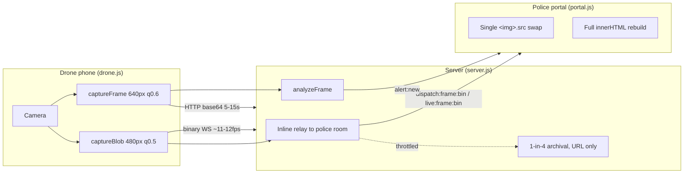
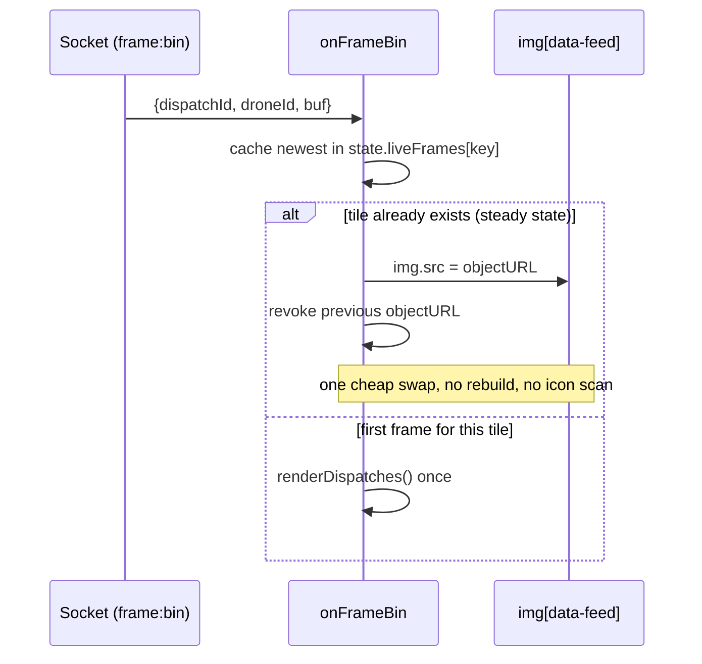
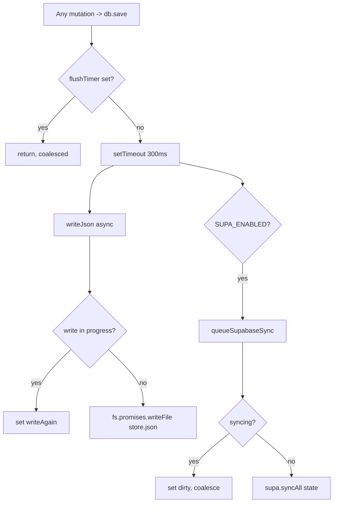

# Performance Analysis

Smart City Drone Security System — a Node.js/Express 5 + Socket.IO backend with an
in-memory state layer (mirrored to Supabase Postgres or local JSON) and a static,
build-free vanilla-JS frontend.

This document analyses where time and memory are actually spent, grounded in the
source. Every claim cites `file:line`. Latency budgets are quoted only where the code
sets them explicitly (timeouts, debounce intervals, capture cadences); real end-to-end
numbers depend on network and provider and are marked where not determinable.

---

## 1. System hot paths at a glance

The system has three high-frequency data flows and one low-frequency one. Performance
work concentrates on the three hot ones.

| Flow | Frequency | Transport | Payload | Where it lives |
|---|---|---|---|---|
| Live/dispatch camera frames | ~11–12 fps (`drone.js:324`, `drone.js:362`) | Binary WebSocket | ~10–18 KB JPEG (`drone.js:219`) | `drone:dispframe`/`drone:liveframe` → `dispatch:frame:bin`/`live:frame:bin` |
| Drone GPS + battery telemetry | ≤ every 2.5 s, 5 s heartbeat (`drone.js:398`, `drone.js:73`) | WebSocket | Small JSON | `drone:location` → `drone:status` |
| Frame analysis (AI) | every 5/8/15 s (`drone.html` interval; `drone.js:292`) | HTTP POST, base64 | 640px q0.6 JPEG (`drone.js:214`) | `POST /api/analyze` |
| Officer actions (escalate/dispatch/resolve) | human-paced | HTTP POST | Small JSON | Various `/api/*` |

The design principle visible throughout is: **keep durable storage and heavyweight
re-renders off the per-frame critical path**, and pay their cost on a throttle or a
debounce instead.

---

## 2. Rendering performance (frontend)

The portal renders with `innerHTML` string templates — there is no virtual DOM and no
diffing framework. Raw list renders replace an entire container's markup
(`renderAlerts` `portal.js:376-377`, `renderDispatches` `portal.js:677`, `renderMF`
`portal.js:709-718`, `renderDroneList` `portal.js:913`, `renderFleetPanel`
`portal.js:874-877`). Because these are full teardown-and-rebuild operations, the code
invests heavily in **not calling them on the hot path**.

### 2.1 The single-`` frame swap (the key optimization)

Live camera frames arrive up to ~11–12 times per second. Rebuilding the dispatch list
on each would be catastrophic. Instead, in steady state a frame updates exactly one
image element:

- `onFrame` (base64 fallback) caches the newest frame in `state.liveFrames[key]` and,
  if the tile already exists, does `img.src = p.image` and returns — no list rebuild,
  no icon scan (`portal.js:109-120`, comment at `portal.js:107-108`).
- `onFrameBin` (binary fast path) wraps the bytes in a `Blob`, creates an object URL,
  swaps `img.src`, and **revokes the previous object URL** so a long dispatch does not
  leak blob memory (`portal.js:123-141`, revoke at `:134`/`:137`).

A full `renderDispatches()` runs only for the *first* frame of a tile, to replace the
"surrounding…" placeholder card (`portal.js:117-119`, `:138-140`).

The same one-element pattern drives the on-demand live modal: `onLiveFrame` /
`onLiveFrameBin` swap `#liveImg` and revoke the prior blob URL each frame
(`portal.js:983-1004`).

### 2.2 Coalesced re-renders for telemetry

GPS pings would otherwise trigger a re-render per drone per second. Two mechanisms
prevent that:

1. **Payload merge, no refetch.** `drone:status` calls `upsertDrone(drone)` which merges
   the single drone from the event into `state.drones` — it does **not** refetch the
   whole fleet (`portal.js:62`, `:86-90`). The comment at `portal.js:60-61` notes the
   old behaviour scaled "with drones²".
2. **150 ms debounce.** `scheduleDroneRender()` collapses a burst of position pings into
   one paint via a 150 ms timer, and rebuilds the dispatch list *only if a dispatch is
   active* — idle/resolved cards use static distances and are skipped
   (`portal.js:91-102`).

### 2.3 Render gating for the Leaflet map

`renderMap()` short-circuits when the map panel is hidden: it returns before
`invalidateSize` / marker teardown when `#panel-map` is not active
(`portal.js:812-819`), and Leaflet itself is only *initialised* the first time the Map
tab is opened, when the container has a real size (`portal.js:813-816`). Opening the tab
re-renders and frames the fleet (`setupTabs` `portal.js:325`).

### 2.4 State preserved across destructive rebuilds

Because `renderDispatches()` replaces the whole list — and live footage can trigger it —
it snapshots and restores any in-progress "convey" input: value, focus, and cursor
selection range (`portal.js:664-692`). This trades a small amount of work per rebuild for
not dropping the officer's keystrokes.

### 2.5 The document-wide icon scan (cost hotspot)

`refreshIcons()` calls `lucide.createIcons()` with **no root argument**
(`common.js:37-39`), so every invocation re-scans the entire document for
`[data-lucide]` placeholders. The portal calls it at the end of nearly every render —
`renderAlerts` (`:389`), `renderDispatches` (`:703`), `renderMF` (`:721`), `renderMap`
(`:847`), `renderFleetPanel` (`:878`), `renderDroneList` (`:915`), and per `toast`
(`:1068`). At current data caps this is inexpensive, but it grows with total on-page
icon count rather than with what changed. The single-`` swap path deliberately
avoids it (§2.1).

### 2.6 The 30-second "x ago" refresh

A `setInterval` re-runs `renderAlerts(); renderDispatches(); renderMF()` every 30 s
purely to refresh relative timestamps (`portal.js:55`). This performs three full
`innerHTML` rebuilds (plus a document-wide icon scan each) even when nothing changed.

---

## 3. Database / persistence performance

### 3.1 In-memory reads, mirrored writes

All application state is held in memory so reads are synchronous array access — no query
round-trip (`db.js:1-6`, `db.js:25`). `db.find(collection, id)` is a linear
`Array.find` (`db.js:138-140`); with the fleet at 4 drones and the caps below this is
trivial. Read endpoints copy-then-sort per request: `[...db.alerts()].sort(...)`
(`server.js:304`), and the same for dispatches (`:308`) and main force (`:312`). O(n log
n) over small, capped arrays.

Bounded memory is enforced by hard caps that evict oldest records:
`MAX_ALERTS = 300` (`server.js:37`, eviction `:388-393` — never dropping a pending
alert), `MAX_MAINFORCE = 500` (`:36`, `:439-440`), `MAX_FRAMES_PER_DISPATCH = 16`
(`:34`, `:598-602`), `MAX_UPDATES_PER_DISPATCH = 50` (`:35`, `:620-621`).

### 3.2 Debounced, serialized, coalesced writes

Every mutation calls `db.save()` → `persist()`, which is **debounced 300 ms** so a burst
of updates produces one disk/network write (`db.js:85-92`). The JSON write is itself
serialized: an overlapping write sets `writeAgain` and re-runs afterward, so two writes
never interleave and corrupt the file (`db.js:63-82`). It is fully async
(`fs.promises.writeFile`) so a large state never blocks the event loop (`db.js:72`).

Supabase sync is likewise coalesced: if a sync is already in flight, `dirty` is set and
one more runs after it completes — never more than one concurrent sync
(`db.js:41-59`). The sync is a **diff sync**: `lastSynced` holds a serialized row key per
id so only changed rows are upserted and only removed ids are deleted (per the supa
adapter), avoiding a full table rewrite each time.

### 3.3 Write-size observation

Both the debounced write and the shutdown `flushSync` serialize the *entire* state with
2-space pretty-printing: `JSON.stringify(state, null, 2)` (`db.js:72`, `db.js:101`). As
alerts/main-force approach their caps (300/500), each save rewrites the whole document,
and pretty-printing inflates the byte count. Frames are stored URL-only (never base64,
`server.js:588`), which keeps the document from ballooning — but dropping the indent
argument would shrink every write.

### 3.4 Bounded shutdown flush

On `SIGINT`/`SIGTERM`, `flushSync()` writes local JSON immediately, then (if Supabase is
on) races a final `supa.syncAll` against a 4 s timeout so shutdown can never hang
(`db.js:108-125`). `flushSync` is also bound to `process.on('exit')` (`db.js:127`).

### 3.5 Server-side aggregation

`stats()` recomputes six aggregates with independent array passes over alerts, drones,
and dispatches on every call (`server.js:257-269`) and is broadcast to the police room
via `pushStats()` after almost every mutation (`server.js:271`, e.g. `:405`, `:456`,
`:484`). Cheap at current caps, but it is O(n) × several per emit rather than an
incrementally maintained counter.

---

## 4. API / AI performance

### 4.1 Provider selection and vision latency

The provider is chosen once at startup (`ai.js:17-25`): Groq if `GROQ_API_KEY`, else
Claude if `ANTHROPIC_API_KEY`, else fully-offline `mock`. Latency characteristics differ
sharply:

| Provider | Timeout / abort | Cost profile |
|---|---|---|
| Groq | `AbortController` + 15 s timeout, cleared in `finally` (`ai.js:168-183`) | Network round-trip; bounded |
| Claude | **No timeout / no AbortController** (`ai.js:123-141`) | Network round-trip; unbounded on the server side |
| Mock | none (synchronous, in-process) | ~0; random template pick (`ai.js:382-400`) |

The Groq path explicitly bounds a hung request so "a single slow API call can't stall
the drone's scan loop (and pile up requests)" (comment `ai.js:166-167`). The Claude path
has no equivalent guard — a hung Claude request will hold the `/api/analyze` response
open with no server-side ceiling. The real per-call vision latency is **not determinable
from the code** (provider- and network-dependent); only the 15 s Groq ceiling is
codified.

On any real-provider error the frame is treated as "All clear" rather than retried or
faked, so a failure costs one wasted call, not a cascade (`ai.js:402-422`).

### 4.2 The analyze pipeline and its re-validation cost

`POST /api/analyze` (`server.js:319-408`) awaits `analyzeFrame` and, only when raising a
new alert, awaits `saveImage` (`server.js:333`, `:353`). It guards against wasted and
duplicate work:

- A pending alert already exists for the drone → reuse it, skip image save entirely
  (`server.js:349-351`).
- **After** the awaits it re-checks state, because the drone may have been dispatched or
  another concurrent scan may have raised an alert during the await window
  (`server.js:354-363`). This avoids storing an image and emitting a stale/duplicate
  alert.

The client cooperates: `scan()` bails immediately if `st.busy`, in dispatch, awaiting
review, or a live view is running, and sets `st.busy` for the duration
(`drone.js:237`, `:247`), so analyses never overlap on one drone. On the Auto scenario
it also skips near-black frames using a cheap sampled-brightness readback, so a covered
camera never triggers an upload or a false alert (`drone.js:206-214`, `:242-246`). That
`getImageData` readback is taken **only** on the analysis path — the streaming loops skip
it (comment `drone.js:194-195`).

### 4.3 Frame relay vs. archival (keeping storage off the critical path)

Dispatch and live frames are relayed **inline** to the police room first, then the HTTP
handler responds; durable archival happens afterward, fire-and-forget, and only for
1-in-`FRAME_SAVE_EVERY` (every 4th) frame, storing the **URL only**
(`server.js:567-568`, `:584-605`; binary path `:1048-1074`). The comment at
`server.js:581-583` records the motivation: previously every frame was uploaded to
Supabase Storage *and* re-downloaded by every portal, "stacking ~2 network round-trips
per frame" and causing "laggy footage." Binary socket acks fire *immediately* to release
the drone's backpressure before any relay work (`server.js:1039`, `:1049`).

### 4.4 Base64 vs. binary transport

Camera streaming uses binary WebSocket frames (`captureBlob` → `ArrayBuffer`,
`drone.js:220-231`), avoiding the ~33% base64 inflation and JSON parsing of the legacy
HTTP path (which is retained only as a fallback: `dispatch:frame`/`live:frame`,
`server.js:570`, `:701`). The **analysis** frame still travels as base64 in a JSON body
(`drone.js:250-259`, `express.json({ limit: '15mb' })` `server.js:59`), which is
acceptable because it is low-frequency (5–15 s) and must reach the AI provider as base64
anyway (`ai.js:132`, `:161`).

---

## 5. Caching

| Layer | Mechanism | Evidence |
|---|---|---|
| HTTP response compression | `compression()` gzips text/JSON responses; mounted before routes/static | `server.js:58` |
| Uploaded images | `express.static(UPLOAD_DIR, { maxAge: '7d', immutable: true })` — long-lived, revalidation-free | `server.js:70` |
| Client frame cache | `state.liveFrames[key]` holds the newest frame so a full re-render keeps the tile populated | `portal.js:112-113`, `:126-129` |
| Supabase diff cache | `lastSynced` row-key map avoids re-upserting unchanged rows | `db.js` sync + supa adapter |
| Lazy face-detector cache | `_picoClassify` memoizes the unpacked cascade after first use | `portal.js:209-226` |

Two gaps are visible:

- **Static app assets (`/css`, `/js`) set no `maxAge`.** `express.static(public, { index:
  false })` (`server.js:69`) omits caching options, so CSS/JS rely on default ETag /
  Last-Modified revalidation (a conditional `304` round-trip per load) rather than a
  fresh-for-N-days cache like `/uploads` gets. For versioned, rarely-changing assets a
  `maxAge` would remove those revalidation requests.
- **API JSON is not cached** (correctly — it is live state), so every `refreshDrones` /
  `refreshAlerts` / `refreshDispatches` / `refreshMF` is a fresh fetch (`portal.js:82`,
  `:103-105`). Gzip (`compression()`) is the only relief here.

`compression`'s default filter skips already-compressed binary types, so JPEG responses
from `/uploads` are not wastefully re-gzipped; the win is on JSON and HTML/CSS/JS.

---

## 6. Bundle size (no bundler) and third-party scripts

There is **no build step and no bundler** — the frontend is static files served directly
and loaded as native ES modules (`<script type="module" src="/js/portal.js">`
`index.html:224`; `portal.js` imports `common.js` and `ascii-ripple.js`
`portal.js:1-2`). Consequences:

- **Own JS/CSS is unminified.** `style.css` is a single hand-written file; `portal.js`,
  `drone.js`, `common.js`, `ascii-ripple.js` ship as-authored. No tree-shaking or dead-code
  elimination runs, but there is also no framework runtime to ship.
- **Third-party libraries load from a public CDN (unpkg).** Leaflet CSS in the head
  (`index.html:8`), and Leaflet JS + Lucide UMD before the app module
  (`index.html:221-222`). These are external-network, render-affecting dependencies:
  Leaflet CSS in `<head>` is render-blocking, and both `<script>`s are parser-blocking
  (no `defer`). Self-hosting them (as `socket.io.js` already is, served locally at
  `/socket.io/socket.io.js` `index.html:220`), or adding `defer` / a `preconnect`, would
  remove the CDN as a latency and availability dependency.
- **Lucide is loaded on both pages** including the drone unit, which uses far fewer
  icons (`drone.html` scripts). The icon runtime is small, but it is a full parse on a
  device whose job is camera capture.
- **Module granularity is already reasonable.** Shared helpers live in `common.js` and
  are imported by both apps, so there is no duplicated helper payload across the two
  pages.

Exact minified/gzipped byte sizes are **not determinable from the code** (no bundler
output, no size budget declared).

---

## 7. Lazy loading

The codebase applies lazy loading deliberately where the cost is high and the feature is
optional:

- **Face detector loaded on demand.** `pico.js` and its `facefinder` cascade are fetched
  only the first time an officer edits their avatar, then memoized (`ensurePico`
  `portal.js:209-226`). This keeps a nontrivial classifier and its binary cascade off the
  initial page load entirely; face detection runs at ≤640px for speed (`portal.js:230`).
- **Leaflet initialised on first Map-tab open**, not at boot, so a session that never
  opens the map never pays map init or marker rendering (`portal.js:813-816`).
- **Image thumbnails use native lazy loading.** Collapsed alert cards render
  `` (`portal.js:346`), deferring off-screen thumbnail fetches.
- **AI badge / config gate optional UI.** The drone scenario override is hidden entirely
  when a real provider is configured (`drone.js:52`), avoiding building an options list
  that is irrelevant in live mode.

---

## 8. Code splitting

**Not applicable.** With no bundler there is no build-time chunking. The two apps are
already separate entry points (`/js/portal.js` vs `/js/drone.js`) served on separate
pages, so a visitor to `/drone` never downloads the portal controller and vice-versa —
achieving the practical goal of code splitting (per-page code isolation) without a
splitter. Native ES-module imports provide on-demand module resolution, and `ensurePico`
(`portal.js:209-226`) is effectively a hand-rolled dynamic import for the one heavy
optional dependency.

---

## 9. Streaming pipeline tuning

The camera loops are explicitly tuned to decouple frame rate from round-trip latency:

- Dispatch stream: `INTERVAL = 90` ms (~11 fps), `CAP = 3` frames in flight before
  skipping (`drone.js:321-340`). Each frame emits with a 1.5 s `socket.timeout` ack that
  decrements `inFlight`, so the counter can never get stuck if a frame is dropped
  (`drone.js:333-334`).
- Live view: `INTERVAL = 80` ms (~12 fps), same `CAP = 3` and timeout-ack design
  (`drone.js:362-380`). The comment at `drone.js:363-364` records that strict
  one-at-a-time capture "capped us at one frame per RTT = choppy," motivating the
  in-flight window.
- Frames are captured small and lossy for the wire (480px, quality 0.5, ~10–18 KB) —
  "a live feed wants low latency, not detail" (`drone.js:217-231`).

On the server side, a `10 s` safety sweep reconciles the `connected` flag against real
socket-room membership and is `.unref()`-ed so it never keeps the process alive
(`server.js:1107-1123`); Socket.IO ping is tightened to `pingInterval 10000` /
`pingTimeout 12000` to detect vanished phones faster than the ~45 s default
(`server.js:45-51`).

---

## 10. Concrete optimization opportunities

Ranked roughly by impact-to-effort, all grounded in the code above.

1. **Add a timeout/AbortController to the Claude path.** `analyzeClaude`
   (`ai.js:123-141`) has no request ceiling, unlike Groq's 15 s abort (`ai.js:168-183`).
   A hung Claude call holds `/api/analyze` open indefinitely. Mirror the Groq guard.
2. **Scope the icon scan to the re-rendered container.** `refreshIcons()` re-scans the
   whole document on every render (`common.js:37-39`, called from `portal.js:389`, `:703`,
   `:721`, `:847`, `:878`, `:915`). Passing the just-rebuilt container as the scan root
   would make it O(changed) instead of O(page).
3. **Update timestamps in place on the 30 s tick.** The interval rebuilds three full
   lists purely for "x ago" text (`portal.js:55`). Rewriting only the timestamp text
   nodes avoids three `innerHTML` rebuilds + three document-wide icon scans every 30 s.
4. **Reuse Leaflet markers instead of clear-and-rebuild.** `renderMap` calls
   `mapMarkers.clearLayers()` then re-creates every marker each render
   (`portal.js:821-846`). Keeping marker references and calling `setLatLng` /
   `setIcon` would cut allocation and DOM churn on the map tab, especially as the fleet
   grows.
5. **Drop pretty-printing on the JSON store write.** `JSON.stringify(state, null, 2)`
   (`db.js:72`, `db.js:101`) inflates every debounced save. `JSON.stringify(state)` cuts
   bytes with no functional change (the file is machine-read on load, `db.js:31`).
6. **Cache app static assets with `maxAge`.** `express.static(public)` sets no cache
   policy (`server.js:69`); versioned CSS/JS would benefit from the same long
   `maxAge`/`immutable` treatment `/uploads` already has (`server.js:70`), removing a
   revalidation round-trip per asset per load.
7. **Self-host or `defer` the CDN libraries.** Leaflet CSS/JS and Lucide load from unpkg
   and block rendering/parsing (`index.html:8`, `:221-222`). Serving them locally (as
   `socket.io.js` already is) or adding `defer`/`preconnect` removes an external latency
   and availability dependency.
8. **Consider incremental `stats()` counters.** `stats()` re-scans arrays on every emit
   (`server.js:257-269`, emitted after most mutations). Maintaining counters
   incrementally would make each `pushStats` O(1). Low priority at current caps.

None of these are correctness fixes; they are efficiency refinements over an architecture
that already keeps storage and heavy renders off the per-frame critical path.

---

## Appendix: performance-relevant constants

| Constant | Value | Location |
|---|---|---|
| Persist debounce | 300 ms | `db.js:91` |
| Shutdown Supabase flush cap | 4000 ms | `db.js:118` |
| Drone-render coalesce | 150 ms | `portal.js:101` |
| "x ago" refresh interval | 30 000 ms | `portal.js:55` |
| GPS send throttle / heartbeat | 2500 ms / 5000 ms | `drone.js:398`, `:73` |
| Dispatch stream cadence / in-flight cap | 90 ms (~11 fps) / 3 | `drone.js:324`, `:325` |
| Live view cadence / in-flight cap | 80 ms (~12 fps) / 3 | `drone.js:362`, `:363` |
| Frame ack timeout | 1500 ms | `drone.js:333`, `:374` |
| Groq request timeout | 15 000 ms | `ai.js:169` |
| Claude request timeout | none | `ai.js:123-141` |
| Analysis frame size / quality | 640px / 0.6 | `drone.js:199`, `:214` |
| Stream frame size / quality | 480px / 0.5 | `drone.js:220` |
| Frame archival throttle | every 4th (URL only) | `server.js:568`, `:591` |
| Socket ping interval / timeout | 10 000 / 12 000 ms | `server.js:49-50` |
| Connectivity safety sweep | 10 000 ms, `.unref()` | `server.js:1123` |
| Uploads cache | `maxAge 7d, immutable` | `server.js:70` |
| Record caps | alerts 300 · mainforce 500 · frames/dispatch 16 · updates/dispatch 50 | `server.js:34-37` |
