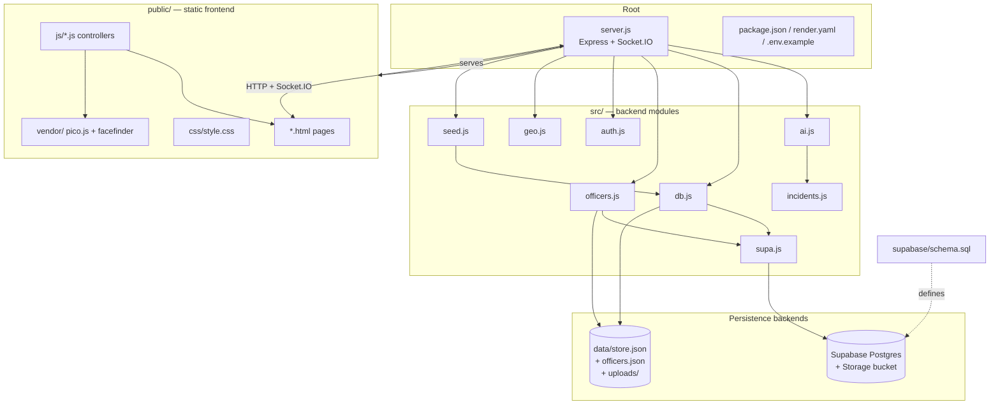
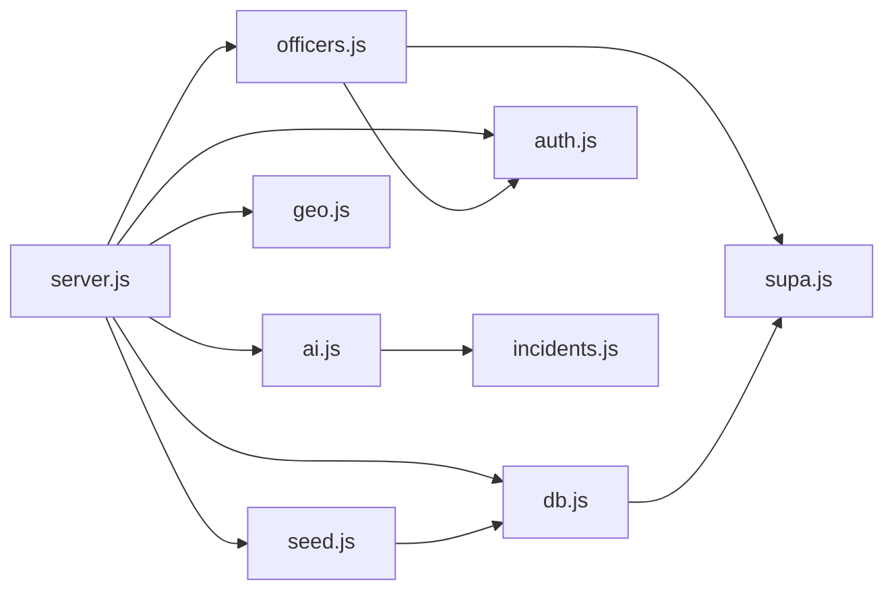
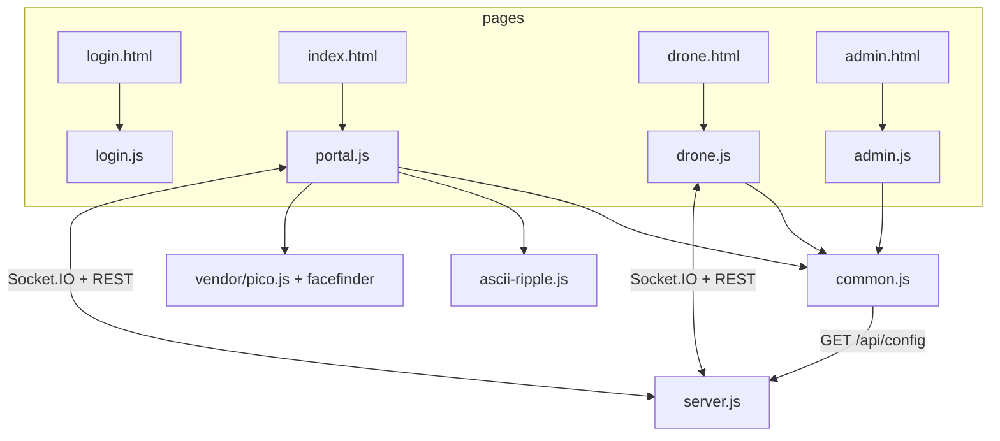
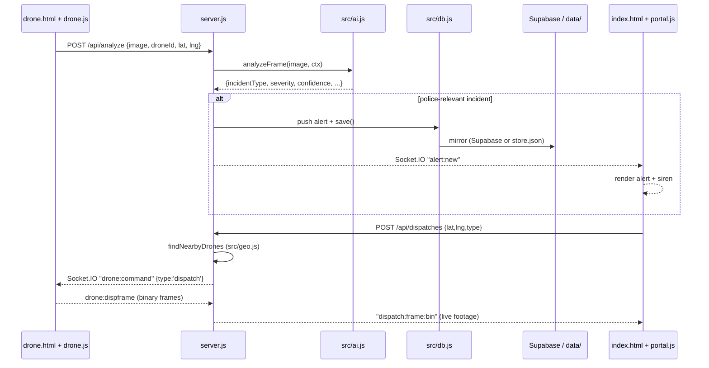

# Project Structure

Smart City Drone Security System — GEC Kozhikode S7 Main Project (Group 17).

This document explains every folder and every important file in the repository:
its purpose, responsibilities, key exports, dependencies, and how it interacts
with the rest of the system. All statements are grounded in the actual source;
file/line citations are given as `file:line`.

The application is a **persistent Node.js + Express 5 + Socket.IO server** with a
**static HTML/vanilla-JS frontend and no build step** (`package.json:10-13` has
only `start`/`dev` scripts; the frontend is served directly from `public/`). Data
lives **in memory** and is mirrored to either **Supabase Postgres** or a **local
JSON file**, and vision AI is provided by **Groq**, **Claude**, or a fully offline
**mock** simulation.

---

## 1. Top-level directory tree

```
SmartDrone/
├── server.js               # Single entry point: Express app + Socket.IO + HTTPS listener
├── package.json            # Manifest, ESM, deps, npm scripts (no build step)
├── package-lock.json       # Locked dependency graph
├── render.yaml             # Render.com Blueprint (one-click deploy)
├── .env.example            # Documented environment variables (template)
├── .gitignore              # Ignores node_modules/, data/, .env, certs/, logs
├── README.md               # Human-facing project overview + demo script
│
├── src/                    # Backend logic modules (ESM), imported by server.js
│   ├── ai.js               # Frame → incident classification (Groq / Claude / mock)
│   ├── incidents.js        # The 18-type incident catalogue (single source of truth)
│   ├── db.js               # In-memory state + JSON/Supabase persistence
│   ├── supa.js             # Supabase Postgres + Storage adapter
│   ├── officers.js         # Officer-account store (Supabase or JSON)
│   ├── auth.js             # bcrypt hashing + signed-cookie session primitives
│   ├── geo.js              # Haversine distance + nearest-drone selection
│   └── seed.js             # Fleet + landmark + city-centre seed data
│
├── public/                 # Static frontend — served as-is, NO build/bundle
│   ├── index.html          # Police Control Center page (login-gated)
│   ├── drone.html          # Drone Camera Unit page (open, runs on the phone)
│   ├── admin.html          # Officer-management console (admin-gated)
│   ├── login.html          # Sign-in page
│   ├── css/
│   │   └── style.css       # Single hand-written CSS design-token/theme system
│   ├── js/
│   │   ├── common.js       # Shared helpers: api(), CONFIG, themes, icons, esc()
│   │   ├── portal.js       # Police portal controller (module)
│   │   ├── drone.js        # Drone camera controller (module)
│   │   ├── admin.js        # Officer CRUD controller (module)
│   │   ├── login.js        # Login form controller
│   │   └── ascii-ripple.js # Dependency-free glitch-ripple text effect
│   └── vendor/
│       ├── pico.js         # Third-party pico.js face detector (MIT)
│       └── facefinder      # Binary face-detection cascade data
│
├── supabase/
│   └── schema.sql          # Idempotent Postgres schema (run once in SQL Editor)
│
├── certs/                  # (gitignored, auto-generated) self-signed TLS cert
│   ├── cert.pem
│   └── key.pem
│
├── data/                   # (gitignored, runtime-generated) local persistence
│   ├── store.json          # Local mirror of app state
│   ├── officers.json       # Local officer accounts (when not using Supabase)
│   └── uploads/            # Locally stored captured frames
│
└── docs/
    └── PROJECT_STRUCTURE.md # This document
```

> `data/`, `certs/`, `node_modules/`, and `.env` are all git-ignored
> (`.gitignore:1-8`). `data/` and `certs/` are created/regenerated at runtime, so
> a fresh clone contains no persisted state or private keys.

---

## 2. How the folders relate



**Data direction:** the **phone/drone** page (`public/drone.html` + `drone.js`)
captures frames and streams them to `server.js`; `server.js` calls `src/ai.js` to
classify each frame, mutates state through `src/db.js`, and pushes real-time
events over Socket.IO to the **police portal** (`public/index.html` +
`portal.js`). Every state change is mirrored to Supabase (`src/supa.js`) or the
local JSON store, and every captured image goes to the Supabase Storage bucket or
`data/uploads/`.

---

## 3. Root-level files

### `server.js` — the single entry point (~1219 lines)

**Why it exists:** it is the whole HTTP + realtime backend. `package.json:6`
declares it as `"main"`, and `npm start` runs `node server.js`
(`package.json:11`).

**Main responsibilities:**

- **App + servers.** Creates the Express app (`server.js:43`), an
  `http.createServer(app)` that always exists (`server.js:44`), and a Socket.IO
  server bound to it with `maxHttpBufferSize: 12e6`, `pingInterval: 10000`,
  `pingTimeout: 12000` (`server.js:45-51`).
- **Process resilience.** Installs `uncaughtException` / `unhandledRejection`
  handlers that log and keep the process alive (`server.js:55-56`).
- **Middleware chain (order is load-bearing).** `compression()` →
  `express.json({ limit: '15mb' })` → page routes → static → auth API → the
  `/api/*` access guard → protected routes (`server.js:58-127`).
- **Page routing before static.** `/login`, `/`, `/index.html`, `/admin`,
  `/admin.html`, `/drone` are declared **before** `express.static` so login-gating
  cannot be bypassed; static is mounted with `{ index: false }`
  (`server.js:61-70`).
- **REST API.** Auth, officers (admin CRUD), config, drones, alerts, dispatches,
  main-force log, stats, `/api/analyze`, dispatch/live-frame relays, and the
  SSRF-guarded `/api/resolve-location` map-link resolver (`server.js:73-878`).
- **Socket.IO realtime.** Rooms `police`, `drones`, `drone:<id>`; handles
  `police:join/watch/unwatch`, `drone:hello/location/liveframe/dispframe`, and
  disconnect; emits `alert:new`, `dispatch:*`, `live:frame(:bin)`,
  `drone:status/command`, `stats`, `refresh`, `fleet:changed`
  (`server.js:933-1123`).
- **Local HTTPS.** `startHttps()` (`server.js:1164-1184`) starts a self-signed
  HTTPS listener on `HTTPS_PORT` (default `PORT + 443` = 3443) so a phone camera
  can be used over Wi-Fi (browsers require HTTPS for `getUserMedia`). It is
  **skipped** when `NODE_ENV=production` or `RENDER` or `RAILWAY_ENVIRONMENT` is
  set (managed hosts terminate TLS at the edge, `server.js:1167-1169`), and it
  reads or regenerates `certs/key.pem` + `certs/cert.pem` via `openssl`
  (`server.js:1139-1161`).
- **Startup sequence.** `start()` (`server.js:1186-1218`): `db.init()` →
  `seedFleet()` → `seedDefaultAdmin()` → `server.listen` → `startHttps()` → print
  a LAN banner.

**Interaction with other folders:** imports every `src/` module (`ai`, `db`,
`supa`, `officers`, `auth`, `geo`, `seed`, plus `incidents` via `ai`); serves
everything under `public/`; persists through `data/` or Supabase.

### `package.json`

**Why it exists:** the npm manifest. Name `smart-drone-security` v1.0.0,
`"type": "module"` (ESM), `"main": "server.js"`, MIT license, Node engine
`>=20` (`package.json:2-8,21-22`).

- **Scripts** (`package.json:10-13`): `start` → `node server.js`; `dev` →
  `node --watch server.js`. **There is no `build` script — the frontend is static
  and requires no bundling.**
- **Runtime dependencies** (`package.json:23-32`): `@anthropic-ai/sdk` (Claude
  vision), `@supabase/supabase-js` (cloud persistence + Storage), `bcryptjs`
  (password hashing), `compression` (gzip), `dotenv` (`.env` loading), `express`
  (**Express 5**), `pg` (Postgres driver), `socket.io` (realtime).

### `package-lock.json`

Locks the exact resolved dependency tree for reproducible installs. Not edited by
hand.

### `render.yaml`

Render.com **Blueprint** for one-click deploy. Declares a single web service
`dronesecurity`, `runtime: node`, `plan: free`, build `npm install`, start
`npm start`, health check `/api/stats`, and env vars `NODE_ENV=production`,
`GROQ_MODEL` (literal) plus secret placeholders `GROQ_API_KEY`, `SUPABASE_URL`,
`SUPABASE_SECRET_KEY` marked `sync: false`. It exists because Vercel/Netlify are
serverless and cannot host a long-lived Socket.IO server.

### `.env.example`

Documented template for environment variables (copy to `.env`, which is
git-ignored). Covers `GROQ_API_KEY`, `GROQ_MODEL`, `ANTHROPIC_API_KEY`,
`AI_MODEL`, `AI_PROVIDER`, `PORT`, `HTTPS_PORT`, `CLEAR_SECRET`, `SUPABASE_URL`,
`SUPABASE_SECRET_KEY`. Note: `AUTH_SECRET` (`auth.js:7`) and `ADMIN_PASSWORD`
(`officers.js:67`) are read by the code but are **not** listed in
`.env.example` — they fall back to insecure defaults with a startup warning.

### `.gitignore`

Ignores `node_modules/`, `data/`, `.env`, `*.log`, `.DS_Store`, `certs/`, and
scratch `_*.mjs` files (`.gitignore:1-11`). The comment on `certs/` notes it holds
a private key and is regenerated on first run.

### `README.md`

Human-facing overview: the two-directional concept (drone→police detection,
police→drone dispatch), quick-start, AI-provider setup, Supabase setup, Render
deploy notes, and a demo script. It is documentation only, not executed.

---

## 4. `src/` — backend logic modules

**Purpose:** all server-side business logic, split into small single-responsibility
ESM modules that `server.js` composes. Nothing here binds to HTTP directly (except
that `db.js` registers process-signal shutdown handlers); the modules export
functions and data that `server.js` wires into routes and socket handlers.

### `src/ai.js` — vision analysis (~425 lines)

**Why it exists:** converts a captured camera frame into a structured incident
classification, abstracting three providers behind one function.

- **Provider auto-selection.** `decideProvider()` (`ai.js:17-24`) picks `groq`,
  `claude`, or `mock`. `AI_PROVIDER` forces a choice (falling back to `mock` if
  the matching key is absent); otherwise `GROQ_API_KEY` → groq, else
  `ANTHROPIC_API_KEY` → claude, else mock. **Groq wins over Claude when both keys
  exist.** `AI_LABEL` is `'Groq Vision'` / `'Claude Vision'` / `'Standby'`
  (`ai.js:32-33`).
- **Models.** `CLAUDE_MODEL = process.env.AI_MODEL || 'claude-opus-4-8'`
  (`ai.js:27`); `GROQ_MODEL = process.env.GROQ_MODEL ||
  'meta-llama/llama-4-scout-17b-16e-instruct'` (`ai.js:30`).
- **Key export `analyzeFrame(imageBase64, context)`** (`ai.js:402-424`): routes to
  `analyzeGroq` (`ai.js:144-191`), `analyzeClaude` (`ai.js:123-141`), or
  `analyzeMock` (`ai.js:382-400`). On any real-provider error it logs and returns
  a deterministic **"All clear"** normal result rather than inventing an incident
  (`ai.js:406-422`). Groq has a 15 s `AbortController` timeout (`ai.js:168-183`).
- **Shared prompt/schema.** `SYSTEM_PROMPT` (`ai.js:52-62`) and `ANALYSIS_SCHEMA`
  (`ai.js:64-76`) are built from the incident catalogue.
- **`normalize()`** (`ai.js:78-100`) coerces any raw provider output into the
  canonical camelCase shape `{ incidentType, title, severity, confidence,
  interpretation, recommendedAction, source }`, clamping confidence to [0,1] and
  filling defaults from the catalogue. `parseLenient()` (`ai.js:103-116`) recovers
  JSON from noisy responses.
- **Mock mode.** `MOCK_TEMPLATES` (18 entries) and `AUTO_WEIGHTS` (9 of them)
  drive a weighted random simulation so the system demos with no API key
  (`ai.js:194-400`).

**Dependencies:** `@anthropic-ai/sdk` (constructed only in claude mode,
`ai.js:35-42`), `node:fetch` for Groq, and `src/incidents.js` for the catalogue.
Imported by `server.js` (`/api/analyze`, `/api/config`).

### `src/incidents.js` — incident catalogue (~107 lines)

**Why it exists:** the **single source of truth** for the 18 incident types
(README calls out "edit them in one place"). Used by the AI prompt/schema, the
alert normalizer, and the frontend menus.

- **`INCIDENT_TYPES`** (`incidents.js:7-98`): 18 keyed entries, each with `label`,
  `icon` (emoji), `lucide` (icon name), `color` (hex), `defaultSeverity`,
  `policeRelevant` (all `true` except `normal`), and `hint`.
- **Exports:** `INCIDENT_KEYS` (`incidents.js:100`), `SEVERITY_RANK`
  (`incidents.js:102`), and `meta(type)` which falls back to `normal`
  (`incidents.js:104-106`).

**Interaction:** consumed by `src/ai.js`; surfaced to the frontend via the
`/api/config` route (`server.js:295`) so both drone and portal render the same
labels/colors/icons.

### `src/db.js` — in-memory state + persistence (~178 lines)

**Why it exists:** keeps the app state synchronous and in-memory while durably
mirroring every change. The two-tier design (`db.js:1-6`): Supabase Postgres when
enabled, else `data/store.json`; **the JSON file is always written as an offline
backup regardless**.

- **State shape** `EMPTY = { drones, alerts, dispatches, mainForce }`
  (`db.js:23`); live `state` is a `structuredClone` (`db.js:25`).
- **Exports:** the const `UPLOAD_DIR` (`db.js:16`) and the `db` object
  (`db.js:129-178`) with accessors `drones()/alerts()/dispatches()/mainForce()`,
  `find(collection, id)`, `save()` (debounced 300 ms persist), `flush()`
  (synchronous write), `setDrones()`, `reset()`, and `async init()`.
- **Persistence internals:** `persist()` debounces writes then triggers a
  Supabase sync (`db.js:85-92`); `queueSupabaseSync()` coalesces overlapping syncs
  (`db.js:41-59`); `shutdown()` on SIGINT/SIGTERM flushes JSON then bounds the
  Supabase sync to 4 s before exit (`db.js:108-126`).
- **Load precedence** (`db.init`, `db.js:161-178`): if Supabase is enabled, load
  from it (falling back to JSON on error); otherwise load JSON.

**Dependencies:** `src/supa.js` (when enabled). Imported by `server.js` (all state
reads/writes) and `src/seed.js` (`db.setDrones`).

### `src/supa.js` — Supabase adapter (~178 lines)

**Why it exists:** encapsulates all Supabase Postgres and Storage access, so the
rest of the app never talks to Supabase directly.

- **Backend flag** `SUPA_ENABLED = !!(SUPABASE_URL && SUPABASE_SECRET_KEY)`
  (`supa.js:7-9`); the client is created only when enabled (`supa.js:12-13`).
- **State sync exports:** `loadAll()`, `syncAll(state)` (diff-based upsert +
  delete per collection), `ensureBucket()`, `uploadImage()`, `deleteImages()`,
  `clearImages()` (`supa.js:43-135`). `BUCKET = 'drone-images'` (`supa.js:10`).
- **Officer exports:** `officersList/officerByUsername/officerById/officerCreate/
  officerUpdate/officerRemove` (`supa.js:146-178`).
- **Naming conversion:** `toRow`/`fromRow` convert camelCase ↔ snake_case at the
  **top level only** (nested jsonb keeps camelCase) (`supa.js:15-20`); the
  `COLLECTIONS` map ties `mainForce → main_force` (`supa.js:23-28`).

**Dependencies:** `@supabase/supabase-js`. Imported by `src/db.js`,
`src/officers.js`, and `server.js` (image storage helpers).

### `src/officers.js` — officer-account store (~75 lines)

**Why it exists:** manages police login accounts independently of the main app
state, choosing its backend once at module load: `const SUPA = supa.SUPA_ENABLED`
(`officers.js:12`), Supabase or `data/officers.json`.

- **Exports:** `newId()`, `listOfficers()`, `findByUsername()`, `findById()`,
  `createOfficer()`, `updateOfficer()`, `removeOfficer()`, `publicOfficer()`
  (strips `passwordHash`), and `seedDefaultAdmin()` (`officers.js:14-75`).
- **`seedDefaultAdmin()`** (`officers.js:64-75`): if no admin exists, creates
  `username: 'admin'` with `ADMIN_PASSWORD || 'admin123'` (warns if unset).

**Dependencies:** `src/supa.js`, `src/auth.js` (`hashPassword`). Imported by
`server.js` (login and the officer CRUD routes) and used at startup.

### `src/auth.js` — authentication primitives (~86 lines)

**Why it exists:** provides password hashing and a **stateless, HMAC-signed
cookie session** (a two-part mini-JWT — there is **no server-side session store**
and no standard 3-part JWT, `auth.js:1-3,24-27`).

- **Secret:** `SECRET = process.env.AUTH_SECRET || 'dev-insecure-secret-change-me'`
  (warns if unset, `auth.js:7-9`).
- **Exports:** `hashPassword` / `verifyPassword` (bcrypt cost 10,
  `auth.js:17-22`); `signToken` / `verifyToken` (HMAC-SHA256 with
  `timingSafeEqual`, 7-day expiry, `auth.js:24-39`); cookie helpers `setSession`
  (httpOnly, sameSite lax, `secure` in prod/Render), `clearSession`,
  `sessionFromReq` (`auth.js:51-62`); and Express middleware `requireAuth`,
  `requireAdmin`, `requireAuthPage`, `requireAdminPage` (`auth.js:65-86`).

**Interaction:** the login **route** lives in `server.js` (`server.js:73-86`) and
calls these primitives; `officers.js` uses `hashPassword`. The middleware guards
routes and pages across `server.js`.

### `src/geo.js` — geo/distance helpers (~31 lines)

**Why it exists:** the math for dispatching the nearest drones.

- **`haversineKm(a, b)`** (`geo.js:5-15`): great-circle km between two `{lat,lng}`.
- **`findNearbyDrones(target, drones, opts)`** (`geo.js:22-31`): filters to
  **dispatchable** drones (connected, not already dispatched, has coordinates),
  annotates each with `distanceKm`, sorts ascending, and returns those within
  `radiusKm` (up to 4) or else the nearest few online drones.

**Interaction:** imported by `server.js` for the `/api/dispatches` route.

### `src/seed.js` — seed data & fleet reconciliation (~78 lines)

**Why it exists:** defines the demo fleet, landmarks, and city centre, and
reconciles the persisted fleet on every boot.

- **Exports:** `seedFleet()` (`seed.js:15-57`), `HOME_POSITIONS`, `LANDMARKS`
  (10 Kozhikode places dispatchable by name), and `CITY_CENTER = { lat: 11.2588,
  lng: 75.7804 }` (`seed.js:5,63-78`).
- **`seedFleet()`** keeps the 4 defined drones, resets transient fields
  (`connected=false`, downgrades stale `dispatched`/`alerting` to `monitoring`),
  adds missing ones, drops extras, closes any still-active dispatch, and persists
  via `db.setDrones()`.

**Interaction:** imported by `server.js` (called at startup, and `LANDMARKS`/
`CITY_CENTER` are exposed through `/api/config`).



---

## 5. `public/` — static frontend (no build step)

**Purpose:** everything the browser loads. Served by `express.static` with
`{ index: false }` (`server.js:69`); the HTML pages themselves are routed
explicitly before static so they can be login-gated. There is **no bundler,
transpiler, or framework** — plain HTML, ES-module `<script type="module">`, and
one CSS file. Icons come from the Lucide UMD build loaded from unpkg at runtime.

### 5.1 HTML pages

| File | Page | Access | Served at | Key elements |
|---|---|---|---|---|
| `index.html` | Police Control Center | login (`requireAuthPage`) | `/`, `/index.html` | Topbar, officer sidebar, stat tiles, tabs (alerts / dispatch / map / mainforce), review + clear-images + live-camera modals; loads Leaflet + Socket.IO + Lucide, then `js/portal.js` |
| `drone.html` | Drone Camera Unit | open | `/drone` | `<video>`/`<canvas>` camera frame, drone selector, scenario select, dispatch banner + tracker, GPS row; loads Socket.IO + Lucide, then `js/drone.js` (no Leaflet) |
| `admin.html` | Officer Management | admin (`requireAdminPage`) | `/admin`, `/admin.html` | Officer grid + add/edit modal form; loads `js/admin.js` |
| `login.html` | Sign in | open | `/login` | Username/password form; loads `js/login.js` |

All four pages share the same pre-paint inline theme bootstrap that reads
`localStorage['sd-theme']` into `documentElement.dataset.theme` before first paint
(e.g. `index.html:10`, `admin.html:9`, `login.html:9`), and all link
`/css/style.css`.

### 5.2 `public/js/` — page controllers

- **`common.js`** — shared helpers imported by every page module. Exports the
  mutable `CONFIG` object and `loadConfig()` (GET `/api/config`), `incidentMeta()`,
  the Lucide icon helpers (`icon`, `incidentIcon`, `refreshIcons`), the `api(path,
  opts)` fetch wrapper (JSON serialize/parse, throws `data.error`), `esc()` HTML
  escaper, `timeAgo`/`fmtTime`, the 6-entry `THEMES` list, `currentTheme`/
  `applyTheme`, and `initThemePicker()` (`common.js:11-127`).
- **`portal.js`** — the police-portal controller (~1119 lines). Opens `io()`,
  holds client `state` (`drones/alerts/dispatches/mf/pendingTarget/liveDroneId`),
  and renders alerts, dispatch form + list, the **Leaflet** fleet map, the
  main-force log, and live/dispatch camera feeds. Emits `police:join/watch/
  unwatch` and consumes `alert:new`, `dispatch:*`, `live:frame(:bin)`,
  `drone:status`, `stats`, `refresh` (`portal.js:4-79`). Also handles the
  new-alert siren, review modal, and admin-only reset/clear-images actions. It is
  the **only** page that lazily loads the `vendor/` face detector to auto-center
  uploaded profile photos (`portal.js:208-261`).
- **`drone.js`** — the drone camera controller (~469 lines). Generates a
  persistent per-device UUID, opens `io()`, picks a free drone id, captures frames
  from `<video>`/`<canvas>`, POSTs `/api/analyze`, and streams binary frames via
  `drone:dispframe` (dispatch, ~11 fps) and `drone:liveframe` (on-demand live,
  ~12 fps). Emits `drone:hello`/`drone:location` and reacts to `drone:command`
  (`dispatch`/`resume`/`livestream`/`livestream_stop`) and `drone:taken`
  (`drone.js:3-146`). Manages GPS `watchPosition`, a 5 s location heartbeat, the
  dispatch tracker (distance + compass bearing, arrival at ≤20 m), and battery.
- **`admin.js`** — officer-management controller. Guards the page client-side
  (redirects non-admins), then renders officer cards and drives create/edit/delete
  through `/api/officers` (`admin.js:11-118`).
- **`login.js`** — login-form controller: redirects to `/` if already
  authenticated, otherwise POSTs `/api/auth/login` and redirects on success
  (`login.js:1-29`).
- **`ascii-ripple.js`** — a self-contained, dependency-free "glitch ripple" text
  effect (`attachAsciiRipple(el, opts)`) used for flourish on the portal; honours
  `prefers-reduced-motion` and inserts an accessible static twin
  (`ascii-ripple.js:25-197`).

### 5.3 `public/css/style.css`

A single hand-written vanilla CSS file — no framework or preprocessor. The design
is a **CSS custom-property token system** on `:root`, with **6 themes**
(`midnight`/default, `graphite`, `obsidian`, `emerald`, `tricolor`, `aurora`)
swapped by overriding those variables under `html[data-theme="..."]`. It styles
all four pages plus the Leaflet map, and uses modern CSS (keyframe animations,
`@property` conic borders, `backdrop-filter`, grid/flex, `prefers-reduced-motion`,
responsive breakpoints).

### 5.4 `public/vendor/`

Third-party, checked-in assets loaded only by the portal's avatar face-centering:

- **`pico.js`** — the MIT-licensed **pico.js** face-detection library
  (`pico.js:1` header). Provides `pico.unpack_cascade`, `pico.run_cascade`,
  `pico.cluster_detections`.
- **`facefinder`** — the binary cascade data the detector unpacks. Fetched as an
  `ArrayBuffer` and passed to `unpack_cascade` (`portal.js:222-223`).

These load lazily and fail soft: if unavailable, the portal falls back to a plain
centre crop (`portal.js:255-261`).



---

## 6. `supabase/` — database schema

### `supabase/schema.sql`

**Why it exists:** the one-time SQL to run in the Supabase SQL Editor when cloud
mode is enabled. It is **idempotent** (`create table if not exists`, safe to
re-run, `schema.sql:1-4`).

- **Tables** (all in `public`, all with a `text` primary key): `drones`,
  `alerts`, `dispatches`, `main_force`, `officers` (`schema.sql:6-90`). Dispatch
  list columns (`assigned_drones`, `frames`, `updates`, `arrived`) are `jsonb`
  defaulting to `'[]'`.
- **No foreign keys** anywhere — `drone_id`, `source_id`, `active_dispatch_id`,
  etc. are plain `text` with no FK constraint (`schema.sql` comments).
- **Indexes** on `officers(lower(username))` and `timestamp desc` for alerts,
  dispatches, and main_force (`schema.sql:91-96`).
- **No RLS** — the server uses the trusted service_role key which bypasses RLS;
  the file ends with `notify pgrst, 'reload schema'` to refresh the PostgREST
  cache (`schema.sql:98-103`).

**Interaction:** the tables map to the app collections via `src/supa.js`'s
`COLLECTIONS` and column mappers. This folder is inert configuration — it is not
imported by any code.

---

## 7. Generated / runtime folders (git-ignored)

These are not committed; they appear at runtime and are ignored by `.gitignore`.

### `data/`

The local persistence tier (used whenever Supabase is not configured, and always
as an offline JSON backup):

- **`store.json`** — the mirror of in-memory app state `{ drones, alerts,
  dispatches, mainForce }`, written (debounced) by `src/db.js` (`STORE_FILE`,
  `db.js:15`).
- **`officers.json`** — local officer accounts, written by `src/officers.js` when
  `SUPA_ENABLED` is false (`officers.js:11`).
- **`uploads/`** — locally stored captured frames, served read-only at `/uploads`
  with a 7-day immutable cache (`UPLOAD_DIR`, `db.js:16`; `server.js:70`).

### `certs/`

Auto-generated self-signed TLS material (`key.pem`, `cert.pem`) for the local
HTTPS listener. `server.js` reads it, or regenerates it via `openssl` if missing
(`server.js:1139-1161`). Git-ignored because it contains a private key
(`.gitignore:7-8`).

### `node_modules/`

Installed dependencies from `npm install`. Git-ignored.

---

## 8. `docs/`

Project documentation. Contains this file, `PROJECT_STRUCTURE.md`. Documentation
only — not referenced by any code.

---

## 9. End-to-end request flow (how the folders cooperate at runtime)



This illustrates the core loop: the **drone page** feeds frames to **`server.js`**,
which uses **`src/ai.js`** (+ `src/incidents.js`) to classify, **`src/db.js`**
(+ `src/supa.js`) to persist, **`src/geo.js`** to choose drones for dispatch, and
Socket.IO to keep the **police portal** and the **drone** in realtime sync — with
`src/auth.js` + `src/officers.js` gating who may act.

---

## 10. Not determinable from the current codebase

- The exact contents of `data/store.json`, `data/officers.json`, and
  `data/uploads/` at any moment are runtime state, not source.
- `AUTH_SECRET` and `ADMIN_PASSWORD` are read by the code but are **not**
  documented in `.env.example` (only their in-code defaults and warnings exist).
