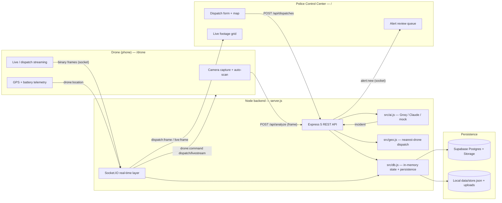
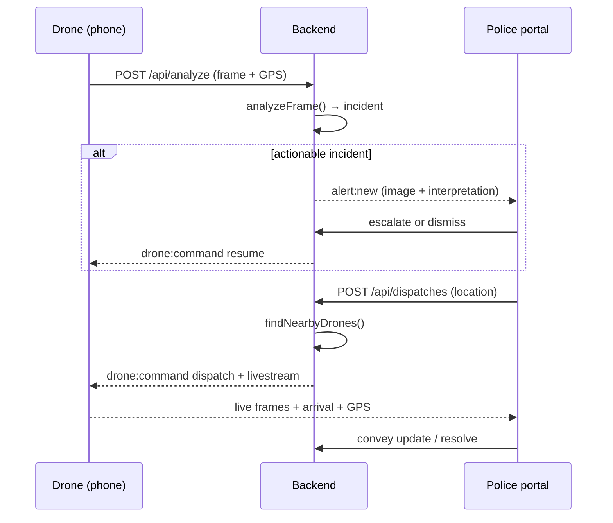

# Smart City Drone Security System — Executive Summary

**Project:** Smart City Drone Security System · S7 B.Tech Main Project · Group 17,
Government Engineering College, Kozhikode
**Package:** `smart-drone-security` v1.0.0 · MIT License (`package.json:2,21-22`)

---

## 1. What the project does

The system turns an ordinary smartphone camera, mounted on a drone, into an
AI-assisted surveillance and emergency-response node for a smart city. It
implements **two complementary workflows** (`README.md:20-33`):

1. **Drone → Police (autonomous detection).** The drone app continuously
   captures camera frames and sends them to the backend, which classifies each
   frame into one incident category using a vision AI. When something actionable
   is seen, an **alert** (timestamp, image, AI interpretation) is pushed in real
   time to the Police Control Center, where a *drone police officer* reviews it
   and either **escalates to the Main Force** or **dismisses** it as a false
   alarm.
2. **Police → Drone (dispatch & surround).** An officer marks an incident
   location on the portal; the backend selects the **nearest online drones**
   (`src/geo.js`) and commands them to move to the target and **stream live
   footage** back to the portal, where officers watch and relay field updates
   to the Main Force.

The incident catalogue defines **18 categories** — a `normal / all-clear` class
plus **17 actionable incident types** (building fire, forest fire, traffic
block, road accident, person-alone-at-night, unusual crowd, flood, suspicious
activity, weapon threat, violence/assault, theft/robbery, medical emergency,
abandoned object, stampede, building collapse, animal intrusion, electrical
hazard) — all defined in one place, `src/incidents.js:7-98`.

There are two web surfaces, both static and served by the same backend:

| Surface | URL | Users | Auth |
|---|---|---|---|
| Police Control Center | `/`, `/index.html` | Drone police + main force | Login required (`server.js:64`) |
| Admin console | `/admin` | Administrators | Admin login (`server.js:65`) |
| Drone Camera App | `/drone` | Phone mounted on the drone | Open — field device (`server.js:66`) |

---

## 2. Major technologies

| Layer | Technology | Evidence |
|---|---|---|
| Runtime | Node.js **≥20**, ESM (`"type":"module"`) | `package.json:5,7-8` |
| HTTP / REST | **Express 5.2.1** + `compression` (gzip) | `package.json:29`, `server.js:43,58` |
| Real-time | **Socket.IO 4.8.3** (12 MB buffer, 10 s ping) | `package.json:31`, `server.js:45-51` |
| Vision AI | **Groq** (preferred) / **Anthropic Claude** / **offline mock** | `src/ai.js:16-33` |
| Persistence | **Supabase** (Postgres + Storage) *or* local JSON fallback | `src/db.js`, `src/supa.js` |
| Auth | `bcryptjs` + HMAC-SHA256-signed cookie (mini-JWT, stateless) | `src/auth.js:1-3,24-39` |
| Frontend | Static HTML + **vanilla JS, no build step**; Leaflet map; Lucide icons | `public/`, `index.html:8,222` |
| Deploy | Render Blueprint (`render.yaml`); Railway / Fly.io | `render.yaml`, `README.md:114-123` |

The AI provider is **auto-selected** at startup and can be forced with
`AI_PROVIDER` (`src/ai.js:16-24`): if `GROQ_API_KEY` is set it uses Groq; else if
`ANTHROPIC_API_KEY` is set it uses Claude; otherwise it runs a **fully offline
scenario simulation** — so the system demos with no API key or internet. All
three providers return an identical normalized shape (`src/ai.js:8-10,78-100`).
Likewise, if neither Supabase env var is present the app persists to
`data/store.json` and stores images on local disk, requiring **zero external
setup** to run (`README.md:46-48`, `src/db.js`).

---

## 3. Architecture overview

**State model.** The backend keeps all working state
(`drones, alerts, dispatches, mainForce`) **in memory** so the app logic stays
synchronous, and mirrors every change to a durable backend — Supabase when
configured, and **always** to `data/store.json` as an offline backup
(`src/db.js:1-6`). Writes are debounced (~300 ms) and flushed on shutdown
(`src/db.js:85-92,108-125`). "Online" status is derived from live Socket.IO
room membership, reconciled by a 10 s safety sweep (`server.js:1107-1123`).

**Networking.** One `http.createServer` always listens on `PORT` (default 3000).
For phone cameras over Wi-Fi (which browsers gate behind HTTPS), the server also
starts a **self-signed HTTPS listener** on `HTTPS_PORT` (default `PORT+443` =
3443), auto-generating a certificate via `openssl` if absent — but this is
**skipped on managed hosts** (`NODE_ENV=production` / `RENDER` /
`RAILWAY_ENVIRONMENT`) that terminate TLS at the edge (`server.js:1164-1184`).

---

## 4. Key features

- **Bidirectional workflow** — autonomous alerting *and* police-initiated
  dispatch with live surround footage (`README.md:20-33`).
- **Provider-agnostic AI with graceful degradation** — Groq / Claude / offline
  mock behind one interface; real-provider failures fall back to a safe
  "All clear" rather than inventing incidents (`src/ai.js:402-424`).
- **Zero-setup persistence** — local JSON + disk by default; drop in two env
  vars to promote to cloud Postgres + image Storage, with diff-based sync
  (`src/supa.js:63-84`).
- **Real-time everything** — alerts, dispatch commands, GPS, and binary camera
  frames over Socket.IO; live on-demand camera view per drone (`README.md:86-89`).
- **Role-based auth** — bcrypt-hashed officers, admin console, stateless signed
  session cookie, auto-seeded default admin (`src/auth.js`, `src/officers.js:64-75`).
- **Single-source incident catalogue** — prompt, JSON schema, and UI dropdowns
  are all generated from `src/incidents.js`, so they cannot drift (`src/ai.js:46-50`).
- **Operational hardening** — process-level crash guards (`server.js:55-56`),
  SSRF-guarded map-link resolution (`server.js:848`), record caps with
  pending-alert protection, and a one-click demo reset.
- **One-click deploy** — Render Blueprint with `/api/stats` health check
  (`render.yaml`).

---

## 5. Strengths

- **Clear, well-factored architecture.** Concerns are cleanly separated across
  `src/` modules (ai, incidents, db, supa, auth, officers, geo, seed) with a
  thin `server.js` wiring layer.
- **Demo-resilient by design.** It runs end-to-end with no API keys, no
  database, and no internet — ideal for an academic review or offline demo.
- **Real-time UX is genuinely live** — binary frame streaming, live GPS on the
  map, and arrival detection (20 m radius, `server.js:41`) rather than
  simulation.
- **Lightweight footprint** — no build toolchain, no bundler, eight runtime
  dependencies, static frontend; easy to read, run, and grade.
- **Thoughtful failure handling** — crash guards, debounced+flushed persistence,
  socket ping tuning to detect vanished phones, and safe AI fallbacks.

---

## 6. Weaknesses

- **Broken Claude vision path.** `analyzeClaude` passes
  `output_config: { format: { type:'json_schema', … } }` (`src/ai.js:137`),
  which is **not a valid Anthropic Messages API parameter** and would be
  rejected — so the Claude provider likely never succeeds and silently falls
  back to "All clear". The default `AI_MODEL='claude-opus-4-8'` (`src/ai.js:27`)
  is also not a real public Anthropic model id. Unlike the Groq path, the Claude
  path has **no timeout/abort** (`src/ai.js:123-141`).
- **Insecure default secrets.** `AUTH_SECRET` defaults to
  `dev-insecure-secret-change-me` (`src/auth.js:7`), `ADMIN_PASSWORD` to
  `admin123` (`src/officers.js:67`), and `CLEAR_SECRET` to `police2026`
  (`server.js:39`). Nothing forces these to be overridden in production.
- **Single-instance only.** All working state lives in one process's memory and
  Socket.IO uses the default in-process adapter — there is no shared adapter
  (e.g. Redis), so the app cannot be horizontally scaled or run behind multiple
  replicas. The Render free plan also sleeps when idle.
- **Documentation drift.** `README.md:49` claims a "self-contained SVG
  fleet/incident map (no external map service)", but the portal now loads
  **Leaflet CSS/JS from the unpkg CDN** (`index.html:8,221`) — an external
  runtime dependency that breaks offline use and is not pinned with SRI.
- **Fragile Groq parsing.** The Groq path enforces JSON only via prompt text and
  relies on lenient substring parsing (`src/ai.js:144-191`); malformed output
  degrades to defaults.
- **Weak data-layer guarantees.** The Supabase schema has **no foreign keys and
  no RLS** (uses the trusted service_role key), and captured surveillance images
  are written to a **public** Storage bucket (`src/supa.js:99-118`) — a privacy
  concern for real footage.
- **Open field endpoints.** `/drone` and the live/dispatch frame relay routes
  are unauthenticated (`server.js:66`, `OPEN_API_RE`); device ownership is the
  only guard.
- **No automated tests and no CI** exist in the repository.

---

## 7. Recommendations for future improvement

1. **Fix the Claude integration.** Remove the invalid `output_config`; obtain
   structured JSON via tool-use or a strict prompt as the Groq path does, set a
   valid model id, and add an `AbortController` timeout to match Groq.
2. **Enforce secrets in production.** Fail fast (refuse to boot) when
   `AUTH_SECRET`, `ADMIN_PASSWORD`, or `CLEAR_SECRET` are left at their insecure
   defaults while `NODE_ENV=production`.
3. **Make the datastore the source of truth and add a Socket.IO adapter**
   (e.g. Redis) so the service can scale beyond a single instance and survive
   restarts without relying on in-memory state.
4. **Restore offline self-containment.** Self-host/bundle Leaflet (or reinstate
   the SVG map) and add Subresource Integrity to any remaining CDN assets; then
   update the README to match the shipped code.
5. **Tighten data privacy.** Use a private Supabase bucket with short-lived
   signed URLs for surveillance images, and add foreign-key constraints / RLS to
   the schema.
6. **Add authentication and rate limiting to field/relay endpoints**, or a
   per-device token issued on drone enrolment.
7. **Introduce a test suite and CI** — at minimum smoke tests for
   `analyzeFrame`, the dispatch/geo selection, and the auth token round-trip.

---

*Grounding note: statements above cite `file:line` against the current
codebase; items not present in the code are omitted rather than assumed.*
