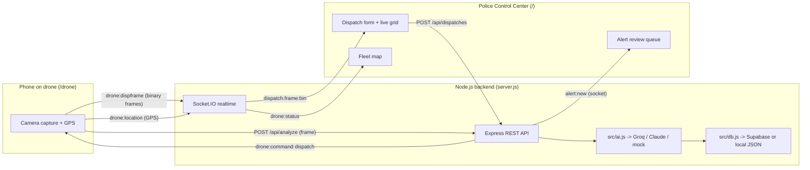
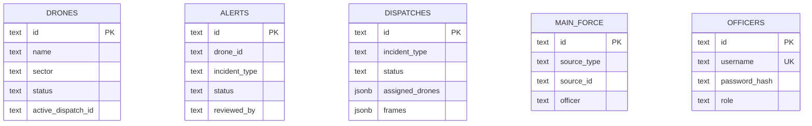

# Smart City Drone Security System

**AI-based drone surveillance and emergency-response platform for a smart city.**

> S7 B.Tech Main Project · Group 17 · Government Engineering College, Kozhikode
> Package: `smart-drone-security` v1.0.0 ([`package.json`](../package.json))

---

## Table of contents

- [Description](#description)
- [Problem statement](#problem-statement)
- [Solution overview](#solution-overview)
- [Features](#features)
- [Screenshots](#screenshots)
- [Tech stack](#tech-stack)
- [System requirements](#system-requirements)
- [Installation](#installation)
- [Environment variables](#environment-variables)
- [Running locally](#running-locally)
- [Build process](#build-process)
- [Production deployment](#production-deployment)
- [Folder structure](#folder-structure)
- [Usage instructions](#usage-instructions)
- [API overview](#api-overview)
- [Database overview](#database-overview)
- [Security considerations](#security-considerations)
- [Performance considerations](#performance-considerations)
- [Future improvements](#future-improvements)
- [Known limitations](#known-limitations)
- [License](#license)

---

## Description

A phone camera mounted on a drone acts as the drone's "eye". As the drone flies
around the city, the on-board app captures still frames and sends them to the
backend, which runs each frame through a vision AI. When the AI recognises a
situation where drone security can help, it raises an **alert on the police
station portal** — with a timestamp, the captured image, the incident type, and
the drone's own natural-language interpretation.

The system implements **both directions** of the project proposal:

1. **Drone → Police (autonomous detection).** The drone continuously monitors.
   When the AI flags an incident, an alert is pushed to the portal. Because
   drones are not perfectly accurate, a **drone-police officer reviews every
   alert** and either **escalates it to the Main Force** or **dismisses it** and
   tells the drone to resume monitoring.
2. **Police → Drone (dispatch & surround).** When the main force receives a call
   (e.g. a robbery), an officer enters the location on the portal. The **nearest
   online drones are dispatched to surround it** and stream **live footage**
   back to the portal, so the drone police can watch the scene and convey useful
   field information to the main force.

The application ships two web front-ends served from the same backend
(`server.js:63-66`):

| Part | URL | Who uses it |
|------|-----|-------------|
| **Police Control Center** | `/` | Drone police + main force (login required) |
| **Drone Camera App** | `/drone` | Runs in the phone mounted on the drone (open) |
| **Admin Console** | `/admin` | Officer account management (admin only) |

---

## Problem statement

Conventional city surveillance relies on fixed CCTV cameras and human operators
watching wall-to-wall monitor grids. This has real gaps:

- **Fixed coverage.** Cameras only see where they are bolted; incidents in blind
  spots go unseen.
- **Human monitoring fatigue.** Operators cannot watch every feed at once, so
  incidents are noticed late — or only reviewed after the fact.
- **Slow, manual dispatch.** When a call comes in, choosing and directing units
  to the exact scene is a manual, error-prone process, and responders arrive
  without live eyes on the situation.

The proposal for this project asks for a mobile, AI-assisted alternative: drones
that both **watch autonomously and report** what they see, and that can be
**dispatched to a live incident** to give responders eyes on the ground before
they arrive.

---

## Solution overview

A phone acts as the drone's camera + compute unit. The backend is a persistent
Node.js server that combines a REST API with a Socket.IO real-time layer, so
alerts, dispatch commands, and live video frames flow between drones and the
police portal with low latency.



Key design decisions, all verifiable in code:

- **AI is provider-agnostic with a full offline fallback.** `src/ai.js` auto-
  selects Groq, Claude, or a built-in "mock" simulation depending on which API
  keys are present (`ai.js:16-25`), so the system demos end-to-end with **no API
  key and no internet**.
- **Storage is optional-cloud.** If `SUPABASE_URL` + `SUPABASE_SECRET_KEY` are
  set, state and images live in Supabase Postgres + Storage; otherwise the app
  uses a local JSON store (`data/store.json`) and local image files
  (`src/db.js`, `src/supa.js:7-9`). The local JSON file is **always** written as
  an offline backup.
- **Real-time first.** Socket.IO carries alerts, dispatch commands, GPS, and
  binary camera frames; the HTTP endpoints exist mainly as fallbacks and for
  initial page loads (`server.js:45-51`).
- **No build step.** The front-end is plain static HTML + vanilla JS in
  `public/`, served directly — there is nothing to compile.

---

## Features

- **Autonomous incident detection** across **18 incident types** defined in one
  place — `src/incidents.js` (`INCIDENT_TYPES`, `incidents.js:7-98`): normal /
  all-clear, building fire, forest / wildfire, traffic block, road accident,
  person alone in the dark, unusual crowd, flooding, suspicious activity, armed
  person / weapon, violence / assault, theft / robbery, medical emergency,
  unattended object, stampede, building collapse, animal intrusion, and
  electrical hazard.
- **Human-in-the-loop review.** Every alert is reviewed by a drone-police
  officer who can **escalate to the Main Force** (`POST /api/alerts/:id/escalate`)
  or **dismiss** it (`POST /api/alerts/:id/dismiss`).
- **Police → drone dispatch.** Officers enter a location; the backend selects the
  nearest dispatchable drones via `findNearbyDrones` (`src/geo.js:22-31`) and
  commands them to surround it (`POST /api/dispatches`, `server.js:490`).
- **Live camera streaming.** Dispatched drones stream binary JPEG frames back to
  the portal (`drone:dispframe` → `dispatch:frame:bin`). Any online drone can
  also be watched on demand from the Fleet Map (`POST /api/drones/:id/live/start`).
- **Live GPS + arrival detection.** Drones stream `drone:location`; the server
  detects arrival within a 20 m radius (`ARRIVAL_RADIUS_KM = 0.02`,
  `server.js:41`) and emits `dispatch:arrived`.
- **Officer accounts & sessions.** bcrypt password hashing plus a signed,
  httpOnly session cookie (`src/auth.js`); admin console for CRUD on officers.
- **Multi-provider vision AI** (Groq / Claude / mock) with automatic fallback to
  an "All clear" result when a real provider errors (`ai.js:402-424`).
- **Self-contained real map** using Leaflet on the portal, plus a self-signed
  HTTPS listener so the phone camera works over Wi-Fi (`server.js:1164-1184`).
- **Themed UI** with 6 selectable themes persisted per device and per officer
  account (`public/js/common.js`).

---

## Screenshots

> _Placeholders — replace with real captures before submission._

| View | Placeholder |
|------|-------------|
| Login | `` |
| Police Control Center — alert queue | `` |
| Alert review modal (escalate / dismiss) | `` |
| Dispatch form + live footage grid | `` |
| Fleet map (Leaflet) | `` |
| Main Force log | `` |
| Drone Camera App (`/drone`) | `` |
| Admin console (officer management) | `` |

_Create a `docs/screenshots/` directory and drop the images in, or update the
paths above to match wherever you store them._

---

## Tech stack

| Layer | Technology | Version | Role in this project |
|-------|-----------|---------|----------------------|
| Runtime | Node.js | `>=20` (`package.json:7-8`) | ESM runtime (`"type": "module"`) |
| HTTP / REST + static | Express | `^5.2.1` | REST API, page routing, static file serving (`server.js:43-70`) |
| Real-time | Socket.IO | `^4.8.3` | Alerts, dispatch commands, binary camera frames, GPS (`server.js:45-51`) |
| Vision AI (option A) | Groq (Llama 4 Scout, via REST) | — (`GROQ_MODEL`) | Frame → incident classification (`src/ai.js:144-191`) |
| Vision AI (option B) | Anthropic Claude | `@anthropic-ai/sdk` `^0.110.0` | Alternative vision provider (`src/ai.js:123-141`) |
| Vision AI (fallback) | Built-in mock simulation | — | Fully offline scenario simulation (`src/ai.js:382-400`) |
| Cloud persistence (optional) | Supabase (`@supabase/supabase-js`) | `^2.110.0` | Postgres + image Storage (`src/supa.js`) |
| Postgres driver | `pg` | `^8.22.0` | PostgreSQL driver for the Supabase path |
| Local persistence (default) | JSON file | — | `data/store.json` + `data/uploads/` (`src/db.js`) |
| Auth | `bcryptjs` | `^3.0.3` | Password hashing; sessions via HMAC-signed cookie (`src/auth.js`) |
| Response compression | `compression` | `^1.8.1` | gzip every response (`server.js:58`) |
| Config | `dotenv` | `^17.4.2` | Loads `.env` into `process.env` |
| Front-end | Static HTML + vanilla JS | — | No framework, no build step (`public/`) |
| Map | Leaflet (loaded via CDN in `index.html`) | — | Fleet / incident map |
| Icons | Lucide (UMD) | — | Inline SVG icons |

Dependencies are enumerated in [`package.json`](../package.json) (lines 23-32).

---

## System requirements

- **Node.js `>=20`** (`package.json:7-8`) and npm.
- A modern browser with **camera + geolocation** support for the drone app
  (Chrome/Edge/Safari on a phone or laptop).
- **Optional:** a Groq or Anthropic API key for real vision AI (otherwise the
  mock simulation runs).
- **Optional:** a Supabase project (URL + secret key) for cloud persistence;
  without it the app writes to local JSON files, so nothing extra is required to
  run.
- **Optional:** `openssl` on the `PATH` — used to auto-generate a self-signed
  certificate for the local HTTPS listener so a phone camera works over Wi-Fi
  (`server.js:1146-1161`). If `openssl` is unavailable, HTTPS is simply skipped
  and HTTP still works.

---

## Installation

```bash
# 1. Clone the repository
git clone <repo-url>
cd SmartDrone

# 2. Install dependencies
npm install

# 3. (Optional) configure environment
cp .env.example .env
#   then edit .env — see "Environment variables" below
```

There is no compilation step; `npm install` is all that is needed before
running.

---

## Environment variables

All configuration is via environment variables (loaded from `.env` by `dotenv`).
**Every variable is optional** — with none set, the app runs in offline
simulation mode with local JSON storage. A copyable template lives in
[`.env.example`](../.env.example).

| Variable | Purpose | Default |
|----------|---------|---------|
| `GROQ_API_KEY` | Enables **Groq** vision (preferred when present) | unset → next provider |
| `GROQ_MODEL` | Groq vision model id | `meta-llama/llama-4-scout-17b-16e-instruct` (`ai.js:30`) |
| `ANTHROPIC_API_KEY` | Enables **Claude** vision | unset |
| `AI_MODEL` | Claude model id (only when provider = claude) | `claude-opus-4-8` (`ai.js:27`) |
| `AI_PROVIDER` | Force provider: `groq` \| `claude` \| `mock` | unset → auto-detect (`ai.js:16`) |
| `PORT` | HTTP port | `3000` (`server.js:32`) |
| `HTTPS_PORT` | Local HTTPS port (phone camera over Wi-Fi) | `PORT + 443` = `3443` (`server.js:33`) |
| `CLEAR_SECRET` | Police key to clear captured images | `police2026` (`server.js:39`) |
| `SUPABASE_URL` | Supabase project URL (needs the key too) | unset → local JSON |
| `SUPABASE_SECRET_KEY` | Supabase service/secret key | unset → local JSON |
| `AUTH_SECRET` | HMAC secret signing the session cookie | `dev-insecure-secret-change-me` (`auth.js:7`) |
| `ADMIN_PASSWORD` | Password for the auto-seeded default `admin` | `admin123` (`officers.js:67`) |
| `NODE_ENV` | `production` → Secure cookies + skip local HTTPS listener | unset |
| `RENDER` / `RAILWAY_ENVIRONMENT` | Platform-set; skip local HTTPS listener | unset |

> **Note:** `AUTH_SECRET` and `ADMIN_PASSWORD` are read by the code
> (`src/auth.js`, `src/officers.js`) but are **not** listed in `.env.example`;
> the app warns at startup when they are unset. Set them for any non-demo
> deployment.

Provider auto-selection (`ai.js:16-25`): if `AI_PROVIDER` is set it wins
(falling back to `mock` if the matching key is absent); otherwise
`GROQ_API_KEY` → Groq, else `ANTHROPIC_API_KEY` → Claude, else `mock`.

For the full description of every variable, precedence, and behavior, see
[ENVIRONMENT_VARIABLES.md](./ENVIRONMENT_VARIABLES.md).

---

## Running locally

```bash
npm start        # node server.js
# or, with auto-restart on file changes:
npm run dev      # node --watch server.js
```

Scripts are defined in [`package.json`](../package.json) (lines 10-13).

On startup the server prints a banner showing the active AI provider, the data
store (Supabase vs local), and the URLs to open. Then:

- Police Control Center → **http://localhost:3000/** (redirects to `/login`
  until you sign in).
- Drone Camera App → **http://localhost:3000/drone**.

**Default admin login.** On first run, if no admin account exists, one is seeded
with username `admin` and password from `ADMIN_PASSWORD` (default `admin123`)
(`officers.js:64-75`).

**Phone camera over Wi-Fi.** On `localhost` the camera works over plain HTTP.
To open `/drone` on a real phone, the browser requires HTTPS: the server also
starts a self-signed HTTPS listener and prints a `https://<lan-ip>:3443/drone`
link (`server.js:1195-1214`). Accept the one-time certificate warning on the
phone, then allow camera access. (This local HTTPS listener is skipped on
managed hosts — see below.)

---

## Build process

**There is no build step.** The project is pure runtime Node.js with a static
front-end:

- No `build` script exists in `package.json` (only `start` and `dev`).
- The front-end (`public/`) is served directly as static files — no bundler,
  transpiler, or preprocessor.
- Render's build command is simply `npm install` (`render.yaml:10`).

Running the app is: install dependencies, then `npm start`.

---

## Production deployment

This is a **persistent Node + Socket.IO server** that holds live WebSocket
connections, so it must be deployed on a host that runs a long-lived process.
**Serverless platforms (Vercel / Netlify) will not work** because they do not
support WebSocket servers.

**Render (recommended, config included):** the repo ships a one-click Blueprint
([`render.yaml`](../render.yaml)) — a `web` service, `runtime: node`, build
`npm install`, start `npm start`, health check `/api/stats`. Secrets
(`GROQ_API_KEY`, `SUPABASE_URL`, `SUPABASE_SECRET_KEY`) are marked `sync: false`
to be pasted in the dashboard; `NODE_ENV=production` is set so the app uses
Secure cookies and skips its local self-signed HTTPS listener (the platform
terminates TLS at the edge). **Do not set `PORT`** — Render provides it.

Railway / Fly.io work the same way with the same environment variables.

For step-by-step deployment instructions, platform notes, and the Supabase
setup, see [DEPLOYMENT.md](./DEPLOYMENT.md).

---

## Folder structure

```text
SmartDrone/
├── server.js                 # Express + Socket.IO server, all HTTP routes & realtime events
├── package.json              # Metadata, deps, npm scripts (start / dev)
├── package-lock.json
├── render.yaml               # Render one-click Blueprint (deploy config)
├── .env.example              # Environment-variable template
├── .gitignore                # Ignores node_modules/, data/, .env, certs/, logs
├── README.md                 # Top-level project readme
│
├── src/                      # Backend modules (ESM)
│   ├── ai.js                 # Frame -> incident classification (Groq / Claude / mock)
│   ├── incidents.js          # Incident-type catalogue (18 types) + severity ranks
│   ├── db.js                 # In-memory state + JSON persistence + Supabase mirroring
│   ├── supa.js               # Supabase adapter (Postgres tables + image Storage)
│   ├── seed.js               # Fleet seeding, city center, landmarks
│   ├── geo.js                # Haversine distance + nearest-drone selection
│   ├── auth.js               # bcrypt hashing + signed session cookie + guards
│   └── officers.js           # Officer account store + default-admin seeding
│
├── public/                   # Static front-end (no build step)
│   ├── index.html            # Police Control Center
│   ├── drone.html            # Drone Camera App
│   ├── admin.html            # Admin console
│   ├── login.html            # Login page
│   ├── css/
│   │   └── style.css         # Single hand-written vanilla CSS file (themes via CSS vars)
│   ├── js/
│   │   ├── portal.js         # Police portal controller
│   │   ├── drone.js          # Drone camera unit controller
│   │   ├── admin.js          # Admin console controller
│   │   ├── login.js          # Login controller
│   │   ├── common.js         # Shared helpers (config, api(), themes, icons)
│   │   └── ascii-ripple.js   # Decorative ASCII glitch-ripple text effect
│   └── vendor/               # Bundled third-party assets (pico.js, facefinder cascade)
│
├── supabase/
│   └── schema.sql            # Idempotent Postgres schema (drones/alerts/dispatches/main_force/officers)
│
├── certs/                    # Self-signed TLS cert (git-ignored; regenerated on first run)
├── data/                     # Local store (git-ignored)
│   ├── store.json            # Local JSON persistence (default backend)
│   └── uploads/              # Captured drone images (local mode)
└── docs/                     # This documentation set
```

`data/` and `certs/` are git-ignored and created at runtime (`.gitignore`).

---

## Usage instructions

### 1. Autonomous detection (Drone → Police)

1. Open **`/drone`** (on localhost or the phone HTTPS link), press **Start
   camera**, and allow camera + location access.
2. In **mock mode** (no API key), pick a **scenario** (Fire, Traffic, Robbery…)
   and press **Scan now**, or enable **Auto-monitor** to scan on an interval
   (5 / 8 / 15 s). With a real provider, the actual captured frame is analysed
   each interval.
3. The drone POSTs the frame to `/api/analyze`; if the AI flags an incident, an
   `alert:new` event pushes it to the portal with a sound.
4. On the portal's **Alerts** tab, open the alert and choose **Escalate to Main
   Force** or **Situation OK — Resume**. Escalation logs a record in the **Main
   Force** tab and tells the drone to resume monitoring.

### 2. Dispatch & surround (Police → Drone)

1. On the portal's **Fleet Map** tab, click near a drone to drop a target — the
   **Dispatch** form pre-fills coordinates.
2. Choose an incident type, add a description, and press **Dispatch nearest
   drones**. The backend selects the nearest online drones and sends each a
   `dispatch` command.
3. Dispatched drones switch to **live streaming**; their footage appears in the
   dispatch's live grid. Arrival within 20 m raises a `dispatch:arrived` toast.
4. Type field updates in **Convey to main force**, then **Resolve** the dispatch
   to free the drones.

### 3. On-demand live view

On the **Fleet Map**, each online drone has a **Live view** button; clicking it
starts a live feed at any time (`POST /api/drones/:id/live/start`), and the
drone shows a "police viewing" indicator while watched.

### 4. Admin — officer accounts

Sign in as an admin and open **`/admin`** to create, edit, activate/deactivate,
or delete officer accounts.

### 5. Reset between demos

Admins can click **Reset demo** on the portal to clear all alerts, dispatches,
and logs while keeping the drone fleet (`POST /api/admin/reset`).

---

## API overview

The backend exposes a REST API under `/api/*` plus page routes. All `/api/*`
routes require a valid session **except** an open set — `/api/config`,
`/api/drones`, `/api/analyze`, and the drone-frame relay endpoints — which are
used by the field drone app and pre-login clients (`server.js:120-127`). Admin
routes additionally require the `admin` role.

Representative endpoints:

| Method | Path | Purpose | Auth |
|--------|------|---------|------|
| POST | `/api/auth/login` | Log in, set session cookie | open |
| POST | `/api/auth/logout` | Clear session | open |
| GET | `/api/config` | Client config (AI label, city center, incident types, landmarks) | open |
| GET | `/api/drones` | Fleet list | open |
| POST | `/api/analyze` | Analyse a drone frame → maybe raise an alert | open |
| GET | `/api/alerts` | Alerts, newest first (optional `?status=`) | auth |
| POST | `/api/alerts/:id/escalate` | Escalate an alert to the main force | auth |
| POST | `/api/alerts/:id/dismiss` | Dismiss an alert | auth |
| GET | `/api/dispatches` | Dispatches | auth |
| POST | `/api/dispatches` | Dispatch nearest drones to a location | auth |
| POST | `/api/dispatches/:id/convey` | Field update → main force | auth |
| POST | `/api/dispatches/:id/resolve` | Resolve dispatch, free drones | auth |
| GET | `/api/mainforce` | Main-force log | auth |
| GET | `/api/stats` | Dashboard counts (also the deploy health check) | auth |
| GET/POST/PATCH/DELETE | `/api/officers[/:id]` | Officer account management | admin |
| POST | `/api/admin/reset` | Demo reset (clears incidents, keeps fleet) | admin |
| POST | `/api/admin/clear-images` | Wipe captured images (key-protected) | admin |

The system is **real-time first**: alerts, dispatch commands, GPS, and binary
camera frames travel over Socket.IO (rooms `police`, `drones`, `drone:<id>`),
not HTTP polling.

For the complete route reference (request bodies, response shapes, status codes)
and the full Socket.IO event catalogue, see
[API_DOCUMENTATION.md](./API_DOCUMENTATION.md).

---

## Database overview

The app keeps its main state **in memory** so the rest of the code stays
synchronous, and mirrors every change to a durable backend (`src/db.js:1-6`):

- **Supabase Postgres** when `SUPABASE_URL` **and** `SUPABASE_SECRET_KEY` are set
  (`src/supa.js:7-9`), with captured images pushed to a public Storage bucket
  `drone-images` (auto-created).
- **Local JSON** otherwise — `data/store.json` for state and `data/uploads/` for
  images. The JSON file is **always** written, even in Supabase mode, as an
  offline backup (`db.js:6`, `db.js:88-92`).

The Postgres schema ([`supabase/schema.sql`](../supabase/schema.sql)) is
idempotent and defines five tables — `drones`, `alerts`, `dispatches`,
`main_force`, and `officers` — plus timestamp indexes. It uses the trusted
service-role key and **does not enable row-level security**.



> Relationships are logical only — the schema declares **no foreign keys**;
> `drone_id`, `source_id`, and `active_dispatch_id` are plain `text` columns.

For the full column-by-column schema, the two-tier persistence flow, and the
Supabase diff-sync mechanism, see [DATABASE.md](./DATABASE.md).

---

## Security considerations

- **Password hashing.** Officer passwords are hashed with bcrypt (cost factor
  10) via `bcryptjs`; comparison is constant-time and fails closed
  (`auth.js:17-22`).
- **Session cookie.** Auth uses a stateless, HMAC-SHA256-signed token stored in
  an **httpOnly**, `sameSite=lax` cookie (7-day lifetime); the `Secure` flag is
  set in production / on Render (`auth.js:24-59`). Signatures are verified with
  `crypto.timingSafeEqual`.
- **Set `AUTH_SECRET` in production.** It defaults to a known insecure value and
  warns at startup when unset (`auth.js:7-9`).
- **Route guarding.** Page routes are registered **before** the static
  middleware so login-gating cannot be bypassed (`server.js:61-69`); a global
  `/api/*` guard requires a session for all but an explicit open set
  (`server.js:120-127`); admin routes require the `admin` role.
- **SSRF protection.** `POST /api/resolve-location` (which extracts coordinates
  from a pasted map link) is guarded by a host allowlist, per-hop redirect
  re-checks, an 8-second abort, and a 2 MB body cap (`server.js:779-845`).
- **Image-clear key.** Wiping captured images requires the `CLEAR_SECRET` key
  (`server.js:862`).
- **Process resilience.** `uncaughtException` / `unhandledRejection` are logged
  rather than crashing the control-center process (`server.js:55-56`).

> **Demo-grade defaults to change before production:** `ADMIN_PASSWORD`
> (default `admin123`), `AUTH_SECRET`, and `CLEAR_SECRET` all ship with insecure
> defaults. In Supabase mode the schema runs **without RLS**, relying on the
> secret key being kept server-side.

---

## Performance considerations

- **gzip compression** on every response, mounted before routes/static
  (`server.js:58`).
- **Binary frame streaming.** Live/dispatch camera frames are sent as binary
  Socket.IO messages (`drone:liveframe` / `drone:dispframe` → `*:bin`), not
  base64 over HTTP, with a 12 MB socket buffer (`server.js:45-51`).
- **In-flight caps + throttling on the drone.** The camera app caps concurrent
  in-flight frames and streams at fixed intervals (~11-12 fps); GPS updates are
  throttled to ~2.5 s with a 5 s heartbeat.
- **Frame-archival throttling.** Only every 4th dispatch frame is persisted
  (`FRAME_SAVE_EVERY = 4`, `server.js:568`), and stored frames are capped
  (`MAX_FRAMES_PER_DISPATCH = 16`).
- **Bounded in-memory collections.** Alerts (`MAX_ALERTS = 300`, pending never
  evicted), main-force records (`MAX_MAINFORCE = 500`), and per-dispatch updates
  (`MAX_UPDATES_PER_DISPATCH = 50`) are capped (`server.js:34-37`).
- **Debounced persistence + diff-sync.** JSON writes are debounced 300 ms
  (`db.js:85-92`); Supabase syncs upsert only changed rows and delete only
  removed ones (`supa.js:63-84`).
- **Faster disconnect detection.** Socket.IO ping is tuned (`pingInterval` 10 s,
  `pingTimeout` 12 s) so a vanished phone is marked offline faster than the
  ~45 s default, backed by a 10 s safety sweep (`server.js:1107-1123`).
- **Static asset caching.** `/uploads` is served with `maxAge: '7d', immutable`
  (`server.js:70`).

---

## Future improvements

> _Forward-looking; not yet implemented in the codebase._

- **Automated test suite** — the project currently ships no tests.
- **Enable Supabase row-level security** and move image access behind signed
  URLs rather than a public bucket.
- **JSON-schema / structured-output enforcement on the Groq path** — it
  currently relies on prompt instructions only (`ai.js:144-191`); add a
  response-format constraint and a request timeout on the Claude path (which has
  none today).
- **Add a request timeout / abort to the Claude vision call** to match the 15 s
  guard already on the Groq call (`ai.js:168-183`).
- **Persistent, horizontally-scalable sessions** (e.g. a shared session/store)
  and a Socket.IO adapter (Redis) to run more than one server instance.
- **Configurable fleet** — the fleet is currently hard-coded to 4 drones for
  Kozhikode (`src/seed.js`).
- **True drone autonomy / flight control** — the drone is presently a phone
  camera unit; there is no flight-control integration.

## Known limitations

- **No test suite.** There is no `test` script and no test files.
- **No build/CI pipeline.** Deployment is `npm install` + `npm start` only.
- **Phone-controlled fleet.** Only drones that are online (a phone connected to
  the `/drone` app) are dispatchable (`src/geo.js:18-24`); an offline fleet
  cannot be dispatched.
- **Single-process state.** Main state lives in one process's memory; running
  multiple instances without a shared realtime adapter would desynchronise them.
- **Self-signed local HTTPS.** The Wi-Fi phone-camera path uses a self-signed
  certificate (browser warning on first use) and requires `openssl` on the
  `PATH`; if absent, HTTPS is skipped (`server.js:1146-1161`).
- **Insecure defaults.** `admin123`, `police2026`, and the default
  `AUTH_SECRET` must be changed for any real deployment.
- **AI accuracy.** Drone vision is not perfectly accurate — which is why the
  human-in-the-loop review step exists — and in mock mode results are simulated,
  not derived from the real frame.
- **Region-specific defaults.** City center, landmarks, and sectors are hard-
  coded to Kozhikode.

---

## License

**MIT** — see the `license` field in [`package.json`](../package.json) (line
22). Author: **Group 17 — GEC Kozhikode**.
