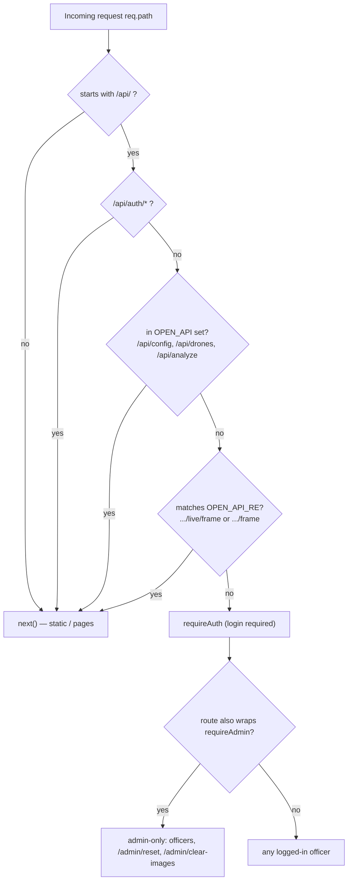

# Security Analysis — Smart City Drone Security System

**Scope:** the Node.js/Express 5 + Socket.IO backend (`server.js`, `src/*.js`) and the
static vanilla-JS frontend (`public/js/*.js`), plus deployment/config
(`.env.example`, `render.yaml`, `.gitignore`, `supabase/schema.sql`).
**Method:** manual source review. Every finding cites `file:line`. Where the code
does not implement a control, this is stated explicitly rather than assumed.

> **Threat-model note.** This is a student capstone (GEC Kozhikode, Group 17) designed
> to run on a LAN or a single free-tier Render instance. Several findings below are
> acceptable for a classroom demo but would be blocking for a real public deployment.
> Severities are rated against the *stated intent* of the app (a police control centre
> handling incident data), not against a toy demo.

---

## 1. Executive summary

| # | Finding | Area | Severity |
|---|---|---|---|
| F1 | Session-signing secret defaults to a hard-coded, publicly-known value (`dev-insecure-secret-change-me`); `AUTH_SECRET` is not in `.env.example` or `render.yaml` | Auth | **Critical** |
| F2 | Default admin account seeded as `admin` / `admin123`; `ADMIN_PASSWORD` not in `.env.example` or `render.yaml` | Auth | **Critical** |
| F3 | No rate limiting anywhere — login brute-force, AI-cost abuse, and open frame/analyze endpoints are all unthrottled | Rate limiting | **High** |
| F4 | `/api/analyze`, `/api/drones`, `/api/dispatches/:id/frame`, `/api/drones/:id/live/frame` require **no authentication** — allows drone spoofing, forced alerts, live-feed frame injection, and AI-cost/DoS abuse | AuthZ | **High** |
| F5 | Stateless tokens are not revocable; deactivating/deleting an officer or changing a password does not invalidate existing API sessions | Auth | **High** |
| F6 | No security headers (no CSP, `X-Frame-Options`, `X-Content-Type-Options`, HSTS); front-end loads third-party scripts from a CDN with no SRI | XSS / transport | **Medium** |
| F7 | Supabase Storage bucket is public **and** the upload endpoints are unauthenticated → world-readable arbitrary-content object store | Upload | **Medium** |
| F8 | `secure` cookie flag is off in local/LAN mode, so the session cookie can traverse plain HTTP on the LAN | Auth / transport | **Medium** |
| F9 | Login is vulnerable to username enumeration via a response-timing side channel | Auth | **Low** |
| F10 | `CLEAR_SECRET` default (`police2026`) is shipped in `.env.example`; admin-set officer `photo` is unvalidated/uncapped | Secrets / validation | **Low** |

**Handled well:** parameterized data access (no SQL injection surface), consistent
output escaping on the portal (`esc()`), a genuinely careful SSRF guard on the
map-link resolver, server-generated upload filenames (no path traversal), bcrypt
password hashing, `timingSafeEqual` token comparison, and `httpOnly` + `SameSite=Lax`
cookies.

---

## 2. Authentication

### 2.1 Mechanism

Authentication is bcrypt password verification plus a **stateless, HMAC-SHA256-signed
mini-token stored in an `httpOnly` cookie** — there is no server-side session store
(`src/auth.js:1-3`).

- Passwords are hashed with `bcrypt.hash(pw, 10)` — cost factor 10 (`auth.js:17-19`);
  verification is `bcrypt.compare`, returning `false` on any throw (`auth.js:20-22`).
- The token is `base64url(JSON payload).base64url(HMAC-SHA256(SECRET, body))` — a
  two-part token, **not** a standard 3-part JWT (`auth.js:24-27`). Payload carries
  `{ id, role, username, exp }` with a 7-day expiry (`auth.js:12`, `auth.js:25`).
- `verifyToken` recomputes the HMAC and compares with `crypto.timingSafeEqual` after a
  length check (`auth.js:32-34`) — a correct, timing-safe verification — then rejects
  missing/expired `exp` (`auth.js:37`).
- The cookie is `httpOnly:true, sameSite:'lax', secure:<conditional>, maxAge:7d, path:'/'`
  (`auth.js:54-59`).

```mermaid
sequenceDiagram
    participant B as Browser
    participant S as server.js
    participant A as auth.js
    participant O as officers store
    B->>S: POST /api/auth/login {username,password}
    S->>O: findByUsername(username)  (server.js:78)
    O-->>S: officer | null
    S->>A: verifyPassword(password, passwordHash)  (server.js:82)
    A-->>S: true / false (bcrypt.compare)
    alt invalid / inactive / not found
        S-->>B: 401 "Invalid username or password"  (server.js:83)
    else valid
        S->>A: setSession(res,{id,role,username})  (server.js:84)
        A-->>B: Set-Cookie sd_session=<body.hmac> httpOnly  (auth.js:56)
    end
    Note over B,S: Later requests send the cookie; requireAuth/requireAdmin<br/>verify the HMAC + exp only — no DB lookup (auth.js:65-75)
```

### 2.2 Findings

**F1 — Insecure default signing secret (Critical).**
`SECRET = process.env.AUTH_SECRET || 'dev-insecure-secret-change-me'` (`auth.js:7`). The
fallback is a constant committed to this public repository. If `AUTH_SECRET` is unset,
**anyone can forge a valid session cookie for any user, including `role:'admin'`**, by
HMAC-signing a payload with the known secret — a complete authentication bypass. The
code does warn on startup (`auth.js:8-9`), but `AUTH_SECRET` appears in **neither**
`.env.example` nor `render.yaml`, so a default Render Blueprint deploy ships with the
insecure secret.

**F2 — Default admin credentials (Critical).**
`seedDefaultAdmin()` creates `username:'admin'` with `process.env.ADMIN_PASSWORD || 'admin123'`
when no admin exists (`officers.js:64-74`). `ADMIN_PASSWORD` is absent from
`.env.example` and `render.yaml`, so a fresh deploy is reachable with `admin` / `admin123`.
A startup warning is printed (`officers.js:68-69`) but does not prevent the weak account.

**F5 — Non-revocable sessions (High).**
Because sessions are stateless, `requireAuth`/`requireAdmin` validate only the token
signature and `exp` — they perform **no per-request DB check** (`auth.js:65-75`).
Consequences:
- Logout only clears the client cookie (`auth.js:60-62`); a copied/leaked token stays
  valid for the full 7 days.
- Deactivating (`active:false`), demoting, deleting, or password-resetting an officer
  does **not** invalidate their outstanding token. The page/`/api/auth/me` path *does*
  re-check `active` and bounce the session (`server.js:88-95`), but every other `/api/*`
  route trusts the token alone, so a deactivated officer keeps full API access until
  expiry. There is no `jti`, token-version, or revocation list.

**F8 — Cookie `secure` flag off on LAN (Medium).**
`secure = NODE_ENV==='production' || RENDER` (`auth.js:55`). In local/LAN operation
(the documented phone-over-Wi-Fi mode, `server.js:1205-1212`) neither is set, so the
session cookie has no `Secure` flag and will be transmitted over the plain-HTTP listener
on port `3000` (`server.js:1195`), where it is sniffable by anyone on the same network.
Credentials submitted to the login form over that same HTTP port are likewise in cleartext.

**F9 — Username enumeration via timing (Low).**
`if (!o || o.active === false || !(await verifyPassword(password, o.passwordHash)))`
(`server.js:82`). JavaScript `||` short-circuits: for an unknown username `bcrypt.compare`
never runs, so the response returns measurably faster than for a valid username (where a
~cost-10 bcrypt hash executes). This leaks account existence despite the deliberately
generic error string. (Mitigating: the message itself does not distinguish the two cases.)

---

## 3. Authorization

### 3.1 Model

Two Express guards enforce roles: `requireAuth` (any valid session) and `requireAdmin`
(session with `role==='admin'`), returning 401/403 JSON (`auth.js:65-75`); page variants
redirect instead (`auth.js:76-86`). A global middleware gates the whole `/api` surface
(`server.js:122-127`):



Admin-only routes: officer CRUD (`server.js:130,134,148,166`), `/api/admin/reset`
(`server.js:714`), `/api/admin/clear-images` (`server.js:862`). Page gating for `/`
and `/admin` is defined **before** `express.static` so it cannot be bypassed by
requesting the raw HTML file (`server.js:61-69`).

### 3.2 Findings

**F4 — Unauthenticated state-changing endpoints (High).**
The `OPEN_API` set and `OPEN_API_RE` regexes intentionally leave these open for the
un-logged-in field drone app (`server.js:120-121`):

| Endpoint | Risk when open |
|---|---|
| `POST /api/analyze` (`server.js:319`) | Any network client can submit frames for any known `droneId`, which **moves that drone's GPS position and marks it online/alerting** (`server.js:324-328,394`), pushes alerts into the police queue, and **triggers a paid Groq/Claude vision call per request** (`server.js:333`). No auth, no ownership check, no rate limit → alert-flooding, map spoofing, and API-cost/DoS abuse. Note the WebSocket telemetry path *does* enforce device ownership (`server.js:1019,1040,1050`), but this HTTP path does not. |
| `POST /api/dispatches/:id/frame` (`server.js:570`) | Anyone who knows/guesses a `dispatchId` + `droneId` can inject arbitrary frames into the live police dispatch feed (`server.js:584`) — a feed-integrity / evidence-spoofing issue. |
| `POST /api/drones/:id/live/frame` (`server.js:701`) | Same, for the on-demand live camera feed (`server.js:708`). |
| `GET /api/drones` (`server.js:299`) | Unauthenticated disclosure of the full fleet: coordinates, battery, status, `activeDispatchId`. |

Drone IDs are highly predictable (`drone-1`…`drone-4`, `seed.js:16`). Dispatch IDs are
`disp_<base36 timestamp><3 random bytes>` (`server.js:181-183`) — only 24 bits of
entropy plus a knowable time prefix, so they are guessable by a motivated attacker.

**Design tension.** Opening these routes is a deliberate trade-off so the field phone
can operate without login. The safer pattern is a per-drone bearer/registration token
issued at pairing time and required on the analyze/frame routes, preserving the
"no human login" property while restoring authenticity.

**Destructive routes behind `requireAuth` only (informational).**
`/api/alerts/clear-reviewed` (`server.js:745`), `/api/dispatches/clear-resolved`
(`server.js:735`), and dispatch/alert actions (escalate/dismiss/resolve/convey) are
available to *any* logged-in officer, not just admins. This may be intended, but the two
`clear-*` routes are bulk-destructive and arguably belong behind `requireAdmin`.

---

## 4. Input validation

Validation is present on the security-relevant numeric and type boundaries, and thin on
free-text fields.

**Validated:**
- Login and officer-create require `username`+`password` present (`server.js:75,136`).
- Dispatch coordinates: `Number.isFinite` + range `|lat|≤90, |lng|≤180` (`server.js:493`).
- WebSocket `drone:location`: same finite/range check **and** device-ownership check
  (`server.js:1017,1019`).
- Map-link resolver validates parsed coordinates before returning (`server.js:772`).
- Self-service avatar: must be a string starting `data:image/`, capped at 800 000 chars
  → 413 otherwise (`server.js:99-101`).
- Theme: string, length ≤ 40 (`server.js:111`).
- Socket payloads are null/type-guarded before destructuring (`server.js:941,949,960,1015`).
- The JSON body parser caps requests at 15 MB (`server.js:59`); the Socket.IO buffer at
  12 MB (`server.js:46`).
- AI output is length-clamped server-side during `normalize()` (title→120, interpretation→600,
  action→300) before storage (`src/ai.js:87-97`).

**Gaps:**
- Free-text fields — `address`, `description`, `note`, `info`, `officer`, and officer
  `name`/`badgeId`/`station` — are type-checked at best but **not length-capped**
  (e.g. `server.js:491-492,418,466,613-615,135`). A client can store very large strings,
  bloating the in-memory state, the `store.json` file, and the Supabase rows.
- Admin-set officer `photo` on create/patch is neither format-validated nor size-capped
  (`server.js:141,154`), unlike the self-service avatar path.
- `scenarioHint` is forwarded to the AI layer untyped (`server.js:320,337`); it only
  selects a mock scenario or adds prompt context and is bounded by the schema, so impact
  is low.

---

## 5. SQL injection prevention

**No SQL-injection surface exists in the reviewed code.**

- There are **no raw SQL strings and no string-concatenated queries anywhere**. Although
  `pg` is a dependency (`package.json`), all database access goes through the Supabase
  JS client's builder API: `.select()`, `.insert()`, `.upsert()`, `.update()`, `.delete()`,
  `.eq()`, `.ilike()`, `.in()`, `.order()`, `.limit()` (`src/supa.js:43-178`). These emit
  parameterized PostgREST calls; user values are never interpolated into SQL text.
- Column names are derived by a fixed `camelToSnake` transform over **known object keys**
  (`supa.js:17,19`), not from user-controlled identifiers, so there is no dynamic-identifier
  injection either.
- Username lookup uses `.ilike('username', u)` with the value passed as a bound parameter
  (`supa.js:152`) — safe.
- In local-JSON mode there is no database at all; state is `JSON.parse`/`JSON.stringify`
  round-tripped (`db.js:31,72`; `officers.js:19,24`).

**Related note (defense-in-depth):** the schema enables **no Row-Level Security** and the
server uses the Supabase **service_role/secret key** (`supa.js:8,13`;
`supabase/schema.sql:98-100`), which bypasses RLS. The application is therefore the *only*
authorization boundary in front of the database — which is why the auth findings (F1, F4,
F5) carry extra weight: any auth bypass is equivalent to full database access.

---

## 6. XSS prevention

### 6.1 Output encoding

The portal consistently HTML-escapes server-provided and user-provided strings before
inserting them via `innerHTML`. `esc()` encodes `& < > " '` (`common.js:54-58`) and is
applied to every dynamic text/attribute field: alert `title`/`severity`/`interpretation`/
`recommendedAction`/`droneName`/`sector`/`reviewNote`/`reviewedBy` (`portal.js:334,338,354-363`),
dispatch `address`/`description`/`officer`/`info`/`name` (`portal.js:622,634,642,647-650`),
main-force `officer`/`title`/`location`/`conveyed` (`portal.js:713-715`), map tooltips
(`portal.js:827,833,844`), and the fleet/roster panels (`portal.js:868-869,893-896`). This
is good, disciplined hygiene and blocks stored XSS through the AI-generated and
officer-entered content that flows into these views.

### 6.2 Residual sinks (Medium → Low)

- **No Content-Security-Policy.** There is no `helmet` and no CSP/`X-Frame-Options`/
  `X-Content-Type-Options` header set anywhere (confirmed: none of these appear in
  `server.js` or `src/`). A single future missed `esc()` would execute with no second
  line of defense, and the portal is framable (clickjacking). *(See F6.)*
- **Third-party scripts with no SRI.** `index.html`/`drone.html` load Leaflet and Lucide
  from a public CDN (per the frontend layout; e.g. `index.html:8,221-222`) without
  Subresource Integrity — a supply-chain exposure with no CSP to constrain it.
- **`img.src` data-URI / URL sinks.** Officer photos and frames are assigned directly to
  `img.src` (`portal.js:190,281,204,987,999`). Self-service photos are validated to be
  `data:image/*` (`server.js:99`), and `` will not execute `javascript:`, so this
  is low risk; however the admin-set `photo` field is unvalidated (§4), so a crafted value
  is stored verbatim.

Overall XSS posture is **good at the encoding layer** but **lacks the header-level
defense-in-depth** that a security review expects.

---

## 7. CSRF protection

**There is no dedicated CSRF protection** — no `csurf`, no synchronizer/double-submit
token, and no per-request CSRF nonce anywhere in the codebase (confirmed absent).

Protection currently rests on two implicit controls:

1. **`SameSite=Lax` session cookie** (`auth.js:57`). This blocks the cookie from being
   attached to cross-site sub-resource requests and cross-site `POST`s, which covers the
   forgeable form-POST vector for all state-changing routes.
2. **JSON content type.** The client always sends `Content-Type: application/json`
   (`common.js:43`) and the server parses only JSON bodies (`server.js:59`). A cross-origin
   HTML `<form>` cannot set that content type without triggering a CORS preflight, and no
   CORS middleware is configured (no `cors()` in the code) so cross-origin browsers cannot
   complete such requests.

**Actual status:** CSRF risk is **Low** in practice for the current same-origin design,
but it is achieved *incidentally* via `SameSite=Lax` + JSON-only bodies rather than by an
explicit anti-CSRF token. This should be documented as an accepted control and hardened by
setting `SameSite=Strict` (or adding tokens) for the high-value admin routes. The
unauthenticated open endpoints (§3.2) do not use the cookie at all, so CSRF is not
applicable to them — but they are exposed regardless.

---

## 8. Secrets management

**Good:**
- `.gitignore` excludes `.env`, the entire `data/` directory (which holds `store.json`,
  `officers.json` with bcrypt hashes, and `uploads/`), `certs/` (the self-signed **private
  key**), and `*.log`. Verified: `git ls-files` tracks **no** `.env`, `store.json`,
  `officers.json`, or `*.pem` — no secrets are committed.
- Deployment secrets in `render.yaml` use `sync: false` so `GROQ_API_KEY`,
  `SUPABASE_URL`, and `SUPABASE_SECRET_KEY` are entered in the dashboard, not committed
  (`render.yaml:18-23`).
- The powerful Supabase secret key is used only server-side (`supa.js:8,13`) and is never
  echoed to the client (`/api/config` returns only AI label, city center, incident types,
  landmarks — `server.js:295-297`).

**Weaknesses:**
- **F1/F2 restated as a secrets problem:** `AUTH_SECRET` and `ADMIN_PASSWORD` — the two
  most security-critical secrets — are **not listed** in `.env.example` or `render.yaml`,
  and both have insecure hard-coded fallbacks (`auth.js:7`; `officers.js:67`). Their
  absence from the sample/blueprint makes an insecure production deploy the *default* path.
- **F10 — `CLEAR_SECRET` shipped with a public default.** `.env.example:27` ships
  `CLEAR_SECRET=police2026`, matching the code default (`server.js:39`). It is compared with
  a plain `!==` (not timing-safe) at `server.js:864`. The image-clear route already requires
  `requireAdmin` (`server.js:862`), so the key is a weak secondary factor whose default is
  public knowledge; treat it as low-value.

---

## 9. File / image upload security

Images arrive either as base64 in a JSON body (`/api/analyze`, `/api/*/frame`) or as raw
binary over Socket.IO (`drone:liveframe`, `drone:dispframe`).

**Good:**
- **Filenames are always server-generated** — `img_<base36 time><3 random bytes>.jpg`
  (`server.js:195,181-183`). No user input reaches the path, so there is **no path
  traversal**. `deleteImagesByUrl` reduces a URL to its basename with `split('/').pop()`
  (`server.js:227`) and only ever unlinks within `UPLOAD_DIR` (`server.js:231`).
- Size is bounded by the 15 MB JSON limit (`server.js:59`) and the 12 MB socket buffer
  (`server.js:46`).
- `/uploads` is served read-only with long-cache/immutable headers (`server.js:70`).

**Weaknesses:**
- **F7 — Public bucket + open upload endpoints (Medium).** When Supabase is enabled the
  `drone-images` bucket is created **public** (`supa.js:106`, `public:true`), so every
  stored frame is world-readable via its public URL. Combined with the **unauthenticated**
  `/api/*/frame` routes (§3.2, `server.js:570,701`), an attacker who guesses IDs can push
  arbitrary bytes into a public, CDN-backed object store — an integrity and
  storage-abuse/hosting vector. Surveillance frames also become publicly retrievable by
  anyone with the URL, with no access control.
- **No content/type verification.** `stripBase64` merely strips the `data:` prefix and the
  bytes are stored as-is with a forced `.jpg` name and `image/jpeg` content type
  (`server.js:185-217`; `supa.js:113`). The payload is never verified to be a real JPEG.
  Because objects are only ever rendered in `` and served with `image/jpeg`, the XSS
  risk from a disguised HTML payload is low, but there is **no `X-Content-Type-Options:
  nosniff`** on `/uploads` (`server.js:70`) to guarantee a browser won't sniff a
  locally-served file — worth adding.
- Local-mode `writeFile` (`server.js:211`) and Supabase `upsert:true` (`supa.js:114`) mean a
  colliding server-generated name would overwrite; collision probability is negligible given
  the timestamp+random name, so this is informational.

---

## 10. Rate limiting

**None is implemented anywhere.** There is no `express-rate-limit`, no throttling
middleware, and no per-IP/per-account counter in `server.js` or `src/` (confirmed:
dependencies are only `@anthropic-ai/sdk`, `@supabase/supabase-js`, `bcryptjs`,
`compression`, `dotenv`, `express`, `pg`, `socket.io`). The only rate-related mechanism is
the per-dispatch frame-archival throttle (`FRAME_SAVE_EVERY`, `server.js:568`), which is a
storage optimization, not an abuse control.

Unthrottled, security-sensitive endpoints include:
- `POST /api/auth/login` (`server.js:73`) — **online password brute-force / credential
  stuffing** with no lockout or backoff.
- `POST /api/analyze` (`server.js:319`) — each call spends real Groq/Claude quota
  (`ai.js:172` / Anthropic SDK); open + unthrottled = a direct **financial-DoS** lever.
- `POST /api/resolve-location` (`server.js:848`) — makes outbound `fetch`es (§11);
  unthrottled server-side request generation.
- The open frame endpoints (§3.2) — unbounded feed-injection / write amplification.

This is the single most impactful *missing* control for a network-exposed deployment.

---

## 11. Bonus: SSRF guard on `/api/resolve-location` (implemented well)

The map-link resolver is a genuine SSRF-hardening effort and deserves credit
(`server.js:756-858`):

- Requires an `http(s)://` scheme (`server.js:850`) and first tries a pure-regex coordinate
  extract with **no network call** (`server.js:809`).
- Fetches only hosts on an **allowlist** (`MAP_HOSTS`, `server.js:779`) via `isMapHost`,
  which correctly matches exact host or `.suffix` so `google.com.evil.com` is rejected
  (`server.js:780-787`).
- Follows redirects **manually with `redirect:'manual'`** and **re-checks the allowlist on
  every hop** (max 5), preventing a short-link from 3xx-bouncing to an internal address
  (`server.js:819-835`).
- Bounds the request with an 8 s `AbortController` timeout (`server.js:813,844`), a 2 MB
  response cap (`server.js:790-806,841`), and a content-type filter (`server.js:840`).

Residual: DNS-rebinding (an allowlisted host resolving to an internal IP) is not addressed,
and the outbound fetch is itself unthrottled (§10). Both are low-to-medium given the tight
allowlist.

---

## 12. Transport & platform notes

- HTTP always listens on `PORT` (`server.js:1195`); a self-signed HTTPS listener runs on
  `HTTPS_PORT` for the phone camera and is **skipped** on managed hosts that terminate TLS
  at the edge (`server.js:1164-1169`). No in-app HTTP→HTTPS redirect exists; transport
  security depends on the platform.
- The self-signed key/cert live in `certs/` (gitignored) and are auto-generated with
  `openssl` if missing (`server.js:1139-1162`) — reasonable for LAN dev.
- Process-level `uncaughtException`/`unhandledRejection` handlers keep the process alive on
  any error (`server.js:55-56`). This is good for demo resilience but can let the server
  continue in an inconsistent state and mask failures — acceptable here, worth noting.

---

## 13. Prioritized recommendations

**P0 — before any non-demo exposure**
1. **Require a strong `AUTH_SECRET`** (F1): fail fast (refuse to start) if it is unset or
   equals the default; add it to `.env.example` and as a `sync: false` var in `render.yaml`
   (`auth.js:7`).
2. **Force admin-password setup** (F2): remove the `admin123` fallback or require a first-login
   password change; add `ADMIN_PASSWORD` to `.env.example`/`render.yaml` (`officers.js:67`).
3. **Add rate limiting** (F3): `express-rate-limit` on `/api/auth/login` (with lockout/backoff),
   on `/api/analyze`, on `/api/resolve-location`, and on the open frame routes.
4. **Authenticate the drone data plane** (F4): issue a per-drone pairing/bearer token and
   require it on `/api/analyze` and the `/frame` routes; add an ownership check to the HTTP
   analyze path mirroring the WebSocket `socket.data.droneId` check (`server.js:1019,1040,1050`).

**P1 — strongly recommended**
5. **Make sessions revocable** (F5): store a per-officer token version or a `jti` denylist and
   check it (or the officer's `active` flag) inside `requireAuth`/`requireAdmin`
   (`auth.js:65-75`); invalidate on logout, deactivate, delete, and password change.
6. **Add security headers** (F6): adopt `helmet` for CSP, `X-Frame-Options: DENY`,
   `X-Content-Type-Options: nosniff` (including on `/uploads`, `server.js:70`), and HSTS in
   production; add SRI to the CDN `<script>`/`<link>` tags or self-host them.
7. **Lock down image storage** (F7): make the Supabase bucket private and serve frames through
   an authenticated proxy, or scope object names so they are unguessable and only linkable to
   an authorized viewer; verify uploaded bytes are a valid JPEG.
8. **Set `Secure` cookies whenever served over TLS** (F8) and steer LAN users to the HTTPS
   port for login (`auth.js:55`).

**P2 — hardening**
9. Cap the length of all free-text fields and validate/limit admin-set `photo` (§4).
10. Equalize the login code path so timing does not reveal account existence (run a dummy
    bcrypt compare for unknown users) (F9, `server.js:82`).
11. Move bulk-destructive `clear-*` routes behind `requireAdmin` (§3.2); rotate `CLEAR_SECRET`
    off its public default and compare it with `crypto.timingSafeEqual` (F10, `server.js:864`).
12. Consider `SameSite=Strict` for admin routes and/or an explicit CSRF token to make the
    current *implicit* CSRF protection explicit (§7).

---

## 14. Not determinable from the current codebase

- The runtime value of `AUTH_SECRET`/`ADMIN_PASSWORD` in any real deployment (only the code
  defaults and their absence from `.env.example`/`render.yaml` are observable).
- Whether the Supabase project has any RLS policies or storage ACLs configured **outside**
  `supabase/schema.sql`; the committed schema explicitly enables none (`schema.sql:98-100`).
- Any WAF, reverse-proxy, or platform-level rate limiting/edge protection provided by
  Render/Railway — outside this repository.
