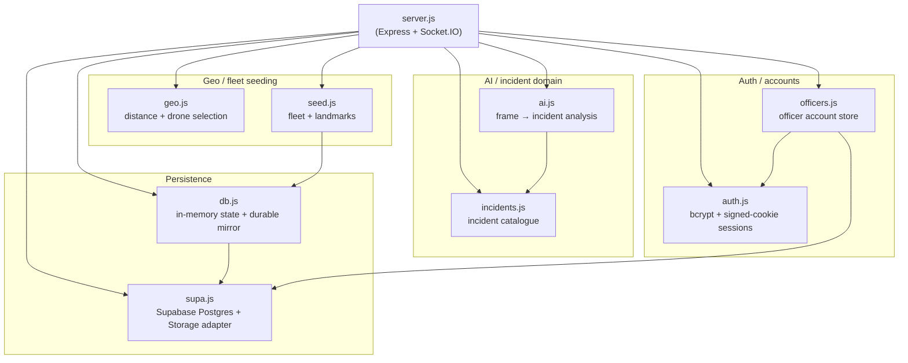
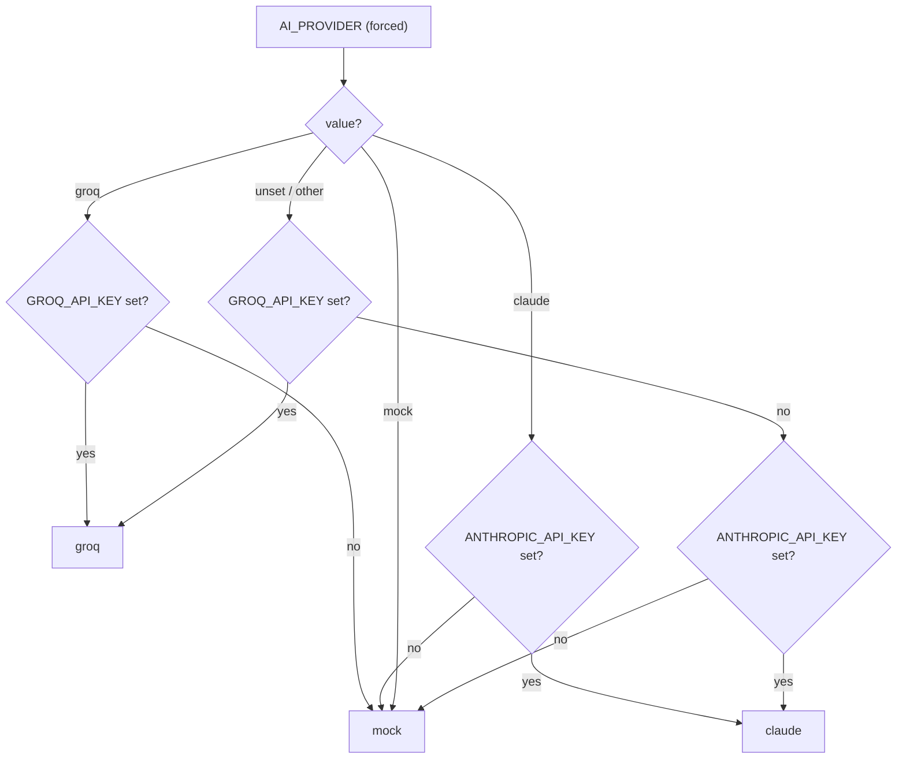
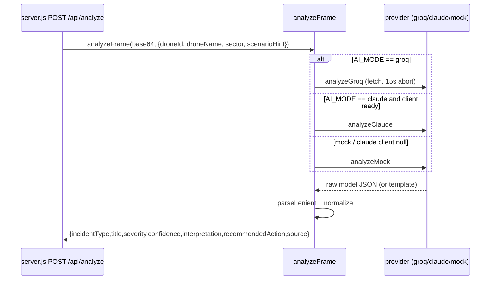
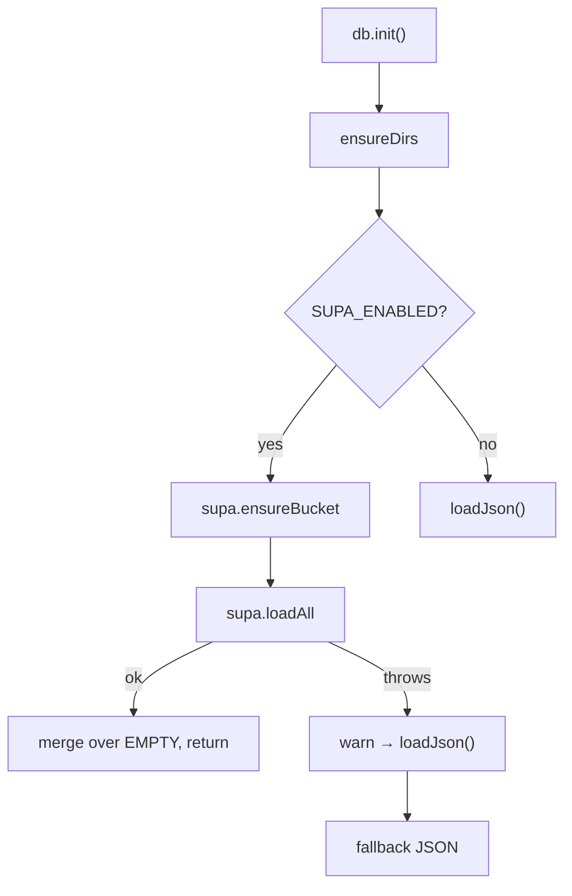
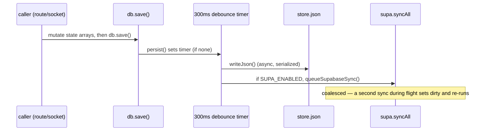
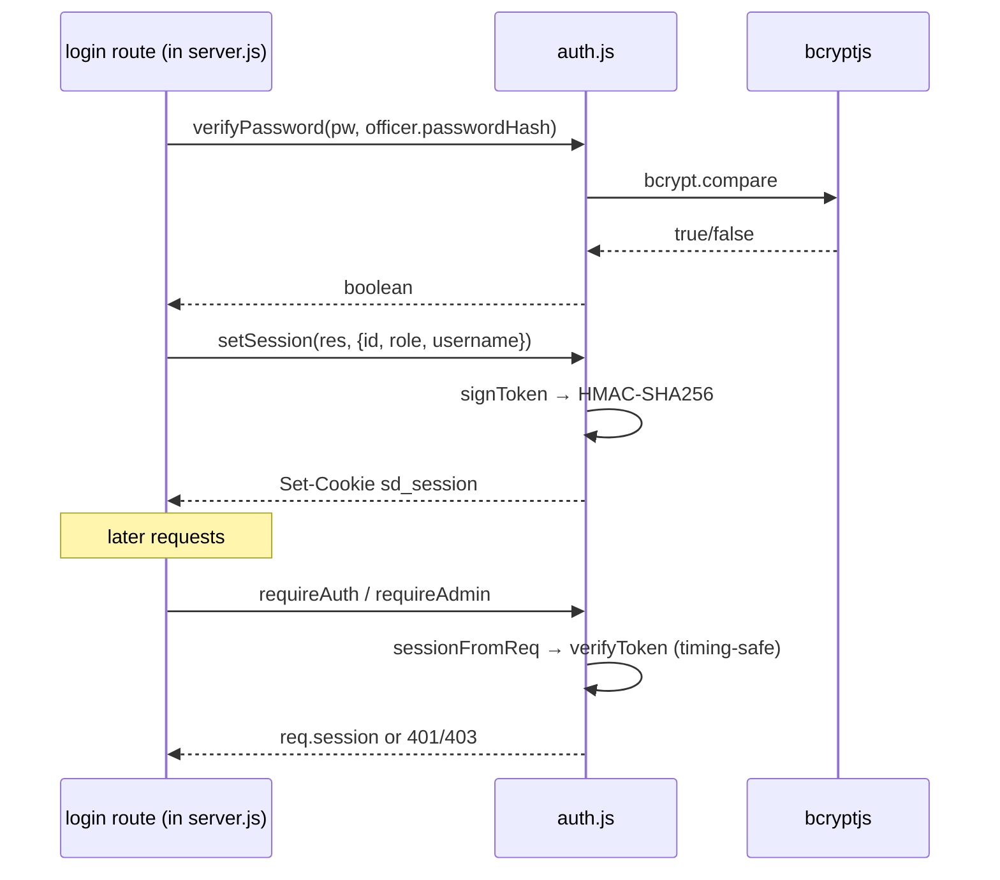
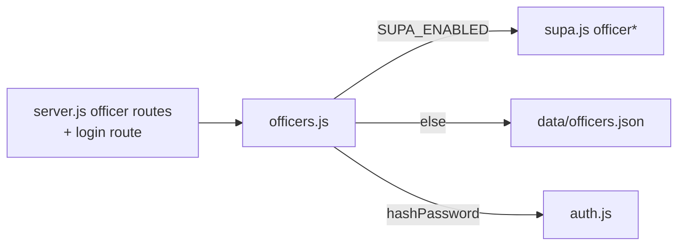

# Services Reference

Backend service modules of the **Smart City Drone Security System**. Every module lives under `src/` and is a native ES module (`"type": "module"` in `package.json`). This reference documents, for each module: its responsibilities, public methods (with signatures), dependencies, data flow, and error handling.

All citations are `file:line` against the actual source.

---

## Module map

The application entry point is `server.js`, which imports every service module and wires them into HTTP routes and Socket.IO handlers (`server.js:16-29`).



Key structural facts:

- `ai.js` depends on `incidents.js` for the incident catalogue that drives its prompt and schema (`ai.js:13`).
- `db.js` depends on `supa.js` for the optional cloud backend (`db.js:11`); `supa.js` has no dependency on `db.js`.
- `seed.js` depends on `db.js` to persist the seeded fleet (`seed.js:3`).
- `officers.js` depends on both `supa.js` (cloud store) and `auth.js` (`hashPassword` for the seeded admin) (`officers.js:7-8`).
- `geo.js` and `incidents.js` are leaf modules with **no internal dependencies** (only standard library / none).

---

## 1. `incidents.js` — Incident catalogue

### Responsibilities

Single source of truth for the 18 incident types the drone AI can report. The catalogue drives the AI prompt, the JSON schema, the client dropdowns, and the map legend so they can never drift apart (`ai.js:46-50`).

### Dependencies

None. Pure data + a lookup helper.

### Public exports

| Export | Type | Description | Line |
|---|---|---|---|
| `INCIDENT_TYPES` | object | Map of `key → metadata`, 18 entries | `incidents.js:7-98` |
| `INCIDENT_KEYS` | `string[]` | `Object.keys(INCIDENT_TYPES)` | `incidents.js:100` |
| `SEVERITY_RANK` | object | `{ none:0, low:1, medium:2, high:3, critical:4 }` | `incidents.js:102` |
| `meta(type)` | `(string) => object` | Returns `INCIDENT_TYPES[type]`, falling back to `INCIDENT_TYPES.normal` for unknown keys | `incidents.js:104-106` |

### Per-entry metadata shape

Each entry carries: `label`, `icon` (emoji, for `<option>` menus that can't render SVG), `lucide` (Lucide icon name), `color` (hex), `defaultSeverity`, `policeRelevant` (bool), and `hint` (`incidents.js:1-11` comment; `incidents.js:8-11` example).

The 18 keys are: `normal`, `building_fire`, `forest_fire`, `traffic_block`, `road_accident`, `person_alone_at_night`, `crowd_gathering`, `flood`, `suspicious_activity`, `weapon_threat`, `violence_assault`, `theft_robbery`, `medical_emergency`, `abandoned_object`, `stampede`, `building_collapse`, `animal_intrusion`, `electrical_hazard`.

Only `normal` is `policeRelevant: false` with `defaultSeverity: 'none'` (`incidents.js:8-11`); every other type is `policeRelevant: true`.

### Data flow

`server.js` re-exports the raw catalogue to clients via `GET /api/config` as `incidentTypes` (`server.js:296`), and imports `meta` for severity/label lookups (`server.js:21`). `ai.js` consumes `INCIDENT_TYPES`, `INCIDENT_KEYS`, and `meta` (`ai.js:13`).

### Error handling

`meta()` never throws: unknown types fall back to the `normal` entry (`incidents.js:104-106`).

---

## 2. `ai.js` — Frame → incident analysis

### Responsibilities

Analyze a single drone-camera frame (base64 JPEG) and return a normalized incident verdict. Supports three providers, auto-selected or forced via `AI_PROVIDER`:

- **`groq`** — Groq's OpenAI-compatible vision API (needs `GROQ_API_KEY`) (`ai.js:4`).
- **`claude`** — Anthropic Claude vision (needs `ANTHROPIC_API_KEY`) (`ai.js:5`).
- **`mock`** — rule/scenario-based, fully offline, no key needed (`ai.js:6`).

All three return the **same shape**: `{ incidentType, title, severity, confidence, interpretation, recommendedAction, source }` (`ai.js:8-10`).

### Dependencies

- `@anthropic-ai/sdk` (`Anthropic`) — only instantiated when the provider is `claude` (`ai.js:12, 36-38`).
- `incidents.js` — `INCIDENT_TYPES`, `INCIDENT_KEYS`, `meta` (`ai.js:13`).
- Global `fetch` for the Groq HTTP call (`ai.js:172`).

### Provider selection

`decideProvider()` runs once at module load into the exported constant `AI_MODE` (`ai.js:17-25`). `forced = (process.env.AI_PROVIDER || '').toLowerCase()` (`ai.js:16`).



Note: when **both** keys are present in auto mode, **Groq wins over Claude** (`ai.js:21-22`).

### Public exports

| Export | Type | Description | Line |
|---|---|---|---|
| `AI_MODE` | `string` | Resolved provider: `'groq' \| 'claude' \| 'mock'` | `ai.js:25` |
| `AI_LABEL` | `string` | Human label: `'Groq Vision' \| 'Claude Vision' \| 'Standby'` | `ai.js:32-33` |
| `analyzeFrame(imageBase64, context = {})` | `async (string, object) => verdict` | Main entry point; returns the normalized verdict object | `ai.js:402-424` |

`context` fields consumed: `droneName`, `droneId`, `sector` (for the user prompt, `ai.js:118-120`) and `scenarioHint` (mock-only, `ai.js:383`).

### Configuration constants

- `CLAUDE_MODEL = process.env.AI_MODEL || 'claude-opus-4-8'` — note the env var is `AI_MODEL`, not a Claude-specific name (`ai.js:27`).
- `GROQ_MODEL = process.env.GROQ_MODEL || 'meta-llama/llama-4-scout-17b-16e-instruct'` (`ai.js:30`).

### Internal pipeline

| Function | Purpose | Line |
|---|---|---|
| `normalize(raw, source)` | Coerces any raw model output into the canonical verdict shape (see below) | `ai.js:78-100` |
| `parseLenient(text)` | Tolerant JSON parse — retries by extracting the substring between the first `{` and last `}`; returns `{}` on total failure | `ai.js:103-116` |
| `USER_TEXT(ctx)` | Builds the per-frame user prompt from drone/sector context | `ai.js:118-120` |
| `analyzeClaude(...)` | Calls Anthropic `messages.create` (image block + text block) | `ai.js:123-141` |
| `analyzeGroq(...)` | POSTs to Groq's chat/completions endpoint | `ai.js:144-191` |
| `analyzeMock(...)` | Builds a plausible verdict from `MOCK_TEMPLATES` + `AUTO_WEIGHTS` | `ai.js:382-400` |

**`normalize()` rules** (`ai.js:78-100`): `incidentType` must be in `INCIDENT_KEYS` else `'normal'`; `confidence` non-finite → `0.6`, values `>1` divided by 100 (handles a 0–100 scale), then clamped to `[0,1]`; `title` → `raw.title || m.label`, capped 120 chars; `severity` validated against the five-value enum else `m.defaultSeverity`; `interpretation` capped 600 chars; `recommendedAction` capped 300 chars with a police-relevant default. The incoming `raw` uses **snake_case** keys (`incident_type`, `recommended_action`); the output is **camelCase**.

**Claude request** (`ai.js:123-141`): `model=CLAUDE_MODEL`, `max_tokens:1024`, `system=SYSTEM_PROMPT`, one user message whose content array is an image block (`type:'image'`, `source:{type:'base64', media_type:'image/jpeg', data:imageBase64}`) followed by a text block; passes `output_config: { format: { type:'json_schema', schema: ANALYSIS_SCHEMA } }` (`ai.js:137`). The response's first `type:'text'` block is fed through `parseLenient` → `normalize(..., 'claude-vision')` (`ai.js:139-140`).

**Groq request** (`ai.js:144-191`): POST `https://api.groq.com/openai/v1/chat/completions` (`ai.js:172`) with `model=GROQ_MODEL`, `temperature:0.2`, `max_tokens:500`; the system message appends an instruction to respond with **only** a JSON object with the exact six keys (`ai.js:153-155`); the user content is a text block plus an `image_url` data URI (`ai.js:160-161`). Auth via `Bearer ${GROQ_API_KEY}` header (`ai.js:175`). Response parsed from `data.choices[0].message.content` → `normalize(..., 'groq-<last path segment of GROQ_MODEL>')` (`ai.js:189-190`).

**Mock generation** (`ai.js:382-400`): picks a type from `context.scenarioHint`; if falsy, `'auto'`, or not a known key, draws from `AUTO_WEIGHTS` via `weightedPick()` (`ai.js:359-379`). `AUTO_WEIGHTS` only spans 9 of the 18 types (`ai.js:359-369`) — the other 9 (e.g. `weapon_threat`, `medical_emergency`) are only reachable via an explicit `scenarioHint`. Confidence is a random value inside the template's `[lo, hi]` range to 2 decimals (`ai.js:388`); severity comes from `meta(type).defaultSeverity` (`ai.js:393`); source is `'mock-simulation'` (`ai.js:398`).

### Data flow



`server.js` calls `analyzeFrame(stripBase64(image), {...})` from `POST /api/analyze` (`server.js:333`), then persists an image via `saveImage` and may raise an alert (`server.js:353` onward). `AI_MODE` and `AI_LABEL` are surfaced to clients via `GET /api/config` (`server.js:296`).

### Error handling

`analyzeFrame` wraps the real-provider calls in try/catch (`ai.js:402-424`):

- **Groq timeout/abort**: an `AbortController` fires after 15 s (`ai.js:168-169`), cleared in `finally` (`ai.js:181-183`); an aborted or non-OK response throws (`ai.js:184-187`).
- On **any** thrown error from a real provider, it logs a warning and returns a normalized **"All clear"** verdict (`incident_type:'normal'`, `severity:'none'`, `confidence:0.5`) with source `` `${AI_MODE}-unavailable` `` (`ai.js:410-421`). This is a deliberate design choice — it does **not** invent a random incident on failure, which previously caused false alerts (`ai.js:407-409`).
- If the Claude client failed to construct at load time, `claude` stays `null` (`ai.js:35-42`) and `analyzeFrame` falls through to `analyzeMock` (`ai.js:405, 423`).
- `parseLenient` swallows all JSON errors and returns `{}`, which `normalize` then fills entirely from defaults (`ai.js:103-116`).

**Note:** the Claude path has **no** timeout/abort (unlike Groq); mock is synchronous with no I/O.

---

## 3. `geo.js` — Distance + drone selection

### Responsibilities

Small geo helpers operating on plain `{ lat, lng }` degree coordinates (`geo.js:1`): great-circle distance and dispatchable-drone ranking.

### Dependencies

None.

### Public exports

| Function | Signature | Description | Line |
|---|---|---|---|
| `haversineKm(a, b)` | `({lat,lng}, {lat,lng}) => number` | Great-circle distance in **km**; Earth radius `R = 6371` km; result clamped via `Math.min(1, …)` before `asin` | `geo.js:5-15` |
| `findNearbyDrones(target, drones, opts)` | `(target, drones[], {radiusKm=3, minCount=3}) => drone[]` | Ranks dispatchable drones by distance | `geo.js:22-31` |

### `findNearbyDrones` logic

A drone is **dispatchable** only if `connected === true` **and** `status !== 'dispatched'` **and** `!activeDispatchId` **and** `typeof lat === 'number'` (`geo.js:24`). Each surviving drone is annotated with `distanceKm` and sorted ascending (`geo.js:25-26`). If any are within `radiusKm`, it returns those up to 4; otherwise it returns the nearest `minCount` online drones regardless of distance (`geo.js:28-30`), because only online (phone-controlled) drones can actually be dispatched (`geo.js:18-21`).

### Data flow

`server.js` calls `findNearbyDrones({lat,lng}, db.drones(), {radiusKm})` from `POST /api/dispatches` (`server.js:496`) and uses `haversineKm` in `checkArrival` to detect a drone reaching its dispatch target (`server.js:280`, compared against `ARRIVAL_RADIUS_KM = 0.02`). `drone.js` on the client also uses a haversine of its own for the on-screen tracker.

### Error handling

No try/catch; both functions are pure math over provided data. `findNearbyDrones` guards against non-numeric `lat` in its filter (`geo.js:24`), so drones without coordinates are silently excluded.

---

## 4. `seed.js` — Fleet + landmarks

### Responsibilities

Seed and reconcile a fleet of 4 surveillance drones around Kozhikode, and export named landmarks/home positions police can dispatch to (`seed.js:1-2`).

### Dependencies

- `db.js` — reads `db.drones()` / `db.dispatches()` and writes via `db.setDrones()` (`seed.js:3, 18, 49, 55`).

### Public exports

| Export | Type | Description | Line |
|---|---|---|---|
| `seedFleet()` | `() => void` | Reconciles the in-memory fleet to match `FLEET` | `seed.js:15-57` |
| `HOME_POSITIONS` | object | `drone-N → {lat,lng}` base coordinates | `seed.js:63` |
| `LANDMARKS` | `object[]` | 10 named places with coords | `seed.js:65-76` |
| `CITY_CENTER` | object | `{ lat: 11.2588, lng: 75.7804 }` (Kozhikode) | `seed.js:5, 78` |

### `seedFleet()` reconciliation

`FLEET` is 4 drones, IDs `drone-1 … drone-4`, spread across sectors (`seed.js:8-16`). The function keeps existing drones whose id is in `FLEET`, adds any missing, and drops extras (e.g. after shrinking 8 → 4) (`seed.js:20-47`):

- **New drone defaults** (`seed.js:26-38`): `status:'monitoring'`, `battery: 70 + random(0..29)`, `connected:false`, `liveView:false`, `activeDispatchId:null`, `lastSeen:null`.
- **Existing drone reset** (`seed.js:39-46`): refresh `name`/`sector`; force `connected=false`, `liveView=false`; downgrade `status` from `dispatched`/`alerting` → `monitoring`; clear `activeDispatchId`.
- Any dispatch still `active` from before restart is closed to `status:'resolved'` with `resolvedAt` = now ISO (`seed.js:48-54`).
- Persists via `db.setDrones(kept)` and logs the final count (`seed.js:55-56`).

### Data flow

Called once during startup, immediately after `db.init()` (`server.js:1188`). `CITY_CENTER` and `LANDMARKS` are re-exported to clients via `GET /api/config` (`server.js:296`).

### Error handling

None — a deterministic in-memory reconciliation. Durability is delegated to `db.setDrones()` → `persist()`.

---

## 5. `db.js` — In-memory state + durable mirror

### Responsibilities

The persistence layer. It holds all app state **in memory** (so the rest of the app stays synchronous) and mirrors every change to a durable backend: Supabase Postgres when configured, otherwise a local `data/store.json`. The JSON file is **always** written as an offline backup regardless of Supabase (`db.js:1-6`).

### Dependencies

- `node:fs`, `node:path`, `node:url` (`db.js:8-10`).
- `supa.js` — the optional cloud backend (`db.js:11`).

### Paths

- `DATA_DIR = ../data` (`db.js:14`), `STORE_FILE = ../data/store.json` (`db.js:15`), `UPLOAD_DIR = ../data/uploads` — **exported** (`db.js:16`).

### State shape

`EMPTY = { drones: [], alerts: [], dispatches: [], mainForce: [] }` (`db.js:23`); `state` is a `structuredClone(EMPTY)` (`db.js:25`).

### Public exports

`UPLOAD_DIR` (const) and the `db` object (`db.js:129-178`):

| Member | Signature | Behavior | Line |
|---|---|---|---|
| `state` (getter) | `get state()` | Returns the live `state` object | `db.js:130-132` |
| `drones()` | `() => Array` | `state.drones` | `db.js:133` |
| `alerts()` | `() => Array` | `state.alerts` | `db.js:134` |
| `dispatches()` | `() => Array` | `state.dispatches` | `db.js:135` |
| `mainForce()` | `() => Array` | `state.mainForce` | `db.js:136` |
| `find(collection, id)` | `(string, id) => obj\|undefined` | `state[collection].find(x => x.id === id)` | `db.js:138-140` |
| `save()` | `() => void` | Debounced persist (300 ms) | `db.js:142-144` |
| `flush()` | `() => void` | Immediate synchronous JSON write | `db.js:146-148` |
| `setDrones(list)` | `(Array) => void` | Replaces `state.drones`, persists | `db.js:150-153` |
| `reset()` | `() => void` | Resets state to `EMPTY`, persists | `db.js:155-158` |
| `init()` | `async () => void` | Load state from Supabase or JSON | `db.js:161-178` |

There are **no** setter methods for `alerts`/`dispatches`/`mainForce`; callers mutate the arrays returned by the getters in place, then call `db.save()` (`db.js:133-148`).

### Load precedence (`db.init`)



If `SUPA_ENABLED`, it ensures the Storage bucket then loads all tables and merges the result over `EMPTY` (`db.js:163-171`); on any error it warns and falls back to `loadJson()` (`db.js:172-176`).

### Persistence internals (not exported)

| Function | Purpose | Line |
|---|---|---|
| `ensureDirs()` | `mkdir` DATA_DIR + UPLOAD_DIR recursively | `db.js:18-21` |
| `loadJson()` | Read/parse `store.json`, merge over `EMPTY`; on error warns and resets to `EMPTY` | `db.js:28-38` |
| `queueSupabaseSync()` | Coalesced, serialized async `supa.syncAll(state)`; if a sync is in-flight, sets `dirty` and re-runs after | `db.js:41-59` |
| `writeJson()` | Serialized async JSON write; overlapping writes deferred via `writeAgain` | `db.js:63-82` |
| `persist()` | **Debounced 300 ms**; on fire writes JSON and, if `SUPA_ENABLED`, queues a Supabase sync | `db.js:85-92` |
| `flushSync()` | Synchronous immediate JSON write; clears the pending timer | `db.js:95-105` |
| `shutdown()` | On `SIGINT`/`SIGTERM`: `flushSync` locally, then (if Supabase) a bounded flush, then `process.exit(0)` | `db.js:108-125` |

### Data flow



### Error handling

- `loadJson()` catches parse/read errors, warns, resets to `EMPTY` (`db.js:34-37`).
- `queueSupabaseSync()` catches sync errors and only warns — a Supabase failure never breaks the running app (`db.js:51`).
- `writeJson()` catches write errors and logs them (`db.js:73-74`).
- `flushSync()` swallows errors best-effort on exit (`db.js:100-104`).
- `shutdown()` bounds the final Supabase flush with a 4 s `Promise.race` timeout so shutdown can never hang, catching and warning on failure (`db.js:115-123`). It is registered on `SIGINT`/`SIGTERM`, and `flushSync` is also bound to `process.on('exit')` (`db.js:126-127`).

---

## 6. `supa.js` — Supabase Postgres + Storage adapter

### Responsibilities

Optional cloud persistence: Postgres tables plus an image Storage bucket. Enabled only when `SUPABASE_URL` **and** `SUPABASE_SECRET_KEY` are both set; otherwise the app uses the local JSON store (`supa.js:1-3`).

### Dependencies

- `@supabase/supabase-js` (`createClient`) — the client is constructed **only** when enabled, with `{ auth: { persistSession: false } }` (`supa.js:5, 12-13`).

### Backend-selection flag

```js
export const SUPA_ENABLED = !!(URL && KEY);   // supa.js:7-9
export const BUCKET = 'drone-images';          // supa.js:10
```

### camelCase ↔ snake_case conversion

The app uses camelCase; DB columns are snake_case. Only **top-level** keys (column names) are converted — nested `jsonb` values keep their camelCase (`supa.js:15-20`). Helpers: `camelToSnake`, `snakeToCamel`, `toRow` (`undefined` → `null`), `fromRow`.

### Diff-sync machinery

`COLLECTIONS` maps in-memory names to tables: `drones→drones`, `alerts→alerts`, `dispatches→dispatches`, `mainForce→main_force` (`supa.js:23-28`). A per-collection `lastSynced` `Map(id → serialized rowKey)` (`supa.js:33`) plus `rowKey(row)` (JSON of top-level-sorted keys, `supa.js:37-41`) let the adapter upsert **only** changed rows and delete **only** removed ones — a single GPS ping no longer re-upserts every row (`supa.js:30-32`).

### Public exports

| Function | Signature | Behavior | Line |
|---|---|---|---|
| `SUPA_ENABLED` | `boolean` | Whether the cloud backend is active | `supa.js:9` |
| `BUCKET` | `string` | `'drone-images'` | `supa.js:10` |
| `loadAll()` | `async () => {drones,alerts,dispatches,mainForce}` | `select('*')` (limit 10000) per table, map `fromRow`, seed `lastSynced` | `supa.js:43-52` |
| `syncAll(state)` | `async (state) => void` | Per-collection `syncTable`; isolates errors; throws joined message if any failed | `supa.js:86-97` |
| `ensureBucket()` | `async () => void` | Lists buckets; creates the public `drone-images` bucket if missing | `supa.js:99-109` |
| `uploadImage(buffer, name)` | `async (Buffer, string) => publicUrl` | Uploads as `image/jpeg`, `upsert:true`; returns the public URL | `supa.js:111-118` |
| `deleteImages(names)` | `async (string[]) => void` | Best-effort `.remove(names)` | `supa.js:121-123` |
| `clearImages()` | `async () => number` | Lists (limit 10000) and removes all objects; returns count | `supa.js:126-135` |
| `officersList()` | `async () => Officer[]` | `select('*')` ordered by `created_at` asc | `supa.js:146-150` |
| `officerByUsername(u)` | `async (string) => Officer\|null` | Case-insensitive `.ilike('username', u)` limit 1 | `supa.js:151-155` |
| `officerById(id)` | `async (string) => Officer\|null` | `.eq('id', id)` limit 1 | `supa.js:156-160` |
| `officerCreate(o)` | `async (Officer) => Officer` | Insert `offToRow(o)` | `supa.js:161-165` |
| `officerUpdate(id, patch)` | `async (string, patch) => Officer\|null` | Maps allowed keys and updates | `supa.js:166-173` |
| `officerRemove(id)` | `async (string) => true` | `.delete().eq('id', id)` | `supa.js:174-178` |

**Internal (not exported):** `deleteIds(table, ids)` — chunked-by-100 delete `.in('id', chunk)` to avoid URL-length overflow (`supa.js:54-61`); `syncTable(coll, table, records)` — computes changed rows, upserts, records `lastSynced` **only after** a successful upsert, then deletes removed ids (`supa.js:63-84`).

**Officer row mappers** (`supa.js:138-145`): DB columns `password_hash`, `badge_id`, `created_at` ↔ app `passwordHash`, `badgeId`, `createdAt`. `officerUpdate`'s allow-list explicitly **excludes `id` and `createdAt`** (`supa.js:167`).

### Data flow

`db.js` is the only internal consumer of `syncAll`/`loadAll`/`ensureBucket`. `server.js` uses `supa.SUPA_ENABLED` to branch image storage between `uploadImage` and local files (`server.js:196-212`), `deleteImages` to reclaim evicted frames (`server.js:230`), and `clearImages` for the admin image-clear route (`server.js:868`). `officers.js` delegates to the `officer*` functions when `SUPA_ENABLED` (`officers.js:29-53`).

### Error handling

- Every DB helper throws a prefixed `Error` on a Supabase error (e.g. `` `upsert ${table}: ${error.message}` ``, `supa.js:74`); `loadAll`/officer helpers likewise (`supa.js:47, 148`).
- `syncTable` records a row as synced **only** after a successful upsert, so a failed upsert retries on the next sync (`supa.js:75-76`).
- `syncAll` isolates each table so one table's failure doesn't block the others; it accumulates messages and throws a single joined error at the end (`supa.js:87-96`) — which `db.js` catches and downgrades to a warning.
- `ensureBucket` tolerates an "already exists" create error and only warns on `listBuckets` failure (`supa.js:101-108`).
- `deleteImages` is best-effort (no throw) (`supa.js:121-123`).

---

## 7. `auth.js` — Password hashing + signed-cookie sessions

### Responsibilities

Authentication primitives: bcrypt password hashing plus **stateless** sessions. A session is a mini-JWT (HMAC-SHA256 signed) stored in an httpOnly cookie, so it survives restarts without a server-side session store (`auth.js:1-3`).

### Dependencies

- `node:crypto` (HMAC, `timingSafeEqual`) (`auth.js:4`).
- `bcryptjs` (`auth.js:5`).

### Configuration

- `SECRET = process.env.AUTH_SECRET || 'dev-insecure-secret-change-me'` — warns if `AUTH_SECRET` is unset (`auth.js:7-9`).
- `COOKIE = 'sd_session'` (exported) (`auth.js:11`); `MAX_AGE_MS = 7 days` (`auth.js:12`).

### Public exports

| Function | Signature | Behavior | Line |
|---|---|---|---|
| `COOKIE` | `string` | Cookie name `'sd_session'` | `auth.js:11` |
| `hashPassword(pw)` | `async (any) => string` | `bcrypt.hash(String(pw), 10)` — cost factor **10** | `auth.js:17-19` |
| `verifyPassword(pw, hash)` | `async (any, string) => boolean` | `bcrypt.compare`; returns `false` on throw | `auth.js:20-22` |
| `signToken(payload)` | `(object) => string` | `` `${body}.${hmac(body)}` `` where body includes `exp = now + 7d` | `auth.js:24-27` |
| `verifyToken(token)` | `(string) => payload\|null` | Verifies HMAC (timing-safe) + expiry; returns `{id,role,username,exp}` else `null` | `auth.js:28-39` |
| `parseCookies(req)` | `(req) => object` | Parses the `Cookie` header, URL-decoding values | `auth.js:41-50` |
| `sessionFromReq(req)` | `(req) => payload\|null` | `verifyToken(parseCookies(req)[COOKIE])` | `auth.js:51-53` |
| `setSession(res, payload)` | `(res, object) => void` | Sets the signed cookie (`httpOnly`, `sameSite:'lax'`, conditional `secure`, 7-day `maxAge`) | `auth.js:54-59` |
| `clearSession(res)` | `(res) => void` | `res.clearCookie('sd_session', {path:'/'})` | `auth.js:60-62` |
| `requireAuth` | middleware | 401 if no session, else sets `req.session` | `auth.js:65-69` |
| `requireAdmin` | middleware | 401 if none, 403 `admin only` if `role !== 'admin'` | `auth.js:70-75` |
| `requireAuthPage` | middleware | Redirects to `/login` if no session | `auth.js:76-80` |
| `requireAdminPage` | middleware | Redirect `/login` if none, `/` if not admin | `auth.js:81-86` |

### Token mechanics

The token is **two** parts (`body.signature`), **not** a standard 3-part JWT — there is no separate header (`auth.js:24-27`). `body` is `base64url(JSON({...payload, exp}))`; the signature is `HMAC-SHA256(SECRET, body)` base64url (`auth.js:15, 25-26`). `verifyToken` splits on `.`, recomputes the HMAC, compares with `crypto.timingSafeEqual` (after a length check), parses the JSON body, and rejects a missing or past `exp` (`auth.js:28-39`).



The `secure` cookie flag is true when `NODE_ENV === 'production'` **or** `RENDER` is set (`auth.js:55`).

### Data flow

`server.js` imports the primitives and middleware (`server.js:22-25`) and wires the actual login/logout/photo/theme routes and the `/api/*` auth guard around them. `officers.js` imports `hashPassword` for the seeded default admin (`officers.js:8`).

### Error handling

- `verifyPassword` catches bcrypt errors and returns `false` rather than throwing (`auth.js:21`).
- `verifyToken` returns `null` on any malformation, signature mismatch, JSON parse failure, or expiry — it never throws (`auth.js:28-39`).
- The middleware short-circuits with `401`/`403` JSON (API guards) or redirects (page guards) (`auth.js:65-86`).

**Note:** `auth.js` defines only primitives and middleware. The concrete login route that calls `verifyPassword` + `setSession` lives in `server.js`, not this module.

---

## 8. `officers.js` — Officer account store

### Responsibilities

CRUD store for police login accounts. Uses Supabase when configured; otherwise a local `data/officers.json` file so local dev works without Supabase (`officers.js:1-2`). Also seeds a default admin on boot.

### Dependencies

- `node:fs`, `node:path`, `node:crypto`, `node:url` (`officers.js:3-6`).
- `supa.js` — the cloud store (`officers.js:7`).
- `auth.js` — `hashPassword` for the seeded admin (`officers.js:8`).

The backend is chosen **once at module load**: `const SUPA = supa.SUPA_ENABLED;` (`officers.js:12`).

### Public exports

| Function | Signature | Behavior | Line |
|---|---|---|---|
| `newId()` | `() => string` | `` `off_${Date.now().toString(36)}${randomBytes(3).hex}` `` | `officers.js:14-16` |
| `listOfficers()` | `async () => Officer[]` | Supabase `officersList()` or `loadJson()` | `officers.js:28-31` |
| `findByUsername(u)` | `async (string) => Officer\|null` | Supabase or case-insensitive JSON find | `officers.js:32-35` |
| `findById(id)` | `async (string) => Officer\|null` | Supabase or JSON find | `officers.js:36-39` |
| `createOfficer(o)` | `async (Officer) => Officer` | Supabase insert or push + `saveJson` | `officers.js:40-43` |
| `updateOfficer(id, patch)` | `async (string, patch) => Officer\|null` | Supabase or JSON merge; `null` if not found | `officers.js:44-50` |
| `removeOfficer(id)` | `async (string) => true` | Supabase or JSON filter-out + save | `officers.js:51-54` |
| `publicOfficer(o)` | `(Officer) => Officer\|null` | Strips `passwordHash`; `null` if falsy | `officers.js:57-61` |
| `seedDefaultAdmin()` | `async () => void` | Seeds a default admin if none exists | `officers.js:64-75` |

**Internal:** `loadJson()` (parse file or `[]` on error, `officers.js:18-20`), `saveJson(list)` (mkdir + write pretty JSON, `officers.js:21-26`).

### Default-admin seeding

`seedDefaultAdmin()` (`officers.js:64-75`): if no officer has `role === 'admin'`, it creates one with `username:'admin'`, password `process.env.ADMIN_PASSWORD || 'admin123'`, `name:'System Administrator'`, `badgeId:'ADMIN-001'`, `station:'Control HQ'`, `photo:null`, `role:'admin'`, `active:true`, `createdAt` = ISO now, and `passwordHash = await hashPassword(pw)`. It warns if `ADMIN_PASSWORD` is unset (`officers.js:68-69`).

### Data flow



`server.js` imports the full CRUD surface plus `publicOfficer`, `seedDefaultAdmin`, and `newId` (`server.js:26-29`), and calls `seedDefaultAdmin()` during startup (inside try/catch). `publicOfficer` is the standard projection returned to clients (never leaking the bcrypt hash).

### Error handling

- `loadJson()` returns `[]` on any read/parse error (`officers.js:19`).
- `saveJson()` catches and logs write failures without throwing (`officers.js:25`).
- `updateOfficer` returns `null` when the id is not found in the JSON path (`officers.js:48`).
- Supabase-path errors propagate from `supa.js` (which throws prefixed errors); the caller in `server.js` is responsible for translating them to HTTP responses.

---

## Cross-cutting notes

- **Backend selection is global and load-time.** `SUPA_ENABLED` is computed once (`supa.js:9`) and captured by both `db.js` (per-call checks) and `officers.js` (`const SUPA`, `officers.js:12`). The local JSON store and Supabase are never used simultaneously for reads, but `db.js` **always** writes the local JSON backup even in Supabase mode (`db.js:6, 90`).
- **Image storage** is orchestrated in `server.js` (`storeBuffer`/`saveImage`/`saveImageBuffer`), which routes to `supa.uploadImage` (with one retry, no local fallback) when enabled, else writes to `UPLOAD_DIR` (`server.js:193-222`).
- **The seeded default admin password** defaults to `admin123` when `ADMIN_PASSWORD` is unset, and the session secret defaults to `dev-insecure-secret-change-me` when `AUTH_SECRET` is unset — both emit startup warnings and should be overridden in production (`officers.js:67-69`, `auth.js:7-9`).
