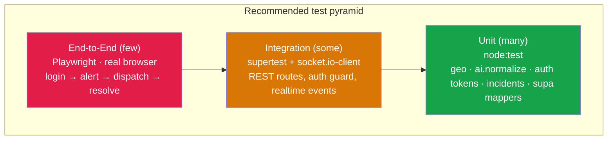
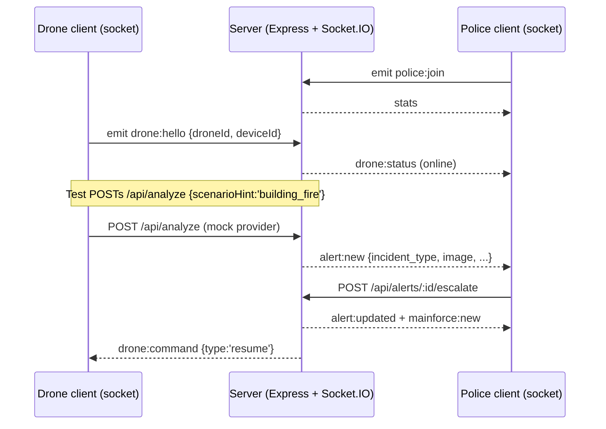
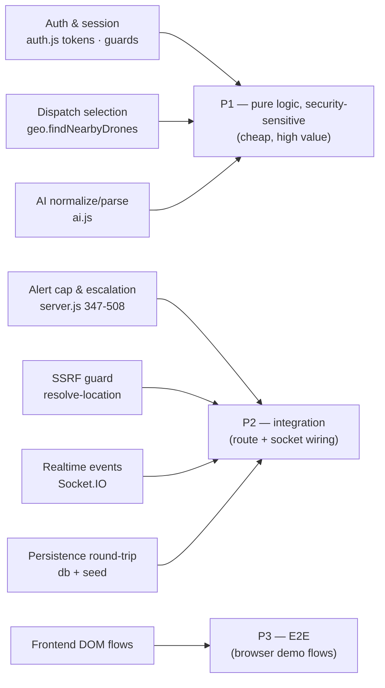

# Testing Guide — Smart City Drone Security System

This document describes the **current testing status**, a recommended **testing
strategy**, and concrete **unit / integration / end-to-end (E2E)** test suggestions
for the Smart City Drone Security System (Node.js + Express 5 + Socket.IO backend,
static-HTML/vanilla-JS frontend).

> Grounding note: every claim below is tied to the actual repository. Where the
> codebase currently contains nothing, that is stated plainly rather than invented.

---

## 1. Current test status

**There is no automated test suite in this repository.** This was verified, not
assumed:

| Evidence checked | Result |
|---|---|
| `scripts` in `package.json` | Only `start` (`node server.js`) and `dev` (`node --watch server.js`) — **no `test` script** (`package.json:10-13`). |
| Test-runner dependency (jest / vitest / mocha / ava / node:test config) | **None** in `dependencies` (`package.json:23-32`). There is no `devDependencies` block at all. |
| Test files in project source (`*.test.js`, `*.spec.js`, `test/`, `tests/`, `__tests__/`) | **None** outside `node_modules/`. The only matches are inside third-party packages (e.g. `node_modules/@stablelib/base64/…`, `node_modules/pg-protocol/…`), which are vendored dependency tests, not this project's. |
| Test-runner config (`jest.config.*`, `vitest.config.*`, `playwright.config.*`, `.mocharc*`) | **None found** in the project root. |
| Continuous integration config (`.github/workflows/…`) | **None found** — there is no `.github/` directory. |
| Health/smoke check | The only automated verification is the Render deploy **health check** hitting `GET /api/stats` (`render.yaml:12`), which is a liveness probe, not a test. |

**Conclusion:** existing automated tests are **none found**. Everything in
Sections 3–9 is a *recommendation* for work that does not yet exist.

---

## 2. What "testing" means for this project today

Currently the project is validated **manually**, via the demo flows documented in
`README.md`:

- The **simulation ("mock") AI mode** lets the whole system run with no API key
  and no internet — provider auto-selection falls back to `mock` when neither
  `GROQ_API_KEY` nor `ANTHROPIC_API_KEY` is set (`src/ai.js:16-25`). This makes the
  app fully exercisable offline, which is ideal for deterministic tests.
- The **local JSON store** is used automatically when Supabase env vars are unset
  (`SUPA_ENABLED = !!(URL && KEY)`, `src/supa.js:7-9`; load path `db.init()`,
  `src/db.js:161-178`). Tests can run against `data/store.json` with no external
  database.
- The manual **"Suggested demo script"** (`README.md:127-143`) — autonomous alert
  → review/escalate/dismiss → dispatch → live stream → resolve — is effectively an
  informal E2E acceptance checklist that should be automated (Section 6).

---

## 3. Testing strategy

Adopt a standard **test pyramid**: many fast, isolated unit tests over the pure
logic; a focused band of integration tests over the HTTP + Socket.IO surface; a
thin layer of E2E tests over the two browser apps.



**Guiding principles**

1. **Force determinism through env.** Run the suite with `AI_PROVIDER=mock` (or no
   AI keys) so `analyzeFrame` never calls a live provider (`src/ai.js:16-25`), and
   with Supabase unset so the local JSON path is used (`src/supa.js:7-9`). Set a
   fixed `AUTH_SECRET` so signed-cookie sessions are reproducible
   (`src/auth.js:7`).
2. **Test pure logic in isolation first** — it is the cheapest, highest-value
   coverage and needs no server (Section 4).
3. **Isolate persistence.** The in-memory `state` plus debounced 300 ms JSON
   persistence (`src/db.js:85-92`) means tests should point `DATA_DIR` at a
   throwaway temp directory (or call `db.reset()`, `src/db.js:155-158`) and call
   `db.flush()` (`src/db.js:146-148`) to avoid cross-test bleed.
4. **Prefer the built-in runner.** `engines.node` is `>=20` (`package.json:7-8`),
   so Node's built-in `node:test` + `node:assert` runner is available with **zero
   new dependencies** — the lightest option for a student project with no build
   step.

---

## 4. Testability assessment (before writing tests)

Some code is trivially unit-testable; some needs a small refactor first. Call this
out honestly:

| Area | Testability | Note |
|---|---|---|
| `src/geo.js`, `src/incidents.js`, and the pure helpers in `src/ai.js` (`normalize`, `parseLenient`, `decideProvider`, `weightedPick`) | **Easy** — pure functions, deterministic, no I/O. |
| `src/auth.js` token/hash primitives (`signToken`/`verifyToken`, `hashPassword`/`verifyPassword`, `parseCookies`) | **Easy** — pure or self-contained; only depends on `AUTH_SECRET`. |
| `src/supa.js` row mappers (`toRow`/`fromRow`, `rowKey`) | **Easy** — pure transforms; the network functions require a Supabase mock. |
| REST endpoints in `server.js` | **Medium** — `server.js` calls `start()` at import time (`server.js:1218`) and binds `PORT`/`HTTPS_PORT`. It does **not** currently export `app`. To use `supertest` in-process you must either (a) refactor `server.js` to `export { app, server, io }` and gate `start()` behind an `if (import.meta.url === …)` guard, or (b) spawn the server as a child process and hit it over `http://127.0.0.1:PORT`. |
| Socket.IO event handlers | **Medium** — require a `socket.io-client` connection against a running server; ground truth for "online" is room membership, so tests must actually join rooms. |
| Frontend modules (`public/js/*.js`) | **Medium** — plain ES modules with no build step; the pure helpers in `common.js` (`esc`, `timeAgo`, `incidentMeta`, `THEMES`) are unit-testable, but DOM-driven code needs a browser (Playwright) or a DOM shim. |
| `startHttps()` / self-signed cert generation (`server.js:1139-1184`) | **Hard** — shells out to `openssl` via `spawnSync`; skip in CI (it is already skipped when `NODE_ENV=production` or `RENDER`/`RAILWAY_ENVIRONMENT` is set). |

---

## 5. Recommended tooling

None of these are currently installed — they are proposals:

| Layer | Recommended tool | Why |
|---|---|---|
| Unit | **`node:test` + `node:assert`** (built in, Node ≥ 20) | Zero dependencies, matches `engines.node >=20`. `vitest` is a fine alternative if watch-mode DX is wanted. |
| HTTP integration | **`supertest`** | Drives Express routes without a live port (needs the `export app` refactor in Section 4). |
| Realtime integration | **`socket.io-client`** | Same major line as the server's `socket.io ^4.8.3` (`package.json:31`); connects to test the events in `server.js`. |
| E2E | **`@playwright/test`** | Real Chromium; can grant camera permission and exercise both `/` and `/drone`. |
| Coverage | **`c8`** or `node --test --experimental-test-coverage` | Line/branch coverage for the unit + integration layers. |

Proposed `package.json` scripts (to add — **do not exist today**):

```jsonc
// scripts (recommended additions)
"test":       "node --test",
"test:watch": "node --test --watch",
"test:e2e":   "playwright test"
```

---

## 6. Suggested unit tests

These target pure, deterministic logic and should form the bulk of the suite.

### 6.1 `src/geo.js` — distance & nearest-drone selection

| Function | Case | Expected |
|---|---|---|
| `haversineKm(a,b)` (`geo.js:5-15`) | identical points | `0` |
| `haversineKm` | Mananchira → SM Street (`{11.251,75.775}` → `{11.247,75.781}`) | ≈ small positive km; assert within tolerance |
| `haversineKm` | antipodal-ish / clamp path | never `NaN` (the `Math.min(1, …)` clamp guards `asin`) |
| `findNearbyDrones` (`geo.js:22-31`) | drones with `connected:false` | excluded (only dispatchable drones returned) |
| `findNearbyDrones` | drone with `status:'dispatched'` or truthy `activeDispatchId` | excluded |
| `findNearbyDrones` | drone missing numeric `lat` | excluded |
| `findNearbyDrones` | 2 drones within `radiusKm`, 2 far | returns the in-radius ones (capped at 4) |
| `findNearbyDrones` | none within radius | returns nearest `minCount` (default 3) regardless of distance |
| `findNearbyDrones` | result ordering | ascending `distanceKm` |

### 6.2 `src/ai.js` — normalization, parsing, provider choice

| Function | Case | Expected |
|---|---|---|
| `decideProvider()` (`ai.js:16-24`) | `AI_PROVIDER=groq` + `GROQ_API_KEY` set | `'groq'`; with key **absent** → `'mock'` |
| `decideProvider()` | no override, both keys set | `'groq'` (Groq wins over Claude) |
| `decideProvider()` | no override, no keys | `'mock'` |
| `normalize(raw, source)` (`ai.js:78-100`) | unknown `incident_type` | coerced to `'normal'` |
| `normalize` | `confidence` = `85` (0–100 scale) | divided to `0.85`; clamped to `[0,1]` |
| `normalize` | `confidence` non-finite | defaults to `0.6` |
| `normalize` | missing `title`/`severity`/`interpretation` | filled from `meta(type)` defaults; strings sliced (title ≤120, interpretation ≤600, action ≤300) |
| `normalize` | invalid `severity` | replaced with `meta(type).defaultSeverity` |
| `parseLenient(s)` (`ai.js:103-116`) | clean JSON | parsed object |
| `parseLenient` | JSON wrapped in prose/fences | recovers substring `{ … }` |
| `parseLenient` | unparseable | returns `{}` (letting `normalize` fill defaults) |
| `analyzeMock(ctx)` (`ai.js:382-400`) | `scenarioHint` in `INCIDENT_KEYS` | uses that template; confidence within its `[lo,hi]` |
| `analyzeMock` | `scenarioHint='auto'`/absent | draws from `AUTO_WEIGHTS` (9 of 18 types) |

> Note: `analyzeFrame`'s real-provider failure path returns a fixed **"All clear"**
> normal result rather than a random incident (`ai.js:406-422`) — worth an explicit
> assertion using an injected throwing client if the module is refactored for DI.

### 6.3 `src/auth.js` — sessions & hashing

| Function | Case | Expected |
|---|---|---|
| `signToken` → `verifyToken` (`auth.js:24-39`) | round-trip a payload | returns `{ id, role, username, exp }` |
| `verifyToken` | tampered body (signature mismatch) | `null` (uses `crypto.timingSafeEqual`) |
| `verifyToken` | expired `exp` | `null` |
| `verifyToken` | malformed / missing dot | `null` |
| `hashPassword` + `verifyPassword` (`auth.js:17-22`) | correct password | `true` (bcrypt cost 10) |
| `verifyPassword` | wrong password / null hash | `false` (never throws) |
| `parseCookies` (`auth.js:41-50`) | multi-cookie header, URL-encoded value | correctly split + decoded |

The middleware (`requireAuth`/`requireAdmin`/`requireAuthPage`/`requireAdminPage`,
`auth.js:65-86`) can be unit-tested with fake `req/res/next` objects asserting
`401`/`403` JSON or `/login`/`/` redirects.

### 6.4 `src/incidents.js` — catalogue integrity

| Case | Expected |
|---|---|
| `INCIDENT_KEYS` length (`incidents.js:100`) | 18 keys |
| Every non-`normal` entry | `policeRelevant === true` |
| `meta('does_not_exist')` (`incidents.js:104-106`) | falls back to `INCIDENT_TYPES.normal` |
| `SEVERITY_RANK` (`incidents.js:102`) | monotonic `none<low<medium<high<critical` |
| `ANALYSIS_SCHEMA` enum (`ai.js:64-76`) | matches `INCIDENT_KEYS` exactly (guards drift) |

### 6.5 `src/supa.js` — pure row mappers

| Function | Case | Expected |
|---|---|---|
| `toRow` / `fromRow` (`supa.js:15-20`) | `{droneId, activeDispatchId}` | top-level camel↔snake (`drone_id`, `active_dispatch_id`); `undefined`→`null` |
| `toRow`/`fromRow` | nested jsonb (`frames`, `updates`) | inner keys **untouched** (only top level converts) |
| Officer mappers `offToRow`/`offFromRow` (`supa.js:138-145`) | `passwordHash`↔`password_hash`, `badgeId`↔`badge_id`, `createdAt`↔`created_at` | mapped both ways |
| `officerUpdate` allow-list (`supa.js:167`) | patch containing `id`/`createdAt` | those keys ignored |

---

## 7. Integration tests

Integration tests exercise the wiring: HTTP routes + the auth guard + Socket.IO
event emission + the in-memory/JSON persistence. **Prerequisite:** refactor
`server.js` to export `app`/`server`/`io` and guard the auto-`start()`
(`server.js:1218`), or spawn the server on an ephemeral port.

### 7.1 REST endpoints (supertest)

Prioritise the login-gated surface and the guard itself:

| Test | Endpoint(s) | Assertion |
|---|---|---|
| Auth guard blocks | any `/api/*` not in the open list, no cookie | `401` (guard at `server.js:122-127`) |
| Open endpoints stay open | `GET /api/config`, `GET /api/drones`, `POST /api/analyze` | reachable without a session (`OPEN_API`, `server.js:120`) |
| Open-by-regex frame relays | `POST /api/drones/:id/live/frame`, `POST /api/dispatches/:id/frame` | reachable without a session (`OPEN_API_RE`, `server.js:121`) |
| Login happy path | `POST /api/auth/login` `{username:'admin', password:…}` | `200` + `Set-Cookie: sd_session=…`; returns `publicOfficer` (no `passwordHash`) |
| Login failure | bad password | `401` |
| Admin-only guard | `GET /api/officers` with an officer (non-admin) session | `403 admin only` (`requireAdmin`, `auth.js:70-75`) |
| Config shape | `GET /api/config` | `{ aiMode, aiLabel, cityCenter, incidentTypes, landmarks }` (`server.js:295`) |
| Stats shape | `GET /api/stats` | `{ dronesOnline, dronesTotal, pendingAlerts, escalated, dismissed, activeDispatches, mainForce }` (`server.js:257-269`) |
| Analyze → alert | `POST /api/analyze` `{droneId, image, scenarioHint:'building_fire'}` in mock mode | `{ analysis, alert }`; alert appears in `GET /api/alerts` |
| Analyze cap | push > `MAX_ALERTS` (300) | never evicts a `pending_review` alert (`server.js:347-400`) |
| Dispatch — no drones online | `POST /api/dispatches` with all drones offline | `409` "no drones online" message (`server.js:499-508`) |
| Dispatch — all busy | online but all `dispatched` | `409` distinct "all busy" message |
| Escalate / dismiss | `POST /api/alerts/:id/escalate` then re-escalate | first `200` (creates main-force record), second `409` (already reviewed) |
| Clear-images key guard | `POST /api/admin/clear-images` wrong `secretKey` | `403` (default key `police2026`, `server.js:39,862`) |
| SSRF guard | `POST /api/resolve-location` `{url}` to a non-allowlisted host | `400/422/502`, never fetches (`MAP_HOSTS` allowlist, `server.js:779`) |

### 7.2 Real-time flow (socket.io-client)

The autonomous-alert path, end to end through the socket layer:



Integration cases worth automating around this diagram:

- `drone:hello` marks the drone online and emits `drone:status` to `police`
  (`server.js:959-1012`); a second device claiming the same drone triggers
  `drone:taken` (`server.js:967`).
- After `POST /api/analyze` yields an alert, the joined police socket receives
  `alert:new` (`server.js:396`).
- `POST /api/dispatches` emits `dispatch:new` to police and `drone:command`
  (`type:'dispatch'`) to the assigned drone room (`server.js:537,550`).
- `drone:location` within `ARRIVAL_RADIUS_KM` (0.02 km / 20 m, `server.js:41`)
  triggers a `dispatch:arrived` broadcast (`server.js:290`, `checkArrival`).
- The 10 s safety sweep reconciles the `connected` flag against real room presence
  and emits `drone:status`/`stats` on change (`server.js:1107-1123`) — testable by
  disconnecting a socket and asserting the drone flips offline.

### 7.3 Persistence integration

- With Supabase unset, mutating an alert then calling `db.flush()`
  (`src/db.js:146-148`) writes `data/store.json`; reloading via `db.init()`
  (`src/db.js:161-178`) round-trips the state. Point `DATA_DIR` at a temp folder
  per test.
- `seedFleet()` reconciliation (`src/seed.js:15-57`): starting from 8 stored
  drones, seeding down to the 4-drone `FLEET` drops extras and resets transient
  fields (`connected:false`, downgraded `status`).

---

## 8. End-to-end tests

E2E tests drive the real browser apps at `/` (police portal) and `/drone` (drone
camera unit). Automate the README demo script (`README.md:127-143`) with Playwright,
launching the server in `AI_PROVIDER=mock` mode.

Recommended Playwright setup notes:
- Grant camera permission via browser context (`permissions: ['camera']`) and use
  Chromium's `--use-fake-device-for-media-stream` / fake video so `getUserMedia`
  and the `<video id="video">` capture (`drone.js` `captureFrame`) work headless.
- Log in first — `/` and `/admin` are gated (`requireAuthPage`/`requireAdminPage`,
  `server.js:64-65`); `/drone` stays open (`server.js:66`). Seed the default admin
  via `ADMIN_PASSWORD` (auto-seeded, `src/officers.js:64-75`).

| Scenario | Steps | Assertion |
|---|---|---|
| **Login gating** | Visit `/` with no cookie | redirected to `/login` |
| **Admin-only UI** | Log in as officer vs admin | `#clearImgBtn` / `#resetBtn` hidden for non-admin (`index.html:23-24`) |
| **Autonomous alert** | `/drone`: Start camera → scenario *Building Fire* → Scan now | a 🔥 alert card appears in `#alertsPending` on `/` with image + interpretation; alarm/sound fires (`portal.js` `startAlarm`) |
| **Escalate** | Portal: open alert → **Escalate to Main Force** | record appears in `#mfList`; drone status strip shows "resume monitoring" |
| **Dismiss (false alarm)** | Second alert → **Dismiss** | alert moves to history (`#alertsHistory`) |
| **Dispatch & surround** | Fleet Map: click near a drone → Dispatch form fills → set type + description → **Dispatch nearest drones** | dispatch card appears; drone app switches to live streaming; frames render in the dispatch live grid |
| **Live view on demand** | Fleet Map: **📹 Live view** on an online drone | `#liveImg` receives frames; drone shows "🔴 police viewing" (`#liveChip`) |
| **Convey + resolve** | Type an update in "Convey to main force" → **Resolve** | main-force log updated; dispatch marked resolved; drones freed |
| **Reset demo** | Admin: **Reset demo** | alerts/dispatches/logs cleared, fleet retained (`POST /api/admin/reset`, `server.js:714`) |
| **Theme persistence** | Change theme in the officer sidebar | `data-theme` updates and persists (`localStorage['sd-theme']` + `POST /api/auth/theme`) |

---

## 9. Test environment & data

Run the whole suite with **no external services**:

```bash
# Recommended test env (deterministic, offline)
AI_PROVIDER=mock            # forces src/ai.js decideProvider() → 'mock'
AUTH_SECRET=test-secret     # reproducible signed-cookie sessions (auth.js:7)
ADMIN_PASSWORD=test-admin   # known default-admin credentials (officers.js:67)
# leave SUPABASE_URL / SUPABASE_SECRET_KEY UNSET → local JSON store (supa.js:9)
# point DATA_DIR / STORE_FILE at a temp dir per run if the modules are made configurable
```

Data considerations:
- `scenarioHint` in `/api/analyze` makes mock analysis deterministic per incident
  type — use it to produce specific alerts on demand (`src/ai.js:382-400`).
- The 300 ms debounced persistence (`src/db.js:85-92`) means tests must call
  `db.flush()` before asserting file contents, and `db.reset()` between tests.
- Skip the HTTPS listener in CI — it already no-ops when `NODE_ENV=production` or
  `RENDER`/`RAILWAY_ENVIRONMENT` is set (`server.js:1167-1169`), avoiding the
  `openssl` `spawnSync` dependency.

---

## 10. Missing tests & coverage priorities

Because the suite is empty, **everything is missing**. Prioritise by risk:



**Suggested order of work**

1. **P1 (unit):** `geo.js`, `ai.js` pure helpers, `auth.js` tokens/hashing,
   `incidents.js`, `supa.js` mappers — no server, no refactor needed.
2. **Refactor `server.js`** to export `app` (and gate `start()`), unlocking
   supertest.
3. **P2 (integration):** auth guard, `/api/analyze` → `alert:new`, dispatch `409`
   branches, escalate/dismiss `409`, SSRF guard, Socket.IO `drone:hello` /
   `dispatch:arrived`, JSON persistence round-trip.
4. **P3 (E2E):** the README demo script via Playwright with a fake camera.
5. **Add CI:** a `.github/workflows/test.yml` running `npm ci && npm test` on
   Node 20 (matching `engines.node`, `package.json:7-8`).

---

## Appendix — quick reference

| Layer | Tool (proposed) | Entry command (proposed) | Currently exists? |
|---|---|---|---|
| Unit | `node:test` | `node --test` | No |
| Integration (HTTP) | `supertest` | `node --test` | No |
| Integration (realtime) | `socket.io-client` | `node --test` | No |
| E2E | `@playwright/test` | `playwright test` | No |
| CI | GitHub Actions | on push / PR | No |

*All rows are recommendations. No test tooling, test files, or CI configuration
exist in the repository at the time of writing.*
