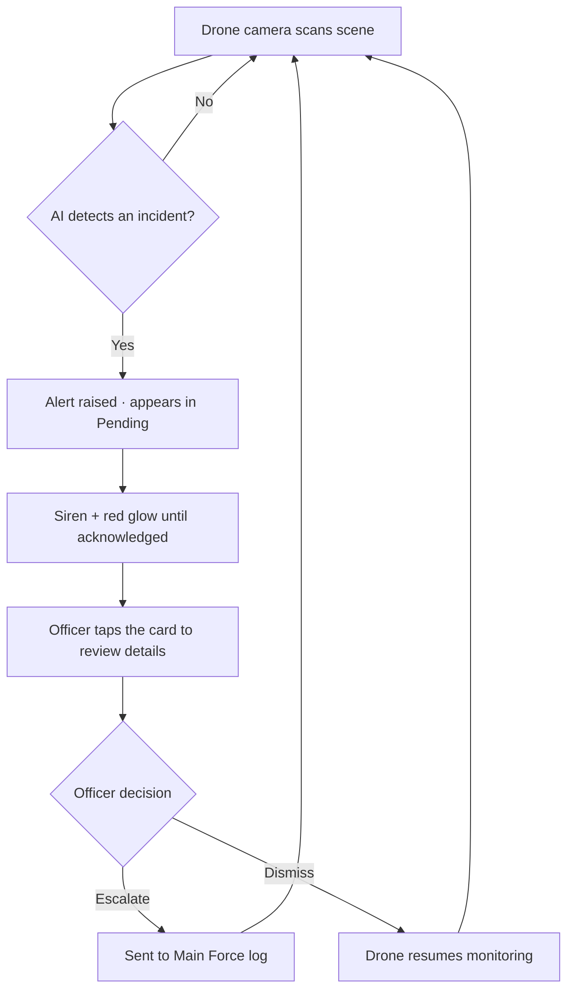
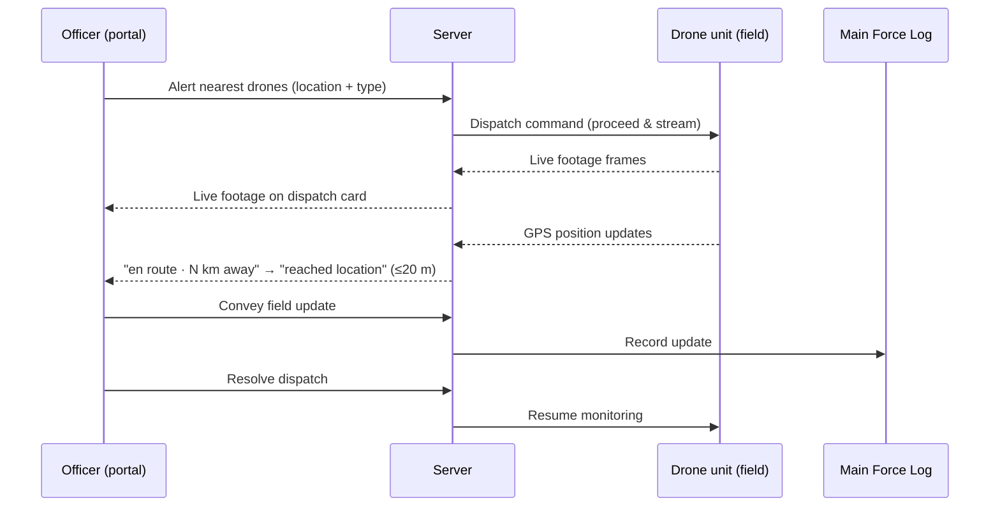
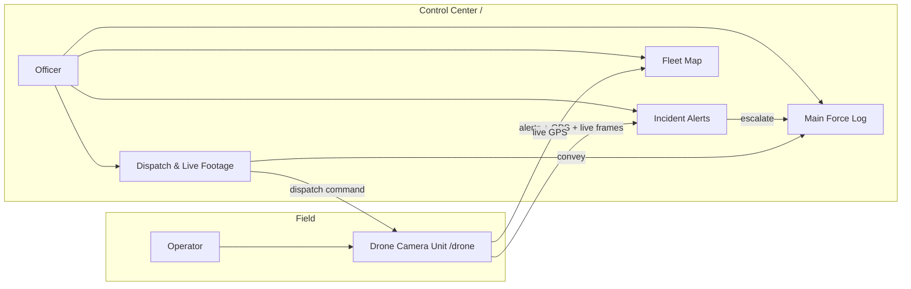

# Smart City Drone Security System — User Guide

A practical, screen-by-screen guide for the two groups of people who use the
system every day:

- **Police officers** working the **Police Control Center** (the desktop portal at `/`).
- **Drone operators** running the **Drone Camera Unit** in the field (the phone/browser app at `/drone`).

No software has to be installed. Everything runs in a web browser — the front end
is plain static HTML/JS with no build step (`package.json:10-13`). You only need
the address of the running server (for example `http://localhost:3000` in a demo,
or the LAN/HTTPS address the server prints on startup).

---

## 1. Introduction

The system turns ordinary phone cameras into a fleet of "smart drones." Each
drone unit points its camera at a scene; an on-board AI classifies what it sees
into an **incident type** (fire, accident, weapon threat, crowd, and so on) and
reports anything worth a human's attention to the Control Center. Officers then
**review**, **escalate**, or **dismiss** each alert, **dispatch** the nearest
drones to a reported emergency, and watch **live footage** stream back.

Two coordinated apps make this work:

| App | URL | Who uses it | Purpose |
|---|---|---|---|
| Police Control Center | `/` | Officers (login required) | Review alerts, dispatch drones, watch live feeds, keep the main-force log |
| Drone Camera Unit | `/drone` | Field operators (no login) | Run a drone's camera, auto-monitor a scene, proceed on dispatch, stream live |
| Login | `/login` | Everyone | Sign in to the portal |
| Admin console | `/admin` | Administrators only | Manage officer accounts |

The AI provider is shown in the top-right **AI badge** on both apps. It reads
`AI: Groq Vision`, `AI: Claude Vision`, or `AI: Standby` (mock/simulation mode)
depending on how the server is configured (`server.js:295-296`, `common.js:19`).

---

## 2. Main features at a glance

- **Automatic incident detection** — the drone camera scans the scene on an
  interval and the AI reports incidents on its own.
- **Real-time alerts** — new alerts pop up instantly with a toast, a beep, and a
  looping siren + red screen glow until an officer acknowledges them
  (`portal.js:1101-1118`).
- **One-tap review** — expand any alert to see the captured frame, the AI's
  interpretation, a confidence bar, coordinates, and the recommended action.
- **Escalate or dismiss** — send a genuine incident to the main police force, or
  clear a false alarm so the drone resumes monitoring.
- **Emergency dispatch** — log a reported crime/emergency; the nearest online
  drones rush to the spot and stream live footage back.
- **Live fleet map** — a real map (Leaflet + OpenStreetMap/CARTO tiles) showing
  every online drone's live GPS position, incidents, and dispatch targets.
- **On-demand live camera** — pull a live feed from any online drone at any time.
- **Main-force log** — a running record of everything conveyed to the main force.
- **Personalisation** — each officer has a profile photo, badge details, and a
  choice of six colour themes that follow their account.

---

## 3. Getting started

### 3.1 Sign in to the Police Control Center

1. Open the portal address in a browser. If you are not signed in you are sent to
   the **Sign in** page (`/login`).
2. Enter your **Username** and **Password** and press **Sign in**
   (`login.html:16-23`).
3. On success you land on the Control Center home screen (`login.js:22`). If the
   credentials are wrong you see *"Invalid username or password"*
   (`server.js:82-83`).

> **First-time / administrator login.** The server automatically seeds one admin
> account on first run — username **`admin`**, password taken from the
> `ADMIN_PASSWORD` setting (falling back to `admin123` if unset)
> (`src/officers.js:64-69`). Administrators should change this and create
> individual officer accounts from the **Admin console** (`/admin`). Regular
> officer accounts are created there, not self-registered.

Sessions last 7 days and are stored in a secure cookie; you can end one any time
with **Log out** in the officer sidebar (`portal.js:168-171`).

### 3.2 Open the Drone Camera Unit

The field app needs **no login** (`server.js:66`). Open `/drone` on the device
that will act as the drone (typically a phone). From the portal you can jump
there via the **Drone Camera App** link in the top bar, which opens `/drone` in a
new tab (`index.html:22`).

> **Phones need HTTPS for the camera.** Browsers only grant camera access over a
> secure origin. On startup the server prints an `https://<ip>:<port>/drone`
> address for exactly this. Open that link, accept the self-signed certificate
> warning once, then allow camera access. If you skip this, "Start camera" fails
> with a permission error (`drone.js:156-159`).

---

## 4. The Police Control Center, screen by screen

### 4.1 Top bar and officer menu

- **☰ menu button** opens the **officer sidebar** on the left (`index.html:14`,
  `portal.js:163`).
- **AI badge** shows the active vision provider (`index.html:21`).
- **Drone Camera App** opens the field app in a new tab (`index.html:22`).
- **Clear images** and **Reset** buttons appear **only for administrators**
  (`index.html:23-24`, `portal.js:285-287`).

The **officer sidebar** shows your photo, name, **Badge ID**, and **Station**,
plus:

- **Change photo** (camera button on the avatar): pick an image; it is
  auto-cropped to a square avatar — centred on your face when one is detected —
  and saved to your account (`portal.js:176-197`, `251-269`).
- **Appearance / Theme picker**: choose one of six themes — *Midnight, Graphite,
  Obsidian, Emerald, Tricolour, Aurora* (`common.js:74-81`). Your choice is saved
  to your account and follows you to any device (`portal.js:14`, `276`).
- **Manage officers** link (admins only) → `/admin` (`portal.js:288-299`).
- **Log out**.

### 4.2 Status tiles

A row of six live counters across the top (`index.html:61-68`, `portal.js:144-153`):

| Tile | Meaning |
|---|---|
| **Drones Online** | `online / total` drones currently controlled by a phone |
| **Pending Alerts** | alerts awaiting your review |
| **Escalated** | alerts sent to the main force |
| **Dismissed** | alerts cleared as false alarms |
| **Active Dispatches** | dispatches currently in progress |
| **Main Force Log** | number of records conveyed to the main force |

When there are pending alerts, a red count badge also appears on the **Incident
Alerts** tab (`portal.js:151-153`).

### 4.3 The four tabs

The main area has four tabs (`index.html:70-75`):

1. **Incident Alerts** — review pending drone alerts and see reviewed history.
2. **Dispatch & Live Footage** — send drones to an emergency and watch their feeds.
3. **Fleet Map** — a live map of drones, incidents, and dispatch targets.
4. **Main Force Log** — everything escalated/conveyed to the main force.

---

## 5. Running a drone (field operator)

Open `/drone` and follow these steps.

### 5.1 Pick which drone this device is

Use the **"This device is"** dropdown to choose a drone (e.g. *Drone 1 — Sector 1
- Mananchira*) (`drone.html:26`, `drone.js:110-119`). The app auto-selects a free
drone for you (`drone.js:55`). Drones already controlled by another device appear
as **"· in use"** and are disabled — if you happen to pick one that gets taken,
the app automatically switches you to an available drone (`drone.js:134-140`).

### 5.2 Start the camera

Press **Start camera** on the camera panel. The browser asks for camera
permission; the app prefers the rear/environment camera (`drone.js:150-169`).
Once running, the status strip reads *"Monitoring — camera live."*

### 5.3 Choose how it monitors

- **Scan now** — analyse the current frame once (`drone.html:69`, `drone.js:61`).
- **Auto-monitor** — tick the checkbox to scan automatically on an interval of
  **5s / 8s / 15s** (default 8s) (`drone.html:79-84`, `drone.js:288-295`).
- **Scenario** (only visible in mock/Standby mode) — force a specific incident
  type for demos, or leave on **Auto**. When a real AI provider is configured
  this selector is hidden because the AI reads the actual image
  (`drone.js:47-52`).

Each scan captures a frame and sends it to the server for analysis
(`drone.js:250-259`). On the **Auto** scenario, near-black frames (a covered or
dark camera) are skipped so they never raise a false alert (`drone.js:242-246`).
The AI's verdict — title, confidence, and a one-line interpretation — is shown as
an overlay on the camera image (`drone.js:278-286`).

When the AI reports a real incident, the drone raises an alert and the status
changes to *"⚠ Alert sent … awaiting police review"*; it then waits for the
officer's decision before resuming (`drone.js:263-268`).

### 5.4 Live GPS tracking

The **Live GPS tracking** switch is **on by default** (`drone.html:93`). While on,
the drone streams its real phone GPS location to the police map (throttled, plus a
5-second heartbeat) (`drone.js:396-404`, `73`). Turn it off to report the drone's
**assigned sector location** instead (`drone.js:462-468`). If GPS is unavailable
the app falls back to the sector location automatically (`drone.js:453-459`).

A **battery badge** appears when the phone exposes its battery level, and that
percentage is sent to the portal too (`drone.js:77-98`).

### 5.5 Stop

**Stop camera** ends monitoring, any dispatch streaming, and any live feed
(`drone.html:70`, `drone.js:171-192`).

---

## 6. Reviewing alerts (officer)

Open the **Incident Alerts** tab. Alerts are split into **Pending drone alerts**
(top) and **Reviewed history** (bottom) (`index.html:79-90`, `portal.js:371-390`).

1. **Tap a card to expand it.** You'll see the captured frame, the AI's quoted
   interpretation, the **suggested action**, a **confidence** bar, the
   coordinates, and which vision engine produced it (`portal.js:350-368`).
2. Decide using the two buttons on a pending card (`portal.js:339-342`):
   - **Escalate to Main Force** — confirm it is a real incident and send it on.
   - **Situation OK — Resume** — dismiss it as not needing police help; the drone
     goes back to monitoring.
3. Either choice opens a **confirmation dialog** where you can add an optional
   note before confirming (`portal.js:392-409`, `index.html:177-187`).

Reviewed alerts drop into the history list with a chip showing *Escalated to main
force* or *Dismissed*, along with your note (`portal.js:337-338`).

> **New-alert alarm.** A fresh alert triggers a toast, a beep, and a looping
> two-tone siren with a full-screen red glow. It keeps going until you interact
> with the page (move the mouse, click, or press a key), after a short grace
> period so it isn't dismissed by accident (`portal.js:1101-1118`).

You can tidy the history with **Clear history**, which removes all non-pending
alerts after a confirmation prompt (`portal.js:37-39`). The button appears only
when there is reviewed history to clear (`portal.js:383-384`).

---

## 7. Escalating to the main force

Escalation is how a control-center officer hands a confirmed incident to the
main police force.

- **From an alert:** use **Escalate to Main Force** on a pending alert card
  (Section 6). This records the incident in the **Main Force Log**
  (`server.js:412`).
- **From an active dispatch:** use the **Convey** field on a dispatch card to send
  a field update (for example *"2 suspects, north exit"*) to the main force
  without resolving the dispatch (`portal.js:694-699`, `server.js:610`).

Everything conveyed appears on the **Main Force Log** tab, newest first, with a
timestamp, whether it was an *Escalation* or a *Field update*, the officer, the
incident, the location, the drone, and the message (`portal.js:707-722`).

---

## 8. Emergency dispatch

Open the **Dispatch & Live Footage** tab. The left card is the dispatch form; the
right column lists active/resolved dispatches with their live footage
(`index.html:94-136`).

### 8.1 Fill in the dispatch

1. **Type of emergency.** Pick from the dropdown, or click a **quick preset** —
   *Jewellery robbery, Bank robbery, Armed person, Kidnapping, Bomb threat,
   Violence, Fire* — which fills in the type and a description for you
   (`portal.js:473-518`).
2. **Location.** Provide it any one of these ways:
   - Choose a **known location** from the dropdown (e.g. *SM Street*, *Railway
     Station*) (`portal.js:491-503`).
   - Type the **place/address** (`index.html:109`).
   - Paste **coordinates** such as `11.2545° N 75.7800° E` or `11.2545, 75.7800`,
     or a shared **Google Maps / OpenStreetMap / Apple Maps link** — the app
     extracts the coordinates, resolving the link on the server if needed
     (`portal.js:520-552`).
   - Or open the **Fleet Map** tab and **click the map** to drop a pin, then
     confirm with **Use for dispatch** (`portal.js:767-773`, `40-43`).
   Use **Exact coordinates & map** to see or fine-tune latitude/longitude
   (`index.html:113-120`).
3. **Details (optional).** Add any extra context (`index.html:122-123`).
4. Press **Alert nearest drones** (`index.html:126`, `portal.js:554-584`).

The system finds the nearest **online** drones within range and sends them to the
target. If no drone is online, or every online drone is already busy, the
dispatch is refused with a message explaining why (`server.js:490-508`) — you'll
need a field operator to bring a drone online first (Section 5).

### 8.2 Watch the response

Each active dispatch card shows every assigned drone with its live status —
**en route · N km away**, its battery, and finally **reached location** once it is
within 20 m of the target (`portal.js:596-624`; arrival radius `server.js:41`).
When a drone arrives you get a toast and a beep (`portal.js:69-73`).

Live footage tiles stream from each assigned drone. You can open a larger **live
camera** from any online assigned drone — even while it is still approaching — via
its **Live camera** button (`portal.js:620-621`, `680`).

### 8.3 Keep the main force updated, then resolve

On an active dispatch card:

- Type into the **Convey info to main force** box and press **Convey** to log a
  field update (`portal.js:694-699`).
- Press **Resolve** when the incident is handled. This frees the drones and marks
  the dispatch resolved (`portal.js:693`, `server.js:650`).

**Clear resolved** removes finished dispatches from the list (it appears only when
there is resolved history) (`portal.js:483-488`, `700-702`).

---

## 9. The Fleet Map

Open the **Fleet Map** tab (`index.html:140-165`, `portal.js:809-849`).

- **Online drones** show as labelled dots coloured by status — **green =
  monitoring, amber = alerting, red = dispatched** (`portal.js:725`, `155-158`).
  Only online drones appear on the map; offline drones are listed in the **fleet
  roster** side panel instead (`portal.js:839-846`, `853-878`).
- **Pending incidents** show as coloured incident icons; **active dispatch
  targets** show as a red pin inside a dashed 20 m arrival circle
  (`portal.js:824-834`).
- **Click anywhere** to set a dispatch target; a confirmation strip shows the
  coordinates and offers **Use for dispatch** (`portal.js:767-773`).
- **Fit all drones** frames the whole online fleet in view (`portal.js:733-742`).

Below the map, the **Drone fleet** grid lists every drone with its status,
battery, and a **Live view** button (enabled for online drones)
(`portal.js:882-916`).

> The map uses online map tiles and the Leaflet library, so the Fleet Map needs
> internet access to draw. It also initialises the first time you open the tab
> (`portal.js:812-816`).

---

## 10. On-demand live camera

You can pull a live feed from any **online** drone without dispatching it.

1. Press **Live view** on a drone in the Fleet grid, or **Live camera** on an
   assigned dispatch drone (`portal.js:906`, `621`).
2. A modal opens showing *"Connecting to the drone's live camera…"* and then the
   live frames (`portal.js:922-945`, `index.html:203-218`).
3. If no frame arrives within a few seconds, the drone's camera is off and you'll
   see **"Camera is off — ask the operator to start its camera"**
   (`portal.js:948-956`).
4. Press **Close** to stop watching; the feed is torn down automatically
   (`portal.js:969-982`).

Requesting a live view sends a command to the field app, which shows a **"● LIVE ·
police viewing"** chip and starts streaming (`drone.js:357-380`, `drone.html:37`).

---

## 11. Administrator tasks

These actions are available only to accounts with the **admin** role
(`portal.js:285-287`).

### 11.1 Reset the demo

The **Reset** button clears all alerts, dispatches, and logs while keeping the
drone fleet, after a confirmation prompt (`portal.js:33-35`, `server.js:714`).
Useful between demonstrations.

### 11.2 Clear captured drone images

The **Clear images** button opens an authorization dialog (`index.html:189-201`,
`portal.js:1028-1058`):

1. Enter the **authorization key** (the `CLEAR_SECRET`; default `police2026` if
   the server hasn't overridden it — `server.js:39`, `862`).
2. Choose an action:
   - **Move to police server & clear cache** (*archive* mode) — offload then clear.
   - **Clear drone images** (*delete* mode) — wipe captured images from storage.

A wrong key is rejected; a correct one reports how many images were cleared
(`server.js:862`, `portal.js:1048-1057`).

### 11.3 Manage officers

The **Manage officers** link in the sidebar opens the Admin console (`/admin`) for
creating, editing, and deactivating officer accounts (`portal.js:288-299`).

---

## 12. Common workflows

**A. Monitor a location and catch an incident (operator + officer)**
1. Operator opens `/drone`, picks a drone, presses **Start camera**, enables
   **Auto-monitor**.
2. AI detects an incident → alert appears in the officer's **Pending** list with a
   siren.
3. Officer expands the card, reviews the frame, and **Escalates** or **Dismisses**.

**B. Respond to a reported crime (officer)**
1. Officer opens **Dispatch**, clicks a preset (e.g. *Jewellery robbery*), sets the
   location, presses **Alert nearest drones**.
2. Nearest online drones proceed and stream footage; the officer watches the
   approach and opens the **live camera** as needed.
3. Officer **conveys** updates to the main force, then **Resolves** when done.

**C. Check on any area right now (officer)**
1. Officer opens the **Fleet Map** or **Drone fleet** grid.
2. Presses **Live view** on an online drone to see its camera immediately.

---

## 13. FAQ

**Do I need to install an app?**
No. Both apps run in a normal web browser; there is no build or install step
(`package.json:10-13`).

**What are the default login details?**
An initial admin account (username `admin`) is seeded on first run; its password
comes from the `ADMIN_PASSWORD` setting, defaulting to `admin123`
(`src/officers.js:64-69`). Change it and create per-officer accounts in the Admin
console. If your administrator has already set these up, use the credentials they
gave you.

**Why does the drone app not ask me to log in?**
By design — the field unit is deliberately open so an operator can bring a drone
online quickly (`server.js:66`).

**Why is a drone greyed out / "in use" in the drone picker?**
Another device is already controlling that drone. Each drone can be controlled by
one device at a time; pick a free one (`drone.js:110-119`, `134-140`).

**Why doesn't a drone show on the map?**
Only **online** drones (those a phone is actively controlling) appear on the map.
Offline drones are listed in the fleet roster side panel and reappear on the map
when they connect (`portal.js:839-846`).

**Why does the live camera say "Camera is off"?**
That drone's operator hasn't started its camera. Ask them to press **Start
camera** (`portal.js:948-956`).

**How does the AI decide what an incident is?**
A vision model (Groq or Claude) classifies each frame into one incident type; if
neither is configured, the system runs in mock/Standby simulation mode. The AI
badge tells you which is active (`server.js:295-296`, `common.js:19`). The
**Scenario** override on the drone app is only shown in mock mode
(`drone.js:47-52`).

**Can I change my photo and theme?**
Yes — both are in the officer sidebar, and your theme choice is saved to your
account so it follows you across devices (`portal.js:14`, `176-197`, `276`).

**What is the difference between Escalate and Dismiss?**
**Escalate** treats the alert as a real incident and records it for the main
force; **Dismiss** clears it as a false alarm and the drone resumes monitoring
(`portal.js:392-409`).

**Who can Reset the board or Clear images?**
Only administrators; those buttons are hidden for regular officers
(`portal.js:285-287`).

---

## 14. Troubleshooting

| Symptom | Likely cause | What to do |
|---|---|---|
| **"Start camera" fails on a phone** | Camera blocked because the page isn't on HTTPS, or permission denied | Open the `https://…/drone` address the server printed, accept the certificate warning, then allow camera access (`drone.js:156-159`) |
| **Portal keeps sending me to the login page** | No/expired session, or you were signed out | Sign in again at `/login`; sessions last 7 days (`portal.js:274-275`) |
| **GPS "unavailable" on the drone** | Location permission denied or no fix | The app falls back to the drone's assigned sector location automatically; grant location permission to track live (`drone.js:453-459`) |
| **"All drones are currently in use by other devices"** | Every drone already has a controller | Free a drone (stop another device) or wait; the picker updates automatically (`drone.js:134-140`) |
| **Dispatch is refused** | No online drones, or all online drones already busy | Bring a drone online via `/drone`, then dispatch again (`server.js:490-508`) |
| **Live view shows "Camera is off"** | The target drone isn't streaming | Ask the operator to start that drone's camera (`portal.js:948-956`) |
| **No sound when an alert arrives** | Browser blocks audio until you interact with the page | Click anywhere in the portal once; alarms will then play (`portal.js:1085-1099`) |
| **Fleet Map is blank** | Map tab not yet opened, or no internet for map tiles/library | Click the **Fleet Map** tab (it initialises on open) and ensure the machine has internet access (`portal.js:812-816`) |
| **Clear images rejected** | Wrong authorization key | Re-enter the correct key (`CLEAR_SECRET`; default `police2026`) (`server.js:39`, `862`) |
| **A drone reads "offline · last seen …"** | Its controlling phone disconnected | Reopen `/drone` on that device; it reconnects and returns to the map (`portal.js:862-864`) |

---

*Smart City Drone Security System · Group 17 · GEC Kozhikode. This guide reflects
the application's current UI and behaviour as implemented in the source; where a
setting has a configurable default (login password, clear-images key, AI
provider), your deployment may differ.*
